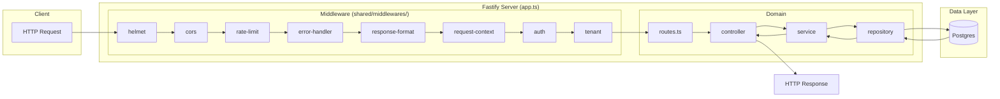
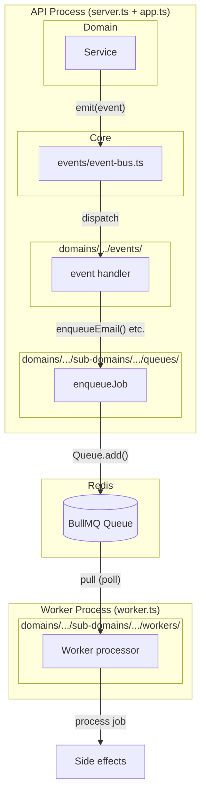

# core-be

Node.js API with Fastify, Drizzle ORM, and BullMQ.

## Tech Stack

- **Runtime**: Node.js 24
- **HTTP**: Fastify
- **Language**: TypeScript (strict mode)
- **Database**: PostgreSQL (managed / auto-scalable service)
- **ORM**: Drizzle ORM + Postgres.js
- **Background jobs**: BullMQ + Redis (ioredis)
- **Cache**: Redis (managed / auto-scalable service)
- **Email**: Resend
- **Payments**: Stripe
- **Observability**: Sentry (errors, tracing, continuous V8 profiling, structured logs) + Pino
- **Validation**: Zod
- **Auth**: HS256/RS256 JWT (`jose`) — 15-min access tokens, account lockout
- **Security**: Helmet, CORS, rate limiting, idempotency, circuit breakers
- **Testing**: Vitest + `fastify.inject()` (in-process HTTP), k6 load testing
- **Package manager**: pnpm

## Setup (full guide)

- **Documentation index:** [docs/README.md](docs/README.md) — docs by folder (`getting-started`, `process`, `deployment` → `setup/` · `ci-cd/` · `runbooks/`, `integrations`, `reference`, `reviews`); deployment hub: [docs/deployment/README.md](docs/deployment/README.md).
- **One-command automated setup:** **[docs/deployment/setup/setup-automation.md](docs/deployment/setup/setup-automation.md)** — `pnpm setup:infra` provisions Neon, Redis, S3, Sentry, Railway, GitHub. Double confirm, atomic rollback, `setup:infra:revert` to tear down.
- **Manual CLI setup:** [docs/deployment/setup/railway-github-cli-setup.md](docs/deployment/setup/railway-github-cli-setup.md) — set up Railway + GitHub via CLI (no automated provisioning).
- **General reference:** [docs/getting-started/setup.md](docs/getting-started/setup.md) — local setup, Git workflow, testing. CI/CD and deployment: [docs/deployment/ci-cd/cicd-and-deployment.md](docs/deployment/ci-cd/cicd-and-deployment.md). Branch protection / required checks (`main`, `dev`): [docs/deployment/ci-cd/branch-protection.md](docs/deployment/ci-cd/branch-protection.md).
- **Cursor cloud agents:** [docs/integrations/cursor-cloud-agent-environment.md](docs/integrations/cursor-cloud-agent-environment.md) — optional `Dockerfile.agent` for full dev dependencies in agent environments (production image remains [`Dockerfile`](Dockerfile)).

## New requirements

When adding a new feature, domain, route, or worker, use **`docs/getting-started/requirement-intake.md`** to provide details in the expected format. That ensures the right skills and rules run and the codebase stays consistent.

## Contributing, security, and conduct

- **[CONTRIBUTING.md](CONTRIBUTING.md)** — prerequisites, branching, commits, tests, pointers to **[AGENTS.md](AGENTS.md)** for full PR checklist commands.
- **[SECURITY.md](SECURITY.md)** — private vulnerability disclosure (never use public issues).
- **[CODE_OF_CONDUCT.md](CODE_OF_CONDUCT.md)** — participation standards.

Bug reports, features, PR text, CODEOWNERS, and CI metadata live under [`.github/`](.github/).

## Project Structure

```
tooling/
  setup/                     # Infra wizard (pnpm setup:infra) — Neon, Railway, Stripe
  ci/                        # Build/CI guards (Dockerfile sync, dist @/ alias check)
  dev/                       # Local dev helpers (compose Postgres wait)
src/
  app.ts                     # Fastify app builder
  server.ts                  # Server entry point
  worker.ts                  # Worker entry point
  routes.ts                  # Central DI + route registration
  fastify.d.ts               # Fastify type augmentation

  shared/
    config/
      env.config.ts          # Environment validation (Zod)
    errors/
      app.error.ts           # Base AppError
      validation.error.ts    # ValidationError
      auth.error.ts          # NotFound, Unauthorized, Forbidden, Conflict, NotImplemented
      index.ts               # Re-exports
    types/
      index.ts               # AuthContext, PaginatedResult
    constants/
      index.ts               # PAGINATION, SLUG_REGEX, UUID_REGEX
    services/                   # (barrel only — services relocated to domains)
    utils/
      logger.util.ts         # Pino logger
      response.util.ts       # successResponse, paginatedResponse
      pagination.util.ts     # paginationSchema, cursorPaginationSchema
      public-id.util.ts      # generatePublicId
      uuid.util.ts           # uuidSchema
    middleware/
      compress.middleware.ts  # gzip/brotli compression
      auth.middleware.ts      # JWT verify, request.auth
      tenant.middleware.ts    # X-Organization-Id → request.organizationId
      cors.middleware.ts
      helmet.middleware.ts
      rate-limit.middleware.ts  # Global + per-route rate limits
      error-handler.middleware.ts  # Error formatting + Sentry capture
      response-format.middleware.ts
      request-context.middleware.ts
      idempotency.middleware.ts  # Idempotency-Key header (Redis-backed)
      health.middleware.ts
      shutdown.middleware.ts
      index.ts               # registerMiddleware()

  infrastructure/
    database/
      connection.ts          # Postgres + Drizzle
      base-repository.ts     # Offset + cursor-based pagination helpers
      transaction.ts         # withTransaction()
      migrate.ts             # Migration runner
      pg-schemas.ts          # Shared pgSchema definitions (auth, tenancy, billing, notify, audit)
    cache/
      redis.client.ts        # Redis connection (managed service)
    queue/
      connection.ts          # Queue Redis re-export + BullMQ connection options
      worker-options.ts      # Shared stall / lock tuning for BullMQ workers
      scheduler.ts            # Central repeatable-job registry (retention cron)
      dead-letter.ts         # `<queue>-dlq` + final-failure Sentry
      bootstrap.ts           # Registers schedulers + workers (mail, webhook, notification, retention, idempotency cardinality)
    mail/
      mail.service.ts        # Resend email service
      templates/             # HTML email templates
      queues/                # BullMQ mail queue
      workers/               # BullMQ mail worker
    payment/
      stripe.client.ts       # Stripe SDK client + helpers
    storage/
      storage.service.ts     # S3 storage service
    resilience/
      circuit-breaker.ts     # Circuit breakers for Stripe, S3, Resend
    observability/
      sentry.ts                           # Sentry: errors, tracing, V8 profiling, structured logs
      idempotency-cardinality.constants.ts # BullMQ queue name
      idempotency-cardinality.service.ts  # Bounded Redis SCAN + threshold alerts
      idempotency-cardinality.worker.ts   # Scheduled processor (see queue/scheduler.ts)
    mcp/
      mcp-server.ts          # MCP server (when ENABLE_MCP_SERVER): tools + resources for frontends/agents

  core/
    events/
      event-bus.ts           # In-process domain event bus
      register-event-handlers.ts  # Domain event handler registration (called from buildApp)

  domains/                   # schema, __tests__/, optional events/; see CLAUDE.md for full layout
    audit/                   # flat domain (no sub-domains/)
    auth/                    # container, routes, controller, service, …
      sub-domains/
        auth-method/         # magic-link, oauth/, verification-token
        auth-session/
        auth-mfa/
        auth-webauthn/
    user/
      sub-domains/
        user-settings/
        user-notification-preferences/
        user-data-export/
    tenancy/
      sub-domains/
        organization/
          organization-settings/
          organization-notification-policy/
          organization-api-key/
        membership/
          member-invitation/
        member-roles/
          member-role-permission/
        permission/            # authorization + permission-cache services
    billing/
      billing.routes.ts
      sub-domains/
        plan/
        subscription/
        stripe-webhook/
    notify/
      notify.routes.ts
      sub-domains/
        notification/          # queues/, workers/
        webhook/
          webhook-event/
    upload/                  # flat domain (no sub-domains/)

  scripts/                   # Under src/ — pnpm tooling (not the setup wizard)
    generate-openapi.ts      # pnpm docs:generate → docs/openapi/openapi.json (or openapi.{locale}.json)
    validate-domain.ts       # CI gate for domain structure
    seed/
      minimal.ts             # Orchestration: permissions + plans (domain seeds)
      full.ts                # Orchestration: demo data + common flows (add user to org, invite)
      faker-data.ts          # Faker helpers for reproducible full seed

  tests/
    setup.ts
    helpers/                 # test-app, test-auth, test-database, test-redis, test-organization
    factories/               # user, organization, plan factories
    integration/
    unit/
    security/                # auth-enforcement, cors, helmet, jwt, rate-limiting, idempotency, input-validation
    performance/             # N+1 detection, concurrent requests
    global/                  # domain-consistency, system-validation, route-completeness
    load/k6/                 # k6 load scenarios (run with pnpm load:*, not Vitest)
      helpers/               # config, auth, data, checks
      scenarios/             # auth-onboarding, daily-ops, billing, webhooks, admin

docs/
  openapi/                   # Generated by pnpm docs:generate
    openapi.json             # Default spec (en)
    openapi.en.json, openapi.es.json  # Locale-specific (pnpm docs:generate:multilang)

migrations/
  *.sql
```

For the current `src/` tree, run `pnpm tool:project-structure-tree` or see [docs/reference/architecture/project-structure-guide.md](docs/reference/architecture/project-structure-guide.md).

### Domain Layer Convention

Each domain uses these layers:

```
<domain>.routes.ts       — Route registration (Fastify plugin)
<domain>.controller.ts   — Thin Fastify handlers
<domain>.validator.ts    — Calls DTO.parse()
<domain>.dto.ts          — Zod input schemas
<domain>.serializer.ts   — Response shaping
<domain>.service.ts      — Business logic
<domain>.repository.ts   — Database access (Drizzle)
<domain>.container.ts    — DI: repos → services (export for routes/controllers)
<domain>.types.ts        — TypeScript interfaces
```

API routes use Paddle-style responses: `{ data, meta: { request_id, pagination? } }`. Errors use `{ error: { type, code, detail, documentation_url?, errors? }, meta: { request_id } }`.

## Architecture Diagrams

### API Request Flow



### Event-Bus and BullMQ Flow



## Prerequisites

- [Node.js 24+](https://nodejs.org/)
- [pnpm](https://pnpm.io/installation)
- **PostgreSQL** — managed service (e.g. Supabase, Neon, AWS RDS, Railway)
- **Redis** — managed service (e.g. Upstash, AWS ElastiCache, Railway)

## Local Setup

### 1. Clone & Install

```bash
git clone <repo-url>
cd core-be
pnpm install
```

### 2. Environment Variables

Env files live at **project root only** (no `env/` directory). Bootstrap one file per environment from the committed template:

```bash
pnpm env:init                # creates .env.development + .env.production
# Then edit each .env.<environment> file with real values.
```

`pnpm env:init` copies `.env.example` → `.env.development` and `.env.production` (both
gitignored). For local dev, edit `.env.development` and run with `NODE_ENV=development`
(default). Provide your managed Postgres and Redis connection strings in `DATABASE_URL`
and `REDIS_URL`. Set `JWT_SECRET` (min 32 chars). Committed template: `.env.example`.
Gitignored: every `.env.*` file.

For one-command automated setup (Neon, Redis, S3, Sentry, Railway, GitHub), see [docs/deployment/setup/setup-automation.md](docs/deployment/setup/setup-automation.md). Edit `tooling/setup.config.json`, run `pnpm setup:infra`. **Infrastructure must be ready before auto-deploy** (push to dev/main) can succeed.

### 3. Apply Migrations

```bash
pnpm db:migrate
```

### 4. Run the API server

```bash
pnpm dev
```

Server is available at `http://localhost:3000`.

## Git workflow and branch strategy

We use **main** and **dev** as long-lived branches. Work happens on short-lived branches (e.g. `feature/ai-stream-response`, `fix/login-error`) created from **dev**. Merge flow: feature → dev → main. PR titles must follow [Conventional Commits](https://www.conventionalcommits.org/). Full branch naming, types, and step-by-step PR flow: **[docs/process/git-workflow.md](docs/process/git-workflow.md)**.

## Testing (when to run each)

**Where tests live:** Vitest suites (unit, integration, e2e, security, performance, chaos) and k6 load scenarios are under `src/tests/`; domain route tests are under `src/domains/*/__tests__/`. k6 assets live in `src/tests/load/k6/` — run with `pnpm load:*` (see [docs/reference/testing/load-testing.md](docs/reference/testing/load-testing.md) and [src/tests/load/k6/README.md](src/tests/load/k6/README.md)).

| Category                    | Command                                 | When to run                                                                                                                                                                                              |
| --------------------------- | --------------------------------------- | -------------------------------------------------------------------------------------------------------------------------------------------------------------------------------------------------------- |
| **Unit**                    | `pnpm test:unit`                        | Fast feedback before commit. Covers `src/tests/unit/` and domain unit tests. Full `pnpm test` needs Postgres + Redis.                                                                                    |
| **Integration**             | `pnpm test:integration`                 | Before pushing; requires Postgres + Redis (`pnpm compose:up`). CI runs full suite.                                                                                                                       |
| **E2E / domain**            | `pnpm test:e2e`                         | Full domain flows; run with `pnpm test`. CI runs as part of `pnpm test:coverage`.                                                                                                                        |
| **Security**                | `pnpm test:security`                    | Auth, JWT, CORS, Helmet, rate-limiting, idempotency, input validation. Before release; CI includes it.                                                                                                   |
| **Performance**             | `pnpm test:performance`                 | N+1 and concurrent-request tests. Run when changing queries or concurrency.                                                                                                                              |
| **Chaos / fault injection** | `pnpm test:chaos`                       | Toxiproxy scenarios for Redis/Postgres partitions, circuit breakers, BullMQ retries — see [docs/reference/reliability/chaos-testing.md](docs/reference/reliability/chaos-testing.md). Requires `pnpm chaos:provision` + proxies. |
| **Smoke (health)**          | `pnpm load:health` or `pnpm test:bench` | Quick sanity after deploy or locally. Server must be running; no auth.                                                                                                                                   |
| **Smoke (auth)**            | `pnpm load:auth`                        | Login + profile + list orgs (demo credentials). Requires server + full seed.                                                                                                                             |
| **Load (health stress)**    | `pnpm load:stress`                      | Up to 100 VUs on health endpoints. Before release or after infra changes.                                                                                                                                |
| **Load (API stress)**       | `pnpm load:stress:api`                  | Key API routes under load. Needs `TEST_TOKEN` + `TEST_ORG_ID` (`pnpm tool:load-test-credentials`). Use `pnpm dev:loadtest` to avoid rate-limit 429s.                                                     |

**When to run:** Before commit → `pnpm validate && pnpm test:unit`. Before PR → `pnpm ci:local` (or `pnpm ci:quality` for static checks only). Before release → add `pnpm test:security`, `pnpm test:chaos` (requires Toxiproxy + `pnpm chaos:provision`), `pnpm load:stress` (and optionally `pnpm load:stress:api`). After deploy → smoke (`pnpm load:health` or hit `/health/ready`). Full k6 scenarios: [docs/reference/testing/load-testing.md](docs/reference/testing/load-testing.md) and [src/tests/load/k6/README.md](src/tests/load/k6/README.md).

## CI/CD and deployment

**Single document:** [docs/deployment/ci-cd/cicd-and-deployment.md](docs/deployment/ci-cd/cicd-and-deployment.md) — CI pipeline (quality, test, security, Docker, docs, PR checks), branch-to-environment mapping (dev/main → Railway), deploy flow, **where you need which token**, and first-time setup checklist. Includes diagrams.

**Memory and quotas:** Align Railway / Kubernetes limits with **`NODE_OPTIONS=--max-old-space-size`** (`NODE_OPTIONS` synced from GitHub when set) — [docs/deployment/runbooks/resource-limits.md](docs/deployment/runbooks/resource-limits.md).

## Path to production

For a full step-by-step runbook (local dev → validate → build → run → deploy), see **[docs/deployment/runbooks/runbook-dev-to-production.md](docs/deployment/runbooks/runbook-dev-to-production.md)**.

1. **Pre-deploy**
   - Run `pnpm validate` and `pnpm test`. CI runs lint, typecheck, domain validation, tests, security scan, and Docker build.
   - Set `NODE_ENV=production`. In production, `ALLOWED_ORIGINS` is required; DB uses SSL; JWT prefers RS256 (set `JWT_PUBLIC_KEY` / `JWT_PRIVATE_KEY`).

2. **Build**
   - `pnpm build` produces `dist/`. Docker: see [docs/deployment/docker-images.md](docs/deployment/docker-images.md) — `pnpm docker:build` (both images), `pnpm docker:check-sync` (after editing Dockerfiles), `pnpm compose:up` then `pnpm docker:smoke:up` for a containerized API smoke test (`NODE_ENV=test`).

3. **Runtime**
   - **API:** `node dist/server.js` (or run the built Docker image). Expose port 3000.
   - **Worker:** run a separate process with `node dist/worker.js` (BullMQ mail, webhook, notification, retention). Use the same `REDIS_URL` and env as the API.

4. **Data**
   - Run migrations before starting: `pnpm db:migrate` (uses `DATABASE_URL` or `DATABASE_MIGRATION_URL`).
   - Optional: `pnpm db:seed` (minimal) or `pnpm db:seed:full` (demo + common flows). Seed data is route-aligned; do not use seed in production for real data.

5. **Deploy**
   - Deploy workflows run on push to **dev** and **main** (see [CI/CD and deployment](#cicd-and-deployment)). API and worker deploy to Railway; env from GitHub. Ensure Postgres and Redis are available and migrations are run. Full detail: [docs/deployment/ci-cd/cicd-and-deployment.md](docs/deployment/ci-cd/cicd-and-deployment.md).

See `.cursor/skills/production-hardening-guard/SKILL.md` for the full production checklist.

## Running load tests

With the server running (`pnpm dev`), use [docs/reference/testing/load-testing.md](docs/reference/testing/load-testing.md) and [src/tests/load/k6/README.md](src/tests/load/k6/README.md) for full instructions. Quick commands: `pnpm test:bench` (Autocannon), `pnpm load:health` (k6 health), `pnpm load:stress` (k6 health under stress, up to 100 VUs), `pnpm load:stress:api` (k6 API stress — needs TEST_TOKEN + TEST_ORG_ID; see [docs/reference/testing/load-testing.md](docs/reference/testing/load-testing.md#full-confidence-recommended)), `pnpm load:auth` (k6 auth-onboarding with demo credentials). For daily-ops, billing, and webhooks scenarios you need `TEST_TOKEN` and `TEST_ORG_ID` — run `pnpm tool:load-test-credentials` (server + full seed required). For the admin k6 scenario use `pnpm tool:admin-token` to get `ADMIN_TOKEN`. **BullMQ Board:** Set `ENABLE_QUEUE_DASHBOARD=true`, then open [http://localhost:3000/admin/queues](http://localhost:3000/admin/queues) with a super_admin JWT — see [docs/reference/runtime/bull-board.md](docs/reference/runtime/bull-board.md). **MCP server:** Set `ENABLE_MCP_SERVER=true` to expose a Model Context Protocol endpoint at `POST /api/v1/mcp`. Frontends (or AI agents) can connect to discover and call APIs via MCP tools and resources (no separate API doc needed on the frontend). See [docs/integrations/cursor-backend-mcp.md](docs/integrations/cursor-backend-mcp.md) for how to connect from the frontend.

## Running RBAC/security tests

Tests use `.env` when present (see test setup). Run `pnpm test:security` for the security suite (auth-enforcement, JWT, CORS, helmet, rate-limiting, idempotency, input-validation). Run `pnpm test:e2e` for domain integration tests (including tenancy and permission RBAC). Run `pnpm test:performance` for performance tests. Ensure Postgres and Redis are available (`pnpm compose:up` or local instances).

## Available Scripts

**Naming:** colon namespaces group related commands — `ci:*` (gates), `compose:*` (Docker), `test:*`, `db:*`, `docs:*`, `routes:*`, `load:*`, `chaos:*`, `tool:*` (dev utilities), `setup:infra:*`, `security:*`, `deps:*`. Legacy aliases (`route-catalog`, `scripts:*`) remain for backward compatibility.

| Namespace           | Scripts                                                                                                                                                                                                                          | Purpose                                                                         |
| ------------------- | -------------------------------------------------------------------------------------------------------------------------------------------------------------------------------------------------------------------------------- | ------------------------------------------------------------------------------- |
| **Runtime**         | `dev`, `dev:worker`, `dev:loadtest`, `build`, `build:check`, `start`, `start:worker`                                                                                                                                             | API, worker, production build (`tsc` + `tsc-alias`)                             |
| **Quality**         | `lint`, `lint:fix`, `format`, `format:check`, `typecheck`, `validate`, `validate:domain`                                                                                                                                         | Lint, format, types                                                             |
| **CI gates**        | `ci:local`, `ci:quality`, `verify:base`                                                                                                                                                                                          | PR checklist; static CI slice; migrate + seed + smoke                           |
| **Compose**         | `compose:up`, `compose:down`, `compose:wait`                                                                                                                                                                                     | Local Postgres + Redis                                                          |
| **Tests**           | `test`, `test:unit`, `test:integration`, `test:e2e`, `test:global`, `test:regression`, `test:security`, `test:performance`, `test:chaos`, `test:contract`, `test:coverage`, `test:api-smoke`, `test:bench`, `test:watch`         | Vitest suites                                                                   |
| **Load (k6)**       | `load:health`, `load:stress`, `load:stress:api`, `load:auth`, `load:daily-ops`, `load:billing`, `load:webhooks`, `load:admin`                                                                                                    | Load scenarios (`src/tests/load/k6/`)                                           |
| **Database**        | `db:migrate`, `db:migrate:lint`, `db:seed`, `db:seed:full`, `db:seed:sync-demo`, `db:generate`, `db:push`, `db:studio`                                                                                                           | Migrations, seeds, Drizzle                                                      |
| **Docs**            | `docs:generate`, `docs:generate:multilang`, `docs:postman`, `docs:all`, `docs:upload`                                                                                                                                            | OpenAPI + Postman                                                               |
| **Routes**          | `routes:catalog`, `routes:catalog:check`                                                                                                                                                                                         | `docs/routes.txt` (legacy: `route-catalog`)                                     |
| **Tools**           | `tool:sync-env-example`, `tool:load-test-credentials`, `tool:admin-token`, `tool:project-structure-tree`, `tool:test-report-email`, `tool:send-load-test-results-email`                                                          | Dev helpers (legacy: `scripts:*`)                                               |
| **Chaos**           | `chaos:up`, `chaos:down`, `chaos:provision`                                                                                                                                                                                      | Toxiproxy fault injection                                                       |
| **Security / deps** | `security:secrets`, `security:sast`, `deps:audit`, `deps:update`                                                                                                                                                                 | Local scans; lockfile audit                                                     |
| **Setup**           | `setup:infra`, `setup:infra:init`, `setup:infra:preview`, `setup:infra:check`, `setup:infra:status`, `setup:infra:update`, `setup:infra:revert`, `setup:infra:export-env`, `setup:push-retention-secrets`, `validate:github-environments`, `validate:github-env` | Provisioning — [setup-automation.md](docs/deployment/setup/setup-automation.md) |

Run `pnpm run` to list every script. Full command reference: [CLAUDE.md](CLAUDE.md) (Commands section).
