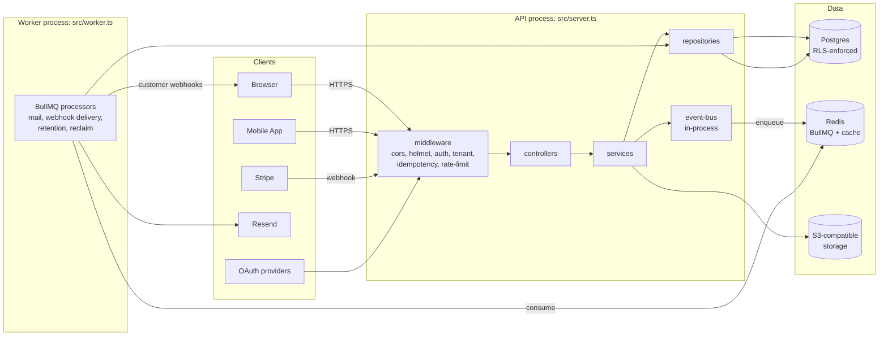

# core-be

*Production-grade multi-tenant SaaS backend — Node.js · Fastify · Drizzle · BullMQ*

[](https://nodejs.org/)
[](https://www.typescriptlang.org/)
[](https://pnpm.io/)
[](https://fastify.dev/)
[](LICENSE)

**core-be** is a multi-tenant SaaS backend: a Node.js + Fastify HTTP API plus a separate BullMQ worker process, both speaking to a single Postgres database and a Redis instance. Postgres is the only source of truth — workers are pull-based, idempotent, and may be restarted without coordination.

**Quick links:** [Quick Start](#-quick-start) · [SETUP.md](SETUP.md) · [Documentation](#-documentation) · [src/OVERVIEW.md](src/OVERVIEW.md) · [CLAUDE.md](CLAUDE.md) · [AGENTS.md](AGENTS.md) · [CONTRIBUTING.md](CONTRIBUTING.md)

---

## ✨ Features

- **Multi-tenancy** — organization-scoped data with Postgres RLS as defense-in-depth
- **Authentication** — passwords (argon2id), magic links, OAuth, MFA (TOTP), WebAuthn, RS256 JWT
- **Billing** — Stripe-backed plans and subscriptions with webhook reconciliation
- **Notifications** — in-app, email (Resend), and outbound webhooks via transactional outbox
- **Audit** — append-only audit log for security- and governance-relevant actions
- **Uploads** — S3 presigned upload and download (two-phase: presign → confirm)
- **Resilience** — idempotency keys, rate limiting, circuit breakers, chaos-tested fault injection
- **Developer experience** — OpenAPI + Postman generation, optional MCP server for agents and frontends

---

## 🧱 Tech Stack

| Layer | Technologies |
| --- | --- |
| **Runtime / HTTP** | [Node.js 24](https://nodejs.org/), [Fastify 5](https://fastify.dev), [Zod 4](https://zod.dev) |
| **Data / Queue** | [Drizzle 0.45](https://orm.drizzle.team), [Postgres](https://www.postgresql.org/), [ioredis 5](https://github.com/redis/ioredis), [BullMQ 5](https://docs.bullmq.io) |
| **Auth / Security** | [jose 6](https://github.com/panva/jose), [argon2id](https://github.com/ranisalt/node-argon2), [otplib](https://github.com/yeojz/otplib), [@simplewebauthn/server](https://simplewebauthn.dev), [opossum](https://nodeshift.dev/opossum/) |
| **Integrations** | [Stripe 22](https://stripe.com), [Resend 6](https://resend.com), AWS SDK v3 S3 |
| **Observability** | [Pino 10](https://getpino.io), [Sentry 10](https://sentry.io), [OpenTelemetry](https://opentelemetry.io), [prom-client](https://github.com/siimon/prom-client) |
| **Testing / Tooling** | [Vitest 4](https://vitest.dev), [k6](https://k6.io), [Toxiproxy](https://github.com/Shopify/toxiproxy), [Biome](https://biomejs.dev), [pnpm 11](https://pnpm.io), [Husky](https://typicode.github.io/husky/) |

---

## ⚡ Quick Start

**Prerequisites:** Node.js 24+, pnpm, Docker (for local Postgres + Redis).

```bash
pnpm install
pnpm compose:up && pnpm compose:wait
pnpm db:migrate && pnpm db:seed
pnpm dev          # API on :3000
pnpm dev:worker   # BullMQ worker (separate terminal)
```

**One-command local bootstrap:** `pnpm setup:local` (Docker + env + migrate + dev). Full clone-to-running guide: [SETUP.md](SETUP.md).

**Environment:** copy values from [`.env.example`](.env.example) into `.env.development`, or run `pnpm github:sync` to bootstrap env files. For one-command cloud provisioning (Neon, Redis, S3, Sentry, Railway, GitHub), see [setup automation](docs/deployment/setup/setup-automation.md) (`pnpm setup:infra`).

---

## 🏗 Architecture

One TypeScript codebase, two processes: the API (`pnpm dev`) and the worker (`pnpm dev:worker`).



- **Request flow** — HTTP → middleware → controller → service → repository → Postgres
- **Event flow** — services emit on the in-process event bus after a successful write; handlers enqueue BullMQ jobs (side effects never block the request)
- **Worker flow** — BullMQ processors pull from Redis, write to Postgres (with RLS context), and call external services

Deep dives: [src/OVERVIEW.md](src/OVERVIEW.md) · [src/PATTERNS.md](src/PATTERNS.md) · [src/FLOWS.md](src/FLOWS.md) · [src/POLICIES.md](src/POLICIES.md)

---

## 📁 Project Layout

```text
src/
  app.ts, server.ts, worker.ts   # Entry points
  domains/                       # Bounded contexts (auth, billing, tenancy, …)
  infrastructure/                # Database, cache, queue, mail, payment, storage
  shared/                        # Config, errors, middleware, locales
  core/                          # In-process event bus
  tests/                         # Cross-cutting test suites
tooling/                         # CI guards, setup wizard, dev helpers
migrations/                      # SQL migrations
docs/                            # Hand-written guides + generated OpenAPI
```

Full tree: `pnpm tool:project-structure-tree`. Canonical layout: [CLAUDE.md](CLAUDE.md) and [project structure guide](docs/reference/architecture/project-structure-guide.md).

---

## 🧪 Testing & Quality

| Command | When |
| --- | --- |
| `pnpm test:unit` | Fast feedback before commit |
| `pnpm test:e2e` | Domain route flows (needs Postgres + Redis) |
| `pnpm validate` | Lint + typecheck |
| `pnpm ci:local` | Full PR gate before opening a pull request |

Security, chaos, contract, and load testing: [docs/reference/testing/](docs/reference/testing/) and [chaos testing](docs/reference/reliability/chaos-testing.md). List all scripts: `pnpm run`.

---

## 🚢 Deployment

CI runs on GitHub Actions; API and worker deploy to Railway on push to **main** (environment mapping in GitHub Environments).

- [CI/CD and deployment](docs/deployment/ci-cd/cicd-and-deployment.md) — pipeline, secrets, branch mapping
- [Production release flow](docs/deployment/runbooks/production-go-live.md) — how single-trunk shipping to production works (development on merge, production on release)

---

## 📚 Documentation

| Doc | Purpose |
| --- | --- |
| [SETUP.md](SETUP.md) | Clone-to-running setup (local + cloud infra) |
| [docs/README.md](docs/README.md) | Full documentation index |
| [src/OVERVIEW.md](src/OVERVIEW.md) | System narrative and domain map |
| [CLAUDE.md](CLAUDE.md) | Architecture rules, commands, conventions |
| [AGENTS.md](AGENTS.md) | Agent and PR checklist (`pnpm ci:local`) |
| [requirement-intake.md](docs/getting-started/requirement-intake.md) | Format for new features and domains |
| [docs/routes.txt](docs/routes.txt) | Route catalog (`pnpm routes:catalog`) |

---

## 🤝 Contributing

See [CONTRIBUTING.md](CONTRIBUTING.md) for local setup, branches, commits, and hooks. Before opening a PR, run the gate in [AGENTS.md](AGENTS.md) (`pnpm ci:local`).

---

## 🔒 Security

Report vulnerabilities privately — see [SECURITY.md](SECURITY.md). Do not use public issues for security reports.

---

## 📜 License

MIT — see [LICENSE](LICENSE).
