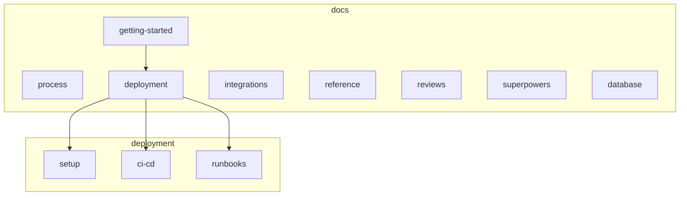

# Documentation index (core-be)

Hand-written guides live in **topic subfolders**; generated API artifacts stay at the repo root of `docs/`.

## Folder layout

| Folder                                                                                                     | Purpose                                                                                    |
| ---------------------------------------------------------------------------------------------------------- | ------------------------------------------------------------------------------------------ |
| [getting-started/](getting-started/)                                                                       | Local setup, API smoke, requirement intake                                                 |
| [process/](process/)                                                                                       | Git branches, PR flow, conventional commits                                                |
| [deployment/](deployment/)                                                                                 | **setup/** · **ci-cd/** · **runbooks/** — see [deployment/README.md](deployment/README.md) |
| [integrations/](integrations/)                                                                             | Third-party tools (Cursor MCP, cloud agents, credentials)                                  |
| [reference/](reference/)                                                                                   | Topic folders for architecture, API design, testing, runtime, security, reliability, data  |
| [reviews/architecture-consistency-roadmap-2026-05.md](reviews/architecture-consistency-roadmap-2026-05.md) | Completed domain-layout program (archival)                                                 |
| [reference/reliability/observability-log-events.md](reference/reliability/observability-log-events.md)     | Structured log event names / dashboard migrations                                          |
| [deployment/docker-images.md](deployment/docker-images.md)                                                 | API vs worker images, MCP docs in container                                                |
| [reviews/](reviews/)                                                                                       | Point-in-time review snapshots (add new dated files; do not rewrite history)               |
| [superpowers/](superpowers/)                                                                               | AI planning-session artifacts — **plans/** and **specs/** (dated, archival)                |

**Generated (do not edit by hand):** [routes.txt](routes.txt), [openapi/](openapi/) (`openapi*.json`), [postman-collection.json](postman-collection.json).

**In-source documentation (lives under `src/`, not `docs/`):**

- System narratives — `src/OVERVIEW.md`, `src/PATTERNS.md`, `src/FLOWS.md`, `src/POLICIES.md` (hand-authored).
- Per-folder overviews — `src/<folder>/<folder>.overview.md` at meaningful boundaries (hand-authored).
- TSDoc on every public export, plus `@remarks` on services/workers/processors/policy files (canonical; gated by `pnpm tsdoc:check`).
- Route documentation lives in inline Fastify `schema.summary` / `schema.description` and drives [openapi/openapi.json](openapi/openapi.json).

There is no auto-generated `DOCS.md` aggregator. These layers are owned by the **system-narrative-maintainer**, **overview-doc-maintainer**, **tsdoc-export-guard**, and **route-schema-doc-guard** skills. Hand-written docs under `docs/` are owned by **docs-maintainer**.

---

## Getting started

| Doc                                                                                          | Description                                                                                                 |
| -------------------------------------------------------------------------------------------- | ----------------------------------------------------------------------------------------------------------- |
| [SETUP.md](../SETUP.md)                                                                       | Local setup, env vars, cloud infra, testing, CI/CD, troubleshooting.                                        |
| [getting-started/prerequisites.md](getting-started/prerequisites.md)                         | External tools (Homebrew, Node, gitleaks, codegraph, headroom, …) auto-installed on macOS by `pnpm setup:local`. |
| [getting-started/api-testing.md](getting-started/api-testing.md)                             | Manual API checklist and smoke after `pnpm db:seed:full`.                                                   |
| [getting-started/requirement-intake.md](getting-started/requirement-intake.md)               | Format for new requirements; which skills and rules to run.                                                 |
| [getting-started/seeded-fixtures.md](getting-started/seeded-fixtures.md)                       | Fixed demo data produced by `pnpm db:seed:full`.                                                            |
| [../CONTRIBUTING.md](../CONTRIBUTING.md)                                                     | Contributor quick start; **AGENTS.md** (author gate), **pr-review.md** (reviewers).                         |
| [deployment/runbooks/environment-variables.md](deployment/runbooks/environment-variables.md) | Env variable workflow (`tooling/setup/setup.config.json` → `pnpm github:sync` → edit values → `pnpm github:sync`). |
| [integrations/credentials-and-env.md](integrations/credentials-and-env.md)                   | Per-provider credential acquisition (S3, Resend, OAuth, Stripe, Sentry, etc.).                              |

---

## Development workflow

| Doc                                                  | Description                                                                              |
| ---------------------------------------------------- | ---------------------------------------------------------------------------------------- |
| [process/trunk-based-workflow.md](process/trunk-based-workflow.md)   | Single-trunk branch model, squash-merge PR flow, conventional commits.                   |
| [process/release-versioning.md](process/release-versioning.md) | Commit prefix → version bump (patch/minor/major), `Release-As` override, single stable channel; merge the Release PR to ship. |
| [process/pr-review.md](process/pr-review.md)         | Human + agent PR review checklist, severity legend, doc-sync map.                        |
| [process/dr-runbook.md](process/dr-runbook.md)       | Disaster recovery — RTO 1h, RPO 15m, failover, quarterly review.                         |
| [process/backup-drills.md](process/backup-drills.md) | Monthly restore drill — required automated RTO gate + optional manual evidence workflow. |
| [process/dlq-runbook.md](process/dlq-runbook.md)     | Dead-letter queue inspection and replay.                                                 |
| [process/sentry-alerts.md](process/sentry-alerts.md) | Sentry alert rules and on-call routing.                                                  |

---

## Deployment and operations

Grouped index: **[deployment/README.md](deployment/README.md)** (`setup/`, `ci-cd/`, `runbooks/`).

| Doc                                                                                                          | Description                                                                                       |
| ------------------------------------------------------------------------------------------------------------ | ------------------------------------------------------------------------------------------------- |
| [deployment/setup/railway-github-cli-setup.md](deployment/setup/railway-github-cli-setup.md)                 | Manual Railway + GitHub CLI setup.                                                                |
| [deployment/ci-cd/cicd-and-deployment.md](deployment/ci-cd/cicd-and-deployment.md)                           | CI pipeline, Railway deploy, GitHub secrets.                                                      |
| [deployment/ci-cd/deploy-artifact-and-secret-decisions.md](deployment/ci-cd/deploy-artifact-and-secret-decisions.md) | Standing decisions on how core-be ships: deploy artifact + secret handling (the *why*).   |
| [deployment/ci-cd/branch-protection.md](deployment/ci-cd/branch-protection.md)                               | Required CI checks for `main` (single trunk; `main.json` is the only ruleset).                    |
| [deployment/runbooks/hotfix-release.md](deployment/runbooks/hotfix-release.md)                               | Ship an urgent fix (fast-tracked `fix:` PR to `main`, fix-forward).                               |
| [deployment/runbooks/rollback-deploy.md](deployment/runbooks/rollback-deploy.md)                             | One-click rollback of a bad release: redeploy the `:previous` GHCR images.                        |
| [deployment/runbooks/production-go-live.md](deployment/runbooks/production-go-live.md)         | **Retired** (single-trunk) — pointer to the current release flow.                                |
| [deployment/runbooks/environment-variables.md](deployment/runbooks/environment-variables.md)                 | Per-key lifecycle: bootstrap, add/rename/remove, sync to GitHub, troubleshoot.                    |
| [deployment/runbooks/add-new-environment.md](deployment/runbooks/add-new-environment.md)                     | Per-environment plumbing: branch ↔ GitHub Environment ↔ `NODE_ENV` 1:1 invariant.                 |
| [deployment/runbooks/resource-limits.md](deployment/runbooks/resource-limits.md)                             | Railway/K8s memory, `NODE_OPTIONS`, Postgres pool budget.                                         |
| [deployment/runbooks/redis-topology.md](deployment/runbooks/redis-topology.md)                               | Cache vs BullMQ logical Redis DBs and AOF.                                                        |
| [reference/reliability/external-service-resilience.md](reference/reliability/external-service-resilience.md) | Circuit breakers for Stripe, Resend, S3, and mail retries.                                        |
| [reference/data/billing-database-schema.md](reference/data/billing-database-schema.md)                       | Billing tables: primary keys, foreign keys, RLS, indexes.                                         |
| [database/core-be.dbml](database/core-be.dbml)                                                               | Full ER diagram (DBML) for [dbdiagram.io](https://dbdiagram.io/) — `pnpm tool:generate-dbdiagram` |
| [deployment/runbooks/observability.md](deployment/runbooks/observability.md)                                 | Sentry, logs, health; Prometheus re-enable checklist.                                             |
| [deployment/runbooks/upload-storage.md](deployment/runbooks/upload-storage.md)                               | Direct-to-S3 upload hardening: validation, presigned POST, PENDING sweeper, lifecycle policy.     |
| [deployment/github-production-environment.md](deployment/github-production-environment.md)                     | GitHub production Environment protection and required reviewers.                                  |
| [deployment/restore-drill.md](deployment/restore-drill.md)                                                   | Backup restore drill procedure and RTO evidence.                                                 |
| [deployment/runbooks/stripe-subscription-reconciliation.md](deployment/runbooks/stripe-subscription-reconciliation.md) | Reconcile Stripe subscriptions against the local ledger.                               |
| [deployment/runbooks/worker-scaling.md](deployment/runbooks/worker-scaling.md)                               | Scaling BullMQ worker processes and concurrency.                                                 |

---

## Features and tooling

| Doc                                                                                              | Description                                                                                         |
| ------------------------------------------------------------------------------------------------ | --------------------------------------------------------------------------------------------------- |
| [reference/runtime/bull-board.md](reference/runtime/bull-board.md)                               | BullMQ dashboard at `/admin/queues`.                                                                |
| [integrations/agentic-third-party-tooling.md](integrations/agentic-third-party-tooling.md)       | CLI vs MCP vs SDK by consumer; per-service mapping for every third party.                            |
| [integrations/cursor-backend-mcp.md](integrations/cursor-backend-mcp.md)                         | Connect frontend to core-be MCP.                                                                    |
| [integrations/codegraph.md](integrations/codegraph.md)                                           | Semantic code index for AI agents (MCP); auto-set-up in `setup:local` (phase 7/9).                  |
| [integrations/understand-anything.md](integrations/understand-anything.md)                         | Knowledge graph, dashboard, and learning-curve steps (`/understand`, tour, chat, diff).             |
| [integrations/claude-code-sessions.md](integrations/claude-code-sessions.md)                     | Claude Code session setup: the common hooks, gates, and skill routing every session runs. |
| [integrations/cursor-cloud-agent-environment.md](integrations/cursor-cloud-agent-environment.md) | `Dockerfile.agent` vs production image for Cursor cloud agents; canonical install config in [`agent-os/cloud-environment/`](../agent-os/cloud-environment/). |
| [integrations/claude-code-web-environment.md](integrations/claude-code-web-environment.md)       | Claude Code on the web: network access, setup script (Node 24), env vars, Postgres/Redis via `pnpm compose`. |
| [integrations/codex-cloud-agent-setup-archive.md](integrations/codex-cloud-agent-setup-archive.md) | Reference-only notes for removed Codex Cloud session setup attempts; local Codex still uses `.codex/` + `agent-os/`. |
| [integrations/cursor-agent-system.md](integrations/cursor-agent-system.md)                         | Skills, rules, subagents, and MCP map for Cursor / coding agents.                                   |
| [reference/runtime/internationalization.md](reference/runtime/internationalization.md)           | Translation keys, locales, error/success messages.                                                  |
| [reference/testing/load-testing.md](reference/testing/load-testing.md)                           | k6 and Autocannon; keep in sync with [src/tests/load/k6/README.md](../src/tests/load/k6/README.md). |

---

## Reference (architecture and API)

| Doc                                                                                                                | Description                                                                            |
| ------------------------------------------------------------------------------------------------------------------ | -------------------------------------------------------------------------------------- |
| [reference/architecture/project-structure-guide.md](reference/architecture/project-structure-guide.md)             | Layer matrix, request flow, naming (`pnpm tool:project-structure-tree` for live tree). |
| [reference/architecture/domains-and-public-api-design.md](reference/architecture/domains-and-public-api-design.md) | Domain layout and Paddle-style API responses.                                          |
| [reference/architecture/sub-domains-layout.md](reference/architecture/sub-domains-layout.md) | Sub-domain and nested sub-domain folder layout rules. |
| [reference/architecture/documentation-system.md](reference/architecture/documentation-system.md) | In-source doc system (narratives, OVERVIEWs, TSDoc, route schema); `tsdoc:check` ratchet. |
| [reference/architecture/personal-vs-team-organizations.md](reference/architecture/personal-vs-team-organizations.md) | Personal vs team organization model and the single route surface. |
| [reference/architecture/typescript-strictness.md](reference/architecture/typescript-strictness.md) | TypeScript strictness settings and rationale. |
| [reference/architecture/scripts-layout.md](reference/architecture/scripts-layout.md) | `src/scripts/` layout and script conventions. |
| [reference/architecture/production-audit-decisions.md](reference/architecture/production-audit-decisions.md) | Audit decisions: seat-entitlement policy, `updated_at` triggers, ops-polish, scale milestones. |
| [reference/api/api-versioning.md](reference/api/api-versioning.md)                                                 | `/api/v1` major-version path prefix, `API-Version` header.                             |
| [reference/api/response-codes.md](reference/api/response-codes.md)                                                 | Method→status policy, when to use each error code, error envelope.                     |
| [reference/api/route-consistency-and-org-model.md](reference/api/route-consistency-and-org-model.md)               | One route surface for personal/team orgs, the `capabilities` object + 422 backstop, route-catalog S/I/O columns, `/auth/me/*` vs login flow. |
| [reference/api/frontend-auth-guide.md](reference/api/frontend-auth-guide.md)                                       | Frontend SPA auth: Bearer + reactive refresh, headers per route, org switching.        |
| [reference/api/frontend-endpoint-mapping.md](reference/api/frontend-endpoint-mapping.md)                           | FE calls → real routes: passkeys, notifications, prefs, webhooks, MFA, sessions, org logo, billing gating. |
| [reference/api/api-documentation.md](reference/api/api-documentation.md) | OpenAPI / Postman / Scalar generation and hosting. |
| [reference/data/data-lifecycle-deletion.md](reference/data/data-lifecycle-deletion.md)                             | Soft-delete, retention, Drizzle table inventory.                                       |
| [reference/data/user-data-export.md](reference/data/user-data-export.md)                                           | Async GDPR export to S3, presigned download, offboarding cleanup.                      |
| [reference/data/migrations.md](reference/data/migrations.md) | Migration authoring, safety rules, and the migrate runner. |
| [reference/runtime/workers-and-events.md](reference/runtime/workers-and-events.md) | In-process event bus vs BullMQ workers; registration paths. |
| [reference/security/authentication.md](reference/security/authentication.md)                                       | Auth methods, rate limits, CAPTCHA (Turnstile) production boot guard.                  |
| [reference/security/csrf-and-session-cookies.md](reference/security/csrf-and-session-cookies.md)                   | Session cookie CSRF posture and Origin checks.                                         |
| [reference/security/route-flow-audit-remediation.md](reference/security/route-flow-audit-remediation.md)           | Route-flow audit fixes, regression tests, and deferred-item plans.                     |
| [reference/security/secrets-management.md](reference/security/secrets-management.md) | Secret storage, encryption key, and rotation. |
| [reference/security/data-classification.md](reference/security/data-classification.md) | Data sensitivity tiers and handling rules. |
| [reference/security/audit-logs.md](reference/security/audit-logs.md) | Audit log model and retention. |
| [reference/security/audit-export.md](reference/security/audit-export.md) | Audit log export workflow. |
| [reference/security/system-tables-without-tenant-rls.md](reference/security/system-tables-without-tenant-rls.md) | System/shared tables intentionally outside tenant RLS. |
| [reference/security/authorization-matrix-review.md](reference/security/authorization-matrix-review.md) | Authorization matrix review. |
| [reference/security/authorization-coverage-gaps.md](reference/security/authorization-coverage-gaps.md) | Authorization coverage gaps tracker. |
| [reference/security/adversarial-audit-report.md](reference/security/adversarial-audit-report.md) | Adversarial security & scalability audit findings (2026-05-31). |
| [reference/security/authorization-testing-plan.md](reference/security/authorization-testing-plan.md) | Authorization testing plan. |
| [reference/reliability/chaos-testing.md](reference/reliability/chaos-testing.md)                                   | Toxiproxy chaos suite (`pnpm test:chaos`).                                             |
| [reference/testing/contract-tests.md](reference/testing/contract-tests.md)                                         | Outbound contracts for Stripe, Resend, S3.                                             |
| [reference/reliability/health-checks.md](reference/reliability/health-checks.md)                                   | API and worker health endpoints, curl examples, k8s/Railway probes.                    |
| [reference/reliability/process-error-handling.md](reference/reliability/process-error-handling.md)                 | `uncaughtException` vs burst-tolerant `unhandledRejection` policy (audit #14).         |
| [reference/reliability/idempotency.md](reference/reliability/idempotency.md) | Idempotency keys, `X-Idempotency-Key`, replay, and the required-write set. |
| [reference/reliability/degraded-mode-runbook.md](reference/reliability/degraded-mode-runbook.md) | Degraded-mode behavior when Redis/DB dependencies are impaired. |
| [reference/reliability/scalability-and-capacity.md](reference/reliability/scalability-and-capacity.md) | Measured single-instance throughput ceiling (~1k req/s), the DB-pool bottleneck, and how to scale past it. |
| [reference/testing/testing-conventions.md](reference/testing/testing-conventions.md) | Test layers, naming, and `fastify.inject` conventions. |
| [reference/testing/mutation-testing.md](reference/testing/mutation-testing.md) | Mutation testing setup and budgets. |
| [reference/quality/sonarqube-local.md](reference/quality/sonarqube-local.md) | Local SonarQube quality gate (`pnpm sonar:*`) used in pre-commit. |
| [reference/quality/test-coverage.md](reference/quality/test-coverage.md) | V8 coverage gates and thresholds. |

---

## Reviews and audits

| Doc                                                                                                        | Description                                                    |
| ---------------------------------------------------------------------------------------------------------- | -------------------------------------------------------------- |
| [reviews/codebase-audit-loop.md](reviews/codebase-audit-loop.md)                                           | Repeatable `/loop`-driven audit procedure (rotating perspectives; append-only living log). |
| [reviews/production-readiness-audit-2026-05-29.md](reviews/production-readiness-audit-2026-05-29.md)       | Principal-staff production-readiness audit for scale risks.    |
| [reviews/production-readiness-remediation-2026-05-30.md](reviews/production-readiness-remediation-2026-05-30.md) | Remediation status tracker (findings 1–16 + extended bugs 31–64). |
| [reviews/production-readiness-2026-05-15.md](reviews/production-readiness-2026-05-15.md)                   | Pre-production checklist (Prometheus/OTel deferred).           |
| [reviews/full-codebase-review-deliverables.md](reviews/full-codebase-review-deliverables.md)               | Full review deliverables: security, performance, dependencies. |
| [reviews/architecture-consistency-roadmap-2026-05.md](reviews/architecture-consistency-roadmap-2026-05.md) | Completed domain-layout / route-catalog program (archival).    |
| [reviews/agent-os-tooling-audit-and-evals-2026-06-14.md](reviews/agent-os-tooling-audit-and-evals-2026-06-14.md) | AI-tooling audit → open/closed-loop strategy → evals harness, enforcement hooks, guard skills (PRs #595–#597). |

---

## Generated artifacts

| Artifact                                           | Regenerate with                                       |
| -------------------------------------------------- | ----------------------------------------------------- |
| [routes.txt](routes.txt)                           | `pnpm routes:catalog`                                 |
| [openapi/](openapi/)                               | `pnpm docs:generate` / `pnpm docs:generate:multilang` |
| [postman-collection.json](postman-collection.json) | `pnpm docs:postman`                                   |

---

## Known gaps and roadmap

**Current observability deferrals:** [deployment/runbooks/observability.md](deployment/runbooks/observability.md). **Dated review snapshot:** [reviews/production-readiness-2026-05-15.md](reviews/production-readiness-2026-05-15.md) (add new dated files under `reviews/`; do not rewrite history). **Dependency note:** [reviews/full-codebase-review-deliverables.md](reviews/full-codebase-review-deliverables.md).
