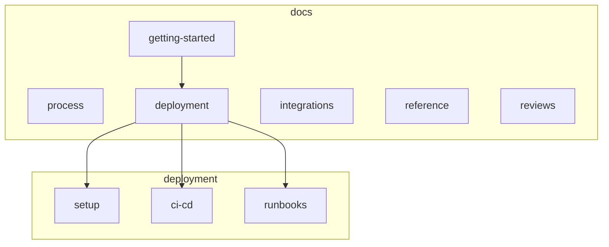

# Documentation index (core-be)

Hand-written guides live in **topic subfolders**; generated API artifacts stay at the repo root of `docs/`.

## Folder layout

| Folder                                                                                                     | Purpose                                                                                    |
| ---------------------------------------------------------------------------------------------------------- | ------------------------------------------------------------------------------------------ |
| [getting-started/](getting-started/)                                                                       | Local setup, API smoke, requirement intake                                                 |
| [process/](process/)                                                                                       | Git branches, PR flow, conventional commits                                                |
| [deployment/](deployment/)                                                                                 | **setup/** · **ci-cd/** · **runbooks/** — see [deployment/README.md](deployment/README.md) |
| [integrations/](integrations/)                                                                             | Third-party tools (Cursor MCP, cloud agents, credentials)                                  |
| [reference/](reference/)                                                                                   | Topic folders for architecture, API design, testing, runtime, security, reliability, data  |
| [reviews/architecture-consistency-roadmap-2026-05.md](reviews/architecture-consistency-roadmap-2026-05.md) | Completed domain-layout program (archival)                                                 |
| [reference/reliability/observability-log-events.md](reference/reliability/observability-log-events.md)     | Structured log event names / dashboard migrations                                          |
| [deployment/docker-images.md](deployment/docker-images.md)                                                 | API vs worker images, MCP docs in container                                                |
| [reviews/](reviews/)                                                                                       | Point-in-time review snapshots (add new dated files; do not rewrite history)               |

**Generated (do not edit by hand):** [routes.txt](routes.txt), [openapi/](openapi/) (`openapi*.json`), [postman-collection.json](postman-collection.json).

---

## Getting started

| Doc                                                                                          | Description                                                                                                 |
| -------------------------------------------------------------------------------------------- | ----------------------------------------------------------------------------------------------------------- |
| [getting-started/setup.md](getting-started/setup.md)                                         | Local setup, testing, links to deployment and credentials.                                                  |
| [getting-started/api-testing.md](getting-started/api-testing.md)                             | Manual API checklist and smoke after `pnpm db:seed:full`.                                                   |
| [getting-started/requirement-intake.md](getting-started/requirement-intake.md)               | Format for new requirements; which skills and rules to run.                                                 |
| [../CONTRIBUTING.md](../CONTRIBUTING.md)                                                     | Contributor quick start; links to **AGENTS.md** for the full PR checklist.                                  |
| [deployment/runbooks/environment-variables.md](deployment/runbooks/environment-variables.md) | Env variable workflow (`.github/sync.config.json` → `pnpm github:sync` → edit values → `pnpm github:sync`). |
| [integrations/credentials-and-env.md](integrations/credentials-and-env.md)                   | Per-provider credential acquisition (S3, Resend, OAuth, Stripe, Sentry, etc.).                              |

---

## Development workflow

| Doc                                                  | Description                                                         |
| ---------------------------------------------------- | ------------------------------------------------------------------- |
| [process/git-workflow.md](process/git-workflow.md)   | Branch naming, PR flow, conventional commits.                       |
| [process/dr-runbook.md](process/dr-runbook.md)       | Disaster recovery — RTO 1h, RPO 15m, failover, quarterly review.    |
| [process/backup-drills.md](process/backup-drills.md) | Monthly restore drill — automated/manual RTO recording and CI gate. |
| [process/dlq-runbook.md](process/dlq-runbook.md)     | Dead-letter queue inspection and replay.                            |

---

## Deployment and operations

Grouped index: **[deployment/README.md](deployment/README.md)** (`setup/`, `ci-cd/`, `runbooks/`).

| Doc                                                                                                          | Description                                                                                       |
| ------------------------------------------------------------------------------------------------------------ | ------------------------------------------------------------------------------------------------- |
| [deployment/setup/setup-automation.md](deployment/setup/setup-automation.md)                                 | One-command provisioning (`pnpm setup:infra`).                                                    |
| [deployment/setup/setup-token-instructions.md](deployment/setup/setup-token-instructions.md)                 | Token sources and `.env.setup` variable names.                                                    |
| [deployment/setup/railway-github-cli-setup.md](deployment/setup/railway-github-cli-setup.md)                 | Manual Railway + GitHub CLI setup.                                                                |
| [deployment/ci-cd/cicd-and-deployment.md](deployment/ci-cd/cicd-and-deployment.md)                           | CI pipeline, Railway deploy, GitHub secrets.                                                      |
| [deployment/ci-cd/branch-protection.md](deployment/ci-cd/branch-protection.md)                               | Required CI checks for `main` / `dev`.                                                            |
| [deployment/runbooks/runbook-dev-to-production.md](deployment/runbooks/runbook-dev-to-production.md)         | Local → production (gates, path-to-production skill, env, deploy, smoke).                         |
| [deployment/runbooks/environment-variables.md](deployment/runbooks/environment-variables.md)                 | Per-key lifecycle: bootstrap, add/rename/remove, sync to GitHub, troubleshoot.                    |
| [deployment/runbooks/add-new-environment.md](deployment/runbooks/add-new-environment.md)                     | Per-environment plumbing: branch ↔ GitHub Environment ↔ `NODE_ENV` 1:1 invariant.                 |
| [deployment/runbooks/resource-limits.md](deployment/runbooks/resource-limits.md)                             | Railway/K8s memory, `NODE_OPTIONS`, Postgres pool budget.                                         |
| [deployment/runbooks/redis-topology.md](deployment/runbooks/redis-topology.md)                               | Cache vs BullMQ logical Redis DBs and AOF.                                                        |
| [reference/reliability/external-service-resilience.md](reference/reliability/external-service-resilience.md) | Circuit breakers for Stripe, Resend, S3, and mail retries.                                        |
| [reference/data/billing-database-schema.md](reference/data/billing-database-schema.md)                       | Billing tables: primary keys, foreign keys, RLS, indexes.                                         |
| [database/core-be.dbml](database/core-be.dbml)                                                               | Full ER diagram (DBML) for [dbdiagram.io](https://dbdiagram.io/) — `pnpm tool:generate-dbdiagram` |
| [deployment/runbooks/observability.md](deployment/runbooks/observability.md)                                 | Sentry, logs, health; Prometheus re-enable checklist.                                             |
| [deployment/runbooks/jwt-key-rotation.md](deployment/runbooks/jwt-key-rotation.md)                           | JWT PEM rotation (ops today; `kid` multi-key deferred).                                           |
| [deployment/runbooks/upload-storage.md](deployment/runbooks/upload-storage.md)                               | Direct-to-S3 upload hardening: validation, presigned POST, PENDING sweeper, lifecycle policy.     |

---

## Features and tooling

| Doc                                                                                              | Description                                                                                         |
| ------------------------------------------------------------------------------------------------ | --------------------------------------------------------------------------------------------------- |
| [reference/runtime/bull-board.md](reference/runtime/bull-board.md)                               | BullMQ dashboard at `/admin/queues`.                                                                |
| [integrations/cursor-backend-mcp.md](integrations/cursor-backend-mcp.md)                         | Connect frontend to core-be MCP.                                                                    |
| [integrations/cursor-cloud-agent-environment.md](integrations/cursor-cloud-agent-environment.md) | `Dockerfile.agent` vs production image for Cursor cloud agents.                                     |
| [reference/runtime/internationalization.md](reference/runtime/internationalization.md)           | Translation keys, locales, error/success messages.                                                  |
| [reference/testing/load-testing.md](reference/testing/load-testing.md)                           | k6 and Autocannon; keep in sync with [src/tests/load/k6/README.md](../src/tests/load/k6/README.md). |

---

## Reference (architecture and API)

| Doc                                                                                                                | Description                                                                            |
| ------------------------------------------------------------------------------------------------------------------ | -------------------------------------------------------------------------------------- |
| [reference/architecture/project-structure-guide.md](reference/architecture/project-structure-guide.md)             | Layer matrix, request flow, naming (`pnpm tool:project-structure-tree` for live tree). |
| [reference/architecture/domains-and-public-api-design.md](reference/architecture/domains-and-public-api-design.md) | Domain layout and Paddle-style API responses.                                          |
| [reference/api/api-versioning.md](reference/api/api-versioning.md)                                                 | `/api/v1`, deprecation, `Sunset` / `Deprecation` headers.                              |
| [reference/data/data-lifecycle-deletion.md](reference/data/data-lifecycle-deletion.md)                             | Soft-delete, retention, Drizzle table inventory.                                       |
| [reference/data/user-data-export.md](reference/data/user-data-export.md)                                           | Async GDPR export to S3, presigned download, offboarding cleanup.                      |
| [reference/security/authentication.md](reference/security/authentication.md)                                       | Auth methods, rate limits, CAPTCHA (Turnstile) production boot guard.                  |
| [reference/security/csrf-and-session-cookies.md](reference/security/csrf-and-session-cookies.md)                   | Session cookie CSRF posture and Origin checks.                                         |
| [reference/reliability/chaos-testing.md](reference/reliability/chaos-testing.md)                                   | Toxiproxy chaos suite (`pnpm test:chaos`).                                             |
| [reference/testing/contract-tests.md](reference/testing/contract-tests.md)                                         | Outbound contracts for Stripe, Resend, S3.                                             |
| [reference/reliability/health-checks.md](reference/reliability/health-checks.md)                                   | API and worker health endpoints, curl examples, k8s/Railway probes.                    |

---

## Reviews and audits

| Doc                                                                                                        | Description                                                    |
| ---------------------------------------------------------------------------------------------------------- | -------------------------------------------------------------- |
| [reviews/production-readiness-2026-05-15.md](reviews/production-readiness-2026-05-15.md)                   | Pre-production checklist (Prometheus/OTel deferred).           |
| [reviews/full-codebase-review-deliverables.md](reviews/full-codebase-review-deliverables.md)               | Full review deliverables: security, performance, dependencies. |
| [reviews/architecture-consistency-roadmap-2026-05.md](reviews/architecture-consistency-roadmap-2026-05.md) | Completed domain-layout / route-catalog program (archival).    |

---

## Generated artifacts

| Artifact                                           | Regenerate with                                       |
| -------------------------------------------------- | ----------------------------------------------------- |
| [routes.txt](routes.txt)                           | `pnpm routes:catalog`                                 |
| [openapi/](openapi/)                               | `pnpm docs:generate` / `pnpm docs:generate:multilang` |
| [postman-collection.json](postman-collection.json) | `pnpm docs:postman`                                   |

---

## Known gaps and roadmap

**Current observability deferrals:** [deployment/runbooks/observability.md](deployment/runbooks/observability.md). **Dated review snapshot:** [reviews/production-readiness-2026-05-15.md](reviews/production-readiness-2026-05-15.md) (add new dated files under `reviews/`; do not rewrite history). **Dependency note:** [reviews/full-codebase-review-deliverables.md](reviews/full-codebase-review-deliverables.md).
