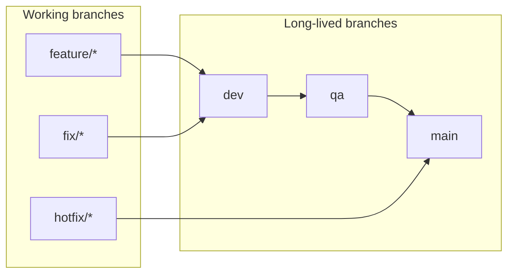

# Branch protection and required CI checks

Canonical reference for **which GitHub checks must gate merges** into **`main`**, **`dev`**, and **`qa`**, and how that maps to workflows and committed ruleset JSON under [`.github/rulesets/`](../../../.github/rulesets/).

**Related docs:** [CI/CD and deployment](cicd-and-deployment.md) (what runs in CI, deploy, and release flow), [Git workflow](../../process/git-workflow.md) (branch naming and promotion).

---

## Branch model

Long-lived branches **`main`**, **`dev`**, and **`qa`** align with Railway environments (production, development, QA). Typical promotion path:



Hotfixes merge **`hotfix/* → main`** first; then sync **`main → dev`** (and optionally **`main → qa`**) so long-lived branches stay aligned (see [Git workflow](../../process/git-workflow.md)).

---

## Required status checks (pull requests)

These are the **exact check names** to require in GitHub for every PR targeting **`main`**, **`dev`**, or **`qa`**.

GitHub Actions reports checks as **`{workflow_name} / {job_name}`** (workflow `name:` from the YAML file, then job `name:`). Match **including spaces and punctuation**.

| Workflow file                                                               | Workflow `name:` | Job `name:`                                  | Required check string                             |
| --------------------------------------------------------------------------- | ---------------- | -------------------------------------------- | ------------------------------------------------- |
| [.github/workflows/ci.yml](../../../.github/workflows/ci.yml)               | `CI`             | `Quality & static security`                  | `CI / Quality & static security`                  |
| [.github/workflows/ci.yml](../../../.github/workflows/ci.yml)               | `CI`             | `Test (Postgres + Redis)`                    | `CI / Test (Postgres + Redis)`                    |
| [.github/workflows/ci.yml](../../../.github/workflows/ci.yml)               | `CI`             | `API smoke (Postgres + Redis + live server)` | `CI / API smoke (Postgres + Redis + live server)` |
| [.github/workflows/ci.yml](../../../.github/workflows/ci.yml)               | `CI`             | `Chaos (Postgres + Redis via Toxiproxy)`     | `CI / Chaos (Postgres + Redis via Toxiproxy)`     |
| [.github/workflows/ci.yml](../../../.github/workflows/ci.yml)               | `CI`             | `Docker Build` (includes Trivy image scan)   | `CI / Docker Build`                               |
| [.github/workflows/pr-checks.yml](../../../.github/workflows/pr-checks.yml) | `PR Checks`      | `PR Quality Gates`                           | `PR Checks / PR Quality Gates`                    |

### Same checks on all three branches

Require **all six** CI + PR rows above for **`main`**, **`dev`**, and **`qa`** PRs. [`.github/workflows/ci.yml`](../../../.github/workflows/ci.yml) runs the same CI targets on PRs into each of these branches (`on: pull_request: branches: [main, dev, qa]`).

### Skipped CI jobs on docs-only pull requests

When [ci.yml](../../../.github/workflows/ci.yml) path filters detect **no `src-code` changes**, these jobs are **skipped** on `pull_request` (they still run on **push**):

| Job `name:`                                  | Skipped when       |
| -------------------------------------------- | ------------------ |
| `Test (Postgres + Redis)`                    | Docs/markdown-only |
| `API smoke (Postgres + Redis + live server)` | Docs/markdown-only |
| `Chaos (Postgres + Redis via Toxiproxy)`     | Docs/markdown-only |
| `Docker Build`                               | Docs/markdown-only (unless `docker` paths change) |

Skipped required checks do **not** block merge. `Quality & static security` and `PR Checks` always run.

### Advisory PR jobs (not in rulesets)

_None — all merge-gating CI jobs are listed in the required table above._

### Post-merge-only jobs (do not add as PR required checks)

| Job `name:`  | Workflow                                                      | Why                                     |
| ------------ | ------------------------------------------------------------- | --------------------------------------- |
| `API Docs`   | [ci.yml](../../../.github/workflows/ci.yml)                   | `if: github.event_name == 'push'`       |
| `Commitlint` | [commit-lint.yml](../../../.github/workflows/commit-lint.yml) | Runs on **push** to `main`, `dev`, `qa` |

Treat these as **post-merge gates**: failing runs still indicate problems on the branch tip after merge.

[deploy-railway.yml](../../../.github/workflows/deploy-railway.yml) runs after **CI** succeeds (`workflow_run`) or via **workflow_dispatch**; it is **not** a PR status check.

---

## Ruleset policy summary (by branch)

These settings match the committed JSON files in [`.github/rulesets/`](../../../.github/rulesets/). Adjust there and re-import if policy changes.

| Rule                                  | `main`                                                             | `dev`                 | `qa`                  |
| ------------------------------------- | ------------------------------------------------------------------ | --------------------- | --------------------- |
| Required approving reviews            | 1                                                                  | 1                     | 1                     |
| Require CODEOWNER review              | Yes ([CODEOWNERS](../../../.github/CODEOWNERS))                    | No                    | No                    |
| Dismiss stale approvals on push       | Yes                                                                | No                    | No                    |
| Require approval on last push         | Yes                                                                | No                    | No                    |
| Require conversation resolution       | Yes                                                                | Yes                   | Yes                   |
| Allowed merge methods                 | Squash only                                                        | Squash + merge commit | Squash + merge commit |
| Require linear history                | Yes                                                                | No                    | No                    |
| Require signed commits                | Yes                                                                | No                    | No                    |
| Block force-push (`non_fast_forward`) | Yes                                                                | Yes                   | Yes                   |
| Block branch deletion                 | Yes                                                                | Yes                   | Yes                   |
| Required status checks                | CI quality + tests + API smoke + chaos + docker (Trivy) + PR checks | Same                  | Same                  |

**Signed commits on `main`:** Contributors must use [verified signatures](https://docs.github.com/en/authentication/managing-commit-signature-verification/about-commit-signature-verification). Teams without signing enabled should temporarily relax `required_signatures` in `main.json` until onboarding is complete.

---

## Apply rulesets (GitHub UI)

1. Repository → **Settings** → **Rules** → **Rulesets** → **New ruleset** → **New branch ruleset**.
2. Target branches: **`main`** (or **`dev`** / **`qa`**).
3. Add rules matching the table above and the corresponding JSON file under [`.github/rulesets/`](../../../.github/rulesets/).
4. Set enforcement to **Active** (use **Evaluate** on Enterprise first if you want dry-run insights).

---

## Apply rulesets via GitHub CLI (`gh`)

Requires [`gh`](https://cli.github.com/) authenticated with **`repo`** scope (and organization permission if the repo belongs to an org).

Replace **`OWNER`** and **`REPO`** with your GitHub owner and repository name.

Each **`POST`** creates a **new** ruleset. Do not run these repeatedly without deleting duplicate rulesets in **Settings → Rules**, or use **`PATCH`** with an existing ruleset ID instead.

```bash
gh api --method POST repos/OWNER/REPO/rulesets \
  -H "Accept: application/vnd.github+json" \
  --input .github/rulesets/main.json

gh api --method POST repos/OWNER/REPO/rulesets \
  -H "Accept: application/vnd.github+json" \
  --input .github/rulesets/dev.json

gh api --method POST repos/OWNER/REPO/rulesets \
  -H "Accept: application/vnd.github+json" \
  --input .github/rulesets/qa.json
```

**Updating an existing ruleset:** use `PATCH /repos/{owner}/{repo}/rulesets/{ruleset_id}` with the same JSON shape (omit fields you do not want to change), or edit in the UI. Listing IDs: `gh api repos/OWNER/REPO/rulesets`.

**Verifying check names:** After at least one PR run, open the PR → **Checks** tab and confirm names match **`CI / …`** and **`PR Checks / …`**. If GitHub shows a different label, align [`.github/rulesets/*.json`](../../../.github/rulesets/) and this doc.

---

## Maintenance

- **Renaming or splitting CI jobs:** Update job `name:` values in workflows **and** sync **`required_status_checks`** contexts in **every** file under [`.github/rulesets/`](../../../.github/rulesets/), plus this document.
- **Adding a new required workflow:** Prefer extending [.github/workflows/ci.yml](../../../.github/workflows/ci.yml) or [.github/workflows/pr-checks.yml](../../../.github/workflows/pr-checks.yml) so checks stay consistent across branches.

Consult [.cursor/skills/skill-index/SKILL.md](../../../.cursor/skills/skill-index/SKILL.md) after edits to `.github/rulesets/` or this file (**docs-maintainer**). Changes to [.github/workflows/ci.yml](../../../.github/workflows/ci.yml) should still follow **code-quality-guard**.
