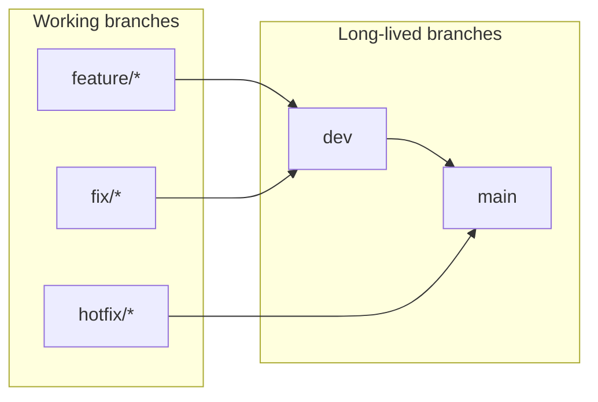

# Branch protection and required CI checks

Canonical reference for **which GitHub checks must gate merges** into **`main`** (the single protected
trunk), and how that maps to workflows and committed ruleset JSON under
[`.github/rulesets/`](../../../.github/rulesets/).

> **Single-trunk model.** `main` is the only long-lived branch. Its ruleset
> ([`main.json`](../../../.github/rulesets/main.json)) is **squash-only**, 0 approvals (D8), with
> `required_linear_history` and strict up-to-date checks. The authoritative DB matrix is enforced via
> the **`matrix / Integration`** required check (backed by the always-runs `reusable-matrix-gate.yml`).
> Short-lived `release/*` hotfix branches are protected by
> [`release.json`](../../../.github/rulesets/release.json). The former `dev` ruleset is retired.

**Related docs:** [CI/CD and deployment](cicd-and-deployment.md) (what runs in CI, deploy, and release flow), [Git workflow](../../process/git-workflow.md) (branch naming and the single-trunk PR flow).

---

## Branch model

Long-lived branches **`main`** and **`dev`** align with Railway environments (production, development). Typical promotion path:



Hotfixes merge **`hotfix/* → main`** first; then sync **`main → dev`** so long-lived branches stay aligned (see [Git workflow](../../process/git-workflow.md)).

---

## Required status checks (pull requests)

These are the **exact check names** to require in GitHub for every PR targeting **`main`** or **`dev`**.

GitHub Actions reports a status-check context as the **bare job `name:`** — **not** prefixed by the workflow name. (The one exception here is the reusable unit workflow, which reports as `unit / Unit + global`.) Match **including spaces and punctuation**. A workflow-prefixed form like `PR CI / Lint` matches **no real check** and silently blocks every merge — use the exact strings in the "Required check string" column below.

| Workflow file | Workflow `name:` | Job `name:` | Required check string |
| ------------- | ---------------- | ----------- | --------------------- |
| [.github/workflows/pr-ci.yml](../../../.github/workflows/pr-ci.yml) | `PR CI` | `Lint` | `Lint` |
| [.github/workflows/pr-ci.yml](../../../.github/workflows/pr-ci.yml) | `PR CI` | `Typecheck` | `Typecheck` |
| [.github/workflows/pr-ci.yml](../../../.github/workflows/pr-ci.yml) | `PR CI` | `Static sync` | `Static sync` |
| [.github/workflows/pr-ci.yml](../../../.github/workflows/pr-ci.yml) | `PR CI` | `Unit + global (pull_request)` | `unit / Unit + global` |
| [.github/workflows/pr-ci.yml](../../../.github/workflows/pr-ci.yml) | `PR CI` | `Migration lint` | `Migration lint` |
| [.github/workflows/pr-ci.yml](../../../.github/workflows/pr-ci.yml) | `PR CI` | `Build verify` | `Build verify` |
| [.github/workflows/pr-ci.yml](../../../.github/workflows/pr-ci.yml) | `PR CI` | `Security audit` | `Security audit` |
| [.github/workflows/pr-ci.yml](../../../.github/workflows/pr-ci.yml) | `PR CI` | `Security secrets` | `Security secrets` |
| [.github/workflows/pr-ci.yml](../../../.github/workflows/pr-ci.yml) | `PR CI` | `Security SAST` | `Security SAST` |
| [.github/workflows/pr-ci.yml](../../../.github/workflows/pr-ci.yml) | `PR CI` | `Contract + property` | `Contract + property` |
| [.github/workflows/pr-ci.yml](../../../.github/workflows/pr-ci.yml) | `PR CI` | `RLS security (non-superuser)` | `RLS security (non-superuser)` |
| [.github/workflows/pr-governance.yml](../../../.github/workflows/pr-governance.yml) | `PR Governance` | `Checks` | `Checks` |

### Same checks on both branches

Require **all twelve** rows above for **`main`** and **`dev`** PRs. [`.github/workflows/pr-ci.yml`](../../../.github/workflows/pr-ci.yml) runs on `pull_request` into each branch. Post-merge Docker (Trivy + GHCR), SBOM, API docs, deploy, and release automation run from [post-merge-ci.yml](../../../.github/workflows/post-merge-ci.yml) when a PR merges (not required PR checks).

> **`RLS security (non-superuser)` is the one DB-backed PR check.** Every other PR-CI job is DB-less, but the RLS suite must run as the non-superuser `core_be_app` role against a real Postgres — the local/CI superuser is RLS-exempt and hides FORCE-RLS bugs (this is how the org-mandated-MFA bypass shipped). It is scoped to `src/tests/security/rls` to stay fast; the rest of `--project security` and the full DB integration and chaos suites remain post-merge / local-only (`pnpm test:integration`, `pnpm test:chaos`).

### Skipped PR CI jobs on docs-only pull requests

When [pr-ci.yml](../../../.github/workflows/pr-ci.yml) path filters detect **docs-only markdown** (`docs-only-md`), all **PR CI** jobs are **skipped**. Skipped required checks do **not** block merge. The markdown lane lives in [pr-docs-lane.yml](../../../.github/workflows/pr-docs-lane.yml) and only triggers when a PR touches `*.md`.

When the PR touches **src** but not only docs, these jobs may still skip individually:

| Job `name:` | Skipped when |
| ----------- | ------------ |
| `Unit + global (pull_request)` | No `src-code` or `ci-config` paths |
| `RLS security (non-superuser)` | No `src-code` or `ci-config` paths |
| `Build verify` | No `src-code`, `docker`, or `ci-config` paths |

`Lint`, `Typecheck`, `Static sync`, `Migration lint`, `Security audit`, `Security secrets`, `Security SAST`, and `Contract + property` run on every non-docs-only PR.

### Advisory PR jobs (not in rulesets)

*None — all merge-gating CI jobs are listed in the required table above.*

### Post-merge-only jobs (do not add as PR required checks)

| Job `name:` | Workflow | Why |
| ----------- | -------- | --- |
| `Docker` | [post-merge-ci.yml](../../../.github/workflows/post-merge-ci.yml) | Build + Trivy + GHCR push + container smoke |
| `SBOM` | [post-merge-ci.yml](../../../.github/workflows/post-merge-ci.yml) | CycloneDX artifact for the branch tip |
| `API docs` | [post-merge-ci.yml](../../../.github/workflows/post-merge-ci.yml) | OpenAPI + Postman publish |
| `Commitlint` | [post-merge-ci.yml](../../../.github/workflows/post-merge-ci.yml) | Conventional commits on merged commits |
| `Release Please` | [post-merge-ci.yml](../../../.github/workflows/post-merge-ci.yml) | Release PR / GitHub Release automation (after Docker green) |
| `Release SBOM` | [post-merge-ci.yml](../../../.github/workflows/post-merge-ci.yml) | Re-uses `sbom` artifact and attaches it when release-please publishes |
| `Deploy` | [post-merge-ci.yml](../../../.github/workflows/post-merge-ci.yml) | Railway deploy via reusable [reusable-railway-deploy.yml](../../../.github/workflows/reusable-railway-deploy.yml) (last step) |

Treat these as **post-merge gates**: failing runs still indicate problems on the branch tip after merge.

Manual emergency redeploy: [reusable-railway-deploy.yml](../../../.github/workflows/reusable-railway-deploy.yml) `workflow_dispatch` only (not a PR status check).

---

## Ruleset policy summary (by branch)

These settings match the committed JSON files in [`.github/rulesets/`](../../../.github/rulesets/). Adjust there and re-import if policy changes.

| Rule | `main` | `dev` |
| ---- | ------ | ----- |
| Required approving reviews | 1 | 0 (solo maintainer — status checks still block merge) |
| Require CODEOWNER review | Yes ([CODEOWNERS](../../../.github/CODEOWNERS)) | No |
| Dismiss stale approvals on push | Yes | No |
| Require approval on last push | Yes | No |
| Require conversation resolution | Yes | Yes |
| Allowed merge methods | Merge commit only | Squash only |
| Require linear history | No | No |
| Require signed commits | Yes | No |
| Block force-push (`non_fast_forward`) | Yes | Yes |
| Block branch deletion | Yes | Yes |
| Required status checks | PR CI (11 jobs incl. RLS security) + PR Governance | Same |

**Signed commits on `main`:** Contributors must use [verified signatures](https://docs.github.com/en/authentication/managing-commit-signature-verification/about-commit-signature-verification). Teams without signing enabled should temporarily relax `required_signatures` in `main.json` until onboarding is complete.

---

## Apply rulesets (GitHub UI)

1. Repository → **Settings** → **Rules** → **Rulesets** → **New ruleset** → **New branch ruleset**.
2. Target branches: **`main`** (or **`dev`**).
3. Add rules matching the table above and the corresponding JSON file under [`.github/rulesets/`](../../../.github/rulesets/).
4. Set enforcement to **Active** (use **Evaluate** on Enterprise first if you want dry-run insights).

---

## Apply rulesets via GitHub CLI (`gh`)

Requires [`gh`](https://cli.github.com/) authenticated with **`repo`** scope (and organization permission if the repo belongs to an org).

### One-step init (recommended)

Use [`tooling/setup/github/init.ts`](../../../tooling/setup/github/init.ts). It derives the target branches from the committed rulesets (`refs/heads/<branch>` entries in `conditions.ref_name.include`), ensures each branch exists on the remote (creating missing branches from the default branch's SHA via `POST /repos/{repo}/git/refs`), `POST`s / `PUT`s every ruleset, and idempotently creates the GitHub Environments declared in [`.github/environments/*.json`](../../../.github/environments/). Safe to run repeatedly.

```bash
pnpm github:sync --check   # read-only: consistency + drift (missing branches, rulesets, environments)
pnpm github:sync           # apply branches + rulesets + environments + push .env.<env> values
```

Before any GitHub API call, `github:sync` runs a **gh auth preflight** that prints the currently active `gh` user and lets you confirm, abort, or switch to a different account (`gh auth switch`). The values push requires typing `sync` (or `--yes` in automation) and is non-reversible.

The script resolves the target repository in this order: `GITHUB_REPOSITORY` env → `origin` git remote → `gh repo view`.

### Manual one-off via raw API

Replace **`OWNER`** and **`REPO`** with your GitHub owner and repository name.

Each **`POST`** creates a **new** ruleset. Do not run these repeatedly without deleting duplicate rulesets in **Settings → Rules**, or use **`PUT`** / **`PATCH`** with an existing ruleset ID instead.

```bash
gh api --method POST repos/OWNER/REPO/rulesets \
  -H "Accept: application/vnd.github+json" \
  --input .github/rulesets/main.json

gh api --method POST repos/OWNER/REPO/rulesets \
  -H "Accept: application/vnd.github+json" \
  --input .github/rulesets/dev.json
```

**Updating an existing ruleset:** use `PATCH /repos/{owner}/{repo}/rulesets/{ruleset_id}` with the same JSON shape (omit fields you do not want to change), or edit in the UI. Listing IDs: `gh api repos/OWNER/REPO/rulesets`.

### Plan requirement

Repository rulesets on **private** repos require **GitHub Pro / Team / Enterprise**. On the free personal plan the API returns `HTTP 403`:

> `Upgrade to GitHub Pro or make this repository public to enable this feature.`

The sync script surfaces this message verbatim and exits non-zero. Either upgrade the account/org plan or make the repository public to apply rulesets.

**Verifying check names:** After at least one PR run, open the PR → **Checks** tab and confirm the names match the **bare check strings** in the table above (e.g. `Lint`, `RLS security (non-superuser)`, `unit / Unit + global`) — **not** a `PR CI / …` prefixed form. If GitHub shows a different label, align [`.github/rulesets/*.json`](../../../.github/rulesets/) and this doc.

---

## Maintenance

- **Renaming or splitting CI jobs:** Update job `name:` values in workflows **and** sync **`required_status_checks`** contexts in **every** file under [`.github/rulesets/`](../../../.github/rulesets/), plus this document.
- **Adding a new required workflow:** Prefer extending [.github/workflows/pr-ci.yml](../../../.github/workflows/pr-ci.yml) or [.github/workflows/pr-governance.yml](../../../.github/workflows/pr-governance.yml) so checks stay consistent across branches.

Consult [.cursor/skills/skill-index/SKILL.md](../../../.cursor/skills/skill-index/SKILL.md) after edits to `.github/rulesets/` or this file (**docs-maintainer**). Changes to [.github/workflows/pr-ci.yml](../../../.github/workflows/pr-ci.yml) should still follow **code-quality-guard**.
