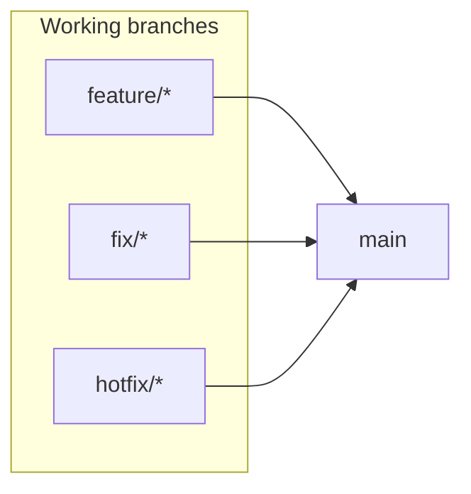

# Branch protection and required CI checks

Canonical reference for **which GitHub checks must gate merges** into **`main`** (the single protected
trunk), and how that maps to workflows and committed ruleset JSON under
[`.github/rulesets/`](../../../.github/rulesets/).

> **Single-trunk model.** `main` is the only long-lived branch. Its ruleset
> ([`main.json`](../../../.github/rulesets/main.json)) is **squash-only**, 0 approvals (D8), with
> `required_linear_history`, **no `bypass_actors`**, and strict up-to-date OFF. Branch protection requires exactly **two**
> aggregate contexts — **`Quality gate`** (the pr-ci.yml aggregate that rolls up every merge-gating
> lane, including the authoritative DB matrix) and **`Checks`** (pr-governance). `main.json` is the
> **only** committed ruleset: hotfixes fix-forward to `main` via ordinary `fix/*` PRs, so there are
> no protected release branches.

**Related docs:** [CI/CD and deployment](cicd-and-deployment.md) (what runs in CI, deploy, and release flow), [Trunk-based workflow](../../process/trunk-based-workflow.md) (branch naming and the single-trunk PR flow).

---

## Branch model

`main` is the only long-lived branch (single trunk) and deploys to both Railway environments (development on merge, production on release). Feature, fix, and hotfix branches merge **directly** into `main` via squash-merged PRs — there is no `dev` branch and no promotion:



Hotfixes are ordinary `fix/*` (or `hotfix/*`) PRs that **fix-forward** to `main` (see [Trunk-based workflow](../../process/trunk-based-workflow.md)).

---

## Required status checks (pull requests)

Branch protection requires exactly **two** check contexts on every PR into **`main`**:

| Required check string | Workflow | What it covers |
| --------------------- | -------- | -------------- |
| `Quality gate` | [pr-ci.yml](../../../.github/workflows/pr-ci.yml) | **Aggregate** — rolls up every merge-gating PR-CI lane (see below) |
| `Checks` | [pr-governance.yml](../../../.github/workflows/pr-governance.yml) | PR title (conventional commits), size label, `.env` guard, path labels |

GitHub reports a status-check context as the **bare job `name:`** — never prefixed by the workflow. A workflow-prefixed form like `PR CI / Lint` matches **no real check** and silently blocks every merge; [`main.json`](../../../.github/rulesets/main.json) therefore lists the bare strings above.

### Why an aggregate

The `quality-gate` job (in [pr-ci.yml](../../../.github/workflows/pr-ci.yml)) `needs:` every merge-gating lane and passes only when each one **succeeded or was legitimately skipped** (docs-only path filter); any real failure or cancellation fails the aggregate. Because the ruleset points at the single `Quality gate` context, **adding, removing, or renaming a lane changes only `quality-gate.needs` — never the ruleset, and never a `pnpm github:sync`.** That removes the "a job rename silently disabled a required check" drift the previous per-lane list was exposed to. The ruleset ↔ `needs` invariant is pinned by [`pr-quality-gate.policy.unit.test.ts`](../../../src/tests/unit/ci/pr-quality-gate.policy.unit.test.ts).

Lanes currently rolled up (**authoritative source: `quality-gate.needs` in pr-ci.yml** — this table is a convenience mirror):

| Lane (`needs:` id) | Job `name:` |
| ------------------ | ----------- |
| `lint` | Lint |
| `typecheck` | Typecheck |
| `static-sync` | Static sync |
| `unit` | Unit + global (via `reusable-unit-gate.yml`) |
| `matrix` | Integration (via `reusable-matrix-gate.yml`) |
| `migration-lint` | Migration lint |
| `build-verify` | Build verify |
| `security-audit` | Security audit |
| `security-secrets` | Security secrets |
| `security-sast` | Security SAST |
| `security-iac` | Security IaC (Trivy config) |
| `dependency-review` | Dependency review |
| `contract-property` | Contract + property |
| `rls-security` | RLS security (non-superuser) |
| `actionlint` | Actionlint |

Post-merge Docker (Trivy + GHCR), SBOM, API docs, deploy, and release automation run from [post-merge-ci.yml](../../../.github/workflows/post-merge-ci.yml) when a PR merges (not required PR checks).

> **`RLS security (non-superuser)` is the one DB-backed PR lane.** Every other PR-CI job is DB-less, but the RLS suite must run as the non-superuser `core_be_app` role against a real Postgres — the local/CI superuser is RLS-exempt and hides FORCE-RLS bugs (this is how the org-mandated-MFA bypass shipped). It is scoped to `src/tests/security/rls` to stay fast; the rest of `--project security` and the full DB integration and chaos suites remain post-merge / local-only (`pnpm test:integration`, `pnpm test:chaos`). It is gated the same as every other lane: `quality-gate` `needs: rls-security`, so a red RLS run fails `Quality gate` and blocks the merge (pinned by [`pr-rls-security-gate.policy.unit.test.ts`](../../../src/tests/unit/ci/pr-rls-security-gate.policy.unit.test.ts)).

### Advisory PR jobs (run but not in the aggregate)

These run on every non-docs-only PR and display on the PR, but are **not** in `quality-gate.needs`, so they do not block merge: `agent-os evals` (internal tooling gate, only runs on `agent-os/**` changes). Promote one to blocking by adding its job id to `quality-gate.needs` **and** to `REQUIRED_LANES` in [`pr-quality-gate.policy.unit.test.ts`](../../../src/tests/unit/ci/pr-quality-gate.policy.unit.test.ts).

### Skipped PR CI jobs on docs-only pull requests

When [pr-ci.yml](../../../.github/workflows/pr-ci.yml) path filters detect **docs-only markdown** (`docs-only-md`), the code lanes are **skipped** — the aggregate treats skipped as a pass, so `Quality gate` stays green and does not block the docs-only merge. The markdown lane lives in [pr-docs-lane.yml](../../../.github/workflows/pr-docs-lane.yml) and only triggers when a PR touches `*.md`. Individual lanes (`unit`, `rls-security`, `build-verify`) also skip on a non-docs PR that misses their path filter; each skip still counts as a pass for the aggregate.

### Post-merge-only jobs (do not add as PR required checks)

| Job `name:` | Workflow | Why |
| ----------- | -------- | --- |
| `Docker` | [post-merge-ci.yml](../../../.github/workflows/post-merge-ci.yml) | Build + Trivy + GHCR push + container smoke |
| `SBOM` | [post-merge-ci.yml](../../../.github/workflows/post-merge-ci.yml) | CycloneDX artifact for the branch tip |
| `API docs` | [post-merge-ci.yml](../../../.github/workflows/post-merge-ci.yml) | OpenAPI + Postman publish |
| `Commitlint` | [post-merge-ci.yml](../../../.github/workflows/post-merge-ci.yml) | Conventional commits on merged commits |
| `Release Please` | [post-merge-ci.yml](../../../.github/workflows/post-merge-ci.yml) | Release PR / GitHub Release automation (after Docker green) |
| `Release SBOM` | [post-merge-ci.yml](../../../.github/workflows/post-merge-ci.yml) | Re-uses `sbom` artifact and attaches it when release-please publishes |
| `Deploy` | [post-merge-ci.yml](../../../.github/workflows/post-merge-ci.yml) | Railway deploy via reusable [reusable-railway-deploy.yml](../../../.github/workflows/reusable-railway-deploy.yml) (last step) |

Treat these as **post-merge gates**: failing runs still indicate problems on the branch tip after merge.

Manual emergency redeploy: [reusable-railway-deploy.yml](../../../.github/workflows/reusable-railway-deploy.yml) `workflow_dispatch` only (not a PR status check).

---

## Ruleset policy summary

These settings match the committed [`main.json`](../../../.github/rulesets/main.json) — the only ruleset. Adjust there and re-sync (`pnpm github:sync`) if policy changes.

| Rule | `main` |
| ---- | ------ |
| Required approving reviews | 0 (solo maintainer — status checks still block merge) |
| Require CODEOWNER review | No |
| Dismiss stale approvals on push | No |
| Require approval on last push | No |
| Require conversation resolution | Yes |
| Allowed merge methods | Squash only |
| Require linear history | Yes |
| Require signed commits | Yes |
| Block force-push (`non_fast_forward`) | Yes |
| Block branch deletion | Yes |
| Required status checks | `Quality gate` (pr-ci aggregate) + `Checks` (pr-governance) — **no bypass**, strict off |

> **Enforced peer review is off by design** while CODEOWNERS is single-owner. This is the **personal** governance mode; switch to **team** with one command once the roster grows — see [Governance mode — personal ↔ team](#governance-mode--personal--team-one-switch) below.

**Signed commits on `main`:** `required_signatures` is intentionally **not** in the ruleset — branch commits are unsigned, and once `bypass_actors` was removed the rule would deadlock every PR. The commit that lands on `main` is signed regardless, because GitHub signs the squash-merge commit it creates (verify: `gh api repos/OWNER/REPO/commits/main --jq .commit.verification`). To require signed **branch** commits, set up [commit signing](https://docs.github.com/en/authentication/managing-commit-signature-verification/about-commit-signature-verification) first, then re-add `required_signatures`.

---

## Governance mode — personal ↔ team (one switch)

The repository runs in one of two **governance modes**, and you switch between them with a single command rather than hand-editing JSON:

| Mode | Merge gate (`main.json`) | Production-deploy gate (`production.json`) |
| ---- | ------------------------ | ----------------------------------------- |
| **personal** *(current)* | 0 required approvals, no CODEOWNER review, no last-push approval | single reviewer, self-review allowed |
| **team** | 1 CODEOWNER approval, last-push approval, stale approvals dismissed | ≥2 reviewers (from CODEOWNERS), self-review prevented |

In **both** modes the automated gates (`Quality gate` + `Checks`, including the authoritative DB matrix) still block every merge — the mode only governs the **human** review requirement.

Today the repo is in **personal** mode **by design, not by oversight**: [`.github/CODEOWNERS`](../../../.github/CODEOWNERS) lists a **single** owner (`@nikunjmavani`), so requiring a (code-owner) review would make that owner's own PRs unmergeable (GitHub forbids self-approval) — strictly worse than leaving the human-review gate off. (There is no Admin bypass to fall back on: `bypass_actors` is empty, so the automated `Quality gate` / `Checks` gates are absolute for everyone.) The mode fields are **coupled** (e.g. `preventSelfReview` needs ≥2 reviewers; `require_code_owner_review` needs ≥2 owners), which is exactly why they move together through the tool.

### Switch modes

```bash
pnpm github:tool:governance-mode                 # status: current mode, CODEOWNERS roster, next step
pnpm github:tool:governance-mode team            # apply four-eyes mode (needs ≥2 CODEOWNERS owners)
pnpm github:tool:governance-mode personal        # apply solo-maintainer mode
pnpm github:sync                          # push the updated ruleset + environment to GitHub
```

The tool ([`tooling/setup/github/governance-mode.ts`](../../../tooling/setup/github/governance-mode.ts)) flips **all** coupled fields in [`main.json`](../../../.github/rulesets/main.json) and [`production.json`](../../../.github/environments/production.json) atomically, derives the team reviewer roster from [`.github/CODEOWNERS`](../../../.github/CODEOWNERS) (individual users only), and **refuses `team` mode** when the roster has fewer than two users — so the repo can never land in a deadlocking configuration. After switching, update the **Ruleset policy summary** table above so it keeps matching `main.json`.

### To move to team mode

1. Add owner(s) to [`.github/CODEOWNERS`](../../../.github/CODEOWNERS) so it lists **≥2 individual users** with write+ access. (Team handles like `@org/team` resolve only on **organization** repos — the `@core/dev` TODO in CODEOWNERS requires transferring the repo into an org first; a personal repo lists individual handles only.)
2. Run `pnpm github:tool:governance-mode team` then `pnpm github:sync`.

> **Invariant guard.** `pnpm github:tool:governance-mode:check` (and the unit test [`governance-mode.policy.unit.test.ts`](../../../src/tests/unit/ci/governance-mode.policy.unit.test.ts), which runs in the `unit` lane of `Quality gate`) fails if the two committed files ever drift into an inconsistent or deadlocking combination.
>
> **No break-glass — a red check is absolute.** `bypass_actors` is intentionally **empty**: a PR with a failing or pending `Quality gate` / `Checks` cannot be merged by anyone, the repo owner included (no `--admin` / merge-API override). This is precisely what stops a red gate from slipping through. Pinned by [`rulesets.policy.unit.test.ts`](../../../src/tests/unit/ci/rulesets.policy.unit.test.ts). To restore an emergency bypass you would re-add `bypass_actors` to `main.json` — but that re-opens the red-merge hole, so don't.

---

## Apply rulesets (GitHub UI)

1. Repository → **Settings** → **Rules** → **Rulesets** → **New ruleset** → **New branch ruleset**.
2. Target branch: **`main`**.
3. Add rules matching the table above and the corresponding JSON file under [`.github/rulesets/`](../../../.github/rulesets/).
4. Set enforcement to **Active** (use **Evaluate** on Enterprise first if you want dry-run insights).

---

## Apply rulesets via GitHub CLI (`gh`)

Requires [`gh`](https://cli.github.com/) authenticated with **`repo`** scope (and organization permission if the repo belongs to an org).

### One-step init (recommended)

Use [`tooling/setup/github/init.ts`](../../../tooling/setup/github/init.ts). It `POST`s / `PUT`s every committed ruleset and idempotently creates the GitHub Environments declared in [`.github/environments/*.json`](../../../.github/environments/). Safe to run repeatedly. Single trunk: `main` is the only long-lived branch and it is the repository default (always present), so there is no branch-creation step.

```bash
pnpm github:sync --check   # read-only: consistency + drift (rulesets, environments)
pnpm github:sync           # apply rulesets + environments + push .env.<environment> values
```

Before any GitHub API call, `github:sync` runs a **gh auth preflight** that prints the currently active `gh` user and lets you confirm, abort, or switch to a different account (`gh auth switch`). The values push requires typing `sync` (or `--yes` in automation) and is non-reversible.

The script resolves the target repository in this order: `GITHUB_REPOSITORY` env → `origin` git remote → `gh repo view`.

### Manual one-off via raw API

Replace **`OWNER`** and **`REPO`** with your GitHub owner and repository name.

Each **`POST`** creates a **new** ruleset. Do not run these repeatedly without deleting duplicate rulesets in **Settings → Rules**, or use **`PUT`** / **`PATCH`** with an existing ruleset ID instead.

```bash
gh api --method POST repos/OWNER/REPO/rulesets \
  -H "Accept: application/vnd.github+json" \
  --input .github/rulesets/main.json
```

**Updating an existing ruleset:** use `PATCH /repos/{owner}/{repo}/rulesets/{ruleset_id}` with the same JSON shape (omit fields you do not want to change), or edit in the UI. Listing IDs: `gh api repos/OWNER/REPO/rulesets`.

### Plan requirement

Repository rulesets on **private** repos require **GitHub Pro / Team / Enterprise**. On the free personal plan the API returns `HTTP 403`:

> `Upgrade to GitHub Pro or make this repository public to enable this feature.`

The sync script surfaces this message verbatim and exits non-zero. Either upgrade the account/org plan or make the repository public to apply rulesets.

**Verifying check names:** After at least one PR run, open the PR → **Checks** tab and confirm the two required contexts appear as the **bare strings** `Quality gate` and `Checks` — **not** a `PR CI / …` prefixed form. If GitHub shows a different label, align [`.github/rulesets/main.json`](../../../.github/rulesets/main.json) and this doc.

---

## Maintenance

- **Renaming or splitting a rolled-up CI job:** Update the job `name:` and its `- <id>` entry in `quality-gate.needs` in [pr-ci.yml](../../../.github/workflows/pr-ci.yml). The ruleset does **not** change — it only ever requires `Quality gate` + `Checks`, so no `pnpm github:sync` is needed for lane changes.
- **Adding a new required lane:** Add the job to [pr-ci.yml](../../../.github/workflows/pr-ci.yml), add its id to `quality-gate.needs`, and add it to `REQUIRED_LANES` in [`pr-quality-gate.policy.unit.test.ts`](../../../src/tests/unit/ci/pr-quality-gate.policy.unit.test.ts). (Promoting an advisory lane to blocking is the same two-line change.)
- **Changing the required contexts themselves** (rare): edit [`main.json`](../../../.github/rulesets/main.json) and run `pnpm github:sync`; `pr-quality-gate.policy.unit.test.ts` pins the expected set, so update it in the same change.

Consult [.cursor/skills/skill-index/SKILL.md](../../../.cursor/skills/skill-index/SKILL.md) after edits to `.github/rulesets/` or this file (**docs-maintainer**). Changes to [.github/workflows/pr-ci.yml](../../../.github/workflows/pr-ci.yml) should still follow **code-quality-guard**.
