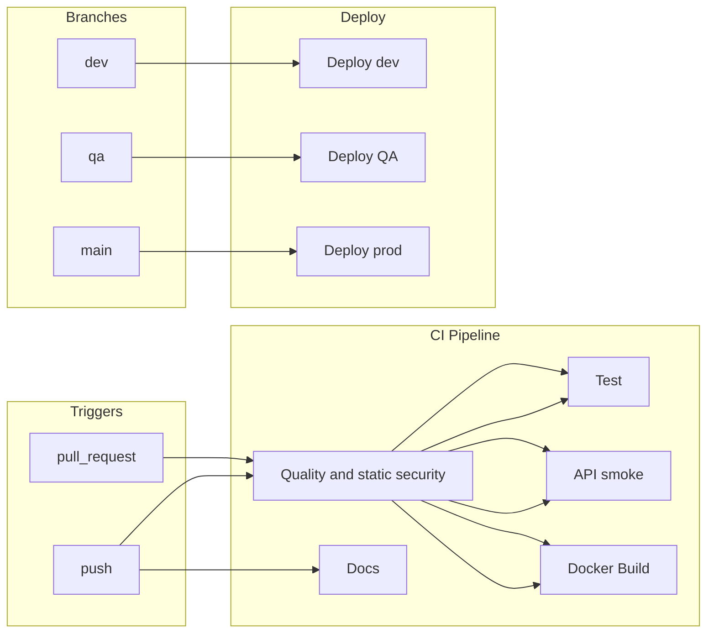
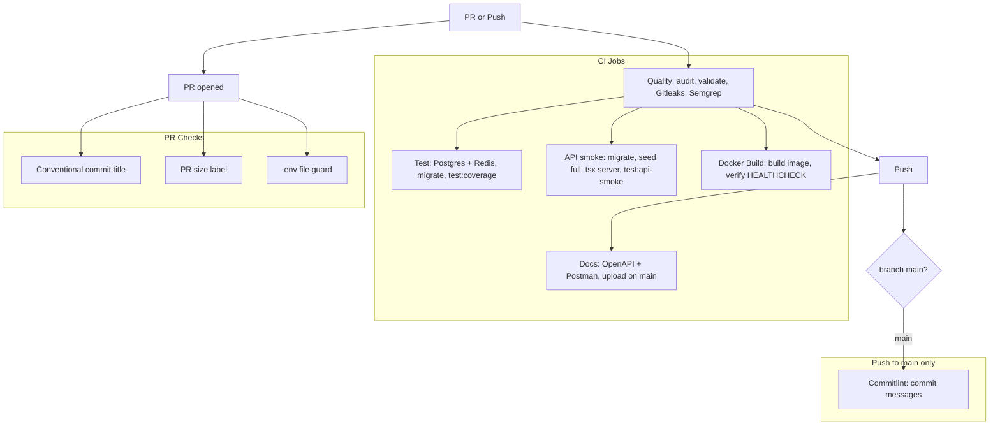
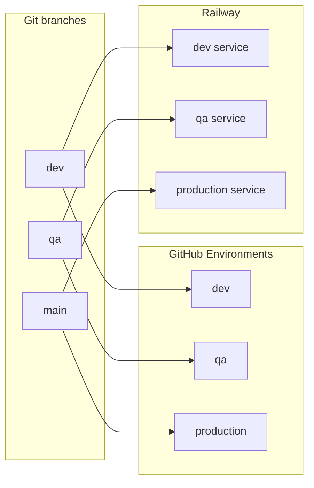
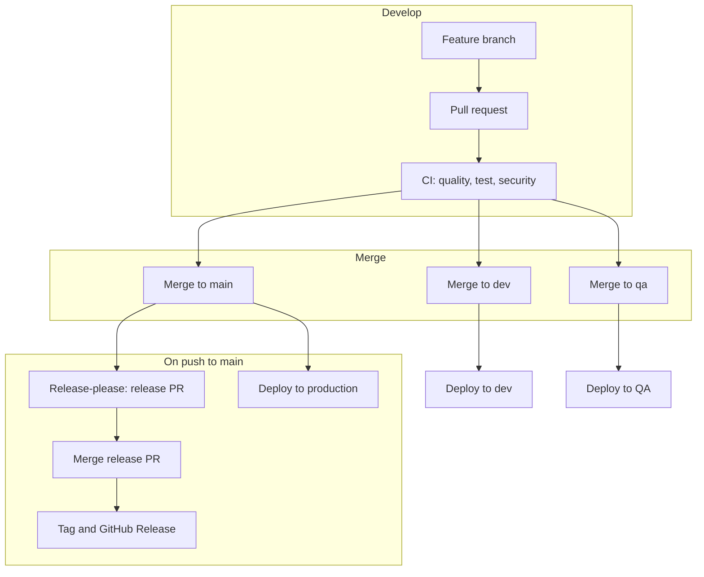
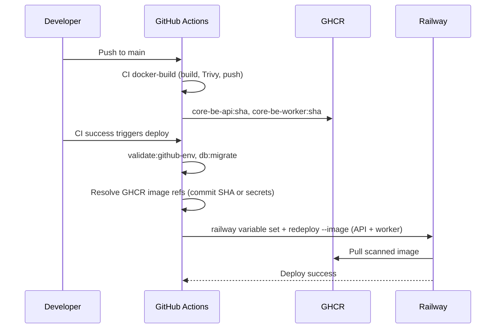
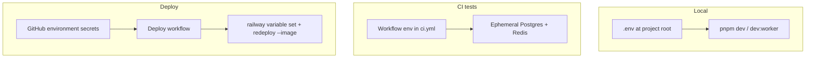
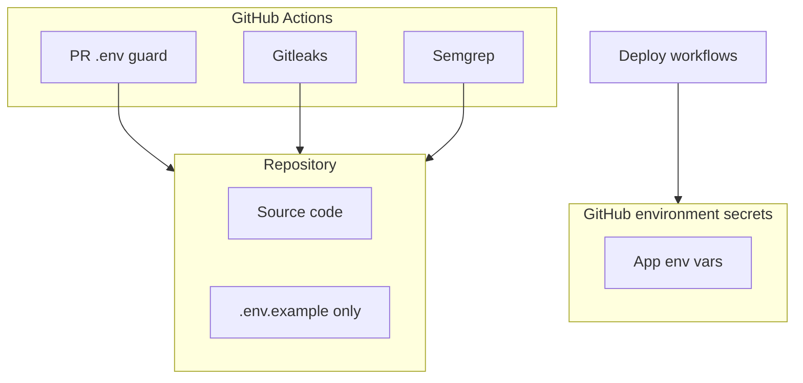

# CI/CD and Deployment

Single reference for what runs in CI, how deployment to Railway works, and **which tokens you need where**. Includes all deployment **Mermaid diagrams** (push → CI → deploy, release-please, secrets). Secrets are stored in **GitHub Environments** (dev, qa, production). See [setup.md](../../getting-started/setup.md) for local dev; [git-workflow.md](../../process/git-workflow.md) for branches and PRs.

> **Prerequisite:** Infrastructure must be set up before auto-deploy works. Use [setup-automation.md](../setup/setup-automation.md) (`pnpm setup:infra`) to provision Neon, Redis, Railway, GitHub secrets first.

---

## 1. Overview



- **CI** runs on every **pull_request** and **push** to **main**, **dev**, and **qa** (quality + static security, tests, live HTTP API smoke, Docker image build + scan on PR and push, docs on push only).
- **Deploy** runs on **push** to **dev** (development), **qa** (QA), or **main** (production); each uses GitHub environment secrets and deploys to Railway.
- On **main**, **release-please** and **commitlint** run on push (release PR automation + validation that commits on `main` use conventional messages). See [§4.1 Release and deploy flow](#41-release-and-deploy-flow-feature--production) below.

---

## 2. CI pipeline (what runs)



| Job              | When                                  | What                                                                                                                                                                   |
| ---------------- | ------------------------------------- | ---------------------------------------------------------------------------------------------------------------------------------------------------------------------- |
| **Quality**      | Every PR and push                     | `pnpm deps:audit`, `pnpm deps:audit:prod`, `pnpm validate`, `pnpm validate:domain`, routes:catalog, `pnpm docs:check`, tool:sync-env-example, Gitleaks, `semgrep scan` |
| **Test**         | PR/push when `src/**` (etc.) changed  | Postgres + Redis → `pnpm db:migrate` → `pnpm test:coverage`. Skipped on docs-only PRs.                                                                                 |
| **API smoke**    | PR/push when `src/**` (etc.) changed  | Migrate → seed → API server → `pnpm test:api-smoke`. Skipped on docs-only PRs.                                                                                         |
| **Chaos**        | PR/push when `src/**` (etc.) changed  | Toxiproxy + `pnpm test:chaos`. Required on PRs (skipped on docs-only). See [branch-protection.md](branch-protection.md).                                               |
| **Docker build** | PR/push when Docker/deps paths change | BuildKit + Trivy + health container. Required on PRs (skipped when no `docker` paths). See [branch-protection.md](branch-protection.md).                                 |
| **Docs**         | Push only (after quality)             | `pnpm docs:all` (no Postgres); upload artifacts; Postman upload on `main`                                                                                              |
| **PR checks**    | On every PR                           | Conventional commit title, PR size label, **.env guard** (fail if `.env` other than `.env.example` in diff)                                                            |
| **Commitlint**   | Push to **main**, **dev**, **qa**     | Validates every commit in the push against [commitlint.config.cjs](../../../commitlint.config.cjs) (covers squash-merge and merge-commit messages, not only PR titles) |

Workflow files: [.github/workflows/ci.yml](../../../.github/workflows/ci.yml), [.github/workflows/pr-checks.yml](../../../.github/workflows/pr-checks.yml), [.github/workflows/commit-lint.yml](../../../.github/workflows/commit-lint.yml). Index: [.github/README.md](../../../.github/README.md).

**Path filters (docs-only PRs):** [ci.yml](../../../.github/workflows/ci.yml) uses `dorny/paths-filter` — when only `docs/**` or markdown changes (no `src-code`), **Test**, **API smoke**, and **Chaos** are skipped on pull requests (required checks still pass). **Quality** always runs. See [branch-protection.md](branch-protection.md).

---

## 3. Branch-to-environment mapping



| Branch | GitHub environment | Railway service |
| ------ | ------------------ | --------------- |
| dev    | dev                | Development     |
| qa     | qa                 | QA              |
| main   | production         | Production      |

Deploy workflow: [deploy-railway.yml](../../../.github/workflows/deploy-railway.yml) (runs after CI succeeds on push to `main` / `dev` / `qa`, or manual `workflow_dispatch`).

**Branch protection:** Which CI jobs must be required on **`main`**, **`dev`**, and **`qa`**, plus committed ruleset JSON and apply steps — see [branch-protection.md](branch-protection.md).

---

## 4. Release and versioning (release-please)

Release-please turns **conventional commits** on `main` into a **release PR** (CHANGELOG + version bump in `package.json`). When you merge that PR, it creates the **GitHub Release** and tag. No npm publish is run (the package is private). We use the maintained [googleapis/release-please](https://github.com/googleapis/release-please) action.

Version and changelog baseline are pinned in the repo root:

| File                                                                    | Purpose                                                        |
| ----------------------------------------------------------------------- | -------------------------------------------------------------- |
| [.release-please-manifest.json](../../../.release-please-manifest.json) | Current released version for the root package (manifest mode). |
| [.release-please-config.json](../../../.release-please-config.json)     | Release type, changelog sections, tag options.                 |

Local commits are validated by **commitlint** via [.husky/commit-msg](../../../.husky/commit-msg); pushes to **main** run [.github/workflows/commit-lint.yml](../../../.github/workflows/commit-lint.yml).

**Branch protection:** Require the CI and PR-check jobs listed in [branch-protection.md](branch-protection.md); apply policies via GitHub Rulesets using [`.github/rulesets/`](../../../.github/rulesets/) or the GitHub UI. On **`main`**, use **Squash and merge** only with the default squash message taken from the PR title so every commit stays conventional (PR checks validate the title; [Commitlint](../../../.github/workflows/commit-lint.yml) validates pushes).

| What         | Where                                                                                                                          |
| ------------ | ------------------------------------------------------------------------------------------------------------------------------ |
| **Runs on**  | Push to **main**                                                                                                               |
| **Workflow** | [.github/workflows/release-please.yml](../../../.github/workflows/release-please.yml)                                          |
| **Token**    | **RELEASE_PLEASE_TOKEN** (Personal Access Token) in repository secrets — use a PAT so that merging the release PR triggers CI. |

### 4.1 Release and deploy flow (feature → production)



- **Feature → PR → CI:** Every PR runs quality, tests, and security. PR title must follow conventional commits (validated by PR checks).
- **Merge to dev/qa/main:** Each branch maps to an environment; push triggers the corresponding deploy workflow (GitHub environment secrets + Railway).
- **On main:** **Commitlint** validates commit messages on each push. **Release-please** opens or updates a **release PR** (CHANGELOG + version bump). Merging that PR creates the GitHub Release and tag. The same push to `main` also triggers **deploy to production**.

**Production path (steps):**

1. Merge to `main` (e.g. from qa → main PR).
2. Release-please creates or updates the release PR on push to `main`.
3. Merge the release PR when ready → GitHub Release + tag.
4. CI `docker-build` job on `main` Trivy-scans and pushes `ghcr.io/<owner>/<repo>/core-be-api` and `core-be-worker` (tags `:sha` and `:latest`).
5. Deploy workflow runs on push to `main` (validate env → resolve GHCR images → migrate → `railway redeploy --image`).
6. Optional smoke: `pnpm load:health` or `GET /health/ready`.

**Hotfix:** Branch from `main` (`hotfix/*`), conventional commit, PR into `main`. Merge triggers production deploy and release-please on the same push. Branch strategy: [git-workflow.md](../../process/git-workflow.md).

### Verify release-please after changing bootstrap config

On GitHub, after merging a change that touches release-please files:

1. Open **Actions** → workflow **Release Please** → confirm the latest run on `main` succeeded (if **RELEASE_PLEASE_TOKEN** is missing or lacks scope, the job fails).
2. Confirm a **release-please** PR exists or is updated when there are new conventional commits since the manifest version (or that the workflow completes with no release until the next qualifying commit).
3. Ensure git tag **`v1.0.0`** exists at the historical 1.0.0 commit if you rely on tag-based archaeology; create it once if absent.
4. After you **merge** the automated release PR, confirm a **GitHub Release** and tag **`v2.x.x`** exist and that `CHANGELOG.md` / `package.json` were updated by the bot.

---

## 5. Deploy flow (per environment)



Steps in each deploy workflow:

1. Checkout code, install dependencies (migrations only — no app `pnpm build`).
2. Run `pnpm validate:github-env` against the GitHub environment.
3. **Resolve scanned CI images from GHCR** — default `ghcr.io/<owner>/<repo>/core-be-api:<commit-sha>` and `core-be-worker:<commit-sha>`; optional secrets **`GHCR_API_IMAGE`** / **`GHCR_WORKER_IMAGE`** override (digest or tag).
4. Run `pnpm db:migrate`, install Railway CLI, sync app env vars with `railway variable set`.
5. Deploy API and worker with `railway redeploy --service … --image …` (no `railway up` / source build on Railway).

**GHCR images (CI):** On push to **`main`**, the reusable [docker-build-verify.yml](../../../.github/workflows/reusable/docker-build-verify.yml) job builds API + worker images, runs Trivy (CRITICAL/HIGH, `exit-code: 1`), then pushes to GHCR. PRs build and scan only (no push).

**Railway pull access:** Each Railway service must be allowed to pull from `ghcr.io` (package visibility + deploy token or linked registry). Images are public within the org or use Railway’s registry credentials for private GHCR packages.

**Optional GitHub environment secrets:**

| Secret | Purpose |
| ------ | ------- |
| `GHCR_API_IMAGE` | Override API image ref (e.g. digest-pinned `ghcr.io/owner/repo/core-be-api@sha256:…`) |
| `GHCR_WORKER_IMAGE` | Override worker image ref |

**Variables synced to Railway on deploy** (when present in GitHub environment secrets):

`DATABASE_URL`, `REDIS_URL`, `JWT_SECRET`, `ALLOWED_ORIGINS`, `NODE_ENV`, `PORT`, `HOST`, `LOG_LEVEL`, `FRONTEND_URL`, `RATE_LIMIT_MAX`, `RATE_LIMIT_WINDOW_MS`, `SENTRY_DSN`, `SENTRY_ENVIRONMENT`, `SENTRY_TRACES_SAMPLE_RATE`, `SENTRY_PROFILE_SAMPLE_RATE`, `AUDIT_RETENTION_DAYS`, `SESSION_RETENTION_DAYS`, `NODE_OPTIONS`, `DEPLOYMENT_PROCESS_COUNT`, `DEPLOYMENT_API_PROCESS_COUNT`, `DEPLOYMENT_WORKER_PROCESS_COUNT`, `DB_MAX`, `POSTGRES_RESERVED_CONNECTIONS`, `POSTGRES_MAX_CONNECTIONS`.

Set **`DEPLOYMENT_PROCESS_COUNT`** to `api_replicas + worker_replicas` on **both** Railway API and worker services (production **required** — startup fails without it). You can use **`DEPLOYMENT_API_PROCESS_COUNT`** and **`DEPLOYMENT_WORKER_PROCESS_COUNT`** instead when split counts are clearer. Optional **`POSTGRES_MAX_CONNECTIONS`** when `SHOW max_connections` is misleading behind a pooler. See [resource-limits.md](../runbooks/resource-limits.md).

Optional on Railway/GitHub only if overriding app default: **`TOMBSTONE_RETENTION_DAYS`** (defaults to **90** in the env schema). **`NODE_OPTIONS`** (for example `--max-old-space-size=<MiB>` for heap limits) is optional and is **not** part of the Zod env schema (Node reads it at process start) — see [resource-limits.md](../runbooks/resource-limits.md).

`RAILWAY_TOKEN` and `RAILWAY_SERVICE_ID` are used by the CLI only; they are not written to Railway as app env vars.

**Validate GitHub env:** Run `pnpm validate:github-env` (or `CONFIG=qa pnpm validate:github-env`) to ensure all required vars from `.env.example` exist in the target GitHub environment. Deploy workflows use `environment: dev|qa|production` so secrets are scoped per env.

**Not in deploy workflows today:**

| Item                    | Notes                                                                                                                                                                                                                                                                                                        |
| ----------------------- | ------------------------------------------------------------------------------------------------------------------------------------------------------------------------------------------------------------------------------------------------------------------------------------------------------------ |
| **Migrations**          | `pnpm db:migrate` runs in deploy before `railway redeploy`. CI test jobs also migrate ephemeral Postgres. See [runbook-dev-to-production.md](../runbooks/runbook-dev-to-production.md).                                                                                                                      |
| **Worker**              | Separate Railway service (`RAILWAY_WORKER_SERVICE_ID` required). Deploy uses the same GHCR worker image as CI (`core-be-worker:<commit-sha>`).                                                                                                                                                               |
| **Integration secrets** | `pnpm setup:infra` can push `RESEND_*`, `STRIPE_*`, `OAUTH_*`, `S3_*`, etc. to GitHub via [build-env-vars.ts](../../../tooling/setup/build-env-vars.ts), but deploy workflows do **not** call `railway variable set` for those keys. Set them on Railway once or add them to the deploy workflow `for` loop. |

---

## 6. Adding a new required env var

When you add a **required** environment variable to the app (e.g. in [src/shared/config/env.config.ts](../../../src/shared/config/env.config.ts), a field without `.optional()`):

1. **Add a non-comment line** to [.env.example](../../../.env.example) in the form `KEY=placeholder` so it is treated as required for deployments.
2. **Set the value in each GitHub environment** (dev, qa, production): Repo → Settings → Environments → select env → Environment secrets → Add secret.
3. **Add it to the deploy workflow** if it must be synced to Railway: edit [deploy-railway.yml](../../../.github/workflows/deploy-railway.yml) to include the var in the "Set Railway service variables" step.
4. Re-run setup (`pnpm setup:infra:update`) to push the new var from `.env.setup` to GitHub (if using automated setup).

For **data retention** vars (`AUDIT_RETENTION_DAYS`, `SESSION_RETENTION_DAYS`), you can also run:

```bash
gh auth login   # once, if not already authenticated
pnpm setup:push-retention-secrets
pnpm validate:github-env
```

Optional: `CONFIG=dev` limits push to one GitHub environment; override values with `AUDIT_RETENTION_DAYS=90 SESSION_RETENTION_DAYS=30`.

---

## 7. Where you need which token (reference)

All tokens stay **out of the repo**. Local uses `.env`; CI/deploy uses **GitHub Environments**.





| Where                                           | What                                                                                                                                                                 | Used for                                                                                                                                     |
| ----------------------------------------------- | -------------------------------------------------------------------------------------------------------------------------------------------------------------------- | -------------------------------------------------------------------------------------------------------------------------------------------- |
| **Local** (`.env` at project root)              | `DATABASE_URL`, `REDIS_URL`, `JWT_SECRET` (min 32 chars), `ALLOWED_ORIGINS`. Optional: Resend, Stripe, OAuth, S3, Sentry (see [.env.example](../../../.env.example)) | `pnpm dev` and `pnpm dev:worker`. **Never commit `.env`.**                                                                                   |
| **GitHub** → Environments (dev, qa, production) | **RAILWAY_TOKEN**, **RAILWAY_SERVICE_ID**, **DATABASE_URL**, **REDIS_URL**, **JWT_SECRET**, **ALLOWED_ORIGINS**, etc. (all app vars per environment)                 | Deploy workflows. Each environment has its own secrets. Set via `pnpm setup:infra` (GitHub provider) or manually in Settings → Environments. |
| **Railway**                                     | Create **project token** → put in GitHub env as **RAILWAY_TOKEN**. Create **service(s)** → copy **Service ID** into GitHub env as **RAILWAY_SERVICE_ID**.            | Token and service ID are stored in GitHub, not in the repo.                                                                                  |

**Summary:**

- **Local:** `.env` with app vars for `pnpm dev` / `pnpm dev:worker`.
- **GitHub:** Environment secrets for dev, qa, production. Setup pushes these when you run `pnpm setup:infra`.
- **Railway:** Create token and service(s); setup adds them to GitHub.

---

## 8. First-time setup checklist

Use this once to get CI and deployment working.

### 8.1 GitHub Environments

- [ ] Create environments **dev**, **qa**, **production** in the repo: Settings → Environments → New environment.
- [ ] Run `pnpm setup:infra` — it provisions Neon, Redis, Railway, etc., and pushes all secrets to GitHub (repository + environment secrets).
- [ ] Or manually: add **RAILWAY_TOKEN**, **RAILWAY_SERVICE_ID**, **DATABASE_URL**, **REDIS_URL**, **JWT_SECRET**, **ALLOWED_ORIGINS** (and other app vars) to each environment’s Environment secrets.

### 8.2 Railway

- [ ] Create a **Railway project** (or setup does this).
- [ ] Create at least one **service** for the API per environment.
- [ ] In Railway Project → **Settings → Tokens**, create a token → add as **RAILWAY_TOKEN** in GitHub environments.
- [ ] Copy each **Service ID** → add as **RAILWAY_SERVICE_ID** in the corresponding GitHub environment.

After this, pushes to **dev**, **qa**, and **main** will run the deploy workflow. No keys or tokens are committed; they stay in GitHub.

---

## 9. Setup via CLI (Railway + GitHub)

### 9.1 Railway CLI

**Install**

```bash
npm i -g @railway/cli
# or: brew install railway
```

**One-time login** — `railway login` (opens browser).

**Create project and service**

```bash
railway init
railway add
railway status --json   # copy service ID
```

**Create project token** — Railway dashboard → Project → Settings → Tokens → Create token. Add to GitHub environment as **RAILWAY_TOKEN**.

### 9.2 GitHub CLI

**Install**

```bash
brew install gh
```

**Auth**

```bash
gh auth login
```

**Set environment secrets** (manual, if not using setup)

```bash
gh secret set RAILWAY_TOKEN --env dev --body "paste-token"
gh secret set RAILWAY_SERVICE_ID --env dev --body "paste-service-id"
gh secret set DATABASE_URL --env dev --body "postgresql://..."
# etc.
```

---

## 10. Quick reference

| Step                   | Railway                                           | GitHub                                                                  |
| ---------------------- | ------------------------------------------------- | ----------------------------------------------------------------------- |
| Install                | `npm i -g @railway/cli` or `brew install railway` | `brew install gh`                                                       |
| Auth                   | `railway login`                                   | `gh auth login`                                                         |
| Create project/service | `railway init` then `railway add`                 | Create environments dev, qa, production in repo Settings                |
| Get service ID         | `railway status --json`                           | —                                                                       |
| Set secrets            | Use dashboard for project token                   | `gh secret set NAME --env dev --body "value"` or run `pnpm setup:infra` |

No Doppler. All deploy secrets live in GitHub Environments.
