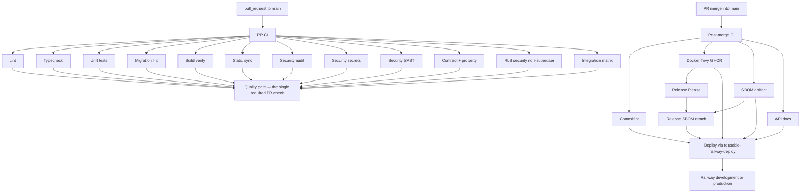
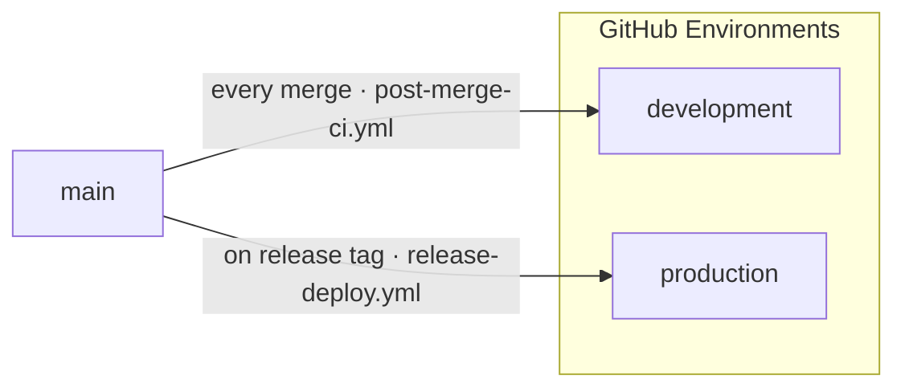
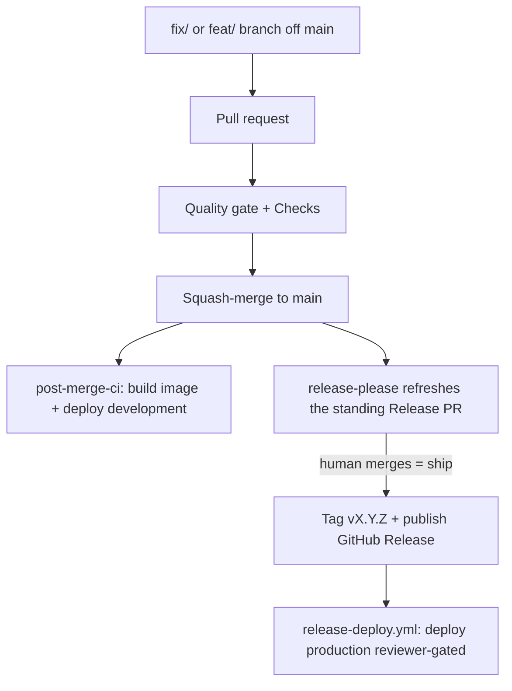
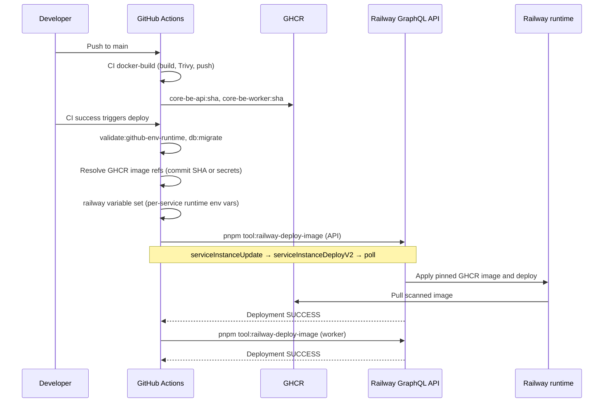
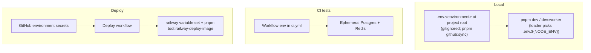
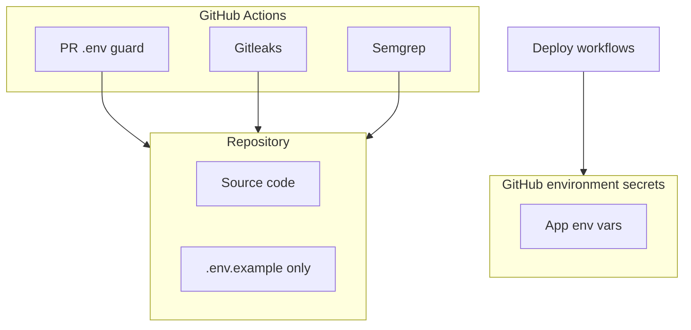

# CI/CD and Deployment

Single reference for what runs in CI, how deployment to Railway works, and **which tokens you need where**. Includes all deployment **Mermaid diagrams** (push → CI → deploy, release-please, secrets). Secrets are stored in **GitHub Environments** (development, production). See [SETUP.md](../../../SETUP.md) for local dev; [trunk-based-workflow.md](../../process/trunk-based-workflow.md) for branches and PRs.

**Single-trunk delivery.** `main` is the only long-lived branch:
**PR → squash-merge to `main` → post-merge adaptive lane** (FAST for a single PR: build → release-please →
deploy **development**; FULL for a batched push: also the matrix) **→ merge the `release-please` Release PR
(the ship button) → `release-deploy.yml` deploys production** on the published tag (reviewer-gated).
Versions are stable `X.Y.Z` only.

> **Prerequisite:** Infrastructure must be set up before auto-deploy works — Neon, Redis, Railway, and the GitHub Environment secrets are provisioned from a separate infrastructure repository; push env values with `pnpm github:sync <environment>`.

### Project identity (branches, images, slug)

Git branch names, GitHub Environment names, Docker/GHCR image names, and the product slug (`core-be` today) are declared in **`tooling/setup/setup.config.json`**. Run **`pnpm tool:generate-project-identity`** after editing that manifest; it writes:

- `src/shared/constants/project-identity.constants.ts` (runtime + OpenAPI defaults)
- `.github/actions/setup-project-identity/action.yml` (composite action; sets identity env vars for CI jobs)
- `.github/project-identity.env` (reference for local scripts — not loaded by Actions)
- Branch/environment literals in key workflow files

CI enforces drift with **`pnpm tool:generate-project-identity:check`** (in `pnpm ci:quality`) and workflow literal scans. See [add-new-environment.md](../runbooks/add-new-environment.md) when adding a hosted environment.

---

## 1. Overview



- **PR CI** ([pr-ci.yml](../../../.github/workflows/pr-ci.yml)) runs on every **pull_request** to **main**: parallel lanes for lint, typecheck, static sync checks, unit + global, the authoritative DB matrix, migration safety lint, TS + Docker build verify, split security checks, contract + property, and the non-superuser RLS suite. A single **`Quality gate`** job `needs:` every merge-gating lane and is the one required PR check (alongside governance **`Checks`**); branch protection never lists individual lanes. See [branch-protection.md](branch-protection.md) for the canonical required-check model.
- **Post-merge CI** ([post-merge-ci.yml](../../../.github/workflows/post-merge-ci.yml)) runs when a PR **merges** into `main`. Optimized chain: `gate → (commitlint, docker, sbom, api-docs in parallel) → release-please (after docker) → release-sbom (re-uses sbom artifact) → deploy`. It does **not** re-run PR CI jobs or full DB integration/chaos suites (those are local: `pnpm test:integration`, `pnpm test:chaos`). Manual `workflow_dispatch` remains for emergency reruns.
- **Deploy** runs via reusable [reusable-railway-deploy.yml](../../../.github/workflows/reusable-railway-deploy.yml): post-merge CI deploys **development** on every merge, and `release-deploy.yml` deploys **production** on the published release tag. The target GitHub Environment is passed **explicitly** (`github_environment`), not derived from the branch. Manual `workflow_dispatch` remains for emergency redeploys. **When post-deploy API smoke passes, that environment is fully live** — the deploy job is the last gate before traffic.
- Release-please runs inside Post-merge CI on the single stable channel (`main`). When a release is published, **Release SBOM** attaches CycloneDX to that release.

---

## 2. CI pipeline (what runs)

### PR lane ([pr-ci.yml](../../../.github/workflows/pr-ci.yml))

All jobs run **in parallel** (~2–3 min target). Caching: `actions/setup-node` with `cache: pnpm`, Vitest `node_modules/.vitest`, Docker BuildKit GHA cache scopes `core-be-api` / `core-be-worker`.

| Job | What |
| --- | ---- |
| **Lint** | `pnpm lint` (Biome) |
| **Typecheck** | `pnpm typecheck` |
| **Static sync** | `pnpm validate:domain:strict`, `pnpm validate:domain:coverage`, `pnpm validate:scripts-layout`, route catalog, docs sync, env example sync |
| **Unit** | `vitest --project unit --project global --changed origin/{base}` (no DB) |
| **Migration lint** | `pnpm db:migrate:lint` (static migration safety) |
| **Build verify** | `pnpm build` + Docker API/worker build (`load: true`, no push, no Trivy) |
| **Security audit** | `pnpm deps:audit`, `pnpm deps:audit:prod`, dependency review |
| **Security secrets** | gitleaks full-history scan |
| **Security SAST** | semgrep |
| **Contract + property** | `pnpm test:contract`, `pnpm test:property` |

### Post-merge lane ([post-merge-ci.yml](../../../.github/workflows/post-merge-ci.yml))

Runs when a PR **merges** into `main` (or manual dispatch). Does **not** re-run PR CI or full DB Vitest matrices.

| Job | Order | When | What |
| --- | --- | ---- | ---- |
| **Commitlint** | parallel | Every merge | Conventional commit messages on merged commits |
| **Docker** | parallel | `src-code`, `docker`, or `ci-config` | Build + Trivy + ephemeral Postgres/Redis container smoke + push `ghcr.io/.../core-be-api:{sha}` (and `:latest` on `main`) |
| **SBOM** | parallel | `src-code` | CycloneDX artifact (workflow artifact) |
| **API docs** | parallel | `src-code` or openapi paths | `pnpm docs:all`, Postman + Scalar publish |
| **Release Please** | after Docker | Every merge | Opens/updates release PR; may publish GitHub Release |
| **Release SBOM** | after SBOM + Release Please | Release Please published a release | Downloads `sbom` artifact and attaches it to the GitHub Release |
| **Deploy** | last | Docker green + gates green | Reusable [reusable-railway-deploy.yml](../../../.github/workflows/reusable-railway-deploy.yml) → resolve env → migrate → **pin Railway service to fresh GHCR image + new deployment** (`pnpm tool:railway-deploy-image`) → API `/readyz` → worker deployment SUCCESS (in-pod `Dockerfile.worker` HEALTHCHECK on `9090/readyz`) → **`pnpm test:api-smoke`** → **fully live** |

**Local-only (not in CI):** `pnpm test:integration`, `pnpm test:chaos` — run before pushing when touching DB/worker paths.

| Other | When | What |
| ----- | ---- | ---- |
| **PR Governance** | Every PR | Conventional title, labels, `.env` guard — [pr-governance.yml](../../../.github/workflows/pr-governance.yml) |
| **Docs lane** | PR touches `*.md` | markdownlint + lychee — [pr-docs-lane.yml](../../../.github/workflows/pr-docs-lane.yml) |

Index: [.github/README.md](../../../.github/README.md). Required PR check names: [branch-protection.md](branch-protection.md).

**Path filters (docs-only PRs):** [pr-ci.yml](../../../.github/workflows/pr-ci.yml) skips all PR CI jobs when the diff is markdown/docs only. Markdown PRs also trigger [pr-docs-lane.yml](../../../.github/workflows/pr-docs-lane.yml).

---

## 3. Environments (single trunk)

`main` is the only long-lived branch and it deploys to **both** hosted environments — the environment is chosen **explicitly** by the deploy caller via the `github_environment` input, never derived from the branch:



| Trigger | GitHub environment | Workflow |
| ------- | ------------------ | -------- |
| Push to `main` (every merge) | development | [post-merge-ci.yml](../../../.github/workflows/post-merge-ci.yml) → reusable-railway-deploy |
| `release: published` (tag) | production (reviewer-gated) | [release-deploy.yml](../../../.github/workflows/release-deploy.yml) → reusable-railway-deploy |

Both environments run the **same scanned image**, promoted by SHA (build-once-promote — see [deploy-artifact-and-secret-decisions.md](deploy-artifact-and-secret-decisions.md)).

**Branch protection:** the required checks on `main` (`Quality gate` + `Checks`) and the committed ruleset are in [branch-protection.md](branch-protection.md).

---

## 4. Release and versioning (release-please)

Release-please turns **conventional commits** into a standing **Release PR** (`chore: release X.Y.Z` — CHANGELOG + version bump in `package.json`). **Merging that Release PR is the ship button**: it creates the **GitHub Release** and tag `vX.Y.Z`, which fires [release-deploy.yml](../../../.github/workflows/release-deploy.yml) to deploy production. No npm publish (the package is private). We use the maintained [googleapis/release-please](https://github.com/googleapis/release-please) action.

**Single stable channel** — one config + one manifest, no prerelease channel:

| Channel | Branch | Tag | Config | Manifest | Changelog |
| ------- | ------ | --- | ------ | -------- | --------- |
| **Stable** | `main` | `vX.Y.Z` | [.github/release-please/config.json](../../../.github/release-please/config.json) | [.github/release-please/manifest.json](../../../.github/release-please/manifest.json) | `CHANGELOG.md` |

The GitHub Release publish (`release: published`) attaches a CycloneDX SBOM via the publish pipeline. The Release PR is **never auto-merged** — merging it is the manual ship decision.

Local commits are validated by **commitlint** via [.husky/commit-msg](../../../.husky/commit-msg); the **Release Please** job runs inside [post-merge-ci.yml](../../../.github/workflows/post-merge-ci.yml) on push to `main`.

**Branch protection:** Require `Quality gate` + `Checks` on `main` (see [branch-protection.md](branch-protection.md)); apply the committed ruleset via `pnpm github:sync`. All PRs **squash-merge** into `main` — there is no promotion PR.

| What | Where |
| --- | --- |
| **Runs on** | Push to **main** — `Release Please` job inside [post-merge-ci.yml](../../../.github/workflows/post-merge-ci.yml) |
| **Token** | **`RELEASE_PLEASE_TOKEN`** (PAT), read from the **development** GitHub Environment — a `github.token`-created release would not trigger `release-deploy.yml` |

### 4.1 Release and deploy cycle



1. **Feature → PR → gate:** every PR runs the `Quality gate` aggregate + `Checks`; the PR title must follow conventional commits.
2. **Squash-merge to `main`:** post-merge CI builds + pushes the SHA-tagged image and deploys the **development** environment; release-please refreshes the standing Release PR (`chore: release X.Y.Z`).
3. **Merge the Release PR (ship):** tags `vX.Y.Z` + publishes the GitHub Release, which fires [release-deploy.yml](../../../.github/workflows/release-deploy.yml) to deploy **production** — pinned to the tag SHA, behind the environment reviewer approval, promoting the exact scanned image (build-once-promote). The release SBOM is attached on publish.
4. **Hotfix:** an ordinary `fix/*` PR to `main`, released immediately by merging the Release PR — **fix-forward** (see [hotfix-release.md](../runbooks/hotfix-release.md)). There is no promotion PR or back-merge.

### Verify release-please

After merging a change that touches release-please files, on GitHub:

1. **Actions → Post-merge CI →** confirm **Release Please** succeeded on `main`.
2. Confirm the Release PR is created/updated when there are new conventional commits since the manifest version (or that it completes with no release until the next qualifying commit).
3. After you **merge** the Release PR, confirm the matching **GitHub Release** + tag `vX.Y.Z` exist and that `CHANGELOG.md` / `package.json` were bumped by the bot.

---

## 5. Deploy flow (per environment)



Steps in each deploy workflow:

1. Checkout code, install dependencies (migrations only — no app `pnpm build`).
2. Run `pnpm validate:github-env-runtime` against the exported GitHub environment (schema-required keys present).
3. **Log expected scanned CI image refs from GHCR** — default `ghcr.io/<owner>/<repo>/core-be-api:<commit-sha>` and `core-be-worker:<commit-sha>`; optional secrets **`GHCR_API_IMAGE`** / **`GHCR_WORKER_IMAGE`** override the logged ref. These are the exact refs the next step pins onto Railway.
4. Run `pnpm db:migrate`, install Railway CLI, sync app env vars with `railway variable set`.
5. Deploy API + worker with **`pnpm tool:railway-deploy-image --service <id> --image <ghcr-ref> --label <api|worker>`** (`tooling/setup/railway/deploy-image.ts`). For each service the tool calls the Railway GraphQL API to (a) resolve the project-token scope with **`projectToken { projectId environmentId }`** using the `Project-Access-Token` header; (b) **`serviceInstanceUpdate`** with `{ source: { image } }` so the service is pinned to the freshly built, Trivy-scanned image; (c) **`serviceInstanceDeployV2(serviceId, environmentId)`** to create a brand-new deployment from the updated configuration; (d) poll `deployment(id)` until terminal status when token scope permits deployment reads. Railway project tokens can trigger the deployment but may not be allowed to read deployment status, so the workflow's API `/readyz` probe, the Railway-reported worker deployment SUCCESS (gated by the in-pod `Dockerfile.worker` HEALTHCHECK on `9090/readyz`), and the post-deploy API smoke remain the hard deploy gates. Worker readiness is **not** probed from the GitHub runner because Postgres/Redis sit on Railway's private network (`*.railway.internal`) which is unreachable from public CI hosts.

> **Why not `railway redeploy` / `railway up`?** The Railway CLI's `redeploy` re-runs the previous deployment object with its existing image tag (community discussion confirms `serviceInstanceRedeploy` ignores configuration changes made between deployments), and the CLI has no `--image` flag. `railway up` uploads the runner's source for Railway to build, bypassing the scanned GHCR image entirely. The GraphQL-based tool is the only reliable way to deploy the image CI just built — and the same path handles both the initial bootstrap (no prior deployment) and steady-state redeploys, so no fallback branch is needed.
>
> **Railway token auth:** Deploy CI uses the Railway **project token** from the GitHub Environment's `RAILWAY_TOKEN`. Project tokens are scoped to one Railway environment and must be sent to GraphQL as `Project-Access-Token`, not `Authorization: Bearer`. Account/workspace tokens may be supplied as `RAILWAY_API_TOKEN` / `RAILWAY_GRAPHQL_TOKEN` for local diagnostics; those use Bearer auth and can usually poll deployment status directly.

**GHCR images (CI):** On push to **`main`**, the reusable [reusable-docker-build-trivy.yml](../../../.github/workflows/reusable-docker-build-trivy.yml) job builds API + worker images, runs Trivy (CRITICAL/HIGH, `exit-code: 1`), then pushes to GHCR. PRs build and scan only (no push).

**Railway pull access:** Each Railway service must be allowed to pull from `ghcr.io` (package visibility + deploy token or linked registry). Images are public within the org or use Railway’s registry credentials for private GHCR packages.

**Optional GitHub environment secrets:**

| Secret              | Purpose                                                                               |
| ------------------- | ------------------------------------------------------------------------------------- |
| `GHCR_API_IMAGE`    | Override API image ref (e.g. digest-pinned `ghcr.io/owner/repo/core-be-api@sha256:…`) |
| `GHCR_WORKER_IMAGE` | Override worker image ref                                                             |

**Variables synced to Railway on deploy** (when present in GitHub environment secrets):

`DATABASE_URL`, `REDIS_URL`, `JWT_PRIVATE_KEY`, `JWT_PUBLIC_KEY`, `ALLOWED_ORIGINS`, `NODE_ENV`, `PORT`, `HOST`, `LOG_LEVEL`, `FRONTEND_URL`, `RATE_LIMIT_MAX`, `RATE_LIMIT_WINDOW_MS`, `SENTRY_DSN`, `SENTRY_ENVIRONMENT`, `SENTRY_TRACES_SAMPLE_RATE`, `SENTRY_PROFILE_SAMPLE_RATE`, `AUDIT_RETENTION_DAYS`, `AUTH_SESSION_RETENTION_DAYS`, `NODE_OPTIONS`, `DEPLOYMENT_TOTAL_REPLICA_COUNT`, `DEPLOYMENT_API_REPLICA_COUNT`, `DEPLOYMENT_WORKER_REPLICA_COUNT`, `DATABASE_POOL_MAX`, `POSTGRES_RESERVED_CONNECTIONS`, `POSTGRES_MAX_CONNECTIONS`.

Set **`DEPLOYMENT_TOTAL_REPLICA_COUNT`** to `api_replicas + worker_replicas` on **both** Railway API and worker services (production **required** — startup fails without it). You can use **`DEPLOYMENT_API_REPLICA_COUNT`** and **`DEPLOYMENT_WORKER_REPLICA_COUNT`** instead when split counts are clearer. Optional **`POSTGRES_MAX_CONNECTIONS`** when `SHOW max_connections` is misleading behind a pooler. See [resource-limits.md](../runbooks/resource-limits.md).

Optional on Railway/GitHub only if overriding app default: **`TOMBSTONE_RETENTION_DAYS`** (defaults to **90** in the env schema). **`NODE_OPTIONS`** (for example `--max-old-space-size=<MiB>` for heap limits) is optional and is **not** part of the Zod env schema (Node reads it at process start) — see [resource-limits.md](../runbooks/resource-limits.md).

`RAILWAY_TOKEN` and `RAILWAY_SERVICE_ID` are used by the CLI only; they are not written to Railway as app env vars.

**Validate GitHub env:** The deploy workflow runs `pnpm validate:github-env-runtime` after exporting the GitHub Environment into the runner, so every schema-required var must exist before anything deploys. Deploy workflows use `environment: development|production` so secrets are scoped per env.

**Not synced to Railway by CD today:**

| Item | Notes |
| --- | --- |
| **Integration secrets** | `pnpm github:sync <environment>` pushes `RESEND_*`, `STRIPE_*`, `OAUTH_*`, `S3_*`, etc. to GitHub via the env sync pipeline (`tooling/setup/github/sync-github-environments.ts`), but `reusable-railway-deploy.yml` does **not** call `railway variable set` for those keys. Set them on Railway once or add them to the CD variable loop. |

### Partial re-runs and manual recovery

Use **workflow_dispatch** when you need to run part of the pipeline without a full merge push.

| Workflow | When to use | Key inputs |
| --- | --- | --- |
| [post-merge-ci.yml](../../../.github/workflows/post-merge-ci.yml) | Re-run publish/deploy/docs after a partial failure | `skip_tests`, `skip_security`, `skip_docker`, `skip_deploy`, `skip_docs` |
| [reusable-railway-deploy.yml](../../../.github/workflows/reusable-railway-deploy.yml) | Redeploy a known GHCR image without rebuilding | `target`, `target_branch`, `image_override` (`:sha`, `:previous`, `:latest`, `:vX.Y.Z`), `debug` |
| Reusable test/docker workflows | Ad-hoc validation on a branch tip | `merge_commit_sha`, `target_branch` on `reusable-vitest-postgres-redis.yml`, `reusable-docker-build-trivy.yml`, `reusable-chaos-toxiproxy.yml`, `reusable-openapi-postman-publish.yml` |

**Rollback:** Dispatch **Reusable — Railway deploy** with `image_override=ghcr.io/<owner>/<repo>/core-be-api:previous` (and the worker ref derived automatically when the override contains `core-be-api`).

**Cleanup:** [cleanup-cache.yml](../../../.github/workflows/cleanup-cache.yml) prunes Actions caches (outcome-aware LRU; daily safety net on `main`). [cleanup-ghcr.yml](../../../.github/workflows/cleanup-ghcr.yml) prunes stale GHCR manifests weekly while preserving `:latest`, `:previous`, `:vX.Y.Z` release tags, and recent SHA tags.

---

## 6. Adding a new env var

Use the **env-schema-add** skill (`.cursor/skills/env-schema-add/SKILL.md`) — it
walks through the Secret-vs-Variable decision and the section placement in
`.env.example`. Summary:

1. **Add the Zod field** to [src/shared/config/env-schema.ts](../../../src/shared/config/env-schema.ts).
   Mark `.optional()` if the runtime can work without it; add `.default()` for
   sensible operational defaults.
2. **Add `KEY=placeholder` to [.env.example](../../../.env.example)** under the
   correct top-level half (`# GitHub Secrets ###` or `# GitHub Variables ###`)
   and an existing sub-section. The half a key sits in IS its classification —
   `pnpm github:sync` reads the structure directly.
3. **Verify schema ↔ template parity** with `pnpm tool:sync-env-example`
   (`--fix` will append commented placeholders for missing keys).
4. **Update operator env files** manually. Existing `.env.<environment>` files
   are not overwritten, so add the new key under the same half + sub-section
   without discarding real values.
5. **Edit `.env.<environment>`** with the real value(s) for each environment
   you have access to, then push:

   ```bash
   pnpm github:sync development --dry-run     # preview the [secret] / [variable] column
   pnpm github:sync development               # push
   pnpm github:sync production --dry-run
   pnpm github:sync production
   ```

6. **Add the key to [reusable-railway-deploy.yml](../../../.github/workflows/reusable-railway-deploy.yml)**
   if it must be synced through to the Railway service variables step.
7. **Paste the "Environment variable changes" snippet** printed by
   `pnpm tool:sync-env-example` into the PR description so reviewers and the
   deploy workflow know what was added/removed.

Full lifecycle (rename, remove, validation matrix, troubleshooting):
**[environment-variables.md](../runbooks/environment-variables.md)**.

---

## 7. Where you need which token (reference)

All tokens stay **out of the repo**. Local uses `.env.<environment>`
(gitignored, generated by `pnpm github:sync` from `tooling/setup/setup.config.json`); CI/deploy uses **GitHub
Environments** (populated by `pnpm github:sync <environment>`).





| Where                                                        | What                                                                                                                                                                                                                                                                          | Used for                                                                                                                   |
| ------------------------------------------------------------ | ----------------------------------------------------------------------------------------------------------------------------------------------------------------------------------------------------------------------------------------------------------------------------- | -------------------------------------------------------------------------------------------------------------------------- |
| **Local** (`.env.<environment>` at project root, gitignored) | `DATABASE_URL`, `REDIS_URL`, `JWT_PRIVATE_KEY` / `JWT_PUBLIC_KEY` (RS256, required), `SECRETS_ENCRYPTION_KEY` (64 hex), `ALLOWED_ORIGINS`. `JWT_SECRET` optional deprecated no-op. Optional: Resend, Stripe, OAuth, S3, Sentry (see [.env.example](../../../.env.example))    | `pnpm dev` / `pnpm dev:worker` — loader reads `.env.${NODE_ENV}`. **Never commit any `.env.*` other than `.env.example`.** |
| **GitHub** → Environments (development, production)          | All keys from `.env.<environment>`, classified by section: anything under `# GitHub Secrets ###` becomes a Secret; anything under `# GitHub Variables ###` becomes a Variable. Plus **RAILWAY_TOKEN**, **RAILWAY_SERVICE_ID**, **RAILWAY_WORKER_SERVICE_ID** (workflow-only). | Deploy workflows. Populated by `pnpm github:sync <environment>` — idempotent, overwrites in place.                         |
| **Railway**                                                  | Create **project token** → put in GitHub env as **RAILWAY_TOKEN**. Create **service(s)** → copy **Service ID** into GitHub env as **RAILWAY_SERVICE_ID** / **RAILWAY_WORKER_SERVICE_ID**.                                                                                     | Token and service IDs are stored in GitHub Environments only.                                                              |

**Summary:**

- **Local:** `pnpm github:sync` → edit `.env.<environment>` → `pnpm dev` / `pnpm dev:worker`.
- **GitHub:** `pnpm github:sync <environment>` pushes every key under the right section header. Re-run any time you change a value locally.
- **Railway:** Create token and service(s); deploy workflow reads them from the GitHub Environment.

---

## 8. First-time setup checklist

Use this once to get CI and deployment working.

### 8.1 GitHub Environments

- [ ] Create environments **development** and **production** in the repo: Settings → Environments → New environment.
- [ ] Provision infrastructure (Neon, Redis, Railway, etc.) from the separate infrastructure repository, then push all secrets to GitHub with `pnpm github:sync <environment>`.
- [ ] Or manually: add **RAILWAY_TOKEN**, **RAILWAY_SERVICE_ID**, **DATABASE_URL**, **REDIS_URL**, **JWT_PRIVATE_KEY**, **JWT_PUBLIC_KEY**, **ALLOWED_ORIGINS** (and other app vars) to each environment’s Environment secrets.

### 8.2 Railway

- [ ] Create a **Railway project** (or setup does this).
- [ ] Create at least one **service** for the API per environment.
- [ ] In Railway Project → **Settings → Tokens**, create a token → add as **RAILWAY_TOKEN** in GitHub environments.
- [ ] Copy each **Service ID** → add as **RAILWAY_SERVICE_ID** in the corresponding GitHub environment.

After this, pushes to **main** will run the deploy workflow. No keys or tokens are committed; they stay in GitHub.

---

## 9. Setup via CLI (Railway + GitHub)

### 9.1 Railway CLI

**Install**

```bash
npm i -g @railway/cli
# or: brew install railway
```

**One-time login** — `railway login` (opens browser).

**Create project and service**

```bash
railway init
railway add
railway status --json   # copy service ID
```

**Create project token** — Railway dashboard → Project → Settings → Tokens → Create token. Add to GitHub environment as **RAILWAY_TOKEN**.

### 9.2 GitHub CLI

**Install**

```bash
brew install gh
```

**Auth**

```bash
gh auth login
```

**Set environment secrets** (manual, if not using setup)

```bash
gh secret set RAILWAY_TOKEN --env development --body "paste-token"
gh secret set RAILWAY_SERVICE_ID --env development --body "paste-service-id"
gh secret set DATABASE_URL --env development --body "postgresql://..."
# etc.
```

---

## 10. Quick reference

| Step                   | Railway                                           | GitHub                                                                          |
| ---------------------- | ------------------------------------------------- | ------------------------------------------------------------------------------- |
| Install                | `npm i -g @railway/cli` or `brew install railway` | `brew install gh`                                                               |
| Auth                   | `railway login`                                   | `gh auth login`                                                                 |
| Create project/service | `railway init` then `railway add`                 | Create environments development, production in repo Settings                    |
| Get service ID         | `railway status --json`                           | —                                                                               |
| Set secrets            | Use dashboard for project token                   | `gh secret set NAME --env development --body "value"` or run `pnpm github:sync development` |
| Deploy a new image     | `pnpm tool:railway-deploy-image --service <id> --image <ghcr-ref> --label <api\|worker>` (GraphQL: `serviceInstanceUpdate` + `serviceInstanceDeployV2`) | CD calls this automatically; manual redeploys can run it locally with `RAILWAY_TOKEN` exported |

No Doppler. All deploy secrets live in GitHub Environments.
