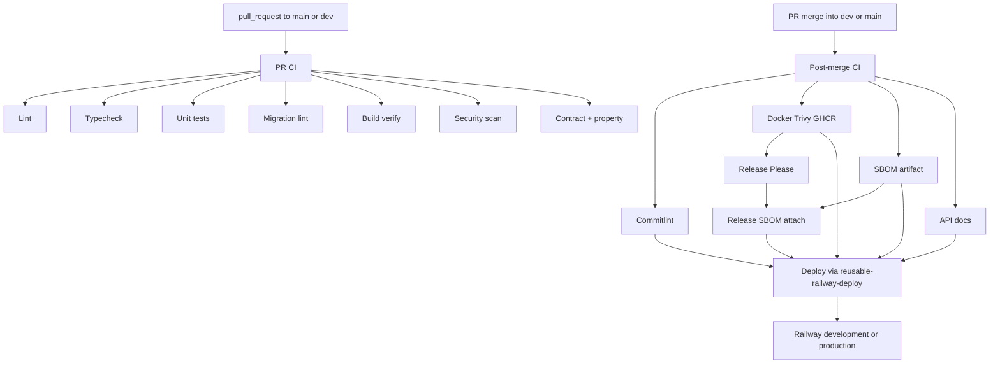
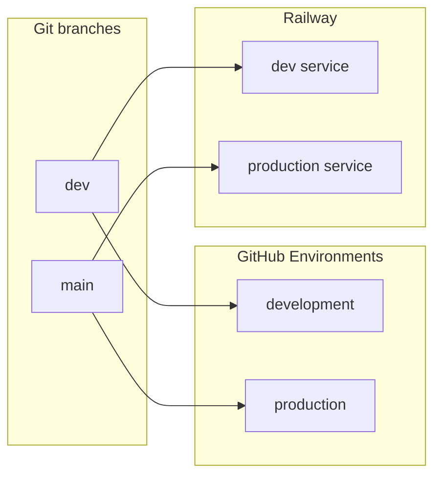
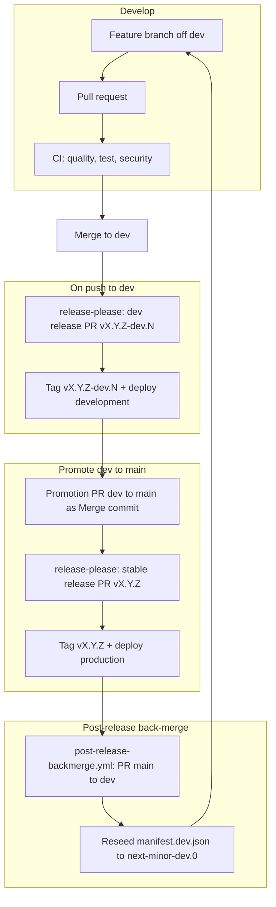
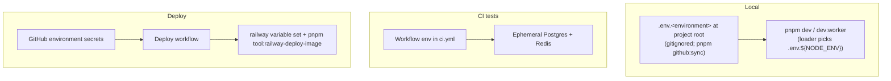
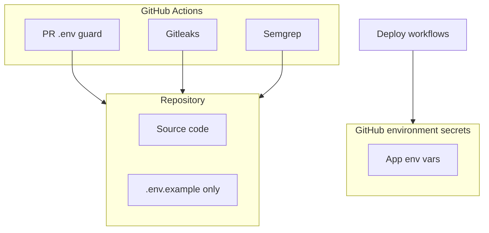

# CI/CD and Deployment

Single reference for what runs in CI, how deployment to Railway works, and **which tokens you need where**. Includes all deployment **Mermaid diagrams** (push → CI → deploy, release-please, secrets). Secrets are stored in **GitHub Environments** (development, production). See [setup.md](../../getting-started/setup.md) for local dev; [git-workflow.md](../../process/git-workflow.md) for branches and PRs.

> **Prerequisite:** Infrastructure must be set up before auto-deploy works. Use [setup-automation.md](../setup/setup-automation.md) (`pnpm setup:infra`) to provision Neon, Redis, Railway, GitHub secrets first.

---

## 1. Overview



- **PR CI** ([pr-ci.yml](../../../.github/workflows/pr-ci.yml)) runs on every **pull_request** to **main** and **dev**: seven parallel jobs (lint, typecheck, unit + global with `vitest --changed`, migration safety lint, TS + Docker build verify, security scan, contract + property). No Postgres/Redis and no GHCR push on PR.
- **Post-merge CI** ([post-merge-ci.yml](../../../.github/workflows/post-merge-ci.yml)) runs when a PR **merges** into `dev` or `main`. Optimized chain: `gate → (commitlint, docker, sbom, api-docs in parallel) → release-please (after docker) → release-sbom (re-uses sbom artifact) → deploy`. It does **not** re-run PR CI jobs or full DB integration/chaos suites (those are local: `pnpm test:integration`, `pnpm test:chaos`). Manual `workflow_dispatch` remains for emergency reruns.
- **Deploy** runs inside Post-merge CI via reusable [reusable-railway-deploy.yml](../../../.github/workflows/reusable-railway-deploy.yml). Only the GitHub Environment differs: `dev` → **development**, `main` → **production**. Manual `workflow_dispatch` on CD remains for emergency redeploys. **When post-deploy API smoke passes, that environment is fully live** — the deploy job is the last gate before traffic.
- Release-please runs inside Post-merge CI on both channels (`main` stable, `dev` prerelease). When it publishes a GitHub Release in the same run, **Release SBOM** attaches CycloneDX to that release.

---

## 2. CI pipeline (what runs)

### PR lane ([pr-ci.yml](../../../.github/workflows/pr-ci.yml))

All jobs run **in parallel** (~2–3 min target). Caching: `actions/setup-node` with `cache: pnpm`, Vitest `node_modules/.vitest`, Docker BuildKit GHA cache scopes `core-be-api` / `core-be-worker`.

| Job | What |
| --- | ---- |
| **Lint** | `pnpm lint` (Biome) |
| **Typecheck** | `pnpm typecheck` |
| **Unit** | `vitest --project unit --project global --changed origin/{base}` (no DB) |
| **Migration lint** | `pnpm db:migrate:lint` (static migration safety) |
| **Build verify** | `pnpm build` + Docker API/worker build (`load: true`, no push, no Trivy) |
| **Security scan** | `pnpm deps:audit`, gitleaks, semgrep |
| **Contract + property** | `pnpm test:contract`, `pnpm test:property` |

### Post-merge lane ([post-merge-ci.yml](../../../.github/workflows/post-merge-ci.yml))

Runs when a PR **merges** into `main` / `dev` (or manual dispatch). Does **not** re-run PR CI or full DB Vitest matrices.

| Job | Order | When | What |
| --- | --- | ---- | ---- |
| **Commitlint** | parallel | Every merge | Conventional commit messages on merged commits |
| **Docker** | parallel | `src-code`, `docker`, or `ci-config` | Build + Trivy + ephemeral Postgres/Redis container smoke + push `ghcr.io/.../core-be-api:{sha}` (and `:latest` on `main`) |
| **SBOM** | parallel | `src-code` | CycloneDX artifact (workflow artifact) |
| **API docs** | parallel | `src-code` or openapi paths | `pnpm docs:all`, Postman + Scalar publish |
| **Release Please** | after Docker | Every merge | Opens/updates release PR; may publish GitHub Release |
| **Release SBOM** | after SBOM + Release Please | Release Please published a release | Downloads `sbom` artifact and attaches it to the GitHub Release |
| **Deploy** | last | Docker green + gates green | Reusable [reusable-railway-deploy.yml](../../../.github/workflows/reusable-railway-deploy.yml) → resolve env → migrate → **pin Railway service to fresh GHCR image + new deployment** (`pnpm tool:railway-deploy-image`) → `/health` → worker readiness → **`pnpm test:api-smoke`** → **fully live** |

**Local-only (not in CI):** `pnpm test:integration`, `pnpm test:chaos` — run before pushing when touching DB/worker paths.

| Other | When | What |
| ----- | ---- | ---- |
| **PR Governance** | Every PR | Conventional title, labels, `.env` guard — [pr-governance.yml](../../../.github/workflows/pr-governance.yml) |
| **Docs lane** | PR touches `*.md` | markdownlint + lychee — [pr-docs-lane.yml](../../../.github/workflows/pr-docs-lane.yml) |

Index: [.github/README.md](../../../.github/README.md). Required PR check names: [branch-protection.md](branch-protection.md).

**Path filters (docs-only PRs):** [pr-ci.yml](../../../.github/workflows/pr-ci.yml) skips all PR CI jobs when the diff is markdown/docs only. Markdown PRs also trigger [pr-docs-lane.yml](../../../.github/workflows/pr-docs-lane.yml).

---

## 3. Branch-to-environment mapping



| Branch | GitHub environment | Railway service |
| ------ | ------------------ | --------------- |
| dev    | development        | Development     |
| main   | production         | Production      |

Deploy workflow: reusable [reusable-railway-deploy.yml](../../../.github/workflows/reusable-railway-deploy.yml) called from **Post-merge CI** (or manual `workflow_dispatch` for emergency redeploy).

**Branch protection:** Which CI jobs must be required on **`main`** and **`dev`**, plus committed ruleset JSON and apply steps — see [branch-protection.md](branch-protection.md).

---

## 4. Release and versioning (release-please)

Release-please turns **conventional commits** into a **release PR** (CHANGELOG + version bump in `package.json`). When you merge that PR, it creates the **GitHub Release** and tag. No npm publish is run (the package is private). We use the maintained [googleapis/release-please](https://github.com/googleapis/release-please) action.

There are **two release channels** — each tracks its own version via a dedicated manifest, so they never collide:

| Channel        | Branch | Tag style      | Config file                                                                               | Manifest file                                                                                 | Changelog          |
| -------------- | ------ | -------------- | ----------------------------------------------------------------------------------------- | --------------------------------------------------------------------------------------------- | ------------------ |
| **Stable**     | `main` | `v3.1.0`       | [.github/release-please/config.json](../../../.github/release-please/config.json)         | [.github/release-please/manifest.json](../../../.github/release-please/manifest.json)         | `CHANGELOG.md`     |
| **Prerelease** | `dev`  | `v3.1.0-dev.0` | [.github/release-please/config.dev.json](../../../.github/release-please/config.dev.json) | [.github/release-please/manifest.dev.json](../../../.github/release-please/manifest.dev.json) | `CHANGELOG-dev.md` |

The dev config sets `prerelease: true` + `prerelease-type: "dev"` and writes its own `CHANGELOG-dev.md`. Both channels publish GitHub Releases (`release: published`), so [release-sbom.yml](../../../.github/workflows/release-sbom.yml) attaches a CycloneDX SBOM in either case.

> **Prerelease prerequisite (one-time)** — release-please's `node` release-type only honors `prerelease: true` when the manifest already contains a `-dev.N` suffix. `manifest.dev.json` is seeded to `3.0.0-dev.0` so dev keeps emitting `-dev.N` going forward. Do not edit either manifest by hand for routine releases — let release-please bump them, and let the back-merge workflow (section 4.2) reseed dev after each stable release.

Local commits are validated by **commitlint** via [.husky/commit-msg](../../../.husky/commit-msg); pushes to **main** and **dev** run **Commitlint** inside [post-merge-ci.yml](../../../.github/workflows/post-merge-ci.yml).

**Branch protection:** Require the CI and PR-check jobs listed in [branch-protection.md](branch-protection.md); apply policies via GitHub Rulesets using [`.github/rulesets/`](../../../.github/rulesets/) or the GitHub UI. On **`main`**, use **Squash and merge** for normal PRs (the squash subject must stay conventional); use **Merge commit** for the **promotion PR `dev → main`** so each underlying `feat:` / `fix:` survives and release-please can compute the right bump (otherwise add a `Release-As: <version>` footer in the squash commit body).

| What | Where |
| --- | --- |
| **Runs on** | Push to **main** (stable) and **dev** (prerelease) — job inside [post-merge-ci.yml](../../../.github/workflows/post-merge-ci.yml) |
| **Token** | Built-in **`github.token`** (no extra GitHub Environment secret required) |

### 4.1 Release and deploy cycle (feature → production → back to dev)



- **Feature → PR → CI:** Every PR runs quality, tests, and security. PR title must follow conventional commits (validated by PR checks).
- **Merge to dev:** push to `dev` triggers release-please which opens or updates the **dev release PR** (`vX.Y.Z-dev.N`). Auto-merge in [post-merge-ci.yml](../../../.github/workflows/post-merge-ci.yml) ships it → tag → SBOM → deploy `development`.
- **Promote dev → main:** open a PR `dev → main` titled `chore(release): promote <version> to main`. Use **Merge commit** so each `feat:` / `fix:` survives; if squash is required, add `Release-As: <version>` to the squash body. release-please then opens the stable release PR (`vX.Y.Z`) → auto-merge → tag → deploy `production`.
- **Back-merge main → dev (automatic):** the new [post-release-backmerge.yml](../../../.github/workflows/post-release-backmerge.yml) fires on every non-prerelease GitHub Release, merges main into dev, reseeds `manifest.dev.json` to the next prerelease window (default rule: bump minor → `X.(Y+1).0-dev.0`), and opens an auto-merging PR `main → dev`. Section 4.2 covers it in detail.

**Production path (steps):**

1. Merge promotion PR to `main` (Merge commit recommended).
2. release-please creates or updates the stable release PR.
3. Merge the release PR → stable GitHub Release + tag (`vX.Y.Z`) → `release-sbom.yml` attaches the SBOM.
4. CI `docker-build` job on `main` Trivy-scans and pushes `ghcr.io/<owner>/<repo>/core-be-api` and `core-be-worker` (tags `:sha` and `:latest`).
5. Deploy workflow runs on push to `main` (validate env → log expected GHCR image refs → migrate → `pnpm tool:railway-deploy-image` pins each Railway service to the freshly scanned GHCR image and triggers `serviceInstanceDeployV2` → `/health` → worker readiness → `pnpm test:api-smoke` on the Railway API URL).
6. [post-release-backmerge.yml](../../../.github/workflows/post-release-backmerge.yml) opens an auto-merging PR `main → dev` with the reseed.
7. Optional load check: `pnpm load:health` against the deployed base URL.

**Development path (steps):** identical to production but on the `dev` branch:

1. Merge to `dev` (e.g. from a feature PR).
2. release-please creates or updates the **dev release PR** (`.github/release-please/config.dev.json` + `.github/release-please/manifest.dev.json`).
3. Merge the dev release PR → **prerelease** GitHub Release + tag (`vX.Y.Z-dev.N`) → `release-sbom.yml` attaches the SBOM. Back-merge does **not** fire (prerelease tags are filtered out).
4. CI `docker-build` job on `dev` Trivy-scans and pushes `core-be-api` / `core-be-worker` (SHA-tagged only — `:latest` is reserved for `main`).
5. Deploy workflow runs on push to `dev` (validate env → log expected GHCR image refs by SHA → migrate → `pnpm tool:railway-deploy-image` per service against the **development** GitHub Environment).

**Hotfix:** Branch from `main` (`hotfix/*`), conventional commit, PR into `main`. Merge triggers production deploy + release-please + automatic back-merge to dev. Branch strategy: [git-workflow.md](../../process/git-workflow.md).

### 4.2 Post-release back-merge (main → dev)

Why it exists: after main publishes `vX.Y.Z`, dev's `manifest.dev.json` is still at something like `X.Y.Z-dev.4`. The next dev commits would compute against that base and try to emit `X.Y.Z-dev.5`, but `vX.Y.Z` has already shipped. The back-merge explicitly reseeds dev so prereleases continue on a fresh window.

The workflow [.github/workflows/post-release-backmerge.yml](../../../.github/workflows/post-release-backmerge.yml) does:

1. Checks out `dev`, fetches `main` at the just-released tag.
2. Creates `release/backmerge-v<version>` off `dev` and merges `origin/main` into it (brings any direct-on-main hotfix commits).
3. Computes the next dev seed:
   - Default: bump minor → `X.(Y+1).0-dev.0`.
   - Override: `workflow_dispatch` input `next_seed` (e.g. `4.0.0-dev.0` if the next cycle is breaking, or `3.1.1-dev.0` if patch-only).
4. Edits **only** `manifest.dev.json` to the seed.
5. Opens or updates the PR `main → dev` and enables auto-merge (`gh pr merge --auto --squash`).

The PR title is `chore(release): back-merge v<version> into dev`. If the merge has conflicts, the workflow fails fast — open the PR manually, resolve conflicts, push, then re-trigger via `workflow_dispatch` with the same `version`.

### Verify release-please after changing bootstrap config

On GitHub, after merging a change that touches release-please files:

1. Open **Actions** → **Post-merge CI** → confirm **Release Please** succeeded on **both** `main` and `dev`.
2. Confirm a **release-please** PR exists or is updated when there are new conventional commits since the channel's manifest version (or that the workflow completes with no release until the next qualifying commit). Each channel produces its own PR.
3. After you **merge** an automated release PR, confirm the matching **GitHub Release** + tag exist and that `CHANGELOG.md` / `package.json` were updated by the bot — `main` → stable `vX.Y.Z`, `dev` → prerelease `vX.Y.Z-dev.N`.
4. After a **stable** main release: confirm [post-release-backmerge.yml](../../../.github/workflows/post-release-backmerge.yml) opened the back-merge PR within minutes and that it auto-merges into dev with `manifest.dev.json` reseeded.

---

## 5. Deploy flow (per environment)


Steps in each deploy workflow:

1. Checkout code, install dependencies (migrations only — no app `pnpm build`).
2. Run `pnpm validate:github-env` against the GitHub environment.
3. **Log expected scanned CI image refs from GHCR** — default `ghcr.io/<owner>/<repo>/core-be-api:<commit-sha>` and `core-be-worker:<commit-sha>`; optional secrets **`GHCR_API_IMAGE`** / **`GHCR_WORKER_IMAGE`** override the logged ref. These are the exact refs the next step pins onto Railway.
4. Run `pnpm db:migrate`, install Railway CLI, sync app env vars with `railway variable set`.
5. Deploy API + worker with **`pnpm tool:railway-deploy-image --service <id> --image <ghcr-ref> --label <api|worker>`** (see [tooling/setup/railway/deploy-image.ts](../../../tooling/setup/railway/deploy-image.ts)). For each service the tool calls the Railway GraphQL API to (a) resolve the project-token scope with **`projectToken { projectId environmentId }`** using the `Project-Access-Token` header; (b) **`serviceInstanceUpdate`** with `{ source: { image } }` so the service is pinned to the freshly built, Trivy-scanned image; (c) **`serviceInstanceDeployV2(serviceId, environmentId)`** to create a brand-new deployment from the updated configuration; (d) poll `deployment(id)` until terminal status when token scope permits deployment reads. Railway project tokens can trigger the deployment but may not be allowed to read deployment status, so the workflow's API `/health`, worker readiness, and API smoke checks remain the hard deploy gates.

> **Why not `railway redeploy` / `railway up`?** The Railway CLI's `redeploy` re-runs the previous deployment object with its existing image tag (community discussion confirms `serviceInstanceRedeploy` ignores configuration changes made between deployments), and the CLI has no `--image` flag. `railway up` uploads the runner's source for Railway to build, bypassing the scanned GHCR image entirely. The GraphQL-based tool is the only reliable way to deploy the image CI just built — and the same path handles both the initial bootstrap (no prior deployment) and steady-state redeploys, so no fallback branch is needed.
>
> **Railway token auth:** Deploy CI uses the Railway **project token** from the GitHub Environment's `RAILWAY_TOKEN`. Project tokens are scoped to one Railway environment and must be sent to GraphQL as `Project-Access-Token`, not `Authorization: Bearer`. Account/workspace tokens may be supplied as `RAILWAY_API_TOKEN` / `RAILWAY_GRAPHQL_TOKEN` for local diagnostics; those use Bearer auth and can usually poll deployment status directly.

**GHCR images (CI):** On push to **`main`**, the reusable [docker-build-verify.yml](../../../.github/workflows/reusable/docker-build-verify.yml) job builds API + worker images, runs Trivy (CRITICAL/HIGH, `exit-code: 1`), then pushes to GHCR. PRs build and scan only (no push).

**Railway pull access:** Each Railway service must be allowed to pull from `ghcr.io` (package visibility + deploy token or linked registry). Images are public within the org or use Railway’s registry credentials for private GHCR packages.

**Optional GitHub environment secrets:**

| Secret              | Purpose                                                                               |
| ------------------- | ------------------------------------------------------------------------------------- |
| `GHCR_API_IMAGE`    | Override API image ref (e.g. digest-pinned `ghcr.io/owner/repo/core-be-api@sha256:…`) |
| `GHCR_WORKER_IMAGE` | Override worker image ref                                                             |

**Variables synced to Railway on deploy** (when present in GitHub environment secrets):

`DATABASE_URL`, `REDIS_URL`, `JWT_PRIVATE_KEY`, `JWT_PUBLIC_KEY`, `ALLOWED_ORIGINS`, `NODE_ENV`, `PORT`, `HOST`, `LOG_LEVEL`, `FRONTEND_URL`, `RATE_LIMIT_MAX`, `RATE_LIMIT_WINDOW_MS`, `SENTRY_DSN`, `SENTRY_ENVIRONMENT`, `SENTRY_TRACES_SAMPLE_RATE`, `SENTRY_PROFILE_SAMPLE_RATE`, `AUDIT_RETENTION_DAYS`, `AUTH_SESSION_RETENTION_DAYS`, `NODE_OPTIONS`, `DEPLOYMENT_TOTAL_REPLICA_COUNT`, `DEPLOYMENT_API_REPLICA_COUNT`, `DEPLOYMENT_WORKER_REPLICA_COUNT`, `DATABASE_POOL_MAX`, `POSTGRES_RESERVED_CONNECTIONS`, `POSTGRES_MAX_CONNECTIONS`.

Set **`DEPLOYMENT_TOTAL_REPLICA_COUNT`** to `api_replicas + worker_replicas` on **both** Railway API and worker services (production **required** — startup fails without it). You can use **`DEPLOYMENT_API_REPLICA_COUNT`** and **`DEPLOYMENT_WORKER_REPLICA_COUNT`** instead when split counts are clearer. Optional **`POSTGRES_MAX_CONNECTIONS`** when `SHOW max_connections` is misleading behind a pooler. See [resource-limits.md](../runbooks/resource-limits.md).

Optional on Railway/GitHub only if overriding app default: **`TOMBSTONE_RETENTION_DAYS`** (defaults to **90** in the env schema). **`NODE_OPTIONS`** (for example `--max-old-space-size=<MiB>` for heap limits) is optional and is **not** part of the Zod env schema (Node reads it at process start) — see [resource-limits.md](../runbooks/resource-limits.md).

`RAILWAY_TOKEN` and `RAILWAY_SERVICE_ID` are used by the CLI only; they are not written to Railway as app env vars.

**Validate GitHub env:** Run `pnpm validate:github-env` (or `CONFIG=production pnpm validate:github-env`) to ensure all required vars from `.env.example` exist in the target GitHub environment. Deploy workflows use `environment: development|production` so secrets are scoped per env.

**Not synced to Railway by CD today:**

| Item | Notes |
| --- | --- |
| **Integration secrets** | `pnpm setup:infra` can push `RESEND_*`, `STRIPE_*`, `OAUTH_*`, `S3_*`, etc. to GitHub via [build-env-vars.ts](../../../tooling/setup/build-env-vars.ts), but `reusable-railway-deploy.yml` does **not** call `railway variable set` for those keys. Set them on Railway once or add them to the CD variable loop. |

---

## 6. Adding a new env var

Use the **env-schema-add** skill (`.cursor/skills/env-schema-add/SKILL.md`) — it
walks through the Secret-vs-Variable decision and the section placement in
`.env.example`. Summary:

1. **Add the Zod field** to [src/shared/config/env-schema.ts](../../../src/shared/config/env-schema.ts).
   Mark `.optional()` if the runtime can work without it; add `.default()` for
   sensible operational defaults.
2. **Add `KEY=placeholder` to [.env.example](../../../.env.example)** under the
   correct top-level half (`# GitHub Secrets ###` or `# GitHub Variables ###`)
   and an existing sub-section. The half a key sits in IS its classification —
   `pnpm github:sync` reads the structure directly.
3. **Verify schema ↔ template parity** with `pnpm tool:sync-env-example`
   (`--fix` will append commented placeholders for missing keys).
4. **Update operator env files** manually. Existing `.env.<environment>` files
   are not overwritten, so add the new key under the same half + sub-section
   without discarding real values.
5. **Edit `.env.<environment>`** with the real value(s) for each environment
   you have access to, then push:

   ```bash
   pnpm github:sync development --dry-run     # preview the [secret] / [variable] column
   pnpm github:sync development               # push
   pnpm github:sync production --dry-run
   pnpm github:sync production
   ```

6. **Add the key to [reusable-railway-deploy.yml](../../../.github/workflows/reusable-railway-deploy.yml)**
   if it must be synced through to the Railway service variables step.
7. **Paste the "Environment variable changes" snippet** printed by
   `pnpm tool:sync-env-example` into the PR description so reviewers and the
   deploy workflow know what was added/removed.

Full lifecycle (rename, remove, validation matrix, troubleshooting):
**[environment-variables.md](../runbooks/environment-variables.md)**.

---

## 7. Where you need which token (reference)

All tokens stay **out of the repo**. Local uses `.env.<environment>`
(gitignored, generated by `pnpm github:sync` from `.github/sync.config.json`); CI/deploy uses **GitHub
Environments** (populated by `pnpm github:sync <environment>`).





| Where                                                        | What                                                                                                                                                                                                                                                                          | Used for                                                                                                                   |
| ------------------------------------------------------------ | ----------------------------------------------------------------------------------------------------------------------------------------------------------------------------------------------------------------------------------------------------------------------------- | -------------------------------------------------------------------------------------------------------------------------- |
| **Local** (`.env.<environment>` at project root, gitignored) | `DATABASE_URL`, `REDIS_URL`, `JWT_PRIVATE_KEY` / `JWT_PUBLIC_KEY` (RS256, required), `SECRETS_ENCRYPTION_KEY` (64 hex), `ALLOWED_ORIGINS`. `JWT_SECRET` optional deprecated no-op. Optional: Resend, Stripe, OAuth, S3, Sentry (see [.env.example](../../../.env.example))    | `pnpm dev` / `pnpm dev:worker` — loader reads `.env.${NODE_ENV}`. **Never commit any `.env.*` other than `.env.example`.** |
| **GitHub** → Environments (development, production)          | All keys from `.env.<environment>`, classified by section: anything under `# GitHub Secrets ###` becomes a Secret; anything under `# GitHub Variables ###` becomes a Variable. Plus **RAILWAY_TOKEN**, **RAILWAY_SERVICE_ID**, **RAILWAY_WORKER_SERVICE_ID** (workflow-only). | Deploy workflows. Populated by `pnpm github:sync <environment>` — idempotent, overwrites in place.                         |
| **Railway**                                                  | Create **project token** → put in GitHub env as **RAILWAY_TOKEN**. Create **service(s)** → copy **Service ID** into GitHub env as **RAILWAY_SERVICE_ID** / **RAILWAY_WORKER_SERVICE_ID**.                                                                                     | Token and service IDs are stored in GitHub Environments only.                                                              |

**Summary:**

- **Local:** `pnpm github:sync` → edit `.env.<environment>` → `pnpm dev` / `pnpm dev:worker`.
- **GitHub:** `pnpm github:sync <environment>` pushes every key under the right section header. Re-run any time you change a value locally.
- **Railway:** Create token and service(s); deploy workflow reads them from the GitHub Environment.

---

## 8. First-time setup checklist

Use this once to get CI and deployment working.

### 8.1 GitHub Environments

- [ ] Create environments **development** and **production** in the repo: Settings → Environments → New environment.
- [ ] Run `pnpm setup:infra` — it provisions Neon, Redis, Railway, etc., and pushes all secrets to GitHub (repository + environment secrets).
- [ ] Or manually: add **RAILWAY_TOKEN**, **RAILWAY_SERVICE_ID**, **DATABASE_URL**, **REDIS_URL**, **JWT_PRIVATE_KEY**, **JWT_PUBLIC_KEY**, **ALLOWED_ORIGINS** (and other app vars) to each environment’s Environment secrets.

### 8.2 Railway

- [ ] Create a **Railway project** (or setup does this).
- [ ] Create at least one **service** for the API per environment.
- [ ] In Railway Project → **Settings → Tokens**, create a token → add as **RAILWAY_TOKEN** in GitHub environments.
- [ ] Copy each **Service ID** → add as **RAILWAY_SERVICE_ID** in the corresponding GitHub environment.

After this, pushes to **dev** and **main** will run the deploy workflow. No keys or tokens are committed; they stay in GitHub.

---

## 9. Setup via CLI (Railway + GitHub)

### 9.1 Railway CLI

**Install**

```bash
npm i -g @railway/cli
# or: brew install railway
```

**One-time login** — `railway login` (opens browser).

**Create project and service**

```bash
railway init
railway add
railway status --json   # copy service ID
```

**Create project token** — Railway dashboard → Project → Settings → Tokens → Create token. Add to GitHub environment as **RAILWAY_TOKEN**.

### 9.2 GitHub CLI

**Install**

```bash
brew install gh
```

**Auth**

```bash
gh auth login
```

**Set environment secrets** (manual, if not using setup)

```bash
gh secret set RAILWAY_TOKEN --env development --body "paste-token"
gh secret set RAILWAY_SERVICE_ID --env development --body "paste-service-id"
gh secret set DATABASE_URL --env development --body "postgresql://..."
# etc.
```

---

## 10. Quick reference

| Step                   | Railway                                           | GitHub                                                                          |
| ---------------------- | ------------------------------------------------- | ------------------------------------------------------------------------------- |
| Install                | `npm i -g @railway/cli` or `brew install railway` | `brew install gh`                                                               |
| Auth                   | `railway login`                                   | `gh auth login`                                                                 |
| Create project/service | `railway init` then `railway add`                 | Create environments development, production in repo Settings                    |
| Get service ID         | `railway status --json`                           | —                                                                               |
| Set secrets            | Use dashboard for project token                   | `gh secret set NAME --env development --body "value"` or run `pnpm setup:infra` |
| Deploy a new image     | `pnpm tool:railway-deploy-image --service <id> --image <ghcr-ref> --label <api\|worker>` (GraphQL: `serviceInstanceUpdate` + `serviceInstanceDeployV2`) | CD calls this automatically; manual redeploys can run it locally with `RAILWAY_TOKEN` exported |

No Doppler. All deploy secrets live in GitHub Environments.
