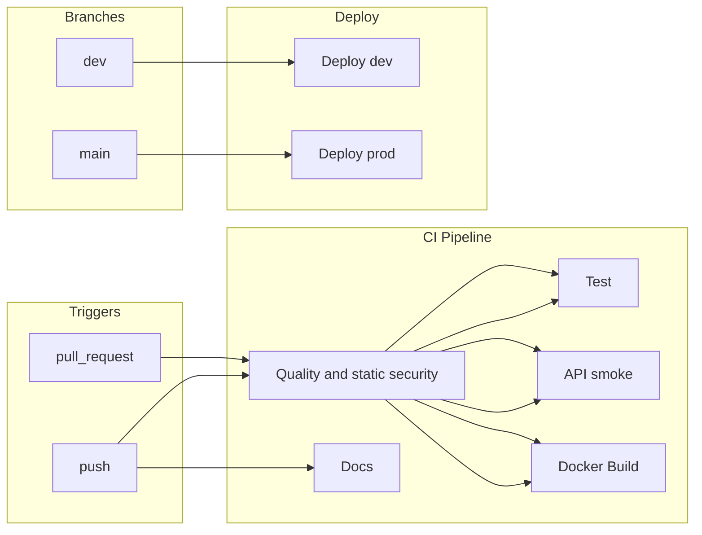
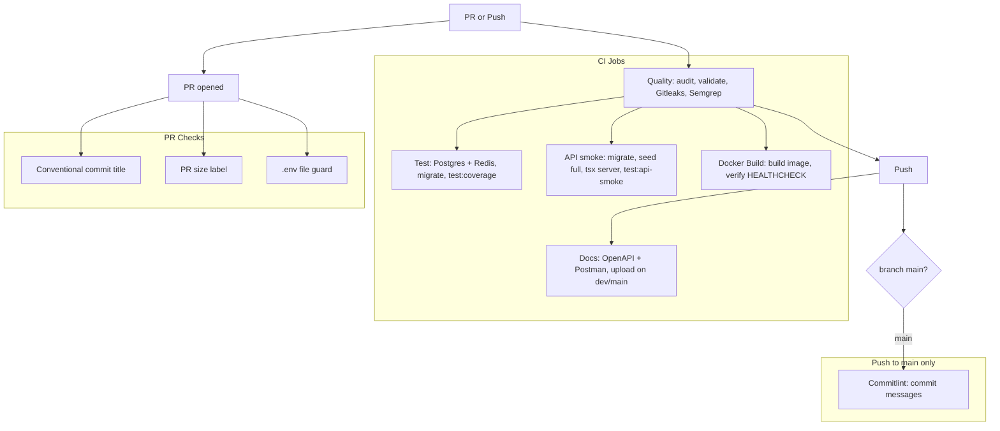
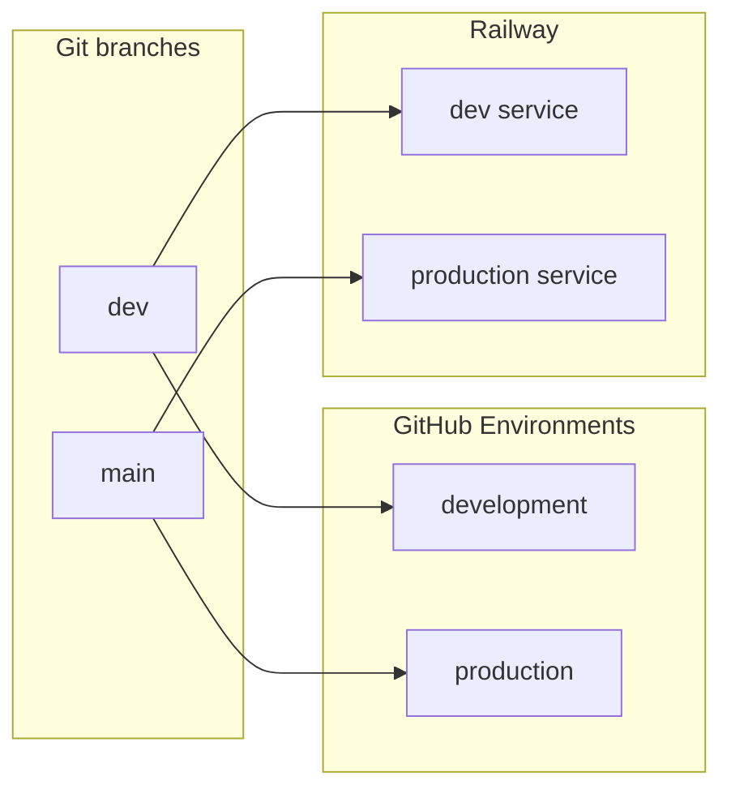
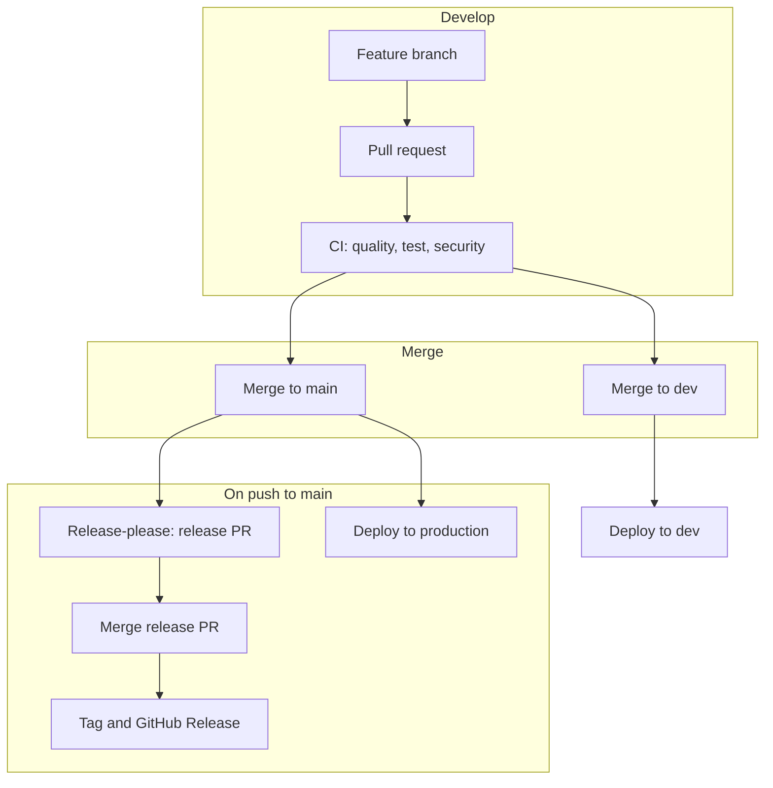
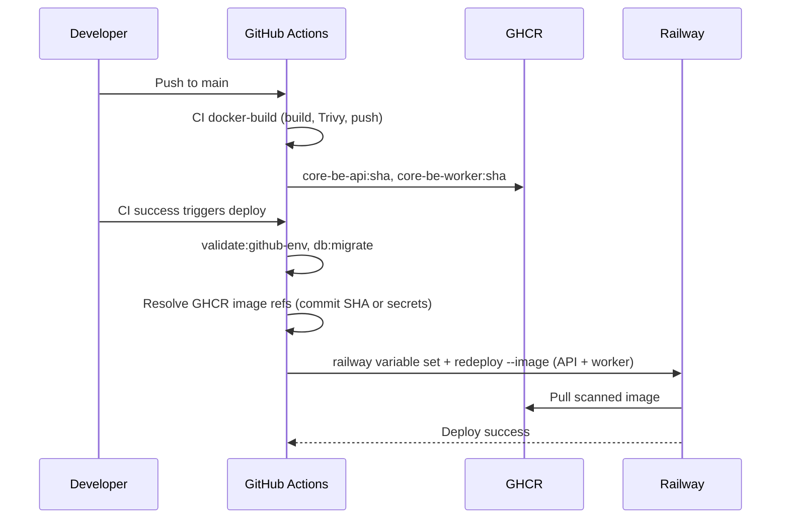
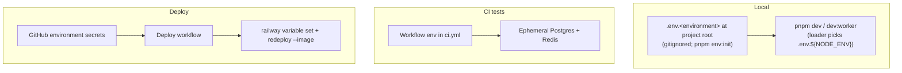
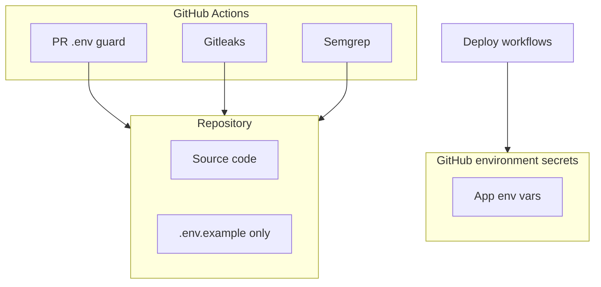

# CI/CD and Deployment

Single reference for what runs in CI, how deployment to Railway works, and **which tokens you need where**. Includes all deployment **Mermaid diagrams** (push → CI → deploy, release-please, secrets). Secrets are stored in **GitHub Environments** (development, production). See [setup.md](../../getting-started/setup.md) for local dev; [git-workflow.md](../../process/git-workflow.md) for branches and PRs.

> **Prerequisite:** Infrastructure must be set up before auto-deploy works. Use [setup-automation.md](../setup/setup-automation.md) (`pnpm setup:infra`) to provision Neon, Redis, Railway, GitHub secrets first.

---

## 1. Overview



- **CI** runs on every **pull_request** and **push** to **main** and **dev** (quality + static security, tests, live HTTP API smoke, Docker image build + scan on PR and push, docs on push only).
- **Deploy** runs on **push** to **dev** (development) or **main** (production); each uses GitHub environment secrets and deploys to Railway.
- On **main** and **dev**, **release-please** and **commitlint** run on push. `main` produces stable releases (`v2.1.0`); `dev` produces pre-releases (`v2.1.0-dev.0`). Both publish GitHub Releases, so [release-sbom.yml](../../../.github/workflows/release-sbom.yml) attaches a CycloneDX SBOM to either channel. See [§4.1 Release and deploy flow](#41-release-and-deploy-flow-feature--production) below.

---

## 2. CI pipeline (what runs)



| Job              | When                                          | What                                                                                                                                                                   |
| ---------------- | --------------------------------------------- | ---------------------------------------------------------------------------------------------------------------------------------------------------------------------- |
| **Quality**      | Every PR and push                             | `pnpm deps:audit`, `pnpm deps:audit:prod`, `pnpm validate`, `pnpm validate:domain`, routes:catalog, `pnpm docs:check`, tool:sync-env-example, Gitleaks, `semgrep scan` |
| **Test**         | PR/push when `src/**` (etc.) changed          | Postgres + Redis → `pnpm db:migrate` → `pnpm test:coverage`. Skipped on docs-only PRs.                                                                                 |
| **API smoke**    | PR/push when `src/**` (etc.) changed          | Migrate → seed → API server → `pnpm test:api-smoke`. Skipped on docs-only PRs.                                                                                         |
| **Chaos**        | PR/push when `src/**` (etc.) changed          | Toxiproxy + `pnpm test:chaos`. Required on PRs (skipped on docs-only). See [branch-protection.md](branch-protection.md).                                               |
| **Docker build** | PR/push when Docker/deps paths change         | BuildKit + Trivy + health container. Required on PRs (skipped when no `docker` paths). See [branch-protection.md](branch-protection.md).                               |
| **Docs**         | Push to `dev` / `main` (after quality)        | `pnpm docs:all`; validate OpenAPI; upload artifacts; Postman + Scalar upload via GitHub Environment secrets (`development`, `production`)                              |
| **PR checks**    | On every PR                                   | Conventional commit title, PR size label, **.env guard** (fail if `.env` other than `.env.example` in diff)                                                            |
| **Commitlint**   | Push to **main**, **dev**                     | Validates every commit in the push against [commitlint.config.cjs](../../../commitlint.config.cjs) (covers squash-merge and merge-commit messages, not only PR titles) |

Workflow files: [.github/workflows/ci.yml](../../../.github/workflows/ci.yml), [.github/workflows/pr-checks.yml](../../../.github/workflows/pr-checks.yml), [.github/workflows/commit-lint.yml](../../../.github/workflows/commit-lint.yml). Index: [.github/README.md](../../../.github/README.md).

**Path filters (docs-only PRs):** [ci.yml](../../../.github/workflows/ci.yml) uses `dorny/paths-filter` — when only `docs/**` or markdown changes (no `src-code`), **Test**, **API smoke**, and **Chaos** are skipped on pull requests (required checks still pass). **Quality** always runs. See [branch-protection.md](branch-protection.md).

---

## 3. Branch-to-environment mapping



| Branch | GitHub environment | Railway service |
| ------ | ------------------ | --------------- |
| dev    | development        | Development     |
| main   | production         | Production      |

Deploy workflow: [deploy-railway.yml](../../../.github/workflows/deploy-railway.yml) (runs after CI succeeds on push to `main` / `dev`, or manual `workflow_dispatch`).

**Branch protection:** Which CI jobs must be required on **`main`** and **`dev`**, plus committed ruleset JSON and apply steps — see [branch-protection.md](branch-protection.md).

---

## 4. Release and versioning (release-please)

Release-please turns **conventional commits** into a **release PR** (CHANGELOG + version bump in `package.json`). When you merge that PR, it creates the **GitHub Release** and tag. No npm publish is run (the package is private). We use the maintained [googleapis/release-please](https://github.com/googleapis/release-please) action.

There are **two release channels** — each tracks its own version via a dedicated manifest, so they never collide:

| Channel        | Branch | Tag style       | Config file                                                                 | Manifest file                                                                   | Changelog          |
| -------------- | ------ | --------------- | --------------------------------------------------------------------------- | ------------------------------------------------------------------------------- | ------------------ |
| **Stable**     | `main` | `v2.1.0`        | [.release-please-config.json](../../../.release-please-config.json)         | [.release-please-manifest.json](../../../.release-please-manifest.json)         | `CHANGELOG.md`     |
| **Prerelease** | `dev`  | `v2.1.0-dev.0`  | [.release-please-config.dev.json](../../../.release-please-config.dev.json) | [.release-please-manifest-dev.json](../../../.release-please-manifest-dev.json) | `CHANGELOG-dev.md` |

The dev config sets `prerelease: true` + `prerelease-type: "dev"` and writes its own `CHANGELOG-dev.md`, so a `dev → main` promotion never collides with main's `CHANGELOG.md`. Both channels publish GitHub Releases (`release: published`), so [release-sbom.yml](../../../.github/workflows/release-sbom.yml) attaches a CycloneDX SBOM in either case.

> **`package.json` version on `dev`** — release-please's `node` release-type also bumps `package.json` on each dev release (e.g. `2.1.0-dev.0`). When you eventually promote `dev → main`, expect a `package.json` merge conflict on the release-PR line; resolve it by **keeping `main`'s version**. The next release-please run on `main` then bumps to the matching stable version.

Local commits are validated by **commitlint** via [.husky/commit-msg](../../../.husky/commit-msg); pushes to **main** run [.github/workflows/commit-lint.yml](../../../.github/workflows/commit-lint.yml).

**Branch protection:** Require the CI and PR-check jobs listed in [branch-protection.md](branch-protection.md); apply policies via GitHub Rulesets using [`.github/rulesets/`](../../../.github/rulesets/) or the GitHub UI. On **`main`**, use **Squash and merge** only with the default squash message taken from the PR title so every commit stays conventional (PR checks validate the title; [Commitlint](../../../.github/workflows/commit-lint.yml) validates pushes).

| What         | Where                                                                                                                          |
| ------------ | ------------------------------------------------------------------------------------------------------------------------------ |
| **Runs on**  | Push to **main** (stable) and **dev** (prerelease)                                                                              |
| **Workflow** | [.github/workflows/release-please.yml](../../../.github/workflows/release-please.yml)                                          |
| **Token**    | **RELEASE_PLEASE_TOKEN** (Personal Access Token) in repository secrets — use a PAT so that merging the release PR triggers CI. |

### 4.1 Release and deploy flow (feature → production)



- **Feature → PR → CI:** Every PR runs quality, tests, and security. PR title must follow conventional commits (validated by PR checks).
- **Merge to dev/main:** Each branch maps to an environment; push triggers the corresponding deploy workflow (GitHub environment secrets + Railway).
- **On main and dev:** **Commitlint** validates commit messages on each push. **Release-please** opens or updates a **release PR** (CHANGELOG + version bump) per channel — `main` produces stable releases, `dev` produces pre-releases (`-dev.N`). Merging that PR creates the GitHub Release and tag for that channel; the SBOM workflow attaches a CycloneDX SBOM. The same push to the branch also triggers **deploy to** the matching environment.

**Production path (steps):**

1. Merge to `main` (e.g. from a release PR).
2. Release-please creates or updates the release PR on push to `main`.
3. Merge the release PR when ready → stable GitHub Release + tag (`v2.x.y`) → `release-sbom.yml` attaches the SBOM.
4. CI `docker-build` job on `main` Trivy-scans and pushes `ghcr.io/<owner>/<repo>/core-be-api` and `core-be-worker` (tags `:sha` and `:latest`).
5. Deploy workflow runs on push to `main` (validate env → resolve GHCR images → migrate → `railway redeploy --image`).
6. Optional smoke: `pnpm load:health` or `GET /health/ready`.

**Development path (steps):** identical to production but on the `dev` branch, with a few differences:

1. Merge to `dev` (e.g. from a feature PR).
2. Release-please creates or updates the **dev release PR** on push to `dev` (`.release-please-config.dev.json` + `.release-please-manifest-dev.json`).
3. Merge the dev release PR when ready → **prerelease** GitHub Release + tag (`v2.x.y-dev.N`) → `release-sbom.yml` attaches the SBOM.
4. CI `docker-build` job on `dev` Trivy-scans and pushes `ghcr.io/<owner>/<repo>/core-be-api` and `core-be-worker` (SHA-tagged only — `:latest` is reserved for `main`).
5. Deploy workflow runs on push to `dev` (validate env → resolve GHCR images by SHA → migrate → `railway redeploy --image`) against the **development** GitHub Environment.

**Hotfix:** Branch from `main` (`hotfix/*`), conventional commit, PR into `main`. Merge triggers production deploy and release-please on the same push. Branch strategy: [git-workflow.md](../../process/git-workflow.md).

### Verify release-please after changing bootstrap config

On GitHub, after merging a change that touches release-please files:

1. Open **Actions** → workflow **Release Please** → confirm the latest runs on **both** `main` and `dev` succeeded (if **RELEASE_PLEASE_TOKEN** is missing or lacks scope, the job fails).
2. Confirm a **release-please** PR exists or is updated when there are new conventional commits since the channel's manifest version (or that the workflow completes with no release until the next qualifying commit). Each channel produces its own PR.
3. Ensure git tag **`v1.0.0`** exists at the historical 1.0.0 commit if you rely on tag-based archaeology; create it once if absent.
4. After you **merge** an automated release PR, confirm the matching **GitHub Release** + tag exist and that `CHANGELOG.md` / `package.json` were updated by the bot — `main` → stable `v2.x.y`, `dev` → prerelease `v2.x.y-dev.N`.

---

## 5. Deploy flow (per environment)



Steps in each deploy workflow:

1. Checkout code, install dependencies (migrations only — no app `pnpm build`).
2. Run `pnpm validate:github-env` against the GitHub environment.
3. **Resolve scanned CI images from GHCR** — default `ghcr.io/<owner>/<repo>/core-be-api:<commit-sha>` and `core-be-worker:<commit-sha>`; optional secrets **`GHCR_API_IMAGE`** / **`GHCR_WORKER_IMAGE`** override (digest or tag).
4. Run `pnpm db:migrate`, install Railway CLI, sync app env vars with `railway variable set`.
5. Deploy API and worker with `railway redeploy --service … --image …` (no `railway up` / source build on Railway).

**GHCR images (CI):** On push to **`main`**, the reusable [docker-build-verify.yml](../../../.github/workflows/reusable/docker-build-verify.yml) job builds API + worker images, runs Trivy (CRITICAL/HIGH, `exit-code: 1`), then pushes to GHCR. PRs build and scan only (no push).

**Railway pull access:** Each Railway service must be allowed to pull from `ghcr.io` (package visibility + deploy token or linked registry). Images are public within the org or use Railway’s registry credentials for private GHCR packages.

**Optional GitHub environment secrets:**

| Secret              | Purpose                                                                               |
| ------------------- | ------------------------------------------------------------------------------------- |
| `GHCR_API_IMAGE`    | Override API image ref (e.g. digest-pinned `ghcr.io/owner/repo/core-be-api@sha256:…`) |
| `GHCR_WORKER_IMAGE` | Override worker image ref                                                             |

**Variables synced to Railway on deploy** (when present in GitHub environment secrets):

`DATABASE_URL`, `REDIS_URL`, `JWT_SECRET`, `ALLOWED_ORIGINS`, `NODE_ENV`, `PORT`, `HOST`, `LOG_LEVEL`, `FRONTEND_URL`, `RATE_LIMIT_MAX`, `RATE_LIMIT_WINDOW_MS`, `SENTRY_DSN`, `SENTRY_ENVIRONMENT`, `SENTRY_TRACES_SAMPLE_RATE`, `SENTRY_PROFILE_SAMPLE_RATE`, `AUDIT_RETENTION_DAYS`, `AUTH_SESSION_RETENTION_DAYS`, `NODE_OPTIONS`, `DEPLOYMENT_TOTAL_REPLICA_COUNT`, `DEPLOYMENT_API_REPLICA_COUNT`, `DEPLOYMENT_WORKER_REPLICA_COUNT`, `DATABASE_POOL_MAX`, `POSTGRES_RESERVED_CONNECTIONS`, `POSTGRES_MAX_CONNECTIONS`.

Set **`DEPLOYMENT_TOTAL_REPLICA_COUNT`** to `api_replicas + worker_replicas` on **both** Railway API and worker services (production **required** — startup fails without it). You can use **`DEPLOYMENT_API_REPLICA_COUNT`** and **`DEPLOYMENT_WORKER_REPLICA_COUNT`** instead when split counts are clearer. Optional **`POSTGRES_MAX_CONNECTIONS`** when `SHOW max_connections` is misleading behind a pooler. See [resource-limits.md](../runbooks/resource-limits.md).

Optional on Railway/GitHub only if overriding app default: **`TOMBSTONE_RETENTION_DAYS`** (defaults to **90** in the env schema). **`NODE_OPTIONS`** (for example `--max-old-space-size=<MiB>` for heap limits) is optional and is **not** part of the Zod env schema (Node reads it at process start) — see [resource-limits.md](../runbooks/resource-limits.md).

`RAILWAY_TOKEN` and `RAILWAY_SERVICE_ID` are used by the CLI only; they are not written to Railway as app env vars.

**Validate GitHub env:** Run `pnpm validate:github-env` (or `CONFIG=production pnpm validate:github-env`) to ensure all required vars from `.env.example` exist in the target GitHub environment. Deploy workflows use `environment: development|production` so secrets are scoped per env.

**Not in deploy workflows today:**

| Item                    | Notes                                                                                                                                                                                                                                                                                                        |
| ----------------------- | ------------------------------------------------------------------------------------------------------------------------------------------------------------------------------------------------------------------------------------------------------------------------------------------------------------ |
| **Migrations**          | `pnpm db:migrate` runs in deploy before `railway redeploy`. CI test jobs also migrate ephemeral Postgres. See [runbook-dev-to-production.md](../runbooks/runbook-dev-to-production.md).                                                                                                                      |
| **Worker**              | Separate Railway service (`RAILWAY_WORKER_SERVICE_ID` required). Deploy uses the same GHCR worker image as CI (`core-be-worker:<commit-sha>`).                                                                                                                                                               |
| **Integration secrets** | `pnpm setup:infra` can push `RESEND_*`, `STRIPE_*`, `OAUTH_*`, `S3_*`, etc. to GitHub via [build-env-vars.ts](../../../tooling/setup/build-env-vars.ts), but deploy workflows do **not** call `railway variable set` for those keys. Set them on Railway once or add them to the deploy workflow `for` loop. |

---

## 6. Adding a new env var

Use the **env-schema-add** skill (`.cursor/skills/env-schema-add/SKILL.md`) — it
walks through the Secret-vs-Variable decision and the section placement in
`.env.example`. Summary:

1. **Add the Zod field** to [src/shared/config/env-schema.ts](../../../src/shared/config/env-schema.ts).
   Mark `.optional()` if the runtime can work without it; add `.default()` for
   sensible operational defaults.
2. **Add `KEY=placeholder` to [.env.example](../../../.env.example)** under the
   correct top-level half (`# GitHub Secrets ###` or `# GitHub Variables ###`)
   and an existing sub-section. The half a key sits in IS its classification —
   `pnpm env:sync` reads the structure directly.
3. **Verify schema ↔ template parity** with `pnpm tool:sync-env-example`
   (`--fix` will append commented placeholders for missing keys).
4. **Regenerate operator templates** with `pnpm env:init --force`. This rewrites
   `.env.development` and `.env.production` (both gitignored) with the new key
   in the same half + sub-section.
5. **Edit `.env.<environment>`** with the real value(s) for each environment
   you have access to, then push:

   ```bash
   pnpm env:sync development --dry-run     # preview the [secret] / [variable] column
   pnpm env:sync development               # push
   pnpm env:sync production --dry-run
   pnpm env:sync production
   ```

6. **Add the key to [deploy-railway.yml](../../../.github/workflows/deploy-railway.yml)**
   if it must be synced through to the Railway service variables step.
7. **Paste the "Environment variable changes" snippet** printed by
   `pnpm tool:sync-env-example` into the PR description so reviewers and the
   deploy workflow know what was added/removed.

Full lifecycle (rename, remove, validation matrix, troubleshooting):
**[environment-variables.md](../runbooks/environment-variables.md)**.

---

## 7. Where you need which token (reference)

All tokens stay **out of the repo**. Local uses `.env.<environment>`
(gitignored, generated by `pnpm env:init`); CI/deploy uses **GitHub
Environments** (populated by `pnpm env:sync <environment>`).





| Where                                                        | What                                                                                                                                                                                                                                                                          | Used for                                                                                                                   |
| ------------------------------------------------------------ | ----------------------------------------------------------------------------------------------------------------------------------------------------------------------------------------------------------------------------------------------------------------------------- | -------------------------------------------------------------------------------------------------------------------------- |
| **Local** (`.env.<environment>` at project root, gitignored) | `DATABASE_URL`, `REDIS_URL`, `JWT_SECRET` (min 32 chars), `JWT_PRIVATE_KEY` / `JWT_PUBLIC_KEY` (RS256), `SECRETS_ENCRYPTION_KEY` (64 hex), `ALLOWED_ORIGINS`. Optional: Resend, Stripe, OAuth, S3, Sentry (see [.env.example](../../../.env.example))                         | `pnpm dev` / `pnpm dev:worker` — loader reads `.env.${NODE_ENV}`. **Never commit any `.env.*` other than `.env.example`.** |
| **GitHub** → Environments (development, production)          | All keys from `.env.<environment>`, classified by section: anything under `# GitHub Secrets ###` becomes a Secret; anything under `# GitHub Variables ###` becomes a Variable. Plus **RAILWAY_TOKEN**, **RAILWAY_SERVICE_ID**, **RAILWAY_WORKER_SERVICE_ID** (workflow-only). | Deploy workflows. Populated by `pnpm env:sync <environment>` — idempotent, overwrites in place.                            |
| **Railway**                                                  | Create **project token** → put in GitHub env as **RAILWAY_TOKEN**. Create **service(s)** → copy **Service ID** into GitHub env as **RAILWAY_SERVICE_ID** / **RAILWAY_WORKER_SERVICE_ID**.                                                                                     | Token and service IDs are stored in GitHub Environments only.                                                              |

**Summary:**

- **Local:** `pnpm env:init` → edit `.env.<environment>` → `pnpm dev` / `pnpm dev:worker`.
- **GitHub:** `pnpm env:sync <environment>` pushes every key under the right section header. Re-run any time you change a value locally.
- **Railway:** Create token and service(s); deploy workflow reads them from the GitHub Environment.

---

## 8. First-time setup checklist

Use this once to get CI and deployment working.

### 8.1 GitHub Environments

- [ ] Create environments **development** and **production** in the repo: Settings → Environments → New environment.
- [ ] Run `pnpm setup:infra` — it provisions Neon, Redis, Railway, etc., and pushes all secrets to GitHub (repository + environment secrets).
- [ ] Or manually: add **RAILWAY_TOKEN**, **RAILWAY_SERVICE_ID**, **DATABASE_URL**, **REDIS_URL**, **JWT_SECRET**, **ALLOWED_ORIGINS** (and other app vars) to each environment’s Environment secrets.

### 8.2 Railway

- [ ] Create a **Railway project** (or setup does this).
- [ ] Create at least one **service** for the API per environment.
- [ ] In Railway Project → **Settings → Tokens**, create a token → add as **RAILWAY_TOKEN** in GitHub environments.
- [ ] Copy each **Service ID** → add as **RAILWAY_SERVICE_ID** in the corresponding GitHub environment.

After this, pushes to **dev** and **main** will run the deploy workflow. No keys or tokens are committed; they stay in GitHub.

---

## 9. Setup via CLI (Railway + GitHub)

### 9.1 Railway CLI

**Install**

```bash
npm i -g @railway/cli
# or: brew install railway
```

**One-time login** — `railway login` (opens browser).

**Create project and service**

```bash
railway init
railway add
railway status --json   # copy service ID
```

**Create project token** — Railway dashboard → Project → Settings → Tokens → Create token. Add to GitHub environment as **RAILWAY_TOKEN**.

### 9.2 GitHub CLI

**Install**

```bash
brew install gh
```

**Auth**

```bash
gh auth login
```

**Set environment secrets** (manual, if not using setup)

```bash
gh secret set RAILWAY_TOKEN --env development --body "paste-token"
gh secret set RAILWAY_SERVICE_ID --env development --body "paste-service-id"
gh secret set DATABASE_URL --env development --body "postgresql://..."
# etc.
```

---

## 10. Quick reference

| Step                   | Railway                                           | GitHub                                                                  |
| ---------------------- | ------------------------------------------------- | ----------------------------------------------------------------------- |
| Install                | `npm i -g @railway/cli` or `brew install railway` | `brew install gh`                                                       |
| Auth                   | `railway login`                                   | `gh auth login`                                                         |
| Create project/service | `railway init` then `railway add`                 | Create environments development, production in repo Settings            |
| Get service ID         | `railway status --json`                           | —                                                                       |
| Set secrets            | Use dashboard for project token                   | `gh secret set NAME --env development --body "value"` or run `pnpm setup:infra` |

No Doppler. All deploy secrets live in GitHub Environments.
