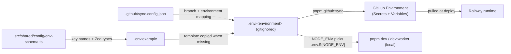
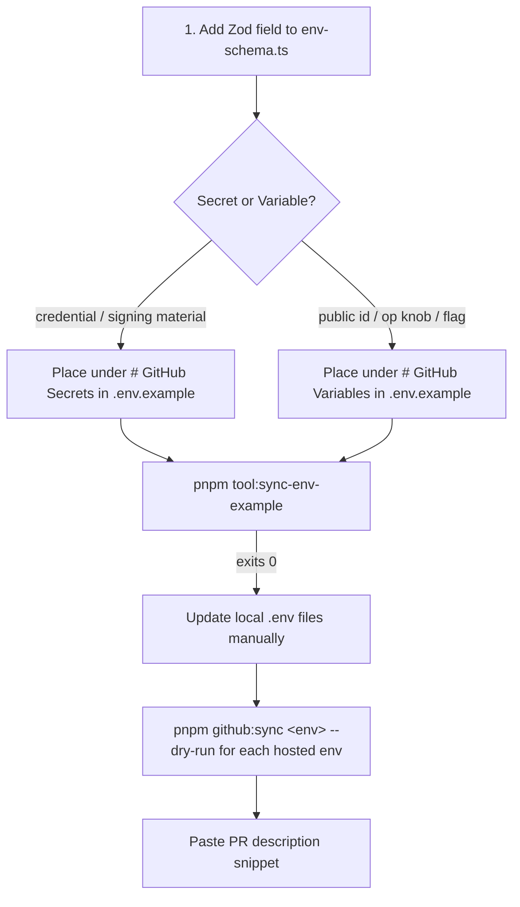

# Runbook: environment variables

Canonical reference for every workflow that touches environment variables in
core-be — from first-time local bootstrap through hosted-environment sync,
adding/renaming/removing keys, and troubleshooting.

If you only need to deal with the `dev` ↔ `prod` plumbing, see
**[add-new-environment.md](./add-new-environment.md)** for the canonical 1:1
invariant. This runbook covers the **per-key lifecycle**.

## TL;DR

| What                                 | Command                                       |
| ------------------------------------ | --------------------------------------------- |
| Bootstrap local env files            | `pnpm github:sync` (from `.github/sync.config.json`) |
| Edit values                          | open `.env.<environment>` (gitignored)        |
| Full GitHub sync (branches + rulesets + env values) | `pnpm github:sync`              |
| Sync one environment                 | `pnpm github:sync <environment>`              |
| Preview without pushing              | `pnpm github:sync <environment> --dry-run`    |
| Add a hosted environment             | edit `.github/sync.config.json`, then `pnpm github:sync` |
| Verify schema ↔ template parity      | `pnpm tool:sync-env-example`                  |
| Verify branch/env/NODE_ENV invariant | `pnpm github:sync --check`                    |
| Verify required keys exist in GitHub | `CONFIG=<env> pnpm validate:github-env`       |
| Add a new env var (skill)            | read `.cursor/skills/env-schema-add/SKILL.md` |

## 1. The mental model

There is **one** source of truth for which keys exist and what kind each one is:

```text
.env.example  (committed)
  │
  ├── # ### GitHub Secrets ###       → pushed via `gh secret set`
  │     # --- Database (Postgres) ---
  │     DATABASE_URL=...
  │     ...
  │
  └── # ### GitHub Variables ###     → pushed via `gh api .../variables`
        # --- Server & process ---
        PORT=3000
        ...
```

The **section a key sits in IS its classification**. There is no separate
classifier file, no override list, no CI guard to keep in sync. The runtime
schema (`src/shared/config/env-schema.ts`) declares Zod validation for every
key; `.env.example` declares its identity (Secret vs Variable) and its
neighbours (sub-section grouping for readability).



## 2. First-time local bootstrap

You only do this once per machine (or after `git clean -fdx`):

```bash
pnpm github:sync
```

That command:

1. Reads `.github/sync.config.json`.
2. Creates any missing `.env.<environment>` files from `.env.example`.
3. Creates any missing `.github/environments/<environment>.json` and `.github/rulesets/<branch>.json`.
4. Applies branches, rulesets, and GitHub Environments.
5. Asks for confirmation before pushing values.

Then edit `.env.development` (and `.env.production` if you have access to
production credentials) with real values:

```bash
$EDITOR .env.development
```

Run locally:

```bash
pnpm compose:up && pnpm compose:wait   # local Postgres + Redis
pnpm db:migrate
pnpm dev                                # API; loads .env.development
pnpm dev:worker                         # worker; same .env.development
```

The loader (`src/shared/config/load-env-files.ts`) picks `.env.${NODE_ENV}` and
strips empty values so optional Zod fields see `undefined`, not `""`. If
`.env.${NODE_ENV}` is missing AND `NODE_ENV !== 'production'`, it falls back to
`.env.development` — this is what lets `NODE_ENV=test` work without forcing
every contributor to maintain a separate `.env.test`.

## 3. Day-to-day local dev

| Task              | How                                                                                                    |
| ----------------- | ------------------------------------------------------------------------------------------------------ |
| Change a value    | edit `.env.development` and restart `pnpm dev`                                                         |
| See what's loaded | the dotenv loader logs `injected env (<n>) from .env.development` at startup                           |
| Switch profile    | `NODE_ENV=production pnpm dev` to test prod settings locally (requires `.env.production` to be filled) |
| Add a new env file | add the environment to `.github/sync.config.json`, then run `pnpm github:sync`                         |

`pnpm github:sync` does not overwrite existing `.env.<environment>` files; update
existing files manually so real values are not discarded.

## 4. Adding a new env var

Use the **env-schema-add** skill — it walks through the decision tree and
checklist. Summary:



Step by step:

1. **Add the Zod field** in `src/shared/config/env-schema.ts`:
   - Use the smallest valid type (`z.string().min(1)`, `z.coerce.number().int()`).
   - Mark `.optional()` if the runtime can work without it.
   - Add `.default(...)` for sensible operational defaults — defaulted keys are
     not part of `envSchemaRequiredKeys` so they do not have to be set per env.
   - Use `.refine()` for cross-field rules (e.g. "required when `FOO=true`")
     instead of duplicating the check at call sites.

2. **Place the key in `.env.example`** under the right half + sub-section:
   - **Secret half** — credentials, signing material, anything whose leak would
     cost money, breach identity, or grant unauthorized access. Examples:
     `*_API_KEY`, `*_TOKEN`, `*_DSN`, `*_PRIVATE_KEY`, `*_WEBHOOK_SECRET`,
     `*_ACCESS_KEY_ID`, `*_SECRET_ACCESS_KEY`, `DATABASE_URL`, `REDIS_URL`,
     AES keys (`SECRETS_ENCRYPTION_KEY`, `RESPONSE_ENCRYPTION_KEY`),
     OAuth `*_CLIENT_SECRET`.
   - **Variable half** — public identifiers and operational knobs. Examples:
     `PORT`, `LOG_LEVEL`, `WORKER_CONCURRENCY`, feature flags (`ENABLE_*`),
     URLs (`FRONTEND_URL`, `ALLOWED_ORIGINS`), public OAuth IDs
     (`OAUTH_*_CLIENT_ID`), public RP info (`WEBAUTHN_RP_ID`),
     `JWT_PUBLIC_KEY`, `CAPTCHA_SITE_KEY`.
   - **Edge cases — `*_KEY`:** `_PRIVATE_KEY` / `_SECRET_KEY` / `_API_KEY` /
     `_ACCESS_KEY_ID` / `_SECRET_ACCESS_KEY` → **Secret**. `_PUBLIC_KEY` /
     `_SITE_KEY` → **Variable**. AES raw-hex keys → **Secret**.
   - When unsure: default to **Secret** — wrong-direction Secret-vs-Variable is
     the worse risk (Variables are plaintext and exposed to every workflow
     step).
   - Pick an **existing sub-section** whenever possible. Create a new one only
     if no existing one fits.
   - Add a one-line description as a `#` comment above the `KEY=placeholder`.

3. **Verify the template:**

   ```bash
   pnpm tool:sync-env-example
   ```

   The script asserts:
   - Every schema key is documented in `.env.example` (commented or uncommented).
   - No uncommented `KEY=` exists in `.env.example` outside the schema.
   - Both top-level halves (`# GitHub Secrets`, `# GitHub Variables`) are present.

   If keys are missing, run `pnpm tool:sync-env-example --fix` and move the
   appended placeholders into the right half/sub-section by hand, with a
   description.

4. **Update local `.env.<environment>` files manually** so they contain the new
   key under the same half + sub-section. Do not overwrite real values.

5. **Dry-run the GitHub sync for each hosted env:**

   ```bash
   pnpm github:sync development --dry-run
   pnpm github:sync production  --dry-run
   ```

   Confirm the new key appears under the correct `[secret]` or `[variable]`
   column.

6. **Update the PR description** with the snippet printed under
   `--- Copy below into PR description ---`. Reviewers and the deploy workflow
   use this to know which secrets / variables they must provision before merge.

## 5. Editing an existing value (operator)

Local-only change (does not touch GitHub):

```bash
$EDITOR .env.development        # edit value
# restart pnpm dev / pnpm dev:worker to pick it up
```

Hosted-environment change:

```bash
$EDITOR .env.<environment>      # edit value
pnpm github:sync <environment> --dry-run    # preview
pnpm github:sync <environment>              # push
```

`github:sync` is **idempotent** and **overwrites in place** — running it twice
with the same file is a no-op for unchanged keys.

## 6. Renaming a key

A rename is atomic — delete + add in the **same PR**:

1. Add the **new key** to the schema and to `.env.example` (right half + sub-section).
2. Update every code site that read the old key to read the new one.
3. **Remove the old key** from the schema, `.env.example`, and any consumers.
4. `pnpm tool:sync-env-example` — must report 0 missing / 0 extra.
5. Update local `.env.<environment>` files manually.
6. After merge, delete the old key from GitHub:
   - Secret: `gh secret delete <OLD_NAME> --env <environment>`
   - Variable: `gh api --method DELETE repos/:owner/:repo/environments/<environment>/variables/<OLD_NAME>`

   `github:sync` does **not** remove keys — it only creates and updates.

## 7. Removing a key

1. Remove from `src/shared/config/env-schema.ts`.
2. Remove from `.env.example`.
3. Remove every consumer in code (`getEnv().FOO`).
4. `pnpm tool:sync-env-example` — must report 0 missing / 0 extra.
5. Update local `.env.<environment>` files manually so they lose the key.
6. After merge, clean up GitHub:
   - Secret: `gh secret delete <NAME> --env <environment>`
   - Variable: `gh api --method DELETE repos/:owner/:repo/environments/<environment>/variables/<NAME>`

## 8. Validation matrix

| Validator                               | What it checks                                                                      | When it runs                         |
| --------------------------------------- | ----------------------------------------------------------------------------------- | ------------------------------------ |
| `pnpm tool:sync-env-example`            | Schema ↔ `.env.example` parity; both halves present                                 | local, pre-commit, CI `ci:quality`   |
| `pnpm github:sync --check`              | `NODE_ENV` enum ↔ config ↔ rulesets ↔ workflow ↔ GitHub env JSON; remote branch/ruleset/env drift | local before sync                    |
| `CONFIG=<env> pnpm validate:github-env` | Each `envSchemaRequiredKeys` key exists as a secret in GitHub Environment `<env>`   | local before deploy; deploy workflow |
| `pnpm github:sync <env> --dry-run`      | Local `.env.<env>` → GitHub plan; surfaces typos and Secret/Variable column         | local before each sync               |

Run `pnpm github:sync --check`, `pnpm tool:sync-env-example`, and (when pushing values) `pnpm github:sync <env> --dry-run` before merging env plumbing changes.

## 9. Troubleshooting

| Symptom                                                                                                 | Cause                                                             | Fix                                                                                                                                                        |
| ------------------------------------------------------------------------------------------------------- | ----------------------------------------------------------------- | ---------------------------------------------------------------------------------------------------------------------------------------------------------- |
| `pnpm dev` boot error "Missing or invalid environment variables"                                        | `.env.${NODE_ENV}` missing or stale schema key                    | Run `pnpm github:sync` to scaffold missing files, then edit values                                                                                         |
| Zod refuses `KEY=""` for an `.optional()` field                                                         | Empty string is not `undefined`                                   | Loader strips empty values automatically; if you still hit this, ensure the key has no inline comment (e.g. `KEY= # foo` parses as a value with a comment) |
| `pnpm github:sync` says `Missing .env.<env>`                                                            | The environment is not in `.github/sync.config.json`, or dry-run cannot scaffold files | Add it to `.github/sync.config.json`, then run `pnpm github:sync` without `--dry-run`                                                                       |
| `pnpm github:sync` errors on the secret push                                                            | `gh auth status` failing or insufficient scope                    | Run `gh auth login` and grant `repo` + `admin:org` if it's an org repo                                                                                     |
| A new env var landed in GitHub as a Variable but should be a Secret                                     | The key was placed in the wrong half of `.env.example`            | Move it under `# GitHub Secrets ###`, regen templates, delete the existing GitHub Variable, re-sync                                                        |
| Local tests fail with `REDIS_BULLMQ_URL must be unset or point to the same Redis endpoint as REDIS_URL` | `REDIS_BULLMQ_URL` is set to a different host than `REDIS_URL`    | Leave `REDIS_BULLMQ_URL=` empty in `.env.development` (single-Redis topology)                                                                              |

## 10. Adding a new hosted environment

For the cross-dimension (branch ↔ GH env ↔ `NODE_ENV` ↔ `.env.<env>`)
1:1 invariant — including ruleset, workflow case mapping, and protection rules —
see the dedicated runbook: **[add-new-environment.md](./add-new-environment.md)**.

## 11. Reference

- **Schema:** `src/shared/config/env-schema.ts`
- **Template (committed):** `.env.example`
- **Operator templates (gitignored):** `.env.development`, `.env.production`
- **Loader:** `src/shared/config/load-env-files.ts`
- **GitHub sync config:** `.github/sync.config.json`
- **GitHub push:** `tooling/setup/github/sync.ts` (`pnpm github:sync`)
- **Section parser shared by both:** `tooling/setup/envs/parse-env-sections.ts`
- **Validator: schema ↔ template:** `src/scripts/validators/env/sync-env-example.ts` (`pnpm tool:sync-env-example`)
- **Consistency (in github:sync):** `tooling/setup/github/sync-config.ts` (`validateGithubSyncConsistency`; run via `pnpm github:sync --check`)
- **Validator: GitHub deploy-required keys:** `tooling/setup/github/validate.ts` (`pnpm validate:github-env`)
- **Skill (use this when editing the schema):** `.cursor/skills/env-schema-add/SKILL.md`
- **Where to obtain credentials:** [credentials-and-env.md](../../integrations/credentials-and-env.md)
- **Hosted-environment plumbing:** [add-new-environment.md](./add-new-environment.md)
- **GitHub Environments index:** [.github/environments/README.md](../../../.github/environments/README.md)
