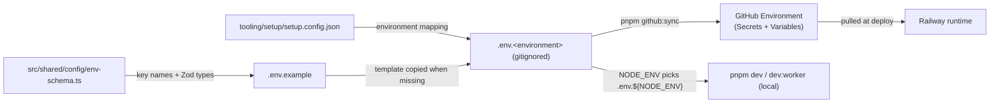
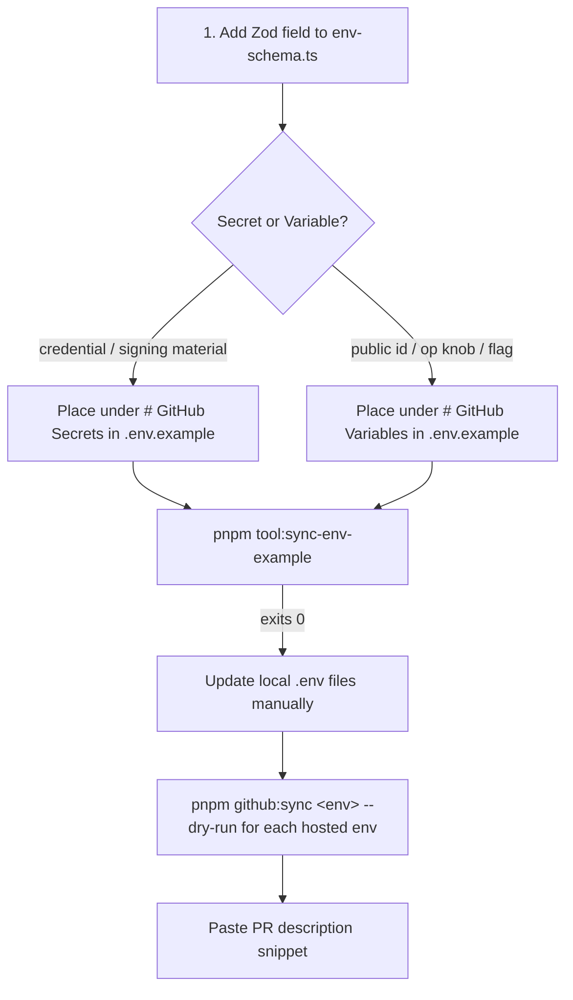

# Runbook: environment variables

Canonical reference for every workflow that touches environment variables in
core-be — from first-time local bootstrap through hosted-environment sync,
adding/renaming/removing keys, and troubleshooting.

If you only need to deal with the `dev` ↔ `prod` plumbing, see
**[add-new-environment.md](./add-new-environment.md)** for the canonical 1:1
invariant. This runbook covers the **per-key lifecycle**.

## TL;DR

| What                                 | Command                                       |
| ------------------------------------ | --------------------------------------------- |
| Bootstrap local env files            | `pnpm github:sync` (reads `tooling/setup/setup.config.json` directly)                              |
| Edit values                          | open `.env.<environment>` (gitignored)        |
| Full GitHub sync (rulesets + environments + env values) | `pnpm github:sync`              |
| Sync one environment                 | `pnpm github:sync <environment>`              |
| Preview without pushing              | `pnpm github:sync <environment> --dry-run`    |
| Add a hosted environment             | edit `tooling/setup/setup.config.json`, then `pnpm tool:generate-project-identity` and `pnpm github:sync` |
| Verify schema ↔ template parity      | `pnpm tool:sync-env-example`                  |
| Verify branch/env/NODE_ENV invariant | `pnpm github:sync --check`                    |
| Verify required keys exist in GitHub | deploy workflow step `pnpm validate:github-env-runtime` (after the environment export) |
| Add a new env var (skill)            | read `.cursor/skills/env-schema-add/SKILL.md` |
| **Which dev/load-test values are unsafe in prod** | [§11 Production safety](#11-production-safety-unsafe-dev-and-load-test-values) |

## 1. The mental model

There is **one** source of truth for which keys exist and what kind each one is:

```text
.env.example  (committed)
  │
  ├── # ### GitHub Secrets ###       → pushed via `gh secret set`
  │     # --- Database (Postgres) ---
  │     DATABASE_URL=...
  │     ...
  │
  └── # ### GitHub Variables ###     → pushed via `gh api .../variables`
        # --- Server & process ---
        PORT=3000
        ...
```

`pnpm github:sync` classifies each key by **name** via `classifyKey()`
(`tooling/setup/github/sync-github-environments.ts`): `*_API_KEY`, `*_TOKEN`,
`*_SECRET`, `*_PRIVATE_KEY`, `*_DSN`, `*_WEBHOOK_SECRET`, `*_ACCESS_KEY_ID`,
`*_SECRET_ACCESS_KEY`, `*_ENCRYPTION_KEY`, `*_WORKSPACE_ID`, `*_SERVICE_ID`,
`*_CLIENT_SECRET`, connection URLs (`DATABASE_URL`, `REDIS_URL`), `JWT_SECRET`,
`CAPTCHA_SECRET` → **Secret**; everything else → **Variable**. The `.env.example`
half is the **human-readable mirror** of that rule — place each key under the half
its name resolves to (the two halves are validated for existence, not per-key
placement). The runtime schema (`src/shared/config/env-schema.ts`) declares Zod
validation for every key; `.env.example` declares its identity (Secret vs Variable)
and its neighbours (sub-section grouping for readability).

### Where each kind is read

A key is consumed in two places, each with its own access syntax — **decide the
classification first, then read it from the matching context:**

| Consumer                                   | Read it as                          |
| ------------------------------------------ | ----------------------------------- |
| App / worker runtime (Node)                | `getEnv().NAME` (Zod-validated)     |
| GitHub Actions — **Secret**                | `${{ secrets.NAME }}`               |
| GitHub Actions — **Variable**              | `${{ vars.NAME }}`                  |

In a workflow the access context **must match the classification**. Reading a
Variable through `secrets.NAME` (or a Secret through `vars.NAME`) returns an
**empty string silently** — no error, the step just runs with `NAME=""`. This is
what hid `SCALAR_NAMESPACE` (a Variable read via `secrets.SCALAR_NAMESPACE`) and
skipped the Scalar Registry publish. When you add or reclassify a key, `grep`
`.github/workflows/` for the name and confirm every reference uses the matching
context. (Related gotcha: a step's own `env:` is not available to that step's
`if:` — gate on `inputs`/`vars`/job-level env instead.)



## 2. First-time local bootstrap

You only do this once per machine (or after `git clean -fdx`):

```bash
pnpm github:sync
```

That command:

1. Reads `tooling/setup/setup.config.json`.
2. Creates any missing `.env.<environment>` files from `.env.example`.
3. Creates any missing `.github/environments/<environment>.json` and `.github/rulesets/<branch>.json`.
4. Applies rulesets and GitHub Environments (single trunk: `main` is the repo default, so no branch is created).
5. Asks for confirmation before pushing values.

Then edit `.env.development` (and `.env.production` if you have access to
production credentials) with real values:

```bash
$EDITOR .env.development
```

Run locally:

```bash
pnpm compose:up && pnpm compose:wait   # local Postgres + Redis
pnpm db:migrate
pnpm dev                                # API; loads .env.development
pnpm dev:worker                         # worker; same .env.development
```

The loader (`src/shared/config/load-env-files.ts`) picks `.env.${NODE_ENV}`, strips
empty values so optional Zod fields see `undefined` not `""`, then layers the
gitignored `.env.local` on top as a per-machine override. It reads `NODE_ENV` **only**
to name the file — no comparison, no branch. The enum is `local | development |
production` (default `local`): an unset `NODE_ENV` is a developer's machine, so
`.env.local` is the **primary** file (self-contained, so the override step is skipped).
`development` / `production` are the two deploy targets and set `NODE_ENV` explicitly.
The Vitest harness pins `NODE_ENV=development`, so
it shares the one `.env.development`-style env (plus any `.env.local`); there is no separate
test env file. `.env.local` is gitignored and excluded from the Docker image
(`.dockerignore`), and production config is platform-injected — so it is absent in
production without needing a runtime guard.

## 3. Day-to-day local dev

| Task              | How                                                                                                    |
| ----------------- | ------------------------------------------------------------------------------------------------------ |
| Change a value    | edit `.env.development` and restart `pnpm dev`                                                         |
| See what's loaded | the dotenv loader logs `injected env (<n>) from .env.development` at startup                           |
| Switch profile    | `NODE_ENV=production pnpm dev` to test prod settings locally (requires `.env.production` to be filled) |
| Add a new env file | add the environment to `tooling/setup/setup.config.json`, run `pnpm tool:generate-project-identity`, then `pnpm github:sync` |

`pnpm github:sync` does not overwrite existing `.env.<environment>` files; update
existing files manually so real values are not discarded.

## 4. Adding a new env var

Use the **env-schema-add** skill — it walks through the decision tree and
checklist. Summary:



Step by step:

1. **Add the Zod field** in `src/shared/config/env-schema.ts`:
   - Use the smallest valid type (`z.string().min(1)`, `z.coerce.number().int()`).
   - Mark `.optional()` if the runtime can work without it.
   - Add `.default(...)` for sensible operational defaults — defaulted keys are
     not part of `envSchemaRequiredKeys` so they do not have to be set per env.
   - Use `.refine()` for cross-field rules (e.g. "required when `FOO=true`")
     instead of duplicating the check at call sites.

2. **Place the key in `.env.example`** under the right half + sub-section:
   - **Secret half** — credentials, signing material, anything whose leak would
     cost money, breach identity, or grant unauthorized access. Examples:
     `*_API_KEY`, `*_TOKEN`, `*_DSN`, `*_PRIVATE_KEY`, `*_WEBHOOK_SECRET`,
     `*_ACCESS_KEY_ID`, `*_SECRET_ACCESS_KEY`, `DATABASE_URL`, `REDIS_URL`,
     AES keys (`SECRETS_ENCRYPTION_KEY`, `RESPONSE_ENCRYPTION_KEY`),
     OAuth `*_CLIENT_SECRET`.
   - **Variable half** — public identifiers and operational knobs. Examples:
     `PORT`, `LOG_LEVEL`, `WORKER_CONCURRENCY`, feature flags (`ENABLE_*`),
     URLs (`FRONTEND_URL`, `ALLOWED_ORIGINS`), public OAuth IDs
     (`OAUTH_*_CLIENT_ID`), public RP info (`WEBAUTHN_RP_ID`),
     `JWT_PUBLIC_KEY`, `CAPTCHA_SITE_KEY`.
   - **Edge cases — `*_KEY`:** `_PRIVATE_KEY` / `_SECRET_KEY` / `_API_KEY` /
     `_ACCESS_KEY_ID` / `_SECRET_ACCESS_KEY` → **Secret**. `_PUBLIC_KEY` /
     `_SITE_KEY` → **Variable**. AES raw-hex keys → **Secret**.
   - When unsure: default to **Secret** — wrong-direction Secret-vs-Variable is
     the worse risk (Variables are plaintext and exposed to every workflow
     step).
   - Pick an **existing sub-section** whenever possible. Create a new one only
     if no existing one fits.
   - Add a one-line description as a `#` comment above the `KEY=placeholder`.

3. **Verify the template:**

   ```bash
   pnpm tool:sync-env-example
   ```

   The script asserts:
   - Every schema key is documented in `.env.example` (commented or uncommented).
   - No uncommented `KEY=` exists in `.env.example` outside the schema.
   - Both top-level halves (`# GitHub Secrets`, `# GitHub Variables`) are present.

   If keys are missing, run `pnpm tool:sync-env-example --fix` and move the
   appended placeholders into the right half/sub-section by hand, with a
   description.

4. **Update local `.env.<environment>` files manually** so they contain the new
   key under the same half + sub-section. Do not overwrite real values.

5. **Dry-run the GitHub sync for each hosted env:**

   ```bash
   pnpm github:sync development --dry-run
   pnpm github:sync production  --dry-run
   ```

   Confirm the new key appears under the correct `[secret]` or `[variable]`
   column.

6. **Update the PR description** with the snippet printed under
   `--- Copy below into PR description ---`. Reviewers and the deploy workflow
   use this to know which secrets / variables they must provision before merge.

## 5. Editing an existing value (operator)

Local-only change (does not touch GitHub):

```bash
$EDITOR .env.development        # edit value
# restart pnpm dev / pnpm dev:worker to pick it up
```

Hosted-environment change:

```bash
$EDITOR .env.<environment>      # edit value
pnpm github:sync <environment> --dry-run    # preview
pnpm github:sync <environment>              # push
```

`github:sync` is **idempotent** and **overwrites in place** — running it twice
with the same file is a no-op for unchanged keys.

## 6. Renaming a key

A rename is atomic — delete + add in the **same PR**:

1. Add the **new key** to the schema and to `.env.example` (right half + sub-section).
2. Update every code site that read the old key to read the new one.
3. **Remove the old key** from the schema, `.env.example`, and any consumers.
4. `pnpm tool:sync-env-example` — must report 0 missing / 0 extra.
5. Update local `.env.<environment>` files manually.
6. After merge, delete the old key from GitHub:
   - Secret: `gh secret delete <OLD_NAME> --env <environment>`
   - Variable: `gh api --method DELETE repos/:owner/:repo/environments/<environment>/variables/<OLD_NAME>`

   `github:sync` does **not** remove keys — it only creates and updates.

## 7. Removing a key

1. Remove from `src/shared/config/env-schema.ts`.
2. Remove from `.env.example`.
3. Remove every consumer in code (`getEnv().FOO`).
4. `pnpm tool:sync-env-example` — must report 0 missing / 0 extra.
5. Update local `.env.<environment>` files manually so they lose the key.
6. After merge, clean up GitHub:
   - Secret: `gh secret delete <NAME> --env <environment>`
   - Variable: `gh api --method DELETE repos/:owner/:repo/environments/<environment>/variables/<NAME>`

## 8. Validation matrix

| Validator                               | What it checks                                                                      | When it runs                         |
| --------------------------------------- | ----------------------------------------------------------------------------------- | ------------------------------------ |
| `pnpm tool:sync-env-example`            | Schema ↔ `.env.example` parity; both halves present                                 | local, pre-commit, CI `ci:quality`   |
| `pnpm github:sync --check`              | `NODE_ENV` enum ↔ config ↔ rulesets ↔ workflow ↔ GitHub env JSON; remote ruleset/env drift | local before sync                    |
| `pnpm validate:github-env-runtime` | Each `envSchemaRequiredKeys` key is present in the exported GitHub Environment   | deploy workflow (pre-deploy step) |
| `pnpm github:sync <env> --dry-run`      | Local `.env.<env>` → GitHub plan; surfaces typos and Secret/Variable column         | local before each sync               |

Run `pnpm github:sync --check`, `pnpm tool:sync-env-example`, and (when pushing values) `pnpm github:sync <env> --dry-run` before merging env plumbing changes.

## 9. Troubleshooting

| Symptom                                                                                                 | Cause                                                             | Fix                                                                                                                                                        |
| ------------------------------------------------------------------------------------------------------- | ----------------------------------------------------------------- | ---------------------------------------------------------------------------------------------------------------------------------------------------------- |
| `pnpm dev` boot error "Missing or invalid environment variables"                                        | `.env.${NODE_ENV}` missing or stale schema key                    | Run `pnpm github:sync` to scaffold missing files, then edit values                                                                                         |
| Zod refuses `KEY=""` for an `.optional()` field                                                         | Empty string is not `undefined`                                   | Loader strips empty values automatically; if you still hit this, ensure the key has no inline comment (e.g. `KEY= # foo` parses as a value with a comment) |
| `pnpm github:sync` says `Missing .env.<env>`                                                            | The environment is not in `tooling/setup/setup.config.json`, or dry-run cannot scaffold files | Add it to `tooling/setup/setup.config.json`, run `pnpm tool:generate-project-identity`, then `pnpm github:sync` without `--dry-run`                          |
| `pnpm github:sync` errors on the secret push                                                            | `gh auth status` failing or insufficient scope                    | Run `gh auth login` and grant `repo` + `admin:org` if it's an org repo                                                                                     |
| A new env var landed in GitHub as a Variable but should be a Secret                                     | `classifyKey()` decides by **name**, not by `.env.example` half — the name has no Secret suffix | Rename the key to carry a Secret suffix (`*_TOKEN` / `*_SECRET` / `*_API_KEY` / `*_KEY`) or add it to `classifyKey()`; moving the `.env.example` half alone does nothing. Then delete the stale Variable and re-sync |
| A workflow step acts as if a secret/variable is empty (e.g. an upload silently skips, an API call 401s)  | The step reads it from the wrong context — `secrets.NAME` for a Variable, or `vars.NAME` for a Secret | Match the access context to the classification: Secret → `${{ secrets.NAME }}`, Variable → `${{ vars.NAME }}`. `grep .github/workflows/` for the name      |
| Local tests fail with `REDIS_BULLMQ_URL must be unset or point to the same Redis endpoint as REDIS_URL` | `REDIS_BULLMQ_URL` is set to a different host than `REDIS_URL`    | Leave `REDIS_BULLMQ_URL=` empty in `.env.development` (single-Redis topology)                                                                              |

## 10. Adding a new hosted environment

For the cross-dimension (branch ↔ GH env ↔ `NODE_ENV` ↔ `.env.<env>`)
1:1 invariant — including ruleset, workflow case mapping, and protection rules —
see the dedicated runbook: **[add-new-environment.md](./add-new-environment.md)**.

## 11. Production safety: unsafe dev and load-test values

The `local`, `test`, and load-test profiles deliberately **turn off** protections
(captcha, rate limiting, Sentry) and tune sizing for one machine. Production must
inherit **none** of those values. Three layers govern this — the first two are
enforced for you; the third is entirely on the operator.

### 11.1 Layer 1 — the schema refuses to boot in production

These `src/shared/config/env-schema.ts` refinements **throw at startup** in
`production`, so a deploy carrying a dev/placeholder value crashes fast
instead of running insecure — you cannot ship the dev value:

| Setting                               | dev / load-test value     | Enforced in production                                                  |
| ------------------------------------- | ------------------------- | --------------------------------------------------------------------------------- |
| `CAPTCHA_PROVIDER` + `CAPTCHA_SECRET` | `disabled`                | `turnstile` **and** `CAPTCHA_SECRET` required (public auth routes)                 |
| `SECRETS_ENCRYPTION_KEY`              | all-zero placeholder      | high-entropy 32-byte key (`openssl rand -hex 32`); low-entropy rejected           |
| `ALLOWED_ORIGINS`                     | `http://localhost:3000`   | absolute `https://` only; no `*`, path, userinfo, query, or trailing slash        |
| `COOKIE_SECURE`                       | `false`                   | `true` (cookies sent over HTTPS only)                                              |
| `UPLOAD_USE_PRESIGNED_POST`           | may be `false`            | `true` (presigned PUT has no min-size enforcement)                                 |
| `OTEL_EXPORTER_OTLP_ENDPOINT`         | `http://…` ok             | `https://` (telemetry must not transmit SQL/paths in plaintext)                   |
| `METRICS_SCRAPE_TOKEN`                | optional                  | **required (≥32 chars)** when `METRICS_ENABLED=true`                               |
| `EMAIL_FROM_ADDRESS`                  | optional                  | **required** when `RESEND_API_KEY` or `STRIPE_SECRET_KEY` is set                   |

**Verify before deploy:** `NODE_ENV=production pnpm dev` with `.env.production`
filled — boot fails loudly on any violation. The deploy workflow's `validate:github-env-runtime`
step confirms the required keys exist in the GitHub Environment before anything deploys.

### 11.2 Layer 2 — `NODE_ENV` selects each policy flag's default (it is not itself a runtime switch)

Runtime code never branches on `NODE_ENV`; it reads explicit **policy flags**, and `NODE_ENV` only
**selects each flag's default** in `env-schema.ts`. The two most safety-relevant flags —
`RATE_LIMIT_RELAXED_CAPS` (lifts every per-route cap to 5000, `rate-limit-presets.constants.ts`) and
`CAPTCHA_FAIL_OPEN` (captcha skips when Turnstile is unconfigured, `captcha.middleware.ts`) — default
relaxed on a local `development` runtime, and a schema refine **rejects the relaxed value in
production at boot**. So even a leaked `.env` cannot ship relaxed caps or fail-open captcha to
a deployed environment — config validation fails closed. The boot-time safety checks
(`DATABASE_TLS_ENFORCED`, `DATABASE_RLS_SAFETY_ENFORCED`, `REDIS_TLS_ENFORCED`, `TRUST_PROXY_REQUIRED`,
`DATABASE_CONNECTION_BUDGET_ENFORCED`) follow the same rule: default enforced when deployed, locked on
in production. You also normally cannot ship the wrong `NODE_ENV` — the Dockerfile sets
`NODE_ENV=production`, and the branch ↔ GitHub-env ↔ `NODE_ENV` 1:1 invariant
(`pnpm github:sync --check`, see [add-new-environment.md](./add-new-environment.md)) blocks a
mismatch. **Never hand-edit `NODE_ENV` in `.env.production`; override an individual policy flag if you
must change a default (a production refine still blocks any unsafe value).**

### 11.3 Layer 3 — valid-but-dangerous values the schema accepts (operator-owned)

These are real, schema-valid values — nothing rejects them — so a load-test value
silently **disables protection** in production. **This is the category to review by
hand on every `.env.production`:**

| Setting                                                                  | Load-test value                | Production value                          | If the load-test value ships                                              |
| ------------------------------------------------------------------------ | ------------------------------ | ----------------------------------------- | ------------------------------------------------------------------------- |
| `RATE_LIMIT_MAX`                                                         | `100000000`                    | `100` (default)                           | global limiter effectively off → brute-force / DoS exposure               |
| `MEMBER_ROLE_MAX_PER_ORG`                                                | `500`                          | `50` (default)                            | per-org role sprawl / abuse                                               |
| `WEBHOOK_URL_ALLOWLIST`                                                  | `example.com`                  | real partner hosts                        | `example.com` accepted as a webhook delivery target                       |
| `DATABASE_POOL_MAX` / `DEPLOYMENT_*_REPLICA_COUNT` / `POSTGRES_MAX_CONNECTIONS` | tuned to a 12-core box (`44`/`10`/`500`) | match the managed DB plan + replica topology | over/under-provisioned pool; boot connection-budget assert can fail or starve queries — [resource-limits.md](./resource-limits.md) |
| `LOG_LEVEL`                                                              | `debug` (common in dev)        | `info` (default) / `warn`                 | noisy logs, larger PII surface                                            |
| `SENTRY_DSN`                                                             | empty                          | real DSN (`SENTRY_ENVIRONMENT=production`) | no error / performance visibility (ops, not security)                     |
| `HTTP_SERVER_TIMING_ENABLED`                                            | `true` (journey reads `app;dur=`) | consider `false`                          | exposes server compute time (coarsened to 5 ms in prod, but still a signal) |

The full set of **required** production variables (replicas, retention, JWT,
managed URLs, admin emails) is the go-live checklist in
[production-go-live.md](./production-go-live.md).
This section is specifically the **dev / load-test → production delta**.

> The exact load-test overrides are tabulated in
> [src/tests/load/k6/COMPREHENSIVE-JOURNEY.md §1](../../../src/tests/load/k6/COMPREHENSIVE-JOURNEY.md) —
> none of those values belong in a deployed environment.

## 12. Reference

- **Schema:** `src/shared/config/env-schema.ts`
- **Template (committed):** `.env.example`
- **Operator templates (gitignored):** `.env.development`, `.env.production`
- **Loader:** `src/shared/config/load-env-files.ts`
- **Setup manifest (canonical):** `tooling/setup/setup.config.json`
- **GitHub push:** `tooling/setup/github/sync.ts` (`pnpm github:sync`)
- **Secret/Variable classifier (by name):** `tooling/setup/github/sync-github-environments.ts` (`classifyKey`)
- **`.env.example` add helper:** `tooling/setup/envs/env-add.ts` (`pnpm env:add`)
- **Validator: schema ↔ template:** `src/scripts/validators/env/sync-env-example.ts` (`pnpm tool:sync-env-example`)
- **Consistency (in github:sync):** `tooling/setup/github/sync-config.ts` (`validateGithubSyncConsistency`; run via `pnpm github:sync --check`)
- **Skill (use this when editing the schema):** `.cursor/skills/env-schema-add/SKILL.md`
- **Where to obtain credentials:** [credentials-and-env.md](../../integrations/credentials-and-env.md)
- **Hosted-environment plumbing:** [add-new-environment.md](./add-new-environment.md)
- **GitHub Environments index:** [.github/environments/README.md](../../../.github/environments/README.md)
