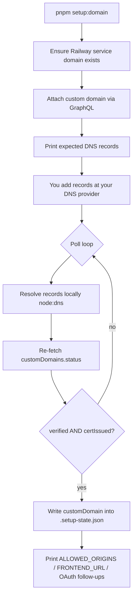

# Railway custom domain (SSL)

How to point a custom hostname like `api.example.com` at a Railway-deployed service and let Railway issue + renew a Let's Encrypt certificate. Both `development` and `production` use the same flow.

## TL;DR

```bash
# Read-only status (safe; no mutations)
pnpm setup:domain --check --all-environments

# Attach in both envs with a template, poll until SSL is issued
pnpm setup:domain --all-environments --domain-template "api.{env}.example.com"

# Production only, explicit domain
pnpm setup:domain --environment production --domain api.example.com
```

The command is implemented in [`tooling/setup/railway/custom-domain.ts`](../../../tooling/setup/railway/custom-domain.ts) and registered as `setup:domain` (and `setup:infra:domain` for symmetry with the rest of the `setup:infra:*` namespace) in [`package.json`](../../../package.json).

## Prerequisites

1. `RAILWAY_TOKEN` set in `.env.setup` (project token; see [setup-token-instructions.md](../setup/setup-token-instructions.md)).
2. `pnpm setup:infra` has been run at least once so `.setup-state.json` contains the Railway project / environments / services.
3. You can edit DNS for the parent zone of the domain you want to attach (`example.com` if attaching `api.example.com`).
4. The service you are attaching to is HTTP-facing (the `api` service). `worker` services do not accept inbound HTTP and the script rejects them.

## Flow



## DNS records

Railway returns one or more records that must exist before it will issue the certificate.

| Record       | When                                                    | Notes                                                              |
| ------------ | ------------------------------------------------------- | ------------------------------------------------------------------ |
| `CNAME`      | Subdomain (e.g. `api.example.com`)                      | Points to the Railway-generated service domain.                    |
| `ALIAS` / `ANAME` / `A` / `AAAA` | Apex (e.g. `example.com`) on providers that support flattening, or fall back to `A`/`AAAA` | Some DNS providers (Cloudflare, Route 53) support CNAME-flattening at apex; otherwise use the IPs Railway returns. |
| `TXT _railway` | Ownership verification                                | Some providers require this even when the CNAME alone would suffice. |

The exact values for each record are printed by the script and are also visible in the Railway dashboard under **Settings → Domains**.

### CAA records (gotcha)

If your zone already has a `CAA` record, make sure it permits `letsencrypt.org`. Otherwise certificate issuance fails with a CAA-related error and the script reports a terminal `cert-failed` outcome.

## Certificate issuance timing

After DNS verifies, Railway typically issues the Let's Encrypt certificate within 1–5 minutes. The script polls every `--poll-interval-seconds` (default 10) and gives up after `--wait-timeout-seconds` (default 900 = 15 minutes). When the timeout is hit but nothing is broken, re-run with `--check` later to resume polling.

## Flags

| Flag                          | Purpose                                                                                |
| ----------------------------- | -------------------------------------------------------------------------------------- |
| `--environment <name>`        | Repeatable. Limit run to specific environments from `.setup-state.json`.               |
| `--all-environments`          | Loop every environment recorded in `.setup-state.json`.                                |
| `--service <name>`            | Defaults to `api`. `worker` is rejected.                                                |
| `--domain <fqdn>`             | Required (per env) when running non-interactively. Mutually exclusive with template.   |
| `--domain-template <pattern>` | `{env}` placeholder, e.g. `api.{env}.example.com`. Convenient with `--all-environments`. |
| `--port <n>`                  | Defaults to `app.port` from [`tooling/setup/setup.config.json`](../../../tooling/setup/setup.config.json) (currently `3000`). |
| `--check`                     | Read-only; print existing custom-domain status. Safe for cron.                          |
| `--no-wait`                   | Skip the DNS + cert poll loop.                                                          |
| `--wait-timeout-seconds <n>`  | Default `900`.                                                                          |
| `--poll-interval-seconds <n>` | Default `10`.                                                                           |
| `--help`, `-h`                | Print the in-script flag reference.                                                     |

## After verification — env-var follow-ups

Attaching a custom domain almost always means you also need to update env vars so the API trusts requests on the new origin. The script prints `gh secret set` commands for the canonical keys; the typical set is:

- `ALLOWED_ORIGINS` — append `https://<new-domain>`.
- `FRONTEND_URL` — set to `https://<new-domain>` when this service is the public API origin.
- `OAUTH_GOOGLE_REDIRECT_URI` / `OAUTH_GITHUB_REDIRECT_URI` — when OAuth is enabled for that env. Must also be updated in the Google / GitHub OAuth app settings.

The script prints copy-pasteable `gh secret set ... --env <env>` commands. You can also push from local env files via `pnpm github:sync <environment>` — see [environment-variables.md](environment-variables.md).

## Troubleshooting

| Symptom                                          | Likely cause                                              | Action                                                                                 |
| ------------------------------------------------ | --------------------------------------------------------- | -------------------------------------------------------------------------------------- |
| Poll loop sits at `verified=false`               | DNS not propagated yet                                    | Wait. The local-DNS line in each poll tells you whether your resolver has the record.  |
| Cert status `FAILED` / `VALIDATION_FAILED`       | CAA blocks Let's Encrypt, or wrong DNS value              | Add `CAA 0 issue "letsencrypt.org"`, or fix the record to match what Railway returned. |
| Timeout (`--wait-timeout-seconds` elapsed)       | Slow DNS or Railway re-check                              | Re-run with `--check` — it is read-only and resumes polling.                            |
| `Custom domain ... disappeared from Railway`     | Domain was deleted in the dashboard mid-poll              | Re-run without `--check` to re-attach.                                                  |
| `RAILWAY_TOKEN is not set`                        | `.env.setup` missing the token                            | See [setup-token-instructions.md](../setup/setup-token-instructions.md).                |
| `worker` rejected                                | Workers don't accept inbound HTTP                         | Use `--service api` (or pick `api` interactively).                                       |

## See also

- [railway-github-cli-setup.md](../setup/railway-github-cli-setup.md) — Railway + GitHub CLI setup (parent of this runbook).
- [setup-automation.md](../setup/setup-automation.md) — One-command provisioning that creates the Railway project this runbook attaches a domain to.
- [environment-variables.md](environment-variables.md) — Env var lifecycle (used for the `ALLOWED_ORIGINS` / `FRONTEND_URL` updates the script suggests).
- [cicd-and-deployment.md](../ci-cd/cicd-and-deployment.md) — Deploy workflow that pushes the image the custom domain fronts.
