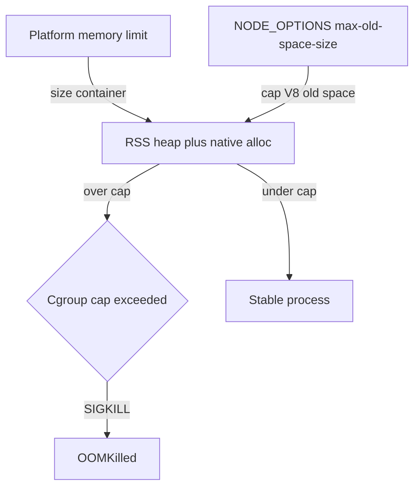

# Container resource quotas and predictable OOM behavior

Set **platform memory limits** for every deployment (Railway **Memory** slider or Kubernetes `resources.limits.memory`) and align **Node heap** via `NODE_OPTIONS=--max-old-space-size=<MB>`.

This repo ships a production [Dockerfile](../../../Dockerfile) with no baked-in heap cap: `NODE_OPTIONS` is injected at runtime by the hosting platform.

---

## Why set explicit limits

| Without heap cap aligned to cgroup                                                       | With aligned heap cap (`--max-old-space-size`)                                                                                                             |
| ---------------------------------------------------------------------------------------- | ---------------------------------------------------------------------------------------------------------------------------------------------------------- |
| V8 grows the heap until RSS hits the cgroup cap; the Linux OOM killer sends **SIGKILL**  | GC runs before the cgroup cap; failures are typically **allocation errors**, **crash reports**, or **health check failure** rather than abrupt silent kill |
| Hard to correlate with logs or error tracking (`OOMKilled` only in platform/kube events) | Easier tuning: correlate heap pressure with metrics and **Sentry** before the kernel intervenes                                                            |

`--max-old-space-size` constrains **V8 old-generation heap**. **RSS still includes** native allocations, stacks, snapshots, buffers, and third-party addons — so heap must stay **below** container memory reserve (see heuristic below).

---

## Sizing heuristic: container memory versus `--max-old-space-size`

**Rule of thumb:** set `--max-old-space-size` to approximately **75%** of container memory (**in megabytes**) so RSS can exceed heap for native allocations and spikes.

Container memory (Railway slider / Kubernetes `limits.memory`) is often expressed as MiB/GiB. Convert to MiB (`1 GiB ≈ 1024 MiB`) then multiply by `0.75` and round down.

| Container memory limit | Suggested `--max-old-space-size` (MiB, ~75%) |
| ---------------------- | -------------------------------------------- |
| 512 MiB                | 384                                          |
| 1 GiB (1024 MiB)       | 768                                          |
| 2 GiB                  | 1536                                         |
| 4 GiB                  | 3072                                         |

**Tune for your workload:** retention workers, large JSON payloads, or high BullMQ concurrency increase native RSS; use a **lower** heap fraction (for example 65–70%) or **raise** container memory.

### Worker RSS warning

The worker process logs a warning when **RSS** exceeds **512 MiB** ([`src/infrastructure/queue/bootstrap.ts`](../../../src/infrastructure/queue/bootstrap.ts)). If the container limit is **below ~768 MiB**, every healthy worker may trip that threshold — tune the deployment (more memory), lower concurrency (`WORKER_CONCURRENCY`), or eventually adjust the threshold in code if intentional.

### Postgres connection budget

Each **API** and **worker** process opens its own postgres.js pool (`DATABASE_POOL_MAX`, default **20**). Size deployments so:

```text
DEPLOYMENT_TOTAL_REPLICA_COUNT × DATABASE_POOL_MAX ≤ max_connections − POSTGRES_RESERVED_CONNECTIONS
```

If you set split counts instead of `DEPLOYMENT_TOTAL_REPLICA_COUNT`, the API and worker counts are added together before applying `DATABASE_POOL_MAX`.

| Variable                          | Meaning                                                         | Default                                      |
| --------------------------------- | --------------------------------------------------------------- | -------------------------------------------- |
| `DEPLOYMENT_TOTAL_REPLICA_COUNT`  | Shorthand: `api_replicas + worker_replicas`                     | required in production (or use split counts) |
| `DEPLOYMENT_API_REPLICA_COUNT`    | API service replica count                                       | optional split count                         |
| `DEPLOYMENT_WORKER_REPLICA_COUNT` | Worker service replica count                                    | optional split count                         |
| `DATABASE_POOL_MAX`               | postgres.js pool `max` per pool                                 | `20`                                         |
| `POSTGRES_RESERVED_CONNECTIONS`   | Admin, migrations, monitoring headroom                          | `10`                                         |
| `POSTGRES_MAX_CONNECTIONS`        | Optional override when `SHOW max_connections` is wrong (pooler) | query Postgres                               |

At startup, API and worker processes call `assertPostgresConnectionBudget()` ([`assert-connection-budget.ts`](../../../src/infrastructure/database/safety/assert-connection-budget.ts)): when `DATABASE_CONNECTION_BUDGET_ENFORCED=true` (the default when deployed — production; a local `development` laptop defaults it off) the check **fails fast** without deployment counts. With it off, the process defaults to **1 API + 1 worker** when counts are unset.

The pre-deploy CI step (`pnpm validate:github-env-runtime` in [`reusable-railway-deploy.yml`](../../../.github/workflows/reusable-railway-deploy.yml)) fails the workflow when schema-required keys are missing from the GitHub Environment, and a missing replica count is caught at boot by `assertPostgresConnectionBudget()` (fails fast when `DATABASE_CONNECTION_BUDGET_ENFORCED=true`) — so a misconfigured environment surfaces before or at container start, never as silent pool pressure.

### Worker Postgres pool demand (per process)

Every worker is registered exactly once in [`worker-registration.registry.ts`](../../../src/infrastructure/queue/worker-runtime/worker-registration.registry.ts) — the same registry drives **startup** (`bootstrap.ts`) and **budgeting** (`worker-connection-budget.ts`). At startup, `assertPostgresConnectionBudget({ assertWorkerConcurrency: true })` sums **enabled** workers that use Postgres and compares the peak to `DATABASE_POOL_MAX`.

| Variable                                                       | Meaning                                                                                                 | Default                           |
| -------------------------------------------------------------- | ------------------------------------------------------------------------------------------------------- | --------------------------------- |
| `WORKER_QUEUE_FAMILIES`                                        | Comma-separated families: `mail`, `notify`, `webhook`, `stripe`, `retention`, `observability`, or `all` | `all` (schema default)            |
| `WORKER_CONCURRENCY`                                           | Fallback BullMQ concurrency when `WORKER_CONCURRENCY_*` unset                                           | `4`                               |
| `WORKER_CONCURRENCY_MAIL` / `_NOTIFY` / `_WEBHOOK` / `_STRIPE` | Per-family throughput caps                                                                              | fall back to `WORKER_CONCURRENCY` |
| `SCHEDULER_ENABLED`                                            | Registers repeatable cron jobs for **active queues in this process** only                               | `true`                            |

#### What "uses Postgres" means

Workers process BullMQ jobs from Redis. A worker that talks to Postgres while processing a job holds **one pool checkout per concurrent job** (`usesPostgres: true`). A worker that only touches Redis or makes outbound HTTP calls consumes **zero** Postgres slots (`usesPostgres: false`).

#### Per-registration metadata

Each entry in [`worker-registration.registry.ts`](../../../src/infrastructure/queue/worker-runtime/worker-registration.registry.ts) declares operational metadata used by startup, budgeting, and alerting:

| Field                             | Purpose                                                                                                                                                                                                                        |
| --------------------------------- | ------------------------------------------------------------------------------------------------------------------------------------------------------------------------------------------------------------------------------ |
| `usesPostgres`                    | Reserves a per-process pool slot when `true`                                                                                                                                                                                   |
| `scheduled`                       | `true` for cron-driven workers, `false` for event-driven; cross-checked against `scheduler.ts` at startup (`worker.registry.scheduler_mismatch`)                                                                               |
| `criticality`                     | `throughput` / `maintenance` / `observability` — surfaced in `worker.queue_families.selected` and pool alerts so operators can correlate latency-critical workloads with pool pressure                                         |
| `holdsConnectionDuringExternalIo` | `true` when the Postgres checkout is held during an outbound HTTP/S3/Resend call — these workers turn slow externals into pool starvation, so their concurrency is also reported as `peakPostgresConcurrencyHoldingExternalIo` |

#### Per-family registry breakdown (32 workers; 29 use Postgres)

With default concurrency (`WORKER_CONCURRENCY=4`):

| Family                 | Workers                                                                                                                                                                | Postgres | Peak demand     | External-IO holding                                                                    |
| ---------------------- | ---------------------------------------------------------------------------------------------------------------------------------------------------------------------- | -------- | --------------- | -------------------------------------------------------------------------------------- |
| `mail`                 | `mail` (throughput), `mail-outbox-sweeper` (1), `commit-dispatch-recovery` (Redis-only)                                                                                | 2 / 3    | `4 + 1 = 5`     | `0`                                                                                    |
| `notify`               | `notification` (throughput), `user-data-export` (throughput)                                                                                                           | 2 / 2    | `4 + 4 = 8`     | `4` (user-data-export → S3)                                                            |
| `webhook`              | `webhook-delivery` (throughput)                                                                                                                                        | 1 / 1    | `4`             | `0` (short transactions around the POST, not across it)                                |
| `stripe`               | `stripe-webhook` (throughput), `subscription-seat-sync` (throughput), `stripe-webhook-event-retention` (1), `stripe-webhook-event-reclaim` (1), `stripe-webhook-event-catchup` (1) | 5 / 5    | `4 + 4 + 1 + 1 + 1 = 11` | `0`                                                                                    |
| `retention`            | 18 single-concurrency workers (audit retention/export/drain, session cleanup, notification retention, 2 offboarding reconcilers, 11 tombstone/retention/sweep workers) | 18 / 18  | `18 × 1 = 18`   | `4` (audit-export, upload-tombstone, upload-pending-sweep, user-data-export-retention) |
| `observability`        | `idempotency-cardinality`, `dlq-depth` (Redis-only), `dlq-auto-retry` (1)                                                                                              | 1 / 3    | `1`             | `0`                                                                                    |
| **Total (monolithic)** | **32**                                                                                                                                                                 | **29**   | **`47`**        | **`8`**                                                                                |

The `External-IO holding` column is the **at-risk slice** of the Postgres budget — these are the slots that can starve when Stripe, Resend, or S3 latency spikes. Watch the `workerPeakPostgresConcurrencyHoldingExternalIo` extra in the `database.pool.exhaustion.*` Sentry alerts.

#### Monolithic vs split worker services

| Mode                                                 | Trigger                                | Enforcement                                                                                                                                                                                              |
| ---------------------------------------------------- | -------------------------------------- | -------------------------------------------------------------------------------------------------------------------------------------------------------------------------------------------------------- |
| **Monolithic**                                       | `WORKER_QUEUE_FAMILIES` unset or `all` | **Warns** (`database.connection_budget.worker_pool_pressure`) when peak Postgres demand exceeds `DATABASE_POOL_MAX`. Default 47 > pool 20 → tune `DATABASE_POOL_MAX` higher (e.g. 50) or split services. |
| **Split** (e.g. `WORKER_QUEUE_FAMILIES=mail,notify`) | Explicit subset                        | **Fails fast** at startup when the subset's computed Postgres demand exceeds `DATABASE_POOL_MAX`.                                                                                                        |

#### Example Railway split (same image, different env per service)

| Service              | `WORKER_QUEUE_FAMILIES`      | `SCHEDULER_ENABLED` | Postgres demand      | Suggested `DATABASE_POOL_MAX`                           |
| -------------------- | ---------------------------- | ------------------- | -------------------- | ------------------------------------------------------- |
| Worker throughput    | `mail,notify,webhook,stripe` | `false`             | `5 + 8 + 4 + 6 = 23` | `24`–`28`                                               |
| Worker retention     | `retention`                  | `true`              | `18`                 | `19`–`24`                                               |
| Worker observability | `observability`              | `true`              | `1`                  | `4` (mostly Redis-only; `dlq-auto-retry` uses Postgres) |

Enable **`SCHEDULER_ENABLED=true` on only one service** per environment so repeatable cron jobs are not duplicated across processes (the scheduler filters its registry to active queues in the process, so duplication is bounded — but exactly one scheduler-bearing service is the cleanest contract).

Worker processes also poll pool pressure (same intervals as API) and attach `workerQueueFamilies` / `workerPeakPostgresConcurrency` to Sentry pool alerts when `METRICS_ENABLED` is on.

Use **`DATABASE_MIGRATION_URL`** (owner) for migrations and **`DATABASE_URL`** as the restricted **`core_be_app`** role in production after [migration 20260516000008_core_be_app_role.sql](../../../migrations/00000000000000_init.sql). RLS is enforced via `FORCE ROW LEVEL SECURITY` ([20260516000006_force_row_level_security.sql](../../../migrations/00000000000000_init.sql)).

### Neon connection strings

| Variable                     | Use                                       | Notes                                                                                                                                  |
| ---------------------------- | ----------------------------------------- | -------------------------------------------------------------------------------------------------------------------------------------- |
| **`DATABASE_URL`**           | API + worker runtime                      | Prefer **pooled** endpoint (`-pooler` host / `?pgbouncer=true` per Neon docs). Provisioning requests `pooled=true` from the Neon API. |
| **`DATABASE_MIGRATION_URL`** | `pnpm db:migrate`, deploy pre-deploy step | **Direct** (non-pooler) connection with migration owner credentials.                                                                   |

Size the connection budget against Neon `max_connections` (see formula above).

**Enforcement:** `pnpm db:migrate` fails fast when `DATABASE_MIGRATION_URL` (or the `DATABASE_URL` fallback) resolves to a pooler endpoint — the migration advisory lock is meaningless through transaction-mode PgBouncer. Use the direct host for migrations only.

**Transport security (TLS):** when `DATABASE_TLS_ENFORCED=true` (the default when deployed; off on a local `development` laptop) a boot assertion ([`assert-database-tls-safety.ts`](../../../src/infrastructure/database/safety/assert-database-tls-safety.ts)) refuses to start unless the Postgres client verifies the server certificate — set `?sslmode=verify-full` (preferred) or `?sslmode=verify-ca` in `DATABASE_URL`, or set `DATABASE_SSL_REJECT_UNAUTHORIZED=true`. Verification uses Node's system trust store; managed providers (Neon, Railway) present certificates chained to public CAs already in that store, so no custom CA file is needed. Neon's bare `sslmode=require` encrypts but does **not** validate the chain (MITM exposure) and will be rejected at boot. Local/CI only warns.

**Backups:** enable automated backups and point-in-time recovery on your managed Postgres provider (Neon/Railway); test restore quarterly.

### Row-level security (RLS) and the connection pool

Org-scoped HTTP routes (`X-Organization-Id` set) hold **one pool checkout** for the full request via `organizationRlsTransactionMiddleware` (`BEGIN` + `SET LOCAL app.current_organization_id`). That keeps Postgres RLS policies aligned with the handler on a single connection.

> **Throughput SLA (RLS ceiling).** Because each org-scoped request holds its connection for the
> whole request, a single process sustains at most `DATABASE_POOL_MAX` concurrent org-scoped
> requests. Steady-state RPS ≈ `DATABASE_POOL_MAX / avg_request_seconds` per process (e.g. 20 / 0.05s
> ≈ 400 RPS). Beyond that, requests queue against `connect_timeout` and the 5s HTTP statement timeout
> and surface as 504s. Scale by raising `DATABASE_POOL_MAX` (within the connection budget above) or
> adding API replicas; watch the `database.pool.exhaustion.*` Sentry alerts (warn 80% / crit 95%).

| Concern                | Guidance                                                                                               |
| ---------------------- | ------------------------------------------------------------------------------------------------------ |
| Effective concurrency  | Treat **`DATABASE_POOL_MAX` as the per-process ceiling** for concurrent org-scoped requests            |
| Workers                | Pass `organization_id` / `organizationPublicId` in queries — do not rely on session GUC                |
| Billing tables         | PK / FK / RLS per table: [billing-database-schema.md](../../reference/data/billing-database-schema.md) |
| System tables (no RLS) | [system-tables-without-tenant-rls.md](../../reference/security/system-tables-without-tenant-rls.md)    |

### HTTP and database statement timeouts

| Variable                             | Default | Scope                                                                                                                                                                                             |
| ------------------------------------ | ------- | ------------------------------------------------------------------------------------------------------------------------------------------------------------------------------------------------- |
| `FASTIFY_REQUEST_TIMEOUT_MS`         | `30000` | Entire HTTP request (Fastify)                                                                                                                                                                     |
| `FASTIFY_CONNECTION_TIMEOUT_MS`      | `10000` | TCP connection accept                                                                                                                                                                             |
| `DATABASE_HTTP_STATEMENT_TIMEOUT_MS` | `5000`  | Connection-level `statement_timeout` for HTTP handlers (scoped RLS contexts only)                                                                                                                   |
| `DATABASE_STATEMENT_TIMEOUT_MS`      | `30000` | Connection-level default for workers and long-running queries                                                                                                                                     |

Org-scoped HTTP handlers wrap database work in `withOrganizationDatabaseContext` — there is no per-request transaction pin. Keep Stripe / S3 / Resend calls **outside** those callbacks (enforced by ESLint).

Cross-organization reads (organization list/get/getBySlug/create) and invitation flows MUST use `withUserDatabaseContext` or the `tenancy.resolve_member_invitation_lookup_by_public_id` / `tenancy.list_pending_member_invitations_for_email` SECURITY DEFINER helpers (see migration `20260520000004_organization_discovery_and_invitation_lookup_rls.sql`).

### Pool exhaustion alerting (API)

The API process polls every `DATABASE_POOL_ALERT_POLL_INTERVAL_MS` (default **5s**) and may emit Sentry messages after consecutive over-threshold samples:

| Variable                                | Default | Meaning                                                              |
| --------------------------------------- | ------- | -------------------------------------------------------------------- |
| `DATABASE_POOL_ACTIVE_WARN_RATIO`       | `0.8`   | Warn when in-process org RLS checkouts ≥ `DATABASE_POOL_MAX × ratio` |
| `DATABASE_POOL_ACTIVE_CRITICAL_RATIO`   | `0.95`  | Critical threshold for same signal                                   |
| `DATABASE_POOL_CLUSTER_WARN_RATIO`      | `0.8`   | Warn when cluster active+waiting connections exceed budget × ratio   |
| `DATABASE_POOL_CLUSTER_CRITICAL_RATIO`  | `0.95`  | Critical cluster threshold                                           |
| `DATABASE_POOL_ALERT_CONSECUTIVE_POLLS` | `2`     | Consecutive polls before alerting                                    |

Alerting runs on API startup (`registerPostgresPoolMetrics` in `server.ts`) and does **not** require `METRICS_ENABLED`. Optional Prometheus gauges use the same sampler when metrics are enabled.

---

## Railway

1. In **Railway** → Project → Service → **Settings** → **Resources**, choose a memory limit consistent with traffic and workers ([Railway resource limits documentation](https://docs.railway.com/reference/resources)).

2. Set **Variables** per service (**API** and **worker are separate services**):

   ```text
   NODE_OPTIONS=--max-old-space-size=768
   ```

   Replace `768` using the table above (and your plan’s MiB allowance).

3. **CD workflow:** `NODE_OPTIONS` can be synced from GitHub Environment variables (`NODE_OPTIONS`) via [reusable-railway-deploy.yml](../../../.github/workflows/reusable-railway-deploy.yml) to both API and worker services. Use equal or higher heap for workers if they run heavier jobs.

4. **Graceful drain:** On `SIGTERM`/`SIGINT`, the API sets a process-wide draining flag before `app.close()`. **`GET /readyz` returns HTTP 503** with `status: "draining"` so the load balancer stops sending traffic while in-flight requests finish, while **`GET /livez` stays HTTP 200** until the process exits. Align platform **draining / health-check grace** with `SHUTDOWN_TIMEOUT_MS` (default 30s).

---

## Kubernetes appendix

### Pod template sketch

Declare **memory `limits`** (and generally **`requests`** for scheduling). Omit **CPU `limits`** for Node.js API/worker Pods when you see CPU throttling in metrics; **`requests`** still document expected share.

```yaml
apiVersion: v1
kind: Pod
metadata:
  name: core-be-api
spec:
  terminationGracePeriodSeconds: 35
  containers:
    - name: api
      image: your-registry/core-be:latest
      env:
        - name: NODE_OPTIONS
          value: '--max-old-space-size=768'
      resources:
        requests:
          memory: '1Gi'
          cpu: '1000m'
        limits:
          memory: '1Gi'
```

- **`terminationGracePeriodSeconds`** should exceed application shutdown budget (for example **`SHUTDOWN_TIMEOUT_MS`** default **30000** in [.env.example](../../../.env.example)) so in-flight Fastify drains and BullMQ workers close cleanly.

### When a Pod exits with exit code **137**

Often indicates **OOMKilled**:

```bash
kubectl describe pod "<pod>" -n "<namespace>"
# Look under Last State → Reason: OOMKilled or exit code 137
```

Then increase `limits.memory` or decrease `--max-old-space-size`.

---

## API versus worker sizing

| Process                            | Typical pressure                       | Recommendation                                                                                                          |
| ---------------------------------- | -------------------------------------- | ----------------------------------------------------------------------------------------------------------------------- |
| **API** (`node dist/server.js`)    | Concurrent HTTP + connection pools     | Baseline heap from heuristic; scale replicas before huge single-pod memory                                              |
| **Worker** (`node dist/worker.js`) | BullMQ jobs, batches, outbound clients | Prefer **equal or larger** memory limit than API; tune **`WORKER_CONCURRENCY`** ([.env.example](../../../.env.example)) |

Both processes should define **`NODE_OPTIONS`** on their respective Pods or Railway services.

---

## CPU guidance

Node.js runs JavaScript on a **single main thread**. **1 vCPU** is a workable floor for light traffic; **2 vCPU** is a reasonable baseline for sustained API throughput. In Kubernetes prefer **`resources.requests.cpu`** and avoid aggressive **`limits.cpu`** unless you deliberately cap burst (throttling hurts latency-bound APIs).

---

## Why we do not set `ulimit` in the Dockerfile

[Dockerfile](../../../Dockerfile) intentionally omits **`ulimit`**. Railway applies platform defaults; lowering `nofile` can starve Postgres pool + Redis + inbound connections. Kubernetes sets ulimits via the container runtime **or** **`securityContext`** on the Pod; treat that as deliberate platform policy rather than embedding limits in every image rebuild.

---

## Flow overview



Set platform limit → set matching `NODE_OPTIONS` → monitor RSS and heap behaviour → tune concurrency or replica count.
