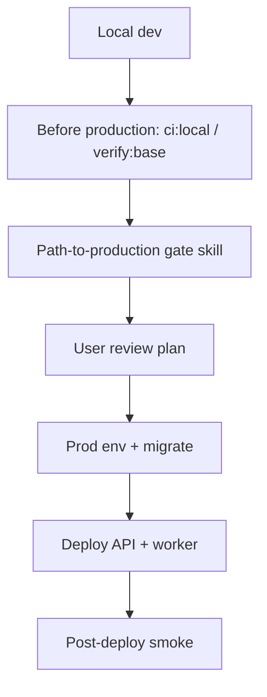
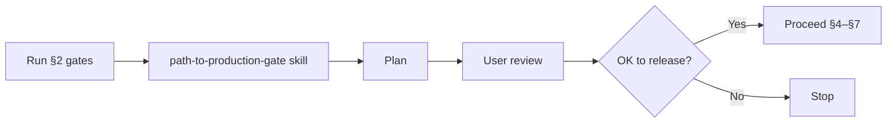

# Runbook: Development to Production

Single runbook from local development through production sign-off and deploy. **Local setup:** [SETUP.md](../../../SETUP.md). **CI/CD:** [cicd-and-deployment.md](../ci-cd/cicd-and-deployment.md).

---

## Flow overview



---

## 1. Local development

Follow **[SETUP.md § Local development](../../../SETUP.md#local-development)** — `.env`, `pnpm compose:up`, `pnpm db:migrate`, optional seed, `pnpm dev` + `pnpm dev:worker`.

---

## 2. Before promoting to production

Run on your machine with **local** `DATABASE_URL` (compose Postgres/Redis):

| Step                            | Command                                                                                                           | Purpose                                                 |
| ------------------------------- | ----------------------------------------------------------------------------------------------------------------- | ------------------------------------------------------- |
| **Full PR gate (recommended)**  | `pnpm ci:local`                                                                                                   | Same as CI: validate, domain, routes, docs, build, test |
| **Integration gate (optional)** | `pnpm compose:up && pnpm compose:wait` then `pnpm verify:base`                                                    | Migrate, seed, API smoke, validate                      |
| Lint + format + typecheck       | `pnpm validate`                                                                                                   | Code quality (included in `ci:local`)                   |
| Unit + integration + security   | `pnpm test`                                                                                                       | Regression (included in `ci:local`)                     |
| Domain structure                | `pnpm validate:domain:strict`                                                                                     | CI gate                                                 |
| Domain integration tests        | `pnpm validate:domain:coverage`                                                                                   | Each domain has e2e tests                               |
| OpenAPI in sync                 | `pnpm docs:check`                                                                                                 | When routes change                                      |
| Docker images                   | `pnpm docker:check-sync && pnpm docker:build`                                                                     | Match CI; see [docker-images.md](../docker-images.md)   |
| Production hardening            | [.cursor/skills/production-hardening-guard/SKILL.md](../../../.cursor/skills/production-hardening-guard/SKILL.md) | Security, DB, Redis, CORS, JWT, Sentry                  |

Do **not** run `verify:base`, `db:seed`, or `db:seed:full` against production `DATABASE_URL`.

Ensure CI runs the same (lint, typecheck, tests, Gitleaks, Semgrep, Docker build).

---

## 3. Path to production gate

Before any **release, deployment, or production sign-off**:

1. **Invoke the path-to-production-gate skill** — [`.cursor/skills/path-to-production-gate/SKILL.md`](../../../.cursor/skills/path-to-production-gate/SKILL.md)
2. The skill runs production-hardening + extra checks (TODOs, i18n, Stripe idempotency, RLS docs), **produces a plan**, and asks you to review it.
3. **Do not deploy** until you have reviewed and confirmed the plan.



---

## 4. Environment by stage

Sync with `.env.example`: `pnpm tool:sync-env-example`

### 4.1 Local vs production (summary)

> For the **dev / load-test → production delta** — which values are auto-rejected at boot vs. which
> the operator must set (e.g. `RATE_LIMIT_MAX`, `CAPTCHA_PROVIDER`, role caps, webhook allowlist) — see
> [environment-variables.md §11 — Production safety](./environment-variables.md#11-production-safety-unsafe-dev-and-load-test-values).

| Variable                                                           | Local / dev                                       | Production                                                                                  |
| ------------------------------------------------------------------ | ------------------------------------------------- | ------------------------------------------------------------------------------------------- |
| `NODE_ENV`                                                         | `local` or `development`                          | `production`                                                                                |
| `ALLOWED_ORIGINS`                                                  | e.g. `http://localhost:3000`                      | **Required.** Comma-separated allowed frontend origins                                      |
| `DATABASE_URL`                                                     | Compose or dev DB; SSL optional                   | Managed Postgres with TLS (`sslmode=require` or provider default)                           |
| `REDIS_URL`                                                        | Compose or dev Redis                              | Managed Redis (queues, rate limits, idempotency, permission cache)                          |
| `JWT_PRIVATE_KEY` / `JWT_PUBLIC_KEY`                               | RS256 PEM pair (via `pnpm setup:infra`)           | **Required** in every runtime — RS256 only                                                  |
| `JWT_SECRET`                                                       | Optional deprecated no-op (min 32 chars when set) | Optional; unused at runtime                                                                 |
| `SENTRY_DSN`                                                       | Optional                                          | Recommended; `SENTRY_ENVIRONMENT=production`                                                |
| `EMAIL_FROM_ADDRESS`                                               | Optional                                          | Verified sender domain                                                                      |
| `ENABLE_QUEUE_DASHBOARD`                                           | `true` if needed                                  | `false` unless network-restricted                                                           |
| `ENABLE_MCP_SERVER`                                                | `true` if needed locally                          | `false` unless network-restricted                                                           |
| `NODE_OPTIONS`                                                     | Typically unset                                   | `--max-old-space-size=<MiB>` — [resource-limits.md](resource-limits.md)                     |
| `DEPLOYMENT_TOTAL_REPLICA_COUNT`                                   | Unset (local defaults to 1 API + 1 worker)        | **Required.** `api_replicas + worker_replicas` on **both** API and worker services          |
| `DEPLOYMENT_API_REPLICA_COUNT` / `DEPLOYMENT_WORKER_REPLICA_COUNT` | Optional split counts                             | Alternative to `DEPLOYMENT_TOTAL_REPLICA_COUNT` when explicit API/worker counts are clearer |
| `DATABASE_POOL_MAX` / `POSTGRES_RESERVED_CONNECTIONS`              | Defaults (`10`)                                   | Tune pool size and headroom — [resource-limits.md](resource-limits.md)                      |
| `POSTGRES_MAX_CONNECTIONS`                                         | Unset (queries Postgres at startup)               | Set when provider `max_connections` differs from `SHOW max_connections`                     |

### 4.2 Production go-live checklist

Set on **both** API and worker services (Railway / K8s):

| Variable / setting                                                 | Production requirement                                                                          |
| ------------------------------------------------------------------ | ----------------------------------------------------------------------------------------------- |
| `NODE_ENV`                                                         | `production`                                                                                    |
| `ALLOWED_ORIGINS`                                                  | Comma-separated browser origins; empty fails CORS at startup                                    |
| `JWT_PRIVATE_KEY` / `JWT_PUBLIC_KEY`                               | RS256 key pair (required in every runtime per env schema)                                       |
| `DATABASE_URL`                                                     | Managed Postgres with TLS                                                                       |
| `REDIS_URL`                                                        | Managed Redis                                                                                   |
| `STRIPE_WEBHOOK_SECRET`                                            | Required when Stripe billing webhooks are enabled                                               |
| `GLOBAL_ADMIN_EMAILS`                                              | Comma-separated platform admin emails (JWT `super_admin` on login/refresh/OAuth/email verification-code/MFA) |
| `ENABLE_QUEUE_DASHBOARD`                                           | `false` unless network-restricted                                                               |
| `ENABLE_MCP_SERVER`                                                | `false` unless network-restricted                                                               |
| `ENABLE_RESPONSE_ENCRYPTION`                                       | If `true`, `RESPONSE_ENCRYPTION_KEY` must be set (encryption fails closed on error)             |
| `AUDIT_RETENTION_DAYS`                                             | Required in every runtime                                                                       |
| `AUTH_SESSION_RETENTION_DAYS`                                      | Required in every runtime                                                                       |
| `DEPLOYMENT_TOTAL_REPLICA_COUNT`                                   | **Required** — `api_replicas + worker_replicas` (same value on API and worker services)         |
| `DEPLOYMENT_API_REPLICA_COUNT` / `DEPLOYMENT_WORKER_REPLICA_COUNT` | Alternative split counts when not using `DEPLOYMENT_TOTAL_REPLICA_COUNT`                        |
| `DATABASE_POOL_MAX`                                                | Optional; default `10` — size with [resource-limits.md](resource-limits.md) connection budget   |

App images do **not** bundle Postgres or Redis — only `DATABASE_URL` / `REDIS_URL` point at managed services. See [docker-images.md](../docker-images.md).

### 4.3 OAuth go-live (optional — social login)

Code is ready for **Google** and **GitHub** when env vars are set ([credentials-and-env.md](../../integrations/credentials-and-env.md)). Without credentials, `GET /api/v1/auth/oauth/:provider` returns **501** (expected).

| Step | Action                                                                                                                             |
| ---- | ---------------------------------------------------------------------------------------------------------------------------------- |
| 1    | Create OAuth apps in Google Cloud Console / GitHub Developer settings                                                              |
| 2    | Set authorized redirect URIs to match `OAUTH_*_REDIRECT_URI` (or `${FRONTEND_URL}/auth/oauth/{provider}/callback` when unset)      |
| 3    | Copy `OAUTH_*` secrets into GitHub Environment → Railway API service variables                                                     |
| 4    | Set `FRONTEND_URL` to the deployed frontend origin per environment                                                                 |
| 5    | Smoke: `GET /api/v1/auth/oauth/providers` → **200**; `GET /api/v1/auth/oauth/google` → **302** (not 501) when Google is configured |
| 6    | Complete one browser callback per provider; verify session cookie + JWT                                                            |

---

## 5. Build and run (production)

1. **Build:** `pnpm build` (output `dist/`) or `docker build -t core-be .` (MCP docs generated in image build stage)
2. **Migrations (production DB):** `pnpm db:migrate` once per release — uses `DATABASE_MIGRATION_URL` if set, else `DATABASE_URL`. Run from a controlled job or shell; **no seeds** on production unless planned.
3. **API:** `node dist/server.js` (or API Docker image; `PORT`, `HOST`, `NODE_OPTIONS`)
4. **Worker:** `node dist/worker.js` (separate container; same `DATABASE_URL`, `REDIS_URL`, app secrets)
5. **Health:** `GET /livez` (liveness), `GET /readyz` (readiness)

---

## 6. Deploy (GitHub Actions + Railway)

**[cicd-and-deployment.md §5–§8](../ci-cd/cicd-and-deployment.md#5-deploy-flow-per-environment)** — branch mapping, tokens, first-time setup.

| Branch | Workflow                                                                                 | GitHub environment |
| ------ | ---------------------------------------------------------------------------------------- | ------------------ |
| `dev`  | [reusable-railway-deploy.yml](../../../.github/workflows/reusable-railway-deploy.yml) (after CI on `dev`)  | `development`      |
| `main` | [reusable-railway-deploy.yml](../../../.github/workflows/reusable-railway-deploy.yml) (after CI on `main`) | `production`       |

`reusable-railway-deploy.yml` runs migrations, syncs shared Railway variables, deploys both API and worker services, and performs post-deploy health checks. Optional integration env (`RESEND_*`, `STRIPE_*`, etc.) still needs to be configured on Railway or added to the CD variable loop.

Deploy **two** services: API (`Dockerfile` / `api` target) and worker (`Dockerfile.worker`). Each service exposes `GET /livez` (liveness) and `GET /readyz` (readiness).

---

## 7. Post-deploy smoke

Replace the host with your production API URL:

```bash
curl -sf https://YOUR_API/readyz
```

Ready response should show `"database":"connected"`, `"redis":"connected"`, `"bullmq":"connected"`.

**Monitoring (first 24h):** [observability.md](observability.md) — Sentry, Pino logs, idempotency cardinality job.

**Rollback:** redeploy previous API + worker image tags; DB rollback via provider PITR only (migrations are forward-only).

---

## Quick reference

| Stage          | Action                                                                      |
| -------------- | --------------------------------------------------------------------------- |
| Local          | [SETUP.md](../../../SETUP.md) — `pnpm dev` + `pnpm dev:worker` |
| Before release | `pnpm ci:local` → **path-to-production-gate** skill → user confirms plan    |
| Prod env       | §4.2 checklist on API + worker                                              |
| Prod migrate   | `pnpm db:migrate` (prod `DATABASE_URL` only; no seed)                       |
| Hosted deploy  | Merge to `dev` / `main` → deploy workflow                                   |
| After deploy   | §7 health smoke + Sentry                                                    |

---

## Idempotency cache cardinality (Redis)

The worker runs a **bounded** `SCAN` over logical keys matching `idempotency:*` (TTL on each key remains **24 hours**). When the observed count crosses `IDEMPOTENCY_CARDINALITY_WARN_THRESHOLD` or `IDEMPOTENCY_CARDINALITY_CRITICAL_THRESHOLD`, Pino logs and Sentry receive alerts (if `SENTRY_DSN` is set).

**Tune:** `IDEMPOTENCY_CARDINALITY_SCAN_MAX`, thresholds, or `IDEMPOTENCY_CARDINALITY_CRON` in env. **Observability:** [observability.md](observability.md).

**Remediate:** identify abusive clients; scale Redis; use `noeviction` in production (see production-hardening checklist).

### Redis eviction policy (pre-production checklist)

Before go-live, confirm the managed Redis instance (Railway Redis database, Redis Cloud, etc.):

1. **`maxmemory-policy` is `noeviction`** — not `allkeys-lru` or `volatile-lru`. Eviction can drop `idempotency:*` keys and weaken HTTP deduplication.
2. **Memory alert** — alert when Redis memory exceeds ~80% of plan limit.
3. **Idempotency cardinality worker** — `IDEMPOTENCY_CARDINALITY_*` thresholds are set; worker logs `idempotency.cache.cardinality.high` / `.critical` to Sentry when configured.

## Dead-letter queue depth

The worker samples each `*-dlq` queue every 15 minutes (configurable via `DLQ_DEPTH_CRON`). When **waiting + failed** jobs exceed `DLQ_DEPTH_WARN_THRESHOLD` (default **10**), logs emit `queue.dlq.depth.high` and Sentry receives a warning. Inspect queues in Bull Board — see [bull-board.md](../../reference/runtime/bull-board.md).

## Staging deploy verification (shutdown + migrate)

Run once per release candidate on the staging environment:

1. **Migrate** — `DATABASE_MIGRATION_URL=... pnpm db:migrate` (or `pnpm db:migrate:dry-run` against a disposable DB restored from schema snapshot).
2. **Deploy** API + worker; confirm `GET /readyz` returns `ok` for database, redis, and bullmq.
3. **Smoke** — `pnpm test:api-smoke` against staging base URL (or minimal billing/auth checks).
4. **Drain** — send `SIGTERM` to API; confirm `/readyz` returns `503` with `status: "draining"` while `/livez` stays `200` until exit (see [resource-limits.md](resource-limits.md)).
5. **Worker** — restart worker; confirm BullMQ schedulers register (stripe-webhook, DLQ depth, idempotency cardinality in logs).
