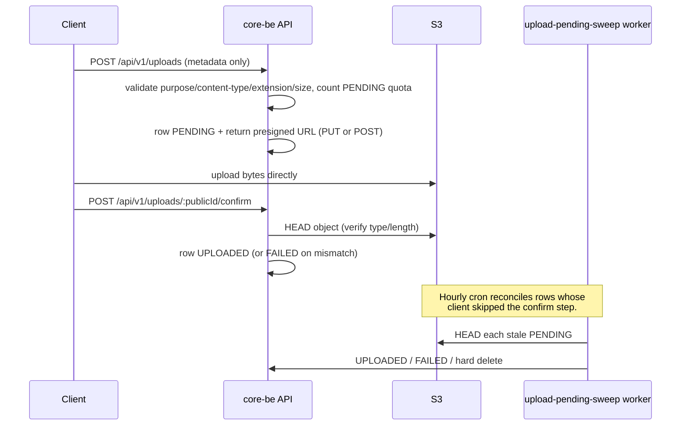

# Upload storage runbook

How the direct-to-S3 upload flow is hardened in production: server-side validation, presigned POST, the orphan-PENDING sweeper, per-user quota, and the S3 bucket lifecycle policy that bounds storage cost when other safeguards regress.

## Flow at a glance



The API never receives the file bytes — only the metadata, then the confirm event after the client has uploaded directly to S3.

## Server-side validation (per upload create)

Applied in [src/domains/upload/upload.validator.ts](../../../src/domains/upload/upload.validator.ts) before the presigned URL is signed:

| Check                  | Behavior                                                                                                                                                                                                                              |
| ---------------------- | ------------------------------------------------------------------------------------------------------------------------------------------------------------------------------------------------------------------------------------- |
| Purpose                | Must be one of the four `UPLOAD_PURPOSES` values (avatar, organization-logo, user-file, organization-file).                                                                                                                           |
| Content type           | Must be in the purpose allowlist (`UPLOAD_PURPOSE_CONFIG[purpose].allowedTypes`). `image/svg+xml` is gated by `UPLOAD_ALLOW_SVG`.                                                                                                     |
| Filename extension     | Must match the declared content type via `CONTENT_TYPE_TO_EXTENSIONS` (e.g. `image/png` → `.png`). Filenames without an extension are allowed. Prevents misleading filenames such as `evil.exe` paired with `contentType: image/png`. |
| File size              | Must be `> 0` and `<= UPLOAD_PURPOSE_CONFIG[purpose].maxSize`.                                                                                                                                                                        |
| Ownership              | `for: 'user'` rejects `organizationId`; `for: 'organization'` requires `organizationId` and `upload:manage` permission on that organization.                                                                                          |
| Per-user PENDING quota | Enforced **atomically** in `UploadService.reservePendingUploadSlot`: inside one `withUserDatabaseContext` transaction it takes a per-user `pg_advisory_xact_lock` (namespace `UPLOAD_PENDING_QUOTA_ADVISORY_LOCK_NAMESPACE` + user internal id), checks `countPendingByUserId(user.id) < UPLOAD_MAX_PENDING_PER_USER` (default 100), then inserts the PENDING row. The presigned URL is minted **only after** the slot commits, so concurrent create-upload requests can never over-provision presigned slots beyond the quota. Stops a single authed user from looping create-without-confirm and exhausting storage. Reconciled by the sweeper (see below). |

## Presigned PUT vs presigned POST

`UPLOAD_USE_PRESIGNED_POST` (default `true`) selects the upload mechanism:

| Mode           | Pros                                                                                                                                             | Notes                                                                                                                               |
| -------------- | ------------------------------------------------------------------------------------------------------------------------------------------------ | ----------------------------------------------------------------------------------------------------------------------------------- |
| Presigned PUT  | Simplest client integration; signed `Content-Type` + `Content-Length`.                                                                           | S3 enforces the signed headers, but the client may omit `Content-Length` on some HTTP stacks and still upload via chunked encoding. |
| Presigned POST | S3 enforces a `content-length-range` policy condition and explicit `eq` on `$Content-Type`; ideal for browser uploads via `multipart/form-data`. | Response carries `uploadMethod: 'POST'` plus `fields` the client must submit alongside the file.                                    |

**Production default:** leave `UPLOAD_USE_PRESIGNED_POST=true` unless a client compatibility rollback is needed. If you must fall back to presigned PUT temporarily, update the value via `pnpm github:sync <environment>` and file a follow-up to restore POST once clients consume the discriminated upload response. See [environment-variables.md](environment-variables.md) for the sync workflow.

## Confirm and attach gate

`POST /api/v1/uploads/:publicId/confirm` runs:

1. `HEAD` the S3 object via the storage port.
2. Compare reported `Content-Length` and (when present) `Content-Type` with the declared values.
3. Mark the row `UPLOADED` on a match, `FAILED` on a mismatch; either way the row stops being PENDING.

`UploadService.assertKeyConfirmed(fileKey)` is called by avatar / organization-logo attach paths and refuses any key that is not in `UPLOADED` status. **Never** add a consumer that attaches an upload key without going through this gate.

## PENDING sweeper (orphan reconciliation)

Hourly BullMQ repeatable, defined in [src/domains/upload/workers/upload-pending-sweep.worker.ts](../../../src/domains/upload/workers/upload-pending-sweep.worker.ts) and scheduled from [src/infrastructure/queue/scheduler.ts](../../../src/infrastructure/queue/scheduler.ts). Cron pattern: `UPLOAD_PENDING_SWEEP_CRON` (default `15 * * * *`).

For each PENDING row older than `PRESIGNED_URL_EXPIRY_SECONDS + UPLOAD_PENDING_SWEEP_GRACE_SECONDS` (default 15 min + 1 h = 75 minutes):

| Verdict        | Trigger                                                                                           | Action                                                 |
| -------------- | ------------------------------------------------------------------------------------------------- | ------------------------------------------------------ |
| `auto_confirm` | S3 `HEAD` succeeds **and** reported `Content-Length` equals `file_size` (and type when reported). | `UPDATE uploads SET status='UPLOADED'`                 |
| `fail`         | S3 `HEAD` succeeds but metadata does not match.                                                   | `UPDATE uploads SET status='FAILED'`                   |
| `orphan`       | S3 `HEAD` returns `null` (object missing or HEAD failed).                                         | Idempotent `deleteObject`, then `DELETE FROM uploads`. |

Log lines for ops:

- `upload-pending-sweep.starting` — start of a sweep (cutoff + counts).
- `upload-pending-sweep.autoConfirmed` — per row that was promoted to `UPLOADED`.
- `upload-pending-sweep.metadataMismatch` — per row demoted to `FAILED`.
- `upload-pending-sweep.s3DeleteFailed` — best-effort S3 delete on an orphan returned `false`; the DB row is still hard-deleted.
- `upload-pending-sweep.completed` — final counts (`scannedCount`, `autoConfirmedCount`, `failedCount`, `deletedCount`).

Worker context: runs under `withGlobalRetentionCleanupDatabaseContext`, so the RLS tenant policy on `upload.uploads` is satisfied without per-tenant fan-out.

## S3 bucket lifecycle policy (defense in depth)

Server-side controls cap **how much** a single user can upload, but the bucket lifecycle is the last line of defense against orphaned bytes when code regresses or when an outage prevents the sweeper from running. Apply a lifecycle rule per upload prefix:

```text
Prefix:          avatars/
                 organization-logos/
                 user-files/
                 organization-files/
Action:          Expire current versions after N days (suggested: 7)
Filter:          Object Tag "confirmed" != "true"  (when supported by the bucket configuration)
```

A future iteration will set an `x-amz-meta-confirmed=true` tag on `confirmUpload`, so the lifecycle can target unconfirmed objects only. Until then, scope the lifecycle rule conservatively (longer TTL, or smaller scope) so confirmed objects are not affected.

Additional bucket hardening:

- Public access block enabled (Block all public access).
- Server-side encryption (`AES256` or KMS) default.
- CORS allows `PUT`/`POST` from the API client origin only; `*` is acceptable for development only.

## Configuration reference

| Variable                             | Default      | Purpose                                                                                                                         |
| ------------------------------------ | ------------ | ------------------------------------------------------------------------------------------------------------------------------- |
| `S3_BUCKET`                          | *required*   | Object storage bucket name.                                                                                                     |
| `S3_REGION`                          | `us-east-1`  | AWS region.                                                                                                                     |
| `S3_MAX_ATTEMPTS`                    | `3`          | AWS SDK retry attempts.                                                                                                         |
| `UPLOAD_USE_PRESIGNED_POST`          | `true`       | When `true`, return a presigned POST with `content-length-range` instead of a presigned PUT URL.                                |
| `UPLOAD_ALLOW_SVG`                   | `false`      | Allow `image/svg+xml` uploads (sanitized via DOMPurify on confirm).                                                             |
| `UPLOAD_MAX_PENDING_PER_USER`        | `100`        | Per-user cap on concurrent PENDING uploads. New `createUpload` calls return `400 errors:uploadPendingQuotaExceeded` at the cap. |
| `UPLOAD_PENDING_SWEEP_CRON`          | `15 * * * *` | Cron pattern for the PENDING sweeper.                                                                                           |
| `UPLOAD_PENDING_SWEEP_GRACE_SECONDS` | `3600`       | Extra seconds beyond presigned URL expiry before a PENDING row becomes eligible for sweeping.                                   |
| `UPLOAD_TOMBSTONE_RETENTION_CRON`    | `52 5 * * *` | Cron for hard-deleting soft-deleted uploads after `TOMBSTONE_RETENTION_DAYS`.                                                   |
| `TOMBSTONE_RETENTION_DAYS`           | `90`         | TTL for soft-deleted upload rows (and their S3 objects).                                                                        |

## Troubleshooting

| Symptom                                                   | First checks                                                                                                                                                                                                          |
| --------------------------------------------------------- | --------------------------------------------------------------------------------------------------------------------------------------------------------------------------------------------------------------------- |
| Many uploads stuck in `PENDING`                           | Inspect sweeper logs (`upload-pending-sweep.completed`); verify the worker process is running and the scheduler is enabled (`SCHEDULER_ENABLED=true`).                                                                |
| Client reports `400 errors:uploadPendingQuotaExceeded`    | Expected when a buggy or malicious client loops `createUpload` without `confirmUpload`. Increase `UPLOAD_MAX_PENDING_PER_USER` only after confirming the workload is legitimate; otherwise let the sweeper reconcile. |
| `confirmUpload` returns `errors:uploadVerificationFailed` | S3 `HEAD` returned a content type or length that does not match what the client declared. Verify the client actually uploaded to the returned key/method and did not strip the `Content-Type` header.                 |
| Lifecycle policy deleted a recently confirmed object      | Lifecycle scope is too aggressive — verify the rule excludes objects with `x-amz-meta-confirmed=true` (or extend the TTL) before re-enabling.                                                                         |
| `s3.headObject.failed` / `s3.deleteObject.failed` in logs | S3 outage or IAM regression. Circuit breaker (`s3Circuit`) will short-circuit further calls. Investigate via AWS console or the contract test (`pnpm test:contract -- s3-object-storage-adapter`).                    |
