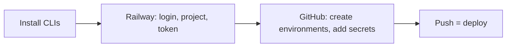

# Full setup via CLI (Railway + GitHub)

Follow this document **top to bottom** for manual setup. For automated one-command provisioning, use [setup-automation.md](setup-automation.md) (`pnpm setup:infra`) instead.

---

## Flow overview



1. Install CLIs (Railway + GitHub)
2. Railway: login → create project + service → get service ID → get project token (dashboard)
3. GitHub: create environments (development, production) → add secrets to each
4. Done → push to dev/main to deploy

---

## What you need before starting

- **Railway account** (sign up at [railway.app](https://railway.app) if needed).
- **GitHub repo** for core-be.
- **Local `.env`** with at least `DATABASE_URL`, `REDIS_URL`, `JWT_PRIVATE_KEY`, `JWT_PUBLIC_KEY`, `ALLOWED_ORIGINS` (see [.env.example](../../../.env.example)). You will add these to GitHub environment secrets.

---

## Step 1: Install CLIs (Railway, GitHub)

```bash
npm i -g @railway/cli
# or: brew install railway

brew install gh

railway --version
gh --version
```

---

## Step 2: Railway — project, service, and token

### 2.1 Login (one-time; opens browser)

```bash
cd /path/to/core-be
railway login
```

### 2.2 Create project and service

```bash
railway init
railway add
railway status --json   # copy service ID
```

### 2.3 Create project token (dashboard)

Railway → Your project → Settings → Tokens → Create token. Copy it; you will add it to GitHub.

---

## Step 3: GitHub — environments and secrets

### 3.1 Create environments

Repo → Settings → Environments → New environment. Create **development** and **production**.

### 3.2 Add secrets to each environment

For each environment (development, production), add Environment secrets:

| Secret name          | Value                                             |
| -------------------- | ------------------------------------------------- |
| RAILWAY_TOKEN        | From Railway (step 2.3)                           |
| RAILWAY_SERVICE_ID   | Service ID for that environment                   |
| DATABASE_URL         | Postgres connection string                        |
| REDIS_URL            | Redis connection string                           |
| JWT_PRIVATE_KEY      | RS256 PEM private key                             |
| JWT_PUBLIC_KEY       | RS256 PEM public key                              |
| JWT_SECRET           | Optional deprecated no-op (min 32 chars when set) |
| ALLOWED_ORIGINS      | Comma-separated frontend origins                  |
| NODE_ENV             | development or production                         |
| PORT                 | 3000                                              |
| HOST                 | 0.0.0.0                                           |
| LOG_LEVEL            | debug or info                                     |
| FRONTEND_URL         | Frontend URL for that env                         |
| RATE_LIMIT_MAX       | 10000 (development), 100 (production)             |
| RATE_LIMIT_WINDOW_MS | 60000                                             |

### 3.3 Via CLI (optional)

```bash
gh auth login
gh secret set RAILWAY_TOKEN --env development --body "paste-token"
gh secret set RAILWAY_SERVICE_ID --env development --body "paste-service-id"
gh secret set DATABASE_URL --env development --body "postgresql://..."
# etc.
```

---

## Step 4: Push to deploy

Push to **dev** or **main**. The deploy workflow uses the corresponding GitHub environment (development, production) and deploys to Railway.

---

## Rotating an invalid or expired Railway token

The `Deploy` job in [reusable-railway-deploy.yml](../../../.github/workflows/reusable-railway-deploy.yml) runs `railway whoami` during preflight. If `RAILWAY_TOKEN` is missing, revoked, expired, or scoped to a different project, the step fails before any database migrations or `railway variable set` calls with:

```text
Railway rejected RAILWAY_TOKEN for GitHub Environment '<env>': Invalid RAILWAY_TOKEN. ...
```

To recover:

1. **Mint a new project token** — Railway → Project → Settings → Tokens → Create token. Pick the project that matches the GitHub Environment (`development` or `production`).
2. **Update the GitHub Environment secret**:

   ```bash
   gh secret set RAILWAY_TOKEN --env development --body "paste-new-token"
   # or for production
   gh secret set RAILWAY_TOKEN --env production --body "paste-new-token"
   ```

   Or push from the local env file via `pnpm github:sync <environment>`.

3. **Re-run the failed `Deploy` job** from the Actions tab. The preflight will pass once `railway whoami` succeeds with the new token.

If the token authenticates but a later step still fails with permission errors, confirm `RAILWAY_SERVICE_ID` / `RAILWAY_WORKER_SERVICE_ID` belong to the same project the token is scoped to.

---

## See Also

- [setup-automation.md](setup-automation.md) — Automated provisioning (recommended)
- [cicd-and-deployment.md](../ci-cd/cicd-and-deployment.md) — Full CI/CD reference
