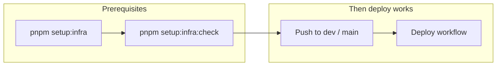

# Setup Automation (One-Command Provisioning)

One-command infrastructure setup that provisions Neon, Redis Cloud, AWS S3, Sentry, Railway, GitHub secrets, and more across multiple environments (development, production). Includes double confirmation, pre-existence checks, and atomic rollback on failure.

**Config:** `tooling/setup/setup.config.json` (committed). **Secrets:** `.env.setup` at project root (env-style, gitignored); each variable has a comment with the URL to get the key.

---

## Infrastructure before auto-deploy

**Auto-deploy needs this infra in place first.** Deploy workflows (push to dev/main) expect GitHub environment secrets, Railway services, Postgres, and Redis to exist. Run infrastructure setup before relying on CI/CD deploy.

---

## Commands

| Command                             | Description                                                                                                                                                                                                                                                                                                                                                                        |
| ----------------------------------- | ---------------------------------------------------------------------------------------------------------------------------------------------------------------------------------------------------------------------------------------------------------------------------------------------------------------------------------------------------------------------------------- |
| `pnpm setup --init`                 | **Optional first step** — interactive: ask organization, project name, environments → generate `setup.config.json` and a `.env.setup` template. No JSON editing.                                                                                                                                                                                                                   |
| `pnpm setup:infra`                  | **Run first** (after init and filling secrets) — full provisioning. Fill `.env.setup` (each line has a comment with the URL to get the key). Creates all resources (Neon, Redis, S3, Sentry, Railway, GitHub). Double confirmation, pre-existence check, atomic rollback on failure. Required before auto-deploy works.                                                            |
| `pnpm setup:infra:check`            | Health check. Verifies all provisioned resources are reachable. Run after setup or when debugging.                                                                                                                                                                                                                                                                                 |
| `pnpm setup:infra:status`           | Status report. Reads `.setup-state.json` and shows what is provisioned vs missing per environment. No API calls.                                                                                                                                                                                                                                                                   |
| `pnpm setup:infra:update`           | Re-sync GitHub branches, rulesets, environments, and secrets from `.env.setup`. Use after rotating a key.                                                                                                                                                                                                                                                                          |
| `pnpm github:sync`                  | Full GitHub sync: consistency + scaffold + branches + rulesets + environments + push each local `.env.<environment>` (typed `sync` confirmation before values). Add an environment name to limit the values push.                                                                                                                                                                  |
| `pnpm github:sync --check`          | Read-only: cross-dimension consistency + remote drift report (no writes).                                                                                                                                                                                                                                                                                                          |
| `pnpm github:sync:dry-run`          | Preview full sync without writing.                                                                                                                                                                                                                                                                                                                                                 |
| `pnpm setup:infra:delete`           | Print a manual-delete guide: dashboard URLs and resource identifiers (from `.setup-state.json`) for every provider that has provisioned state. **The script never deletes resources** — open each dashboard and remove items by hand, then delete the matching entries in `tooling/setup/.setup-state.json`. `setup:infra:revert` is kept as a back-compat alias for this command. |
| `pnpm setup:infra:export-env`       | Write `.env.<environment>` files (e.g. `.env.development`, `.env.production`) from current state. Use these to push secrets to GitHub Environment secrets. Run after provisioning or anytime to regenerate.                                                                                                                                                                        |
| `pnpm validate:github-environments` | Drift check: compare `.github/environments/*.json` (required reviewers, branch policy) vs GitHub API. Requires `gh auth login`. Use `--check` explicitly or via this script.                                                                                                                                                                                                       |
| `pnpm validate:github-env`          | Drift check **plus** validate GitHub environment secrets (all variables from `.env.example`). Uses `CONFIG` (default: `development`). Run with `CONFIG=production` per branch. `SKIP_GITHUB_ENV=1` skips GitHub API calls.                                                                                                                                                         |
| `pnpm setup:push-retention-secrets` | Set `AUDIT_RETENTION_DAYS` and `AUTH_SESSION_RETENTION_DAYS` on GitHub environments (development, production). Requires `gh auth login`. Optional `CONFIG=development`; override days via env vars.                                                                                                                                                                                |

---

## Flow

1. **Config:** Run `pnpm setup --init` (asks org, project, envs → writes `setup.config.json`) **or** edit `tooling/setup/setup.config.json` by hand.
2. **Secrets:** Fill `.env.setup` (each variable has a comment with the URL to get the key). Run `pnpm setup:infra`; browser can open for each provider — paste values into `.env.setup`.
3. Settings review appears; confirm twice.
4. Pre-existence check runs; if any resource already exists, abort and use `pnpm setup:infra:delete` to view the dashboard URLs, then delete the conflicting items by hand before re-running.
5. Provisioning runs sequentially. **On failure, no rollback is performed** — the run stops, partial state is saved, and `pnpm setup:infra:delete` shows what was created so you can clean it up manually.
6. Migrations and seed are not run by `setup:infra` — they are handled by the Continuous Deployment pipeline.
7. **Environment files:** Setup writes `.env.<environment>` (e.g. `.env.development`, `.env.production`) at project root. Each file contains the same keys as `.env.example`, filled with values for that environment. Use them to push secrets to GitHub Environment secrets (e.g. `gh secret set NAME --env development --body-file .env.development` or set each key manually). These files are gitignored (`.env.*`); do not commit them.

---

## Environment files (`.env.<environment>`)

After `pnpm setup:infra` completes, it writes one file per environment: `.env.development`, `.env.production`, etc. (matching the `environments` in `setup.config.json`). Each file has the same structure and key order as `.env.example`, so you can:

- **Push to GitHub:** Set GitHub Environment secrets from the file (e.g. for `development`: use `.env.development` to set each variable in GitHub → Settings → Environments → development → Environment secrets).
- **Regenerate anytime:** Run `pnpm setup:infra:export-env` to regenerate all `.env.<environment>` files from current `setup.config.json`, `.env.setup`, and `.setup-state.json`.

Do not commit these files (they contain secrets); `.env.*` is in `.gitignore` (except `.env.example`).

---

## Environment Variables (for validate:github-env)

| Variable | Purpose                                                                                                                                                                    |
| -------- | -------------------------------------------------------------------------------------------------------------------------------------------------------------------------- |
| `CONFIG` | Environment to validate (full name preferred — `development`, `production`; aliases `dev`/`prod` are accepted and resolve to the same full names). Default: `development`. |

---

## Design (env-first, env-style secrets)

> Former standalone `setup-interactive-design.md` — content lives in this section and [setup-token-instructions.md](setup-token-instructions.md).

- **Environments first:** `pnpm setup --init` asks org, project, and environments → writes `setup.config.json` (no hand-editing JSON).
- **Secrets:** `.env.setup` at repo root (`KEY=value`, comments with URLs). `process.env` is merged so `NEON_API_KEY=... pnpm setup:infra` works.
- **Tools:** One API key per provider (or CLI auth where supported); the script maps env vars to Neon, Redis, AWS, Railway, etc.

| Command                    | Purpose                                             |
| -------------------------- | --------------------------------------------------- |
| `pnpm setup --init`        | Interactive config + optional `.env.setup` template |
| `pnpm setup:infra:preview` | Show providers and where to get tokens              |

---

## See also

- [setup-token-instructions.md](setup-token-instructions.md) — Where to get each token; env var names for `.env.setup`
- [cicd-and-deployment.md](../ci-cd/cicd-and-deployment.md) — CI/CD pipeline, tokens, deploy flow
- [integrations/credentials-and-env.md](../../integrations/credentials-and-env.md) — How to obtain provider credentials
- [railway-github-cli-setup.md](railway-github-cli-setup.md) — Manual Railway + GitHub setup (alternative to automated setup)
