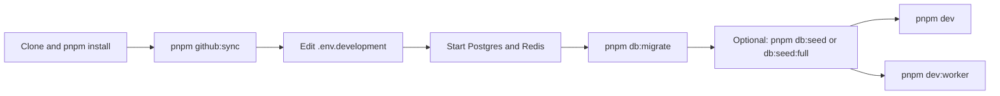

# Setup Guide (core-be)

Single reference for local setup, Git workflow, and testing. **Want one document to set everything up via CLI?** → [railway-github-cli-setup.md](../deployment/setup/railway-github-cli-setup.md) (follow top to bottom). **CI/CD, deployment, and tokens:** [cicd-and-deployment.md](../deployment/ci-cd/cicd-and-deployment.md). **GitHub branch protection / required CI checks:** [branch-protection.md](../deployment/ci-cd/branch-protection.md). See also [README.md](../../README.md), [runbook-dev-to-production.md](../deployment/runbooks/runbook-dev-to-production.md), [load-testing.md](../reference/testing/load-testing.md), [credentials-and-env.md](../integrations/credentials-and-env.md), [understand-anything.md](../integrations/understand-anything.md) (codebase knowledge graph and learning curve), and [codegraph.md](../integrations/codegraph.md) (semantic code index for AI agents, auto-set-up by `setup:local`).

---

## Prerequisites

- **Node.js 24** (supported range is in root `package.json` → `engines.node`; **`.nvmrc`** pins major `24` for **GitHub Actions** and for **nvm** / **fnm** when you run `use` / `install` in the repo root)
- **pnpm**
- **PostgreSQL** — managed service (e.g. Supabase, Neon, AWS RDS, Railway) or local
- **Redis** — managed service (Railway Redis by default — Railway's `redis` database template — or AWS ElastiCache, Redis Cloud) or local
- **Docker** (optional) — for local Postgres + Redis via `pnpm compose:up`

**Switch your shell to Node 24** (pick what you use locally; the repo does not enforce one manager over another):

| Tool                             | Typical command                                                                                                                                                                                                                                                           |
| -------------------------------- | ------------------------------------------------------------------------------------------------------------------------------------------------------------------------------------------------------------------------------------------------------------------------- |
| **[n](https://github.com/tj/n)** | **`n 24`** installs a Node 24 line build; open a **new terminal** and check `node -v` (should satisfy `engines`). With a recent `n`, **`n auto`** from the repo root can follow **`package.json`** `engines` (and some setups honor **`.nvmrc`**); if unsure, use `n 24`. |
| **nvm**                          | `nvm install` then `nvm use` (reads `.nvmrc`).                                                                                                                                                                                                                            |
| **fnm**                          | `fnm install` then `fnm use` (reads `.nvmrc` when `use-on-cd` / default is set).                                                                                                                                                                                          |
| **Volta**                        | `volta install node@24`                                                                                                                                                                                                                                                   |

---

## 1. Local development setup



### 1.1 Clone and install

```bash
git clone <repo-url>
cd core-be
pnpm install
```

### 1.2 Environment variables

Env files live at **project root only**. There is exactly one committed
template — `.env.example` — and one gitignored file per environment created
from `.github/sync.config.json` by `pnpm github:sync`:

```bash
pnpm github:sync                    # creates missing .env.<environment> files
$EDITOR .env.development            # fill in real values
```

`.env.example` is split into two top-level halves (`# GitHub Secrets ###`,
`# GitHub Variables ###`). The section a key sits in IS its classification —
`pnpm github:sync <environment>` later pushes each half to the matching GitHub
Environment via `gh secret set` or `gh api .../variables`. See
[environment-variables.md](../deployment/runbooks/environment-variables.md)
for the full lifecycle, and [credentials-and-env.md](../integrations/credentials-and-env.md)
for per-provider credential acquisition.

Set at least: **DATABASE_URL**, **REDIS_URL**, **JWT_PRIVATE_KEY** /
**JWT_PUBLIC_KEY** (RS256 PEM pair), **SECRETS_ENCRYPTION_KEY** (64 hex chars).
`JWT_SECRET` is optional and unused at runtime (deprecated deploy-template no-op). The runtime loader
(`src/shared/config/load-env-files.ts`) reads `.env.${NODE_ENV}` — defaults
to `.env.development` when `NODE_ENV` is unset, with a safety-net fallback
to `.env.development` for `NODE_ENV=test`. After that, **`.env.local`** is
applied as an `override=true` overlay (non-production only) so a developer can
point `DATABASE_URL` / `REDIS_URL` at their local Docker Compose stack without
editing `.env.development` (which `pnpm github:sync` keeps aligned with the
hosted environment).

| File                 | Status         | Purpose                                                                             |
| -------------------- | -------------- | ----------------------------------------------------------------------------------- |
| `.env.example`       | committed      | Single template; every schema key lives here under the right half + sub-section.    |
| `.env.local.example` | committed      | Template for the optional local override; copy to `.env.local` for local Docker.    |
| `.env.development`   | **gitignored** | Local + dev-environment values; source of truth for `pnpm github:sync development`. |
| `.env.production`    | **gitignored** | Production values; source of truth for `pnpm github:sync production`.               |
| `.env.local`         | **gitignored** | Machine-specific override; wins over `.env.<NODE_ENV>` for local dev only.          |

### 1.3 Database and Redis

Start Postgres and Redis (e.g. Docker):

```bash
pnpm compose:up
```

Wait until Postgres accepts connections (exits **non-zero** if the service never starts or stays unhealthy — avoids silent failure before migrate):

```bash
pnpm compose:wait
```

Optional env: `WAIT_FOR_POSTGRES_ATTEMPTS` (default `60`), `WAIT_FOR_POSTGRES_INTERVAL_SECONDS` (default `1`).

Apply migrations:

```bash
pnpm db:migrate
```

Optional seed:

```bash
pnpm db:seed        # minimal
pnpm db:seed:full  # full demo (e.g. demo@example.com / DemoPassword123!)
```

For manual API checks after full seed, see **[api-testing.md](api-testing.md)** (`pnpm verify:base` for migrate → seeds → smoke → validate, or `pnpm test:api-smoke` alone; run `pnpm db:seed:sync-demo` after permission changes).

### 1.4 Run API and worker

Two terminals:

```bash
pnpm dev            # API at http://localhost:3000
pnpm dev:worker     # BullMQ workers (mail, webhook, notification, retention)
```

Typical local `.env`: `NODE_ENV=local`, `LOG_LEVEL=debug`, `ALLOWED_ORIGINS=http://localhost:3000`.

---

## 2. Git workflow and branch strategy

Long-lived branches: **`dev`** → **`main`**. Short-lived branches use `feature/`, `fix/`, `hotfix/`, etc. (from `dev`, except hotfixes from `main`).

**Full detail** (branch naming, PR flow, hotfixes, protected branches): **[git-workflow.md](../process/git-workflow.md)**.

---

## 3. Testing (when to run each)

**Where tests live:** Cross-cutting Vitest under `src/tests/`; domain tests under `src/domains/<domain>/__tests__/` (bundled e2e, unit, factories); sub-domain and **nested** sub-domain tests under `src/domains/<domain>/sub-domains/.../__tests__/` and `events/__tests__/`. See **CLAUDE.md** § Testing and `docs/reference/architecture/domains-and-public-api-design.md` §1.5. k6: `src/tests/load/k6/` — `pnpm load:*`.

| Category                 | Command                                 | When to run                                                                                                                                          |
| ------------------------ | --------------------------------------- | ---------------------------------------------------------------------------------------------------------------------------------------------------- |
| **Contract (outbound)**  | `pnpm test:contract`                    | nock-mocked Stripe / Resend / S3; no DB; runs in CI **quality** job. Excluded from default `pnpm test`.                                              |
| **Unit**                 | `pnpm test:unit`                        | Fast feedback before commit. Full `pnpm test` needs Postgres + Redis.                                                                                |
| **Integration**          | `pnpm test:integration`                 | Before pushing; requires Postgres + Redis. CI runs full suite.                                                                                       |
| **E2E / domain**         | `pnpm test:e2e`                         | Full domain flows; run with `pnpm test`. CI runs as part of `pnpm test:coverage`.                                                                    |
| **Security**             | `pnpm test:security`                    | Auth, JWT, CORS, Helmet, rate-limiting, idempotency, input validation. Before release; CI includes it.                                               |
| **Performance**          | `pnpm test:performance`                 | N+1 and concurrent-request tests. When changing queries or concurrency.                                                                              |
| **Smoke (health)**       | `pnpm load:health` or `pnpm test:bench` | Quick sanity after deploy or locally. Server running; no auth.                                                                                       |
| **Smoke (auth)**         | `pnpm load:auth`                        | Login + profile + list orgs (demo credentials). Requires server + full seed.                                                                         |
| **Load (health stress)** | `pnpm load:stress`                      | Up to 100 VUs on health endpoints. Before release or after infra changes.                                                                            |
| **Load (API stress)**    | `pnpm load:stress:api`                  | Key API routes under load. Needs `TEST_TOKEN` + `TEST_ORG_ID` (`pnpm tool:load-test-credentials`). Use `pnpm dev:loadtest` to avoid rate-limit 429s. |

**When to run:**

- Before commit → `pnpm validate && pnpm test:unit`
- Before PR → `pnpm validate && pnpm test`
- Before release → add `pnpm test:security`, `pnpm load:stress` (and optionally `pnpm load:stress:api`)
- After deploy → smoke (`pnpm load:health` or hit `/readyz`)

Full k6 scenarios: [load-testing.md](../reference/testing/load-testing.md) and [src/tests/load/k6/README.md](../../src/tests/load/k6/README.md).

---

## 4. CI/CD, deployment, and tokens

**All in one place:** [cicd-and-deployment.md](../deployment/ci-cd/cicd-and-deployment.md)

That document includes:

- What runs in CI (quality, test, API smoke, security, chaos, Docker, docs, PR checks)
- Branch-to-environment mapping (dev → development, main → production)
- Deploy flow (validate → build → GitHub env → Railway)
- **Where you need which token** (local `.env`, GitHub environment secrets, Railway)
- First-time setup checklist

---

## 5. Quick reference

| Goal | Command or action |
| --- | --- |
| Local run | `pnpm compose:up` → `pnpm compose:wait` → `pnpm db:migrate` → `pnpm dev` + `pnpm dev:worker` |
| Before PR | `pnpm validate && pnpm test` |
| Before release | + `pnpm test:security`, `pnpm load:stress` |
| Smoke after deploy | `pnpm load:health` or `GET /readyz` |
| Load-test credentials | `pnpm tool:load-test-credentials` (server + full seed) |
| Admin token (k6) | `pnpm tool:admin-token` |

See [README.md](../../README.md) for the full **Available Scripts** table, [cicd-and-deployment.md](../deployment/ci-cd/cicd-and-deployment.md) for tokens and deploy, and [runbook-dev-to-production.md](../deployment/runbooks/runbook-dev-to-production.md) for the path to production runbook.

---

## 6. Dependency upgrades (maintainers)

- Run **`pnpm deps:audit`** regularly; address findings with safe dependency updates or, when required, `overrides` in root `pnpm-workspace.yaml` (see the dependency-security skill in `.cursor/skills/`).
- Run **`pnpm outdated`** locally or rely on weekly **Dependabot** PRs (see [`.github/dependabot.yml`](../../.github/dependabot.yml)). Dependabot uses conventional-commit-style titles (`chore(deps): …`) so PR title checks stay green.
- **Manual merge:** every Dependabot PR needs human review and merge per branch protection (`main` requires CODEOWNER review; `dev` requires one approval). When **PR CI fails** on a Dependabot PR, [`.github/workflows/dependabot-ci-triage.yml`](../../.github/workflows/dependabot-ci-triage.yml) opens or updates a triage issue. After a push to `main`, **Post-merge CI** opens a main→dev sync PR for manual merge.
- **Required checks:** branch protection must include PR CI (including **`PR CI / Security audit`**, **`PR CI / Security secrets`**, and **`PR CI / Security SAST`**) so dependency PRs cannot merge with known vulnerabilities.
- **Major upgrades** (for example **Zod 3 to 4**) touch most DTO and validator code; schedule them as a dedicated migration, not mixed into routine dependency batches.
