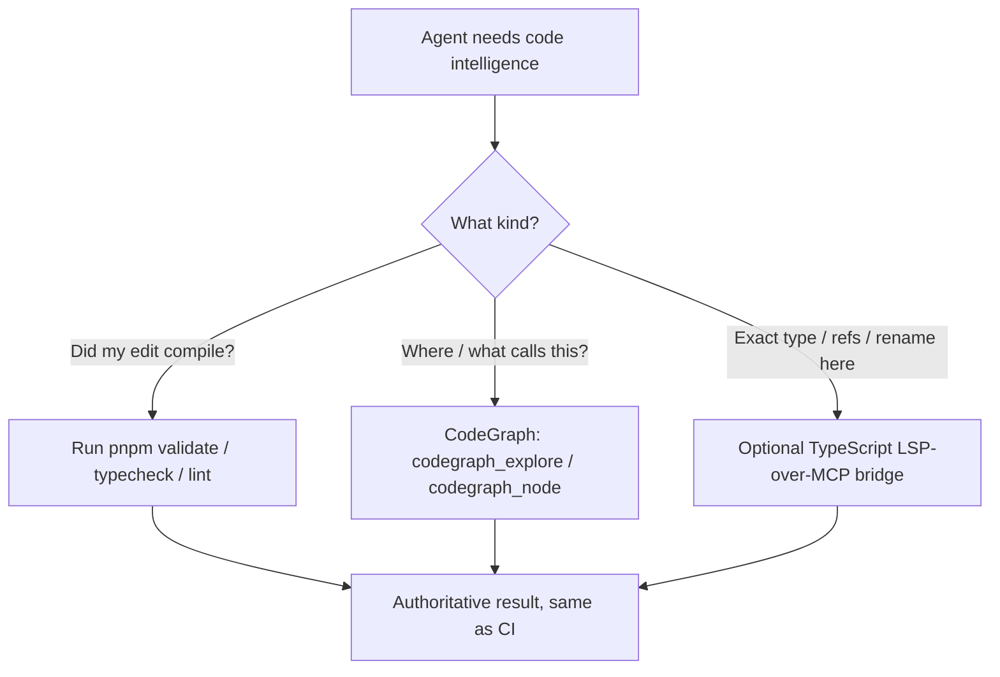

# Agent code intelligence (LSP for Claude Code / Codex / Cursor)

How coding agents get **LSP-grade code intelligence** in this repo. The short version:
for an AI agent, an LSP gives only two things the agent actually uses — **diagnostics**
("did my edit type-check / lint-pass?") and **navigation** (go-to-definition, find
references, symbols) — and both are already provided here through channels better suited
to an agent than a live language server. A literal LSP bridge is an **optional** add for
on-demand semantic hover / references / rename.

> This complements the per-service tooling map in
> [agentic-third-party-tooling.md](agentic-third-party-tooling.md) and the navigation index
> in [codegraph.md](codegraph.md). It does not replace the architecture docs.

## What an LSP gives an agent vs. what this repo already has

| LSP feature | What the agent uses it for | Channel in this repo | Status |
| --- | --- | --- | --- |
| Diagnostics | "Did my change compile / lint-pass?" | `pnpm typecheck` (`tsc --noEmit`) + `pnpm lint` (Biome) + `pnpm validate` | ✅ built in (identical to CI) |
| Go-to-def / find-refs / call paths / impact | Understand and locate code | **CodeGraph** (`codegraph_*` MCP tools or `codegraph` CLI) | ✅ indexed + wired (see [codegraph.md](codegraph.md)) |
| Hover types / rename / code actions | On-demand semantic lookups mid-edit | TypeScript LSP-over-MCP bridge | ⚙️ optional, opt-in (below) |



## 1. Diagnostics — the agent's primary LSP loop

After any edit, the authoritative "is this correct?" signal is the same gate CI runs:

```bash
pnpm typecheck   # tsc --noEmit (full strict tsconfig)
pnpm lint        # biome check src tooling
pnpm validate    # lint + typecheck (run this after a batch of edits)
```

This is the single most valuable LSP feature for an agent, and it is deterministic and
identical to CI — prefer it over a language server's live diagnostics. Both Claude Code and
Codex already run these (Claude via `CLAUDE.md` commands; Codex via [AGENTS.md](../../AGENTS.md)).

## 2. Navigation — CodeGraph (already wired)

CodeGraph is a local semantic index of every symbol and edge in the repo. Reach for it
**before** grep/find when locating or understanding code. Full setup, CLI, and tool list:
[codegraph.md](codegraph.md).

- **MCP tools** (when wired): `codegraph_explore`, `codegraph_node`, `codegraph_callers`,
  `codegraph_callees`, `codegraph_impact`, `codegraph_trace`, `codegraph_search`, …
- **Shell fallback** (always works): `codegraph explore "<question or symbols>"`,
  `codegraph node <symbol-or-file>`.

### Per-agent wiring

| Agent | How it reads MCP | CodeGraph already wired? |
| --- | --- | --- |
| **Claude Code** | project `.mcp.json` (template: [`.mcp.example.json`](../../.mcp.example.json)) | ✅ yes (`codegraph` server) |
| **Cursor** | `.cursor/mcp.json` (symlinked template) | ✅ yes |
| **Codex** | `~/.codex/config.toml` → `[mcp_servers.*]` (per-user, not in the repo) | ⚠️ add it (below) |

Codex does **not** read the repo's `.mcp.json`; configure it once per machine in
`~/.codex/config.toml`:

```toml
[mcp_servers.codegraph]
command = "codegraph"
args = ["serve", "--mcp"]
```

Codex also has the shell fallback (`codegraph explore …` / `codegraph node …`) with no MCP
setup. Prereq either way: `codegraph` on `PATH` and an index built — both handled by
`pnpm setup:local` (phase 7/9). See [codegraph.md](codegraph.md).

## 3. Optional — TypeScript LSP-over-MCP bridge (hover / references / rename)

Only add this if you want the agent to call true semantic operations (precise hover types,
find-references, rename-symbol) tool-by-tool mid-edit. Because Claude Code, Cursor, and
Codex are all MCP clients, **one MCP server serves all three**.

> **Why this is opt-in and not in the shared MCP template:** unlike `codegraph`, the bridge's
> binary is not auto-installed by `pnpm setup:local`, so adding it to the committed template
> would make the server fail on startup for every teammate until they install it. Keep it in
> your **local, gitignored** config instead (`.mcp.json` / `.cursor/mcp.json` /
> `~/.codex/config.toml`). To make it team-wide, also add the install to `setup:local`.

### Install (one time)

```bash
# MCP↔LSP bridge (Go is on PATH in this repo's environments)
go install github.com/isaacphi/mcp-language-server@latest
# TypeScript language server backend
npm i -g typescript-language-server typescript
```

The bridge exposes tools such as `definition`, `references`, `diagnostics`, `hover`, and
`rename_symbol`. Alternative LSP backends: [`vtsls`](https://github.com/yioneko/vtsls), or
`tsgo --lsp` from `@typescript/native-preview` (Microsoft's Go-based TS server — much faster,
still preview).

### Config

```jsonc
// Claude Code: .mcp.json  (or Cursor: .cursor/mcp.json) — both gitignored
"typescript-lsp": {
  "type": "stdio",
  "command": "mcp-language-server",
  "args": ["--workspace", "${PWD}", "--lsp", "typescript-language-server", "--", "--stdio"]
}
```

```toml
# Codex: ~/.codex/config.toml
[mcp_servers.typescript-lsp]
command = "mcp-language-server"
args = ["--workspace", "${PWD}", "--lsp", "typescript-language-server", "--", "--stdio"]
```

### Caveats

- **Workspace path:** `--workspace` needs the repo root. `${PWD}` works when the MCP client
  expands env vars and launches the server with the project as the working directory; if your
  client does not expand it, replace `${PWD}` with the absolute repo path in your local config
  (these files already hold machine-specific paths and are gitignored).
- **Verify flags:** these tools move fast — confirm the exact invocation with
  `mcp-language-server --help` (or the project README) for your version.
- **Cost:** the bridge runs a long-lived language server per agent session and adds tokens per
  call. For most tasks, diagnostics (§1) + CodeGraph (§2) are enough.

## Related

- [codegraph.md](codegraph.md) — semantic code index (navigation): setup, CLI, MCP tools.
- [agentic-third-party-tooling.md](agentic-third-party-tooling.md) — CLI vs MCP vs SDK by consumer; full per-service MCP map.
- [cursor-agent-system.md](cursor-agent-system.md) — skills, rules, subagents, and MCP map.
- [../../AGENTS.md](../../AGENTS.md) — agent onboarding, CI gates, code-intelligence pointer.
