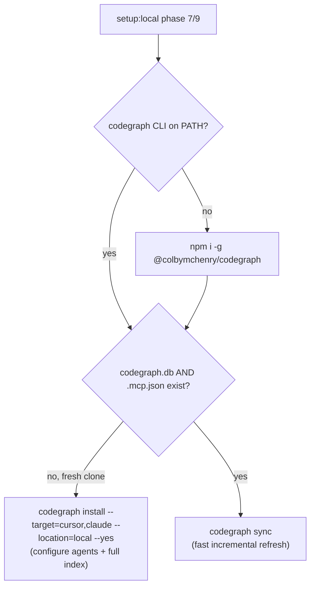

# CodeGraph (semantic code index for AI agents)

[CodeGraph](https://github.com/colbymchenry/codegraph) (`@colbymchenry/codegraph`) builds a local **SQLite knowledge graph** of every symbol, edge, and file in this repo under `.codegraph/`, and exposes it to AI agents (Cursor, Claude Code) over an **MCP server**. Agents query the pre-built index instead of grep + read loops, which cuts tool calls and token cost for "how does X work", "what calls this", and impact-analysis questions.

It is wired into **`pnpm setup:local`** so a fresh clone gets a working index with **no manual steps** — the only thing a developer does afterward is restart their agent so the MCP server loads.

> CodeGraph complements, and does not replace, the canonical architecture docs: [project-structure-guide.md](../reference/architecture/project-structure-guide.md) and [domains-and-public-api-design.md](../reference/architecture/domains-and-public-api-design.md). For the LLM knowledge-graph / onboarding workflow, see [understand-anything.md](understand-anything.md) — that is a separate tool.

---

## What is committed vs generated per machine

The index is **machine-local and regenerable** — it is never committed. Only the configuration that makes the integration reproducible is tracked.

| Path | Tracked? | Purpose |
| --- | --- | --- |
| `.mcp.example.json` | **committed** | Secret-free Claude Code MCP template (all servers, `${CONTEXT7_API_KEY}` placeholder, no machine path). |
| `.mcp.json` | gitignored | Real Claude Code MCP config; written by `codegraph install` / copied from the example. |
| `.cursor/mcp.example.json` | **committed** | Secret-free Cursor MCP template (all servers, `${CONTEXT7_API_KEY}` placeholder, no machine path). |
| `.cursor/mcp.json` | gitignored | Real Cursor MCP config; holds live API keys + an absolute path, so it is not committed. Written by `codegraph install` / copied from the example. |
| `.codegraph/.gitignore` | **committed** | Keeps the index DB, cache, logs, and daemon runtime files out of git. |
| `.codegraph/codegraph.db` | gitignored | The ~26 MB SQLite index. Built per machine. |
| `.codegraph/daemon.sock`, `daemon.pid`, `cache/`, `*.log` | gitignored | Local MCP daemon runtime files. |
| `.claude/settings.json` | gitignored | Claude Code auto-allow permissions. |

Because the DB and per-agent configs are gitignored, they **survive branch switches** (they are not part of any commit) and are **rebuilt on each teammate's machine** the first time they run `setup:local`.

---

## Automatic setup (`pnpm setup:local`)

The local bootstrap runs CodeGraph as **phase `7/9`**. It is idempotent and non-fatal (a failure logs a warning and never blocks the rest of the bootstrap):



- **First run / fresh clone** — `codegraph.db` is absent, so it runs the full `codegraph install` (installs the CLI globally if missing, writes the Cursor + Claude MCP configs, and builds the index from the current working tree).
- **Subsequent runs** — the DB exists, so it runs the fast incremental `codegraph sync`.
- **Skip it** — `pnpm setup:local --skip-codegraph`.

> After the first run, **restart your agent** (Cursor / Claude Code) so it loads the new `codegraph` MCP server. This is the one manual step CodeGraph requires.

---

## Manual setup (without `setup:local`)

```bash
npm i -g @colbymchenry/codegraph
codegraph install --target=cursor,claude --location=local --yes   # configure agents + build index
```

Or scaffold the committed templates and fill in your own keys (both real configs are gitignored):

```bash
cp .cursor/mcp.example.json .cursor/mcp.json   # Cursor
pnpm mcp:setup:default                         # Claude Code — codegraph + headroom (default pair)
# `pnpm mcp:setup` for the full set; then replace ${CONTEXT7_API_KEY} etc. — the codegraph entry needs no edits
```

Non-interactive variants:

```bash
codegraph install --yes                            # auto-detect agents, install globally
codegraph install --target=cursor,claude --yes     # explicit targets
codegraph install --target=auto --location=local   # detected agents, project-local
codegraph install --print-config cursor            # print the MCP snippet, no file writes
```

---

## CLI reference (most used)

| Command | Purpose |
| --- | --- |
| `codegraph status` | Index statistics and freshness. |
| `codegraph sync` | Incremental re-index of changed files (fast). |
| `codegraph index --force` | Full rebuild. |
| `codegraph query <search>` | Search symbols by name. |
| `codegraph context <task>` | Build AI context (entry points + related symbols + code) for a task. |
| `codegraph serve --mcp --path <repo>` | Start the MCP server over stdio (this is what agents launch). |

## MCP tools exposed to agents

`codegraph_search`, `codegraph_context`, `codegraph_trace`, `codegraph_callers`, `codegraph_callees`, `codegraph_impact`, `codegraph_node`, `codegraph_explore`, `codegraph_files`, `codegraph_status`.

---

## Git and CI

- The index DB and daemon runtime files are **never committed** (see `.codegraph/.gitignore`); each developer builds their own from their checkout.
- **Auto-refreshed on branch switch / pull.** [`.husky/post-checkout`](../../.husky/post-checkout) and [`.husky/post-merge`](../../.husky/post-merge) run `codegraph sync -q` in the background so the index tracks the working tree with zero manual effort. Both are **guarded** (no-op when `codegraph` or the index is absent — CI, web sessions) and **backgrounded** (never block the git command). `codegraph sync` is a local, incremental re-index, so it costs **no LLM tokens** — and a fresh index actually *lowers* agent token use (accurate `codegraph_*` queries replace whole-file reads). Pinned by `src/tests/unit/ci/codegraph-git-hooks.policy.unit.test.ts`.
- The real per-agent configs (`.mcp.json`, `.cursor/mcp.json`) are **gitignored** because they may hold live API keys and machine-specific paths. Only the secret-free templates (`.mcp.example.json`, `.cursor/mcp.example.json`) are committed; `setup:local` writes the real configs per machine.
- CI does not run CodeGraph; the index is developer-local.

---

## Troubleshooting

| Problem | Fix |
| --- | --- |
| Agent does not show `codegraph_*` tools | Restart the agent (Cursor / Claude Code) so it loads the MCP server from `.cursor/mcp.json` / `.mcp.json`. |
| `CodeGraph not initialized` | Run `codegraph install --target=cursor,claude --location=local --yes` (or `pnpm setup:local`) from the repo root. |
| `codegraph: command not found` | `npm i -g @colbymchenry/codegraph`. |
| Index out of date | `codegraph sync` (incremental) or `codegraph index --force` (full rebuild). |
| Stale tools after a large refactor | `codegraph index --force`. |

---

## Related docs

- [understand-anything.md](understand-anything.md) — separate LLM knowledge-graph / onboarding tool.
- [cursor-backend-mcp.md](cursor-backend-mcp.md) — MCP for calling the live core-be API from another repo.
- [cursor-cloud-agent-environment.md](cursor-cloud-agent-environment.md) — cloud-agent Docker setup.
- [getting-started/setup.md](../getting-started/setup.md) — local setup and `setup:local`.
