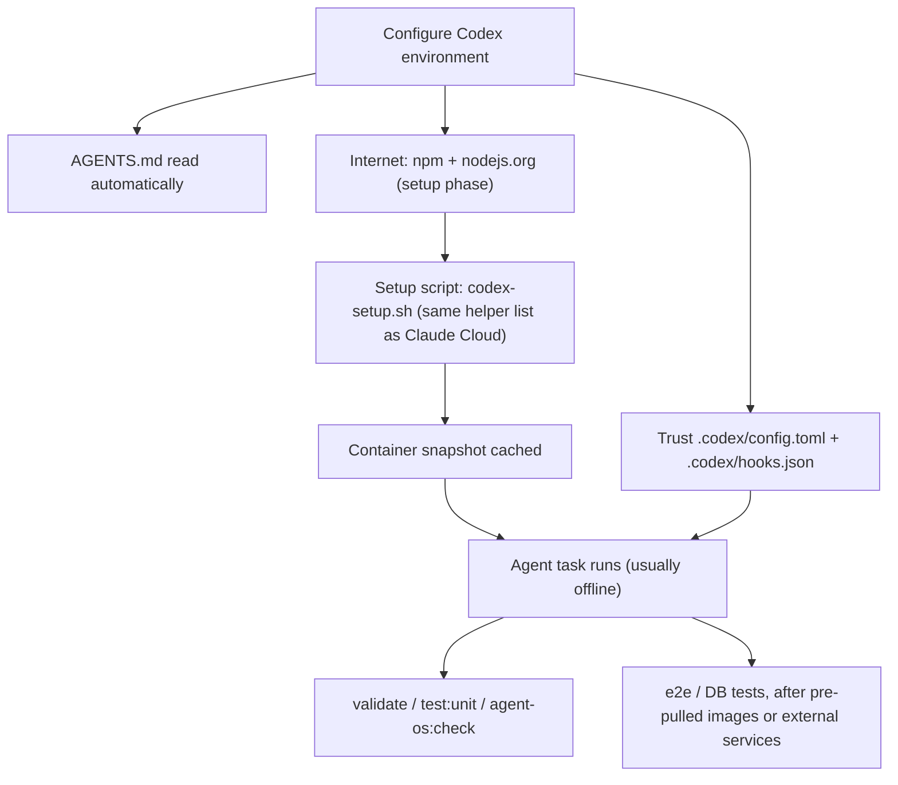

# Codex Cloud agent environment — for core-be

Use this when you run **OpenAI Codex Cloud** (the hosted agent in ChatGPT / the Codex web app) against this repository. It describes the environment you must configure so `pnpm install`, the validation gates, and the test suite work — and what to add for a database or live third-party calls.

Peers: [claude-code-web-environment.md](claude-code-web-environment.md) (Claude Code on the web) and [cursor-cloud-agent-environment.md](cursor-cloud-agent-environment.md) (Cursor cloud agents). Local human setup: [SETUP.md](../../SETUP.md). Codex **local CLI** wiring (`AGENTS.md`, `~/.codex/config.toml`, prompts) is summarized in [AGENTS.md](../../AGENTS.md) and [agent-os/commands/README.md](../../agent-os/commands/README.md).

> Codex Cloud's environment UI, base images, and network model change quickly. Treat the lever names below as a guide and verify against OpenAI's current Codex documentation.

---

## TL;DR — the environment to configure

| Lever | Value |
| ----- | ----- |
| **Repo instructions** | [`AGENTS.md`](../../AGENTS.md) at the root — Codex reads it automatically (no setup) |
| **Setup script** | `bash tooling/setup/agent/codex-setup.sh` (same helper list as Claude Cloud: Node 24, deps, gh, Docker image pre-pull, CodeGraph, Headroom, gitleaks) |
| **Internet access** | On for the **setup** phase (npm + `nodejs.org`); the **agent** phase typically runs offline |
| **Environment variables** | none required for tests |
| **Runtime services** | none for unit tests + static gates; Postgres + Redis only for e2e/DB tests or running the app |

That makes `pnpm validate` / `pnpm test:unit` / `pnpm agent-os:check` / `pnpm routes:catalog:check` / `pnpm tsdoc:check` work. Add a database for DB-bound tests (Tier 2) and third-party hosts for live integrations (Tier 3).

---

## Claude parity map

Codex Cloud should be configured to match the Claude Cloud environment at the same operational points. The filenames differ only where the platforms require different config paths.

| Concern | Claude Cloud path / setting | Codex Cloud path / setting | Parity status |
| ------- | --------------------------- | -------------------------- | ------------- |
| Repo instructions | `CLAUDE.md` + `AGENTS.md` references | `AGENTS.md` | Same repo rules and guardrails |
| Setup script | Environment field: helper list in [claude-code-web-environment.md](claude-code-web-environment.md#setup-script) | Environment field: `bash tooling/setup/agent/codex-setup.sh` | Same helper list, Codex wrapper adds deps install and PATH persistence |
| Startup context | `.claude/settings.json` → `agent-os/hooks/session-start.sh` | generated `.codex/hooks.json` → `agent-os/hooks/session-start.sh` | Same context hook after Codex hook trust |
| Prompt skill routing | `.claude/settings.json` → `prompt-skill-router.sh` | generated `.codex/hooks.json` → `prompt-skill-router.sh` | Same compatible hook |
| Shell guardrails | `.claude/settings.json` → `guardrails.mjs` | generated `.codex/hooks.json` → `guardrails.mjs` | Same compatible hook |
| Stop reminders | `.claude/settings.json` → `stop-gate-reminder.sh` | generated `.codex/hooks.json` → `stop-gate-reminder.sh` | Same compatible hook |
| Edit formatting/reminders | Claude edit hooks in `.claude/settings.json` | Not wired | Codex `apply_patch` payload differs; pre-commit/CI gates still enforce |
| MCP default pair | Environment MCP settings: `codegraph`, `headroom` | `.codex/config.toml` + environment MCP settings: `codegraph`, `headroom` | Same servers, same commands |
| Hook source of truth | `agent-os/hooks/hooks.json` | `agent-os/hooks/hooks.json` → generated `.codex/hooks.json` | Common `agent-os` only |
| MCP source of truth | `.mcp.default.json` | `.codex/config.toml` symlink → generated `agent-os/platforms/codex/config.toml` from `agent-os/mcp/mcp.default.json` | Common `agent-os` only |
| Docker image prep | `install-docker-images.sh` in setup | `codex-setup.sh` runs `install-docker-images.sh` by default | Same mirror + pre-pull |
| Docker services | `pnpm compose:up` on demand | `pnpm compose:up` on demand | Same; setup pre-pulls images but does not run app services |
| Live API smoke | `bash tooling/setup/agent/bootstrap.sh` on demand | `bash tooling/setup/agent/bootstrap.sh` on demand after `codex-setup.sh` | Same one-command bring-up/verify |
| Branch naming | `claude/*` | configure Codex Cloud to use `claude/*` | Same pre-push allowlist |

---

## How Codex differs from the other two cloud agents

Codex Cloud's defining constraint: the **setup (maintenance) script runs with network, then the agent works against a snapshot that is usually offline**. OpenAI's environment docs currently state that the setup script runs before the agent phase, setup scripts have internet access, agent internet is off by default, and shell exports from setup do not automatically persist into the agent phase. Three consequences:

1. **Install everything in the setup script.** Run `pnpm install --frozen-lockfile` (and any image pulls) during setup — not on demand. A `pnpm install` or `pnpm compose:up` issued during the task fails once the agent phase has no egress.
2. **No in-repo SessionStart hook runs.** On Claude Code web, [`session-start.sh`](../../agent-os/hooks/session-start.sh) puts Node on `PATH` and runs `pnpm install`. Codex has no equivalent in-repo hook, so the **setup script must do both** itself.
3. **Persist runtime paths deliberately.** The setup script symlinks Node into `/usr/local/bin` and appends a fallback `PATH` entry to `~/.bashrc`; a plain `export PATH=...` inside the setup shell is not enough.

Sandbox + approvals: the **local** Codex CLI uses `~/.codex/config.toml` (`sandbox_mode`, `approval_policy`) per [AGENTS.md](../../AGENTS.md). In Codex **Cloud** the platform manages sandboxing/approvals; the repo guardrail policy in `AGENTS.md` still applies.

---

## Setup script

core-be's `engines` require **Node 24+** (pinned in [`.nvmrc`](../../.nvmrc)); Codex base images may ship an older Node, so use the repo's Codex setup entrypoint. It mirrors the Claude Cloud setup helper list by default, including the same default MCP pair tooling:

```bash
# Codex environment -> Setup / maintenance script (runs with network; result cached)
bash tooling/setup/agent/codex-setup.sh
```

[`codex-setup.sh`](../../tooling/setup/agent/codex-setup.sh) performs the same cached setup that Claude Cloud uses, with Codex-specific persistence for the agent phase:

```bash
bash tooling/setup/agent/install-node.sh          # Node from .nvmrc into /opt/node24
bash tooling/setup/agent/install-gh.sh            # GitHub CLI fallback
bash tooling/setup/agent/install-docker.sh        # Docker CLI/Compose if missing
bash tooling/setup/agent/install-docker-images.sh # Docker mirror + compose image pre-pull
bash tooling/setup/agent/install-codegraph.sh     # default MCP pair: CodeGraph CLI + index
bash tooling/setup/agent/install-headroom.sh      # default MCP pair: Headroom CLI
bash tooling/setup/agent/install-gitleaks.sh      # pre-commit secret scan
```

It also activates `/opt/node24/bin`, symlinks Node/npm/npx into `/usr/local/bin` when permitted, appends a fallback `PATH` entry to `~/.bashrc`, runs `corepack enable`, and runs `pnpm install --frozen-lockfile` while setup internet is available. Docker is skipped when `docker compose` is already present and installed via apt only when missing. Set `CODEX_SETUP_AGENT_TOOLS=0` only for a deliberately minimal environment; set `CODEX_SETUP_PREPULL_DOCKER=0` only when Docker is unavailable or DB-backed work is out of scope.

Husky activates during `pnpm install` (its `prepare` step), so a properly set-up Codex container gets the **same** pre-commit / pre-push gates as local.

---

## Internet access

Set Codex internet access so the **setup phase** can reach:

| Need | Host(s) |
| ---- | ------- |
| pnpm / npm | `registry.npmjs.org` (+ common package-manager defaults) |
| Node 24 download | `nodejs.org` |
| Git / GitHub | `github.com` |
| Docker mirror / image pre-pull | `gcr.io`, `docker.io` / `docker.com` |
| Tier 3 (live calls only) | `api.stripe.com`, `api.resend.com`, `sentry.io` / `*.ingest.sentry.io` |

The **agent phase** typically has no egress — which is fine once deps are installed, because the tests self-provision and the contract tests mock the third parties.

---

## Environment variables

**Tests need none.** [`src/tests/setup.ts`](../../src/tests/setup.ts) bakes in test RS256 JWT PEMs and every other value, and [`src/tests/global-setup.ts`](../../src/tests/global-setup.ts) points `DATABASE_URL` at the local DB and runs `pnpm db:migrate`. You only need env vars to run the **app** (`pnpm dev` / `pnpm dev:worker`) — mirror the boot block in [claude-code-web-environment.md](claude-code-web-environment.md#environment-variables).

Use Codex environment variables for non-secret test values needed during the agent phase. Use Codex secrets only for setup-time credentials such as private registry tokens; OpenAI currently documents Codex secrets as available to setup scripts and removed before the agent phase. Never write secrets to source, `.env*`, or generated docs — see [credentials-and-env.md](credentials-and-env.md).

---

## Runtime services (Postgres, Redis)

Unit tests and the static gates need neither — that is the Codex sweet spot. For e2e / DB tests you need Postgres 17+ and Redis, but the **offline agent phase can't pull images on demand**, so choose one:

- **Pre-pull in setup, start in task** — [`codex-setup.sh`](../../tooling/setup/agent/codex-setup.sh) runs [`install-docker.sh`](../../tooling/setup/agent/install-docker.sh) and [`install-docker-images.sh`](../../tooling/setup/agent/install-docker-images.sh) by default, so Codex uses a preinstalled Docker when available, installs Docker CLI/Compose when missing, and pulls images while network is up through the same mirror path as Claude Cloud. During the task, [`bootstrap.sh`](../../tooling/setup/agent/bootstrap.sh) runs [`ensure-docker-daemon.sh`](../../tooling/setup/agent/ensure-docker-daemon.sh) immediately before compose so a stopped daemon is started before `SONAR=0 pnpm compose:up && pnpm compose:wait && pnpm db:migrate`. If Codex Cloud lets `dockerd` start but denies Docker's iptables/NAT bridge setup, the helper falls back to restricted Docker networking and `bootstrap.sh` uses [`docker-compose.codex-cloud.yml`](../../tooling/setup/agent/docker-compose.codex-cloud.yml) for host-network Postgres + Redis. If Docker is reachable but layer extraction fails with overlay mount permissions, the helper restarts `dockerd` in the same restricted networking mode with the `vfs` storage driver; this is slower, but avoids overlay snapshot mounts in constrained Codex containers.
- **Provision services in setup** — only if the Codex environment keeps Docker services alive into the agent phase, append `SONAR=0 pnpm compose:up && pnpm compose:wait && pnpm db:migrate` after `codex-setup.sh` in the setup script.
- **External services** — point `DATABASE_URL` / `DATABASE_MIGRATION_URL` / `REDIS_URL` at services your platform provides.

See [claude-code-web-environment.md](claude-code-web-environment.md#runtime-services-postgres-redis) for the compose details (shared with local). Postgres **17+** is required by `pnpm db:migrate` — a base image's older Postgres is not a substitute.

### One-command bring-up + verify

For the full local-parity runtime path — tool installs, Docker mirror, Postgres + Redis, migrations, seed, transient `pnpm dev`, and `/livez` + `/readyz` healthcheck — use the same orchestrator as Claude Cloud:

```bash
bash tooling/setup/agent/bootstrap.sh        # KEEP_APP=1 leaves `pnpm dev` running afterwards
```

Use this on demand after the Codex setup phase when the task needs the live API. The setup script keeps startup lightweight and cached; `bootstrap.sh` is the explicit "Docker up + app live" path.

---

## MCP servers

Codex Cloud should expose the same default MCP pair as Claude Cloud:

| Server | Command | Purpose |
| ------ | ------- | ------- |
| `codegraph` | `codegraph serve --mcp` | Semantic code index for agent navigation |
| `headroom` | `headroom mcp serve` | Context compression for large logs / docs / search chunks |

The source of truth is [`.mcp.default.json`](../../.mcp.default.json), mirrored into the generated Codex config at [`agent-os/platforms/codex/config.toml`](../../agent-os/platforms/codex/config.toml). Project-local [`.codex/config.toml`](../../.codex/config.toml) symlinks to that generated file. [`codex-setup.sh`](../../tooling/setup/agent/codex-setup.sh) installs both CLIs, matching the Claude setup script. Configure the Codex Cloud environment to trust the project config and expose the same two MCP servers; add on-demand providers from [`.mcp.example.json`](../../.mcp.example.json) only when a task needs them and the required tokens are available in the environment. Regenerate with `pnpm agent-os:generate --write`; verify drift with `pnpm agent-os:generate:check`.

---

## GitHub prerequisites (and why creating a PR prompts)

A cloud session can touch GitHub only after the platform is **authorized** on this repo, and opening a PR is a deliberate, gated step — not something the agent does unprompted.

- **One-time authorization (the connect-GitHub prompt).** Install / authorize the platform's GitHub App or connector on `nikunjmavani/core-be` with **least-privilege** scopes — `contents` (read/write the working branch), `pull_requests` (open/update PRs), and `actions: read` (CI status / logs). Without it the session cannot fetch, push, or open a PR.
- **Pushes are pinned to the session branch.** The cloud git proxy restricts a web session to pushing only its assigned working branch. Configure Codex Cloud to use the same `claude/<slug>` branch format as Claude Code web when the platform exposes that setting. Repo hooks run *inside* the session and cannot rename it — `claude/*` is allowlisted by [git-branch-naming.mdc](../../agent-os/rules/git-branch-naming.mdc) by design. To land work under a `feature/` / `fix/` name, rename at the PR / merge layer.
- **"Create PR" asks first — by design.** Opening a pull request is an outward-facing action, so the agent won't do it unsolicited; it confirms first (Claude Code web uses the scoped **GitHub MCP** tools rather than `gh`). Ask explicitly when you want the PR opened, then drive CI to green per [git-workflow.md](../process/git-workflow.md).

---

## Tiers — what to enable for which goal

| Tier | Goal | Internet (setup phase) | Services | Env vars |
| ---- | ---- | ---------------------- | -------- | -------- |
| **1** | Lint, typecheck, unit tests, the gates | npm + `nodejs.org` | none | none |
| **2** | Full test suite (e2e / integration), migrations, seed | same | Postgres + Redis (provisioned in setup, or external) | none — tests self-provision |
| **3** | Run the app (`pnpm dev` / `pnpm dev:worker`) | same | Postgres + Redis | the boot block |
| **4** | Live Stripe / Resend / S3 / Sentry calls | + their API hosts | + Postgres / Redis | + real test keys |

---

## Codex gotchas

- **Agent phase is usually offline** — do every install / image pull in the setup script; an on-demand `pnpm install` or first-time Docker pull fails mid-task.
- **No in-repo SessionStart hook** — the setup script must put Node 24 on `PATH` and run `pnpm install` (Claude web's `session-start.sh` does this; Codex has no equivalent).
- **Project hooks require review/trust** — generated `.codex/hooks.json` wires the compatible Claude hook scripts for Codex from `agent-os/hooks/hooks.json`, but Codex requires project-local hooks to be reviewed and trusted before they run.
- **MCP must be enabled/trusted in the environment** — `codex-setup.sh` installs `codegraph` and `headroom`, and `.codex/config.toml` declares them; the Codex Cloud environment still needs to trust/use that project config so tools appear to the agent.
- **`AGENTS.md` is the instructions file** — Codex reads it automatically; keep the repo guardrail policy there current.
- **Postgres 17+** is required by `pnpm db:migrate`; a base image's older Postgres is not a substitute.

---

## Codex features worth using

Use these when they fit the task; they are additive to the Claude-parity baseline above.

| Feature | When to use it | core-be guidance |
| ------- | -------------- | ---------------- |
| **Worktrees** | Run multiple independent tasks without mixing diffs | Use for parallel refactors, docs-only work, or risky experiments; keep one branch/task per isolated change |
| **Cloud tasks from CLI** | Launch, triage, and apply Codex Cloud work without leaving terminal | Good for background audits or static fixes after `codex-setup.sh` is configured |
| **Appshots / in-app browser** | Give Codex visual context from a local app or rendered page | Useful for API docs UI, dashboard, or frontend integration debugging; avoid for secret-bearing screens |
| **Local environments** | Share local worktree setup/actions through Codex app settings | Mirror common commands such as `pnpm validate`, `pnpm ci:local`, `bash tooling/setup/agent/bootstrap.sh` |
| **Project-local hooks** | Add deterministic guardrails directly in the repo | Already wired from common `agent-os/hooks/hooks.json`; review/trust `.codex/hooks.json` when Codex prompts |
| **Skills** | Package repeated workflows as reusable instructions/resources/scripts | Prefer existing `agent-os/skills/*`; create new skills only when a repeated workflow is stable |

References: [Codex app](https://developers.openai.com/codex/app), [Worktrees](https://developers.openai.com/codex/app/worktrees), [Appshots](https://developers.openai.com/codex/appshots), [Local environments](https://developers.openai.com/codex/app/local-environments), [Codex CLI cloud](https://developers.openai.com/codex/cli/features), [Codex hooks](https://developers.openai.com/codex/hooks), [Codex skills](https://developers.openai.com/codex/skills).

---

## Setup flow



---

## Related documentation

- [claude-code-web-environment.md](claude-code-web-environment.md) — Claude Code on the web (the most detailed cloud-agent guide; the compose + env blocks are shared).
- [cursor-cloud-agent-environment.md](cursor-cloud-agent-environment.md) — Cursor cloud agents (`Dockerfile.agent`).
- [AGENTS.md](../../AGENTS.md) — the instructions file Codex reads; custom subagents and guardrail policy.
- [agent-os/commands/README.md](../../agent-os/commands/README.md) — Codex prompts (`~/.codex/prompts`) wiring.
- [SETUP.md](../../SETUP.md) — local human setup, env vars, testing, CI/CD.
