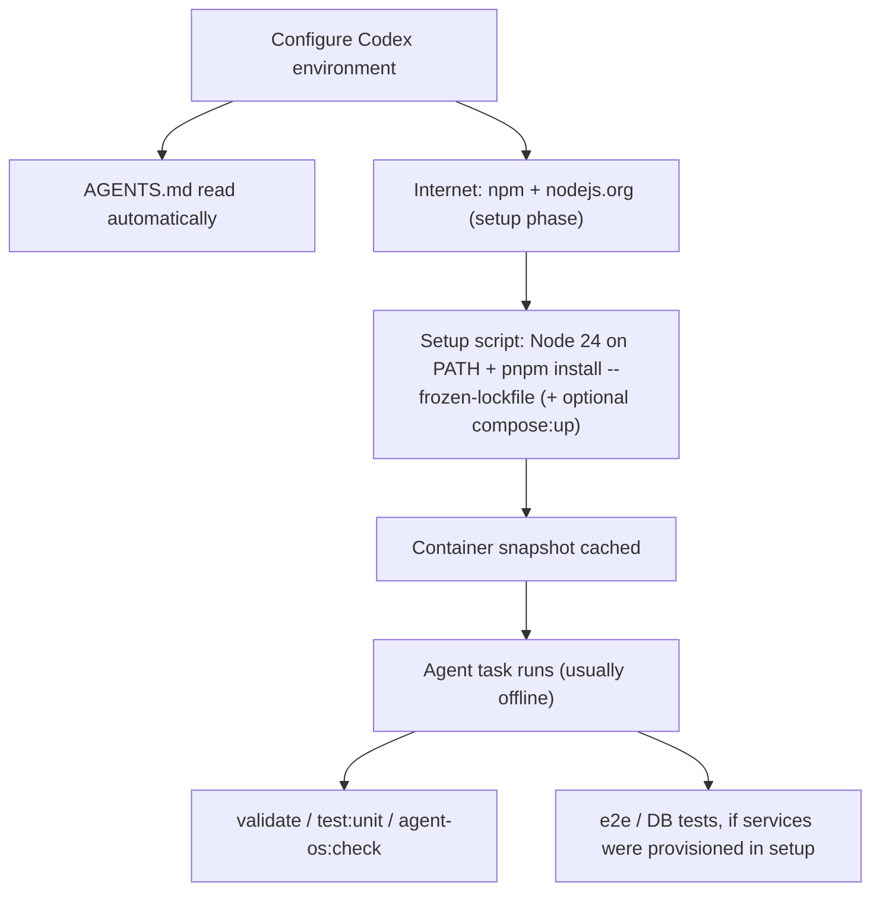

# Codex Cloud agent environment — for core-be

Use this when you run **OpenAI Codex Cloud** (the hosted agent in ChatGPT / the Codex web app) against this repository. It describes the environment you must configure so `pnpm install`, the validation gates, and the test suite work — and what to add for a database or live third-party calls.

Peers: [claude-code-web-environment.md](claude-code-web-environment.md) (Claude Code on the web) and [cursor-cloud-agent-environment.md](cursor-cloud-agent-environment.md) (Cursor cloud agents). Local human setup: [SETUP.md](../../SETUP.md). Codex **local CLI** wiring (`AGENTS.md`, `~/.codex/config.toml`, prompts) is summarized in [AGENTS.md](../../AGENTS.md) and [agent-os/commands/README.md](../../agent-os/commands/README.md).

> Codex Cloud's environment UI, base images, and network model change quickly. Treat the lever names below as a guide and verify against OpenAI's current Codex documentation.

---

## TL;DR — the environment to configure

| Lever | Value |
| ----- | ----- |
| **Repo instructions** | [`AGENTS.md`](../../AGENTS.md) at the root — Codex reads it automatically (no setup) |
| **Setup script** | Install Node 24, `corepack enable`, then **`pnpm install --frozen-lockfile`** (deps must exist before the offline agent phase) |
| **Internet access** | On for the **setup** phase (npm + `nodejs.org`); the **agent** phase typically runs offline |
| **Environment variables** | none required for tests |
| **Runtime services** | none for unit tests + static gates; Postgres + Redis only for e2e/DB tests or running the app |

That makes `pnpm validate` / `pnpm test:unit` / `pnpm agent-os:check` / `pnpm routes:catalog:check` / `pnpm tsdoc:check` work. Add a database for DB-bound tests (Tier 2) and third-party hosts for live integrations (Tier 3).

---

## How Codex differs from the other two cloud agents

Codex Cloud's defining constraint: the **setup (maintenance) script runs with network, then the agent works against a snapshot that is usually offline**. Two consequences:

1. **Install everything in the setup script.** Run `pnpm install --frozen-lockfile` (and any image pulls) during setup — not on demand. A `pnpm install` or `pnpm compose:up` issued during the task fails once the agent phase has no egress.
2. **No in-repo SessionStart hook runs.** On Claude Code web, [`session-start.sh`](../../agent-os/hooks/session-start.sh) puts Node on `PATH` and runs `pnpm install`. Codex has no equivalent in-repo hook, so the **setup script must do both** itself.

Sandbox + approvals: the **local** Codex CLI uses `~/.codex/config.toml` (`sandbox_mode`, `approval_policy`) per [AGENTS.md](../../AGENTS.md). In Codex **Cloud** the platform manages sandboxing/approvals; the repo guardrail policy in `AGENTS.md` still applies.

---

## Setup script

core-be's `engines` require **Node 24+** (pinned in [`.nvmrc`](../../.nvmrc)); Codex base images usually ship an older Node, so install it and make it durable on `PATH`:

```bash
# Codex environment → Setup / maintenance script (runs with network; result cached)
bash tooling/setup/agent/install-node.sh         # downloads the .nvmrc Node to /opt/node24
ln -sf /opt/node24/bin/node /usr/local/bin/node   # put it on PATH (Codex has no session-start hook)
ln -sf /opt/node24/bin/npx  /usr/local/bin/npx
corepack enable                                   # provides pnpm from package.json's packageManager
pnpm install --frozen-lockfile                    # install NOW — the agent phase may be offline
```

[`install-node.sh`](../../tooling/setup/agent/install-node.sh) is Claude-web-shaped (it installs into `/opt/node24` and relies on `session-start.sh` to switch `PATH`); on Codex you add `PATH` yourself (the symlinks above, or your base image's Node manager). If the base image already ships Node 24, skip the install and just `corepack enable && pnpm install --frozen-lockfile`.

Husky activates during `pnpm install` (its `prepare` step), so a properly set-up Codex container gets the **same** pre-commit / pre-push gates as local.

---

## Internet access

Set Codex internet access so the **setup phase** can reach:

| Need | Host(s) |
| ---- | ------- |
| pnpm / npm | `registry.npmjs.org` (+ common package-manager defaults) |
| Node 24 download | `nodejs.org` |
| Git / GitHub | `github.com` |
| Tier 3 (live calls only) | `api.stripe.com`, `api.resend.com`, `sentry.io` / `*.ingest.sentry.io` |

The **agent phase** typically has no egress — which is fine once deps are installed, because the tests self-provision and the contract tests mock the third parties.

---

## Environment variables

**Tests need none.** [`src/tests/setup.ts`](../../src/tests/setup.ts) bakes in test RS256 JWT PEMs and every other value, and [`src/tests/global-setup.ts`](../../src/tests/global-setup.ts) points `DATABASE_URL` at the local DB and runs `pnpm db:migrate`. You only need env vars to run the **app** (`pnpm dev` / `pnpm dev:worker`) — mirror the boot block in [claude-code-web-environment.md](claude-code-web-environment.md#environment-variables). Put any secrets in Codex's **secrets** field (test keys only), never in source — see [credentials-and-env.md](credentials-and-env.md).

---

## Runtime services (Postgres, Redis)

Unit tests and the static gates need neither — that is the Codex sweet spot. For e2e / DB tests you need Postgres 17+ and Redis, but the **offline agent phase can't pull images on demand**, so choose one:

- **Provision in setup** — if the Codex base image has Docker, run `pnpm compose:up && pnpm compose:wait && pnpm db:migrate` in the setup script (image pulls happen while network is up). Pre-pulling via [`install-docker-images.sh`](../../tooling/setup/agent/install-docker-images.sh) (the gcr.io mirror) avoids the Docker Hub CDN allowlist gap.
- **External services** — point `DATABASE_URL` / `DATABASE_MIGRATION_URL` / `REDIS_URL` at services your platform provides.

See [claude-code-web-environment.md](claude-code-web-environment.md#runtime-services-postgres-redis) for the compose details (shared with local). Postgres **17+** is required by `pnpm db:migrate` — a base image's older Postgres is not a substitute.

---

## GitHub prerequisites (and why creating a PR prompts)

A cloud session can touch GitHub only after the platform is **authorized** on this repo, and opening a PR is a deliberate, gated step — not something the agent does unprompted.

- **One-time authorization (the connect-GitHub prompt).** Install / authorize the platform's GitHub App or connector on `nikunjmavani/core-be` with **least-privilege** scopes — `contents` (read/write the working branch), `pull_requests` (open/update PRs), and `actions: read` (CI status / logs). Without it the session cannot fetch, push, or open a PR.
- **Pushes are pinned to the session branch.** The cloud git proxy restricts a web session to pushing only its assigned working branch (`claude/<slug>` on Claude Code web; the platform's task branch on Cursor / Codex). Repo hooks run *inside* the session and cannot rename it — `claude/*` is allowlisted by [git-branch-naming.mdc](../../agent-os/rules/git-branch-naming.mdc) by design. To land work under a `feature/` / `fix/` name, rename at the PR / merge layer.
- **"Create PR" asks first — by design.** Opening a pull request is an outward-facing action, so the agent won't do it unsolicited; it confirms first (Claude Code web uses the scoped **GitHub MCP** tools rather than `gh`). Ask explicitly when you want the PR opened, then drive CI to green per [git-workflow.md](../process/git-workflow.md).

---

## Tiers — what to enable for which goal

| Tier | Goal | Internet (setup phase) | Services | Env vars |
| ---- | ---- | ---------------------- | -------- | -------- |
| **1** | Lint, typecheck, unit tests, the gates | npm + `nodejs.org` | none | none |
| **2** | Full test suite (e2e / integration), migrations, seed | same | Postgres + Redis (provisioned in setup, or external) | none — tests self-provision |
| **3** | Run the app (`pnpm dev` / `pnpm dev:worker`) | same | Postgres + Redis | the boot block |
| **4** | Live Stripe / Resend / S3 / Sentry calls | + their API hosts | + Postgres / Redis | + real test keys |

---

## Codex gotchas

- **Agent phase is usually offline** — do every install / pull in the setup script; an on-demand `pnpm install` / `pnpm compose:up` fails mid-task.
- **No in-repo SessionStart hook** — the setup script must put Node 24 on `PATH` and run `pnpm install` (Claude web's `session-start.sh` does this; Codex has no equivalent).
- **`AGENTS.md` is the instructions file** — Codex reads it automatically; keep the repo guardrail policy there current.
- **Postgres 17+** is required by `pnpm db:migrate`; a base image's older Postgres is not a substitute.

---

## Setup flow



---

## Related documentation

- [claude-code-web-environment.md](claude-code-web-environment.md) — Claude Code on the web (the most detailed cloud-agent guide; the compose + env blocks are shared).
- [cursor-cloud-agent-environment.md](cursor-cloud-agent-environment.md) — Cursor cloud agents (`Dockerfile.agent`).
- [AGENTS.md](../../AGENTS.md) — the instructions file Codex reads; custom subagents and guardrail policy.
- [agent-os/commands/README.md](../../agent-os/commands/README.md) — Codex prompts (`~/.codex/prompts`) wiring.
- [SETUP.md](../../SETUP.md) — local human setup, env vars, testing, CI/CD.
