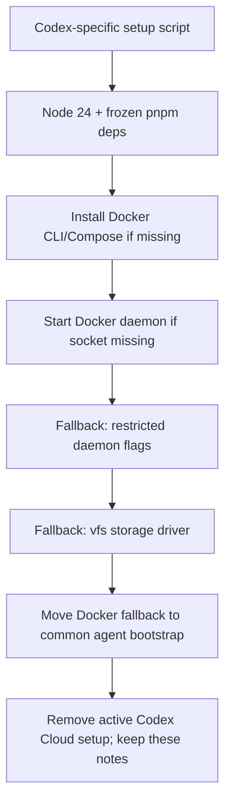

# Codex Cloud Agent Setup Archive

Reference-only notes for the Codex Cloud setup work attempted in June 2026.
This is not an active setup guide, and no repo workflow should point Codex Cloud
at this file as an executable source of truth.

## Current decision

- Removed the active Codex Cloud setup entry point:
  `tooling/setup/agent/codex-setup.sh`.
- Removed the active Codex Cloud environment guide:
  `docs/integrations/codex-cloud-agent-environment.md`.
- Kept common agent infrastructure that is also used by Claude/cloud sessions:
  `tooling/setup/agent/bootstrap.sh`,
  `tooling/setup/agent/ensure-docker-daemon.sh`, and
  `tooling/setup/agent/docker-compose.cloud-agent.yml`.
- Kept local Codex project configuration (`.codex/` and
  `agent-os/platforms/codex/`) because that is local agent guardrail/MCP setup,
  not Codex Cloud environment provisioning.

## What we had

- A Codex-specific setup script installed the pinned Node runtime from `.nvmrc`
  through `tooling/setup/agent/install-node.sh`, put `/opt/node24/bin` on
  `PATH`, enabled Corepack, and ran `pnpm install --frozen-lockfile`.
- The same script optionally installed the cloud-agent tooling we also use for
  Claude-style sessions: `gh`, Docker CLI/Compose when missing, Docker image
  mirror/pre-pull, CodeGraph, Headroom, and gitleaks.
- The removed guide documented Codex setup-phase installs, the offline agent
  phase, GitHub authorization, MCP/default tooling, branch naming, secrets, DB
  tiers, and Docker image pre-pull behavior.
- Branch policy documentation briefly recommended configuring Codex Cloud to use
  the `claude/<slug>` branch format. That active guidance was removed with the
  setup guide.

## What we tried



- First pass matched the Claude web/cloud setup shape: install Node 24, install
  dependencies during setup, then leave database/app startup for explicit task
  prompts.
- When the cloud run reported `docker: not found`, we added Docker
  CLI/Compose installation through the existing agent setup helpers.
- When the Docker socket was unavailable, we added
  `ensure-docker-daemon.sh` so bootstrap can start a daemon when the platform
  image has Docker installed but not running.
- When daemon startup hit restricted container networking, the helper tried
  daemon flags that avoid bridge/NAT setup:
  `--iptables=false --ip-masq=false --ip-forward=false --bridge=none`.
- When image layer extraction failed on overlayfs with `operation not permitted`,
  the helper added a `--storage-driver=vfs` retry.
- The Docker compose override was renamed from a Codex-specific file to the
  common `docker-compose.cloud-agent.yml`, because the fallback applies to any
  restricted cloud-agent container, not only Codex Cloud.

## Useful checks from the attempt

These were the local checks used while the setup was active:

```bash
bash -n tooling/setup/agent/ensure-docker-daemon.sh
bash -n tooling/setup/agent/bootstrap.sh
docker compose -f docker-compose.yml -f tooling/setup/agent/docker-compose.cloud-agent.yml config
pnpm vitest run --project unit src/tests/unit/tooling/agent-docker-daemon-script.unit.test.ts
pnpm docs:lint:changed
pnpm agent-os:check
```

## If we revisit Codex Cloud later

- Start from the common Claude/web setup requirements rather than restoring a
  Codex-only bootstrap path.
- Confirm the current Codex Cloud base image capabilities in a fresh run before
  reintroducing active docs or scripts: Node version, Docker CLI, Docker daemon,
  mount permissions, network policy, and branch naming behavior may have changed.
- Keep Docker daemon and compose fallbacks in common agent tooling if Claude,
  Cursor, or another managed cloud agent also benefits from them.
- Keep secrets in the platform's secrets/environment fields. Do not write
  secrets into source files or tracked setup docs.
- Re-add an active guide only after one cloud session proves the full flow:
  setup, hooks, MCP availability, dependency install, optional Docker services,
  app healthcheck, tests, branch push, PR creation, and CI log access.
