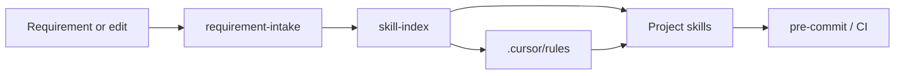

# Cursor agent system (core-be)

Map of skills, rules, subagents, and MCP tooling for coding agents and contributors using Cursor (or Claude Code with the same `.cursor/` layout).

---

## Entry points

| Doc | Role |
| --- | --- |
| [AGENTS.md](../../AGENTS.md) | Onboarding checklist, CI gates, custom subagents |
| [CLAUDE.md](../../CLAUDE.md) | Architecture, domains, commands |
| [requirement-intake.md](../getting-started/requirement-intake.md) | New feature/API intake + Plan workflow |
| [skill-index](../../agent-os/skills/skill-index/SKILL.md) | **Canonical** skill catalog, triggers, and auto-invoke rules |

---

## Project skills (36)

**36 total** — consult [skill-index](../../agent-os/skills/skill-index/SKILL.md) first. Includes **skill-index** (meta) and **cursor-global-skills** (reference to Cursor built-ins).

Common chains:

| Change | Skills (order) |
| --- | --- |
| New route | route-schema-doc-guard → openapi-multilingual (tags) → route-catalog → seed-maintainer → test-generator |
| New domain | domain-generator → schema-generator → sql-design-guard → db-migration-maintainer → … |
| Env var | env-schema-add |
| Hand-written doc under `docs/` | docs-maintainer |

**openapi-route-sync** is legacy (tag locales only). Use **route-schema-doc-guard** for route `schema` blocks.

---

## Cursor rules (37)

Two **always-on** rules: [engineering-principles.mdc](../../agent-os/rules/engineering-principles.mdc), [project-identity.mdc](../../agent-os/rules/project-identity.mdc).

All others are **glob-scoped** — they auto-attach when matching files are edited. Full table: [skill-index → Auto-trigger rules](../../agent-os/skills/skill-index/SKILL.md#auto-trigger-rules).

Policy rules (architecture, import paths, naming, object params) attach on `src/**/*.ts` without invoking a skill — they hold non-negotiable detail.

---

## Custom subagents

Defined in [`agent-os/agents/`](../../agent-os/agents/). All agents are **read-only**.
Cursor reads them via `.cursor/agents` → `agent-os/agents/` symlink.

| Reference | Link |
| --------- | ---- |
| Full catalog + use-when | [agent-os/docs/agents-catalog.md](../../agent-os/docs/agents-catalog.md) |
| Platform invocation table | [agent-os/docs/platform-access.md](../../agent-os/docs/platform-access.md) |

| Tool | How agents are invoked |
| ---- | ---------------------- |
| **Cursor** | `@<agent-name>` in Agent mode; auto-invokes from `description` frontmatter |
| **Claude Code** | `"Read agent-os/agents/<name>.md and follow the procedure"` |
| **Codex** | Reads `AGENTS.md` custom subagents table; invoke by name |

Add new agents with global **create-subagent**. See [cursor-global-skills](../../agent-os/skills/cursor-global-skills/SKILL.md).

---

## Global Cursor skills

Ship with Cursor under `~/.cursor/skills-cursor/`. **Not required** for normal backend work. Use when editing `agent-os/skills`, `agent-os/rules`, `agent-os/agents`, hooks, or IDE automation.

See [cursor-global-skills](../../agent-os/skills/cursor-global-skills/SKILL.md).

---

## MCP servers

Template: [`agent-os/mcp/mcp.example.json`](../../agent-os/mcp/mcp.example.json) → copy to `agent-os/mcp/mcp.json` (gitignored).
Symlinked: `.cursor/mcp.json` → `agent-os/mcp/mcp.json` (Cursor), `.mcp.json` → `agent-os/mcp/mcp.json` (Claude Code).
Configure once — all platforms read the same file.

| Server | Purpose |
| --- | --- |
| **codegraph** | Local semantic index — see [codegraph.md](codegraph.md) |
| **context7** | Version-specific backend library docs |
| **core-be:api** | Local Fastify MCP at `/api/v1/mcp` |
| **headroom** | Context compression — compress large tool output / logs / files before loading into context |
| **neon**, **sentry**, **railway**, **aws**, **stripe**, **semgrep**, **sonarqube**, **redis**, **postman**, **resend** | On-demand hosted integrations — scaffold with `pnpm mcp:setup` |

`codegraph` + `headroom` are the **default auto-start pair** (zero-config, no token), provisioned in `pnpm setup:local` (phase 7/9); the on-demand servers above are opt-in via `pnpm mcp:setup`. The `github`, `composio`, `descript`, and `slack` MCPs are intentionally not part of this project.

---

## Cloud agent environment

Linux agent image with full devDependencies: [cursor-cloud-agent-environment.md](cursor-cloud-agent-environment.md) (`Dockerfile.agent`).

---

## Related

- [documentation-system.md](../reference/architecture/documentation-system.md) — in-source TSDoc, OVERVIEW.md, route schema
- [pr-review.md](../process/pr-review.md) — human and agent PR rubric
