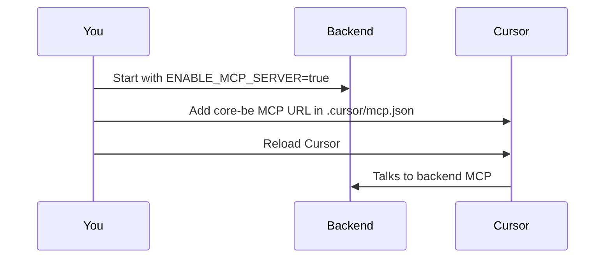

# Connecting the frontend to core-be MCP

When the backend runs with **`ENABLE_MCP_SERVER=true`**, it exposes a Model Context Protocol (MCP) endpoint. The frontend can connect to it to discover and call APIs without separate API documentation.

The backend lists `@modelcontextprotocol/sdk` under **`optionalDependencies`**. Local dev and CI install it by default. Production Docker images omit it unless you build with **`INSTALL_MCP_OPTIONAL=true`** (see [docker-images.md](../deployment/docker-images.md)). The API loads MCP via dynamic import only when `ENABLE_MCP_SERVER=true`.

---

## Connection flow



You start backend with MCP → add config in Cursor → reload → Cursor talks to backend MCP.

---

## Cursor MCP (use core-be APIs from the FE project in Cursor)

If you work in the **frontend** repo in Cursor and want the AI to see and call core-be APIs (OpenAPI, routes, `call_api`), add the core-be MCP server to the frontend project's Cursor config.

1. **Start the backend** with MCP enabled:

   ```env
   ENABLE_MCP_SERVER=true
   ```

   ```bash
   pnpm dev
   ```

2. **In the frontend repo**, create or edit **`.cursor/mcp.json`** (at the project root) and add:

   ```json
   {
     "mcpServers": {
       "core-be-api": {
         "url": "http://localhost:3000/api/v1/mcp"
       }
     }
   }
   ```

   If you already have other MCP servers, add the `"core-be-api"` entry inside `mcpServers`. Use a different port if your backend runs elsewhere (e.g. `http://localhost:4000/api/v1/mcp`).

3. **Reload Cursor** (or restart) so it picks up the new MCP server.

4. In the frontend project, Cursor can now use the **core-be-api** server: list resources (`core-be://openapi`, `core-be://routes`) and the **call_api** tool to call your API. No separate API doc is required in the frontend.

---

## Backend setup

1. Set in `.env`:

   ```env
   ENABLE_MCP_SERVER=true
   ```

2. Start the server: `pnpm dev`
3. MCP endpoint: **`POST {API_BASE}/api/v1/mcp`**  
   Example: `http://localhost:3000/api/v1/mcp`

Ensure **CORS** allows your frontend origin: set `ALLOWED_ORIGINS` in `.env` (e.g. `http://localhost:5173` for Vite).

---

## Frontend: use the MCP client SDK

Install the SDK in the frontend app:

```bash
pnpm add @modelcontextprotocol/sdk
```

### 1. Create transport and client

```ts
import { Client } from '@modelcontextprotocol/sdk/client/index.js';
import { StreamableHTTPClientTransport } from '@modelcontextprotocol/sdk/client/streamableHttp.js';

const MCP_URL = new URL('/api/v1/mcp', import.meta.env.VITE_API_BASE ?? 'http://localhost:3000');

const transport = new StreamableHTTPClientTransport(MCP_URL, {
  // Optional: send auth header on every MCP request (e.g. JWT)
  requestInit: {
    headers: {
      Authorization: `Bearer ${accessToken}`,
      'Content-Type': 'application/json',
    },
  },
  // Optional: custom fetch (e.g. for credentials, base URL)
  // fetch: (url, init) => fetch(url, { ...init, credentials: 'include' }),
});

const client = new Client({ name: 'my-frontend', version: '1.0.0' }, { capabilities: {} });

await client.connect(transport);
```

### 2. List resources and tools

```ts
// List resources (e.g. core-be://openapi, core-be://routes)
const { resources } = await client.listResources();
// resources: { uri, name, mimeType?, description? }[]

// List tools (e.g. call_api)
const { tools } = await client.listTools();
// tools: { name, description?, inputSchema? }[]
```

### 3. Read a resource (e.g. OpenAPI spec)

```ts
const result = await client.readResource({ uri: 'core-be://openapi' });
// result.contents: { uri, mimeType, text? }[]
const openApiSpec = result.contents[0]?.text; // JSON string
```

### 4. Call the API via the `call_api` tool

```ts
const result = await client.callTool({
  name: 'call_api',
  arguments: {
    method: 'GET',
    path: '/api/v1/users/me',
    headers: {
      Authorization: `Bearer ${accessToken}`,
      'X-Organization-Id': organizationId ?? '',
    },
  },
});

// result.content: [{ type: 'text', text: '{"statusCode":200,"body":"...","headers":{...}}' }]
const parsed = JSON.parse(result.content[0].text);
const statusCode = parsed.statusCode;
const body = parsed.body;
```

For POST/PATCH/PUT, pass `body`:

```ts
await client.callTool({
  name: 'call_api',
  arguments: {
    method: 'POST',
    path: '/api/v1/auth/login',
    body: { email: 'user@example.com', password: '...' },
  },
});
```

---

## Summary

| Step     | Action                                                                                              |
| -------- | --------------------------------------------------------------------------------------------------- |
| Backend  | `ENABLE_MCP_SERVER=true`, `pnpm dev` (optional SDK installed by default), `ALLOWED_ORIGINS` for frontend |
| Backend (Docker prod) | `ENABLE_MCP_SERVER=true` **and** image built with `INSTALL_MCP_OPTIONAL=true`              |
| Frontend | `pnpm add @modelcontextprotocol/sdk` (client SDK; separate from backend optional dep)               |
| Connect  | `StreamableHTTPClientTransport(url)` → `Client` → `client.connect(transport)`                       |
| Discover | `client.listResources()`, `client.listTools()`, `client.readResource({ uri: 'core-be://openapi' })` |
| Call API | `client.callTool({ name: 'call_api', arguments: { method, path, body?, headers? } })`               |

The **`call_api`** tool forwards the request through the same backend (auth, tenant, validation). Pass `Authorization` and `X-Organization-Id` in `headers` for protected and org-scoped endpoints.
