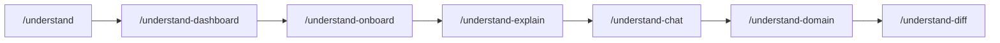

# Understand Anything (core-be learning curve)

[Understand Anything](https://github.com/karpathy/understand-anything) builds an interactive **knowledge graph** of this repo under `.understand-anything/`. Use it to onboard faster, explore architecture layers, ask questions grounded in the graph, and review PR impact against known components.

**Outputs (local):**

| Path | Purpose |
| --- | --- |
| `.understand-anything/knowledge-graph.json` | Main graph (nodes, edges, layers, tour) |
| `.understand-anything/meta.json` | Last analysis time and git commit |
| `.understand-anything/intermediate/` | Batch artifacts during analysis (regenerable) |
| `.understand-anything/.understandignore` | Extra exclude patterns (gitignore syntax) |

Hand-written architecture docs remain canonical for production decisions: [project-structure-guide.md](../reference/architecture/project-structure-guide.md), [domains-and-public-api-design.md](../reference/architecture/domains-and-public-api-design.md), and [production-readiness-audit-2026-05-29.md](../reviews/production-readiness-audit-2026-05-29.md). The graph complements those; it does not replace them.

---

## Prerequisites

1. **Clone and install** core-be per [getting-started/setup.md](../getting-started/setup.md) (`pnpm install`, env, optional `pnpm compose:up`).
2. **Install the Understand Anything plugin** in your AI environment (Cursor / Claude Code / Copilot — follow the plugin’s install guide for your platform).
3. **Open the repo root** (`core-be/`) as the working directory before invoking skills.
4. **First run builds the plugin** if needed (`@understand-anything/core`). Allow several minutes on a full scan (~1.6k analyzed files in a typical run).

---

## Step 1 — Generate the knowledge graph

In the agent chat (from the repo root):

```text
/understand
```

**What happens:** scan → layer detection → batched file analysis → graph assembly → validation. Progress is reported by phase (`[Phase N/7] …`).

**Useful flags:**

| Flag | When to use |
| --- | --- |
| `--full` | Force a full rebuild (ignore existing graph) |
| `--review` | Run the full LLM graph reviewer (slower, stricter) |
| `--language <lang>` | Summaries in another language (e.g. `es`); stored in config |
| `--auto-update` / `--no-auto-update` | Toggle optional graph refresh on commit |

**After a large refactor or domain move:** run `/understand --full` so layers and edges match the tree.

**Git worktrees (Cursor agents):** if you analyze from a worktree, the plugin may redirect output to the main checkout so the graph survives the session. Set `UNDERSTAND_NO_WORKTREE_REDIRECT=1` only if you intentionally want a per-worktree graph.

---

## Step 2 — Tune what gets analyzed (core-be)

Edit `.understand-anything/.understandignore` (already excludes `.cursor/` and `.claude/`). Uncomment patterns when you want a smaller graph:

- `docs/` — skip generated OpenAPI paths if you only care about `src/`
- `migrations/` — focus on runtime TypeScript
- `*.test.*` / `*.spec.*` — de-emphasize test files during onboarding

Syntax matches `.gitignore` (globs, `#` comments, `!` negation).

---

## Step 3 — Open the dashboard

```text
/understand-dashboard
```

Explore **layers**, **tour** steps, and node detail in the browser. If the command reports a missing graph, complete Step 1 first.

---

## Learning curve workflow (recommended order)

Use this sequence when ramping on core-be. Each step assumes `knowledge-graph.json` exists.



### 3.1 Guided tour (dashboard)

1. Start `/understand-dashboard`.
2. Open the **Tour** panel and walk steps in order (HTTP → middleware → domains → workers is the usual narrative).
3. Cross-check layers against [project-structure-guide.md](../reference/architecture/project-structure-guide.md).

### 3.2 Team onboarding doc

```text
/understand-onboard
```

Save the generated guide to `docs/ONBOARDING.md` when prompted, then open a PR if the team wants it versioned.

### 3.3 Deep-dive one module

Pick a file you will touch soon, for example:

```text
/understand-explain src/shared/middlewares/tenant/organization-rls-transaction.middleware.ts
```

```text
/understand-explain src/domains/tenancy/sub-domains/organization/organization.service.ts
```

### 3.4 Ask architecture questions

```text
/understand-chat How does organization RLS context reach Postgres?
```

```text
/understand-chat Where are BullMQ workers registered and started?
```

```text
/understand-chat What is the route flow for member invitations?
```

### 3.5 Business domain map (optional)

```text
/understand-domain
```

Use when you need **business flows** (domains, steps) rather than file-level imports.

### 3.6 Before PR review

On your feature branch:

```text
/understand-diff
```

Compares changed files to graph nodes and surfaces affected components and risks. Pair with [pr-review.md](../process/pr-review.md) and [production-readiness-audit-2026-05-29.md](../reviews/production-readiness-audit-2026-05-29.md) for security findings.

---

## Step 4 — Keep the graph fresh

| Event | Action |
| --- | --- |
| Daily feature work | Incremental `/understand` (default) after merging to `main` |
| New domain or large move | `/understand --full` |
| Pre-PR review on risky areas | `/understand-diff` |
| Release / audit prep | Regenerate graph, then re-run `/understand-onboard` if `docs/ONBOARDING.md` is maintained |

Check staleness in `.understand-anything/meta.json` (`lastAnalyzedAt`, `gitCommitHash`).

---

## Git and CI

- **Do not commit** `.understand-anything/intermediate/` (large, reproducible). It is gitignored.
- **Optional:** commit `.understand-anything/.understandignore` so the team shares the same scan scope.
- **Default:** treat `knowledge-graph.json` as **local** (regenerate per machine). If the team agrees to share one graph, commit only `knowledge-graph.json` + `meta.json` and document refresh policy in the PR.

CI does not run Understand Anything today; analysis is developer-local.

---

## core-be hotspots to explore early

| Topic | Starter prompt or path |
| --- | --- |
| Request + middleware | `/understand-explain src/app.ts` |
| Tenant RLS | `/understand-explain src/shared/middlewares/tenant/organization-rls-transaction.middleware.ts` |
| Domains layout | `/understand-chat What domains exist and how are routes registered?` |
| Workers | `/understand-chat How do BullMQ workers get organization context?` |
| Production risks | Read [production-readiness-audit-2026-05-29.md](../reviews/production-readiness-audit-2026-05-29.md), then `/understand-diff` on your branch |

---

## Troubleshooting

| Problem | Fix |
| --- | --- |
| `No knowledge graph found` | Run `/understand` from repo root |
| Plugin root not found | Reinstall Understand Anything; ensure `~/.understand-anything-plugin` or `CLAUDE_PLUGIN_ROOT` is set per platform docs |
| Analysis very slow | Narrow `.understandignore`; avoid `--review` unless needed |
| Graph out of date | `/understand --full` after merging latest `main` |
| Worktree graph missing | Re-run from main checkout or disable redirect with `UNDERSTAND_NO_WORKTREE_REDIRECT=1` |

---

## Related docs

- [cursor-backend-mcp.md](cursor-backend-mcp.md) — MCP for calling the live API from another repo
- [cursor-cloud-agent-environment.md](cursor-cloud-agent-environment.md) — cloud agent Docker setup
- [project-structure-guide.md](../reference/architecture/project-structure-guide.md) — layer matrix and naming
- [domains-and-public-api-design.md](../reference/architecture/domains-and-public-api-design.md) — domain layout and API patterns
