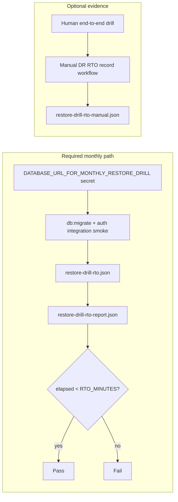

# Backup and restore drills

Operational procedure for monthly disaster-recovery verification. Targets align with [dr-runbook.md](dr-runbook.md): **RPO ≤ 15 minutes**, **RTO ≤ 1 hour** for API + worker availability.

Two GitHub Actions workflows:

| Workflow                                                                                       | Required?                  | Purpose                                                                                                                |
| ---------------------------------------------------------------------------------------------- | -------------------------- | ---------------------------------------------------------------------------------------------------------------------- |
| [scheduled-monthly-restore-rto.yml](../../.github/workflows/scheduled-monthly-restore-rto.yml) | **Yes** (monthly schedule) | Automated `db:migrate` + integration smoke against `DATABASE_URL_FOR_MONTHLY_RESTORE_DRILL`; fails without measurement |
| [manual-dr-rto-record.yml](../../.github/workflows/manual-dr-rto-record.yml)                   | No (optional evidence)     | Record human end-to-end RTO via `recorded_rto_minutes` after a manual drill                                            |

The scheduled workflow runs on the **1st of each month** (06:00 UTC) and can be triggered on demand with `workflow_dispatch`.

---

## RTO threshold (`RTO_MINUTES`)

| Setting       | Default | Where                                                                                                                                                                                             |
| ------------- | ------- | ------------------------------------------------------------------------------------------------------------------------------------------------------------------------------------------------- |
| `RTO_MINUTES` | `60`    | Workflow `env` in [scheduled-monthly-restore-rto.yml](../../.github/workflows/scheduled-monthly-restore-rto.yml) and [manual-dr-rto-record.yml](../../.github/workflows/manual-dr-rto-record.yml) |

Elapsed restore time must be **strictly less than** `RTO_MINUTES × 60` seconds. Both workflows **fail** when elapsed time meets or exceeds the threshold.

To tighten or relax the gate, edit the workflow `env` default and re-run.

---

## What gets measured



| Path                     | Workflow                           | Metric                                                    | Scope                                                |
| ------------------------ | ---------------------------------- | --------------------------------------------------------- | ---------------------------------------------------- |
| **Automated (required)** | Monthly backup restore & RTO drill | Wall seconds from migrate start through integration smoke | Application recovery after DB endpoint is available  |
| **Manual (optional)**    | Manual DR RTO record               | `recorded_rto_minutes` input                              | End-to-end (Neon branch creation through smoke pass) |

Automated timing does **not** include Neon console time to create a branch; use the optional manual workflow for full end-to-end RTO evidence.

A green **monthly** run always means migrate + smoke completed and `within_rto_target` is `true`. Missing `DATABASE_URL_FOR_MONTHLY_RESTORE_DRILL`, skipped restore steps, or `rto_not_recorded` outcomes are **not** valid success paths.

---

## Artifacts and job summary

### Monthly backup restore & RTO drill

Open **Actions → Monthly backup restore & RTO drill**:

| Artifact                   | When                                              |
| -------------------------- | ------------------------------------------------- |
| `restore-drill-rto`        | Automated migrate + smoke completed               |
| `restore-drill-rto-report` | Consolidated JSON from **Record and publish RTO** |

Each JSON file includes `restore_seconds`, `rto_minutes`, `rto_target_seconds`, and `within_rto_target`. The job summary table on the run page mirrors these fields.

### Manual DR RTO record (optional)

Open **Actions → Manual DR RTO record (optional)**:

| Artifact                   | When                                        |
| -------------------------- | ------------------------------------------- |
| `restore-drill-rto-manual` | `recorded_rto_minutes` provided on dispatch |

### Repository secret (required for monthly drill)

Set **`DATABASE_URL_FOR_MONTHLY_RESTORE_DRILL`** as a **repository secret** to a throwaway Neon branch connection string (PITR snapshot or branch from production). Without it, the monthly workflow **fails** — it does not report green with an unmeasured RTO.

---

## Human drill checklist

Approximate duration: 60 minutes.

1. **Schedule** — Platform owner books a 1-hour window; notify the incidents channel.
2. **Neon branch** — Create branch from production (or staging) at a timestamp **15 minutes** in the past.
3. **Migrate** — `DATABASE_URL=<branch> pnpm db:migrate` (idempotent).
4. **Smoke** — Against a throwaway Railway preview or local API with branch URL: `pnpm test:api-smoke` or `pnpm verify:base`.
5. **Redis** — Confirm Upstash backup/restore docs still match [dr-runbook.md](dr-runbook.md) (no data mutation required for API-only drill).
6. **Sign-off** — Optionally run **Manual DR RTO record** with **`recorded_rto_minutes`**, or post:

   ```text
   Restore drill YYYY-MM-DD: RPO verified [yes/no], RTO [minutes], issues: [none|…]
   ```

To record optional evidence in Actions:

1. Complete the checklist above.
2. **Actions → Manual DR RTO record (optional) → Run workflow**.
3. Set **`recorded_rto_minutes`** to measured minutes from incident start to smoke pass.

---

## Acceptance (checklist #96)

- Monthly scheduled run **requires** `DATABASE_URL_FOR_MONTHLY_RESTORE_DRILL` and produces a measured RTO artifact.
- Restore time is **recorded** in the workflow job summary and uploaded as JSON.
- Elapsed time is **validated** against `RTO_MINUTES` (default 60); the workflow fails on breach or when restore steps do not complete.
- Failures surface via the **Alert on drill failure** job.

---

## Out of scope

- Does not restore production automatically
- Does not rotate secrets or change Railway services
- Does not replace Neon/Upstash vendor DR tests

Escalate gaps using the [dr-runbook decision tree](dr-runbook.md).

---

## Related

- [dr-runbook.md](dr-runbook.md) — failover, RTO/RPO targets, quarterly review log
- [restore-drill.md](../deployment/restore-drill.md) — deployment-focused drill notes
- [cicd-and-deployment.md](../deployment/ci-cd/cicd-and-deployment.md) — CI secrets including `DATABASE_URL_FOR_MONTHLY_RESTORE_DRILL`
