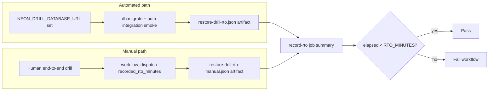

# Backup and restore drills

Operational procedure for monthly disaster-recovery verification. Targets align with [dr-runbook.md](dr-runbook.md): **RPO ≤ 15 minutes**, **RTO ≤ 1 hour** for API + worker availability.

The scheduled workflow [restore-drill.yml](../../.github/workflows/restore-drill.yml) runs on the **1st of each month** (06:00 UTC) and records whether measured restore time is below the RTO threshold.

---

## RTO threshold (`RTO_MINUTES`)

| Setting | Default | Where |
| ------- | ------- | ----- |
| `RTO_MINUTES` | `60` | Workflow `env` in [restore-drill.yml](../../.github/workflows/restore-drill.yml) |

Elapsed restore time must be **strictly less than** `RTO_MINUTES × 60` seconds. The workflow **fails** when elapsed time meets or exceeds the threshold.

To tighten or relax the gate for a single run, set repository variable `RTO_MINUTES` (if configured) or edit the workflow default and re-run.

---

## What gets measured



| Path | Metric | Scope |
| ---- | ------ | ----- |
| **Automated** | Wall seconds from migrate start through integration smoke | Application recovery after DB endpoint is available |
| **Manual** | `recorded_rto_minutes` workflow input | End-to-end (Neon branch creation through smoke pass) |

Automated timing does **not** include Neon console time to create a branch; use the manual input for full end-to-end RTO.

---

## Artifacts and job summary

After each run, open **Actions → Restore drill (monthly)**:

| Artifact | When |
| -------- | ---- |
| `restore-drill-rto` | Automated migrate + smoke completed |
| `restore-drill-rto-manual` | `recorded_rto_minutes` provided on dispatch |
| `restore-drill-rto-report` | Consolidated JSON from **Record and publish RTO** (either path, or `rto_not_recorded`) |

Each JSON file includes `restore_seconds`, `rto_minutes`, `rto_target_seconds`, and `within_rto_target`. The job summary table on the run page mirrors these fields.

### Repository secret

Set **`NEON_DRILL_DATABASE_URL`** to a throwaway Neon branch connection string (PITR snapshot or branch from production) to enable the automated path.

### Manual recording

1. Complete the [human checklist](#human-drill-checklist) below.
2. **Actions → Restore drill (monthly) → Run workflow**.
3. Set **`recorded_rto_minutes`** to measured minutes from incident start to smoke pass.

---

## Human drill checklist (≈ 60 minutes)

1. **Schedule** — Platform owner books a 1-hour window; notify the incidents channel.
2. **Neon branch** — Create branch from production (or staging) at a timestamp **15 minutes** in the past.
3. **Migrate** — `DATABASE_URL=<branch> pnpm db:migrate` (idempotent).
4. **Smoke** — Against a throwaway Railway preview or local API with branch URL: `pnpm test:api-smoke` or `pnpm verify:base`.
5. **Redis** — Confirm Upstash backup/restore docs still match [dr-runbook.md](dr-runbook.md) (no data mutation required for API-only drill).
6. **Sign-off** — Re-run the workflow with **`recorded_rto_minutes`**, or post:

   ```text
   Restore drill YYYY-MM-DD: RPO verified [yes/no], RTO [minutes], issues: [none|…]
   ```

---

## Acceptance (checklist #96)

- Restore time is **recorded** in the workflow job summary and uploaded as a JSON artifact.
- Elapsed time is **validated** against `RTO_MINUTES` (default 60); the workflow fails on breach.
- Failures surface via the **Alert on drill failure** job.

---

## Out of scope

- Does not restore production automatically
- Does not rotate secrets or change Railway services
- Does not replace Neon/Upstash vendor DR tests

Escalate gaps using the [dr-runbook decision tree](dr-runbook.md).

---

## Related

- [dr-runbook.md](dr-runbook.md) — failover, RTO/RPO targets, quarterly review log
- [restore-drill.md](../deployment/restore-drill.md) — deployment-focused drill notes
- [cicd-and-deployment.md](../deployment/ci-cd/cicd-and-deployment.md) — CI secrets including `NEON_DRILL_DATABASE_URL`
