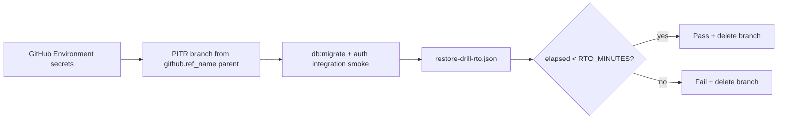

# Backup and restore drills

Operational procedure for monthly disaster-recovery verification. Targets align with [dr-runbook.md](dr-runbook.md): **RPO ≤ 15 minutes**, **RTO ≤ 1 hour** for API + worker availability.

The **[scheduled-monthly-restore-rto.yml](../../.github/workflows/scheduled-monthly-restore-rto.yml)** workflow runs on the **1st of each month** (06:00 UTC) and on **`workflow_dispatch`**. It is fully automated — no human input.

---

## RTO threshold (`RTO_MINUTES`)

| Setting | Default | Where |
| --- | --- | --- |
| `RTO_MINUTES` | `60` | Workflow `env` in [scheduled-monthly-restore-rto.yml](../../.github/workflows/scheduled-monthly-restore-rto.yml) |

Elapsed restore time must be **strictly less than** `RTO_MINUTES × 60` seconds. The workflow **fails** when elapsed time meets or exceeds the threshold.

---

## What gets measured (automated)

| Step | Automated action |
| ---- | ---------------- |
| **Parent branch** | Neon branch named **`github.ref_name`** (`main` on schedule; selected branch on manual run) |
| **Branch create** | Child branch from that parent at **15-minute** PITR lookback |
| **Recovery** | `pnpm db:migrate` + auth integration smoke against the new branch |
| **RTO clock** | Starts at branch creation; ends after smoke passes |
| **Cleanup** | Ephemeral branch deleted (also has `expires_at` TTL) |

Neon branch names must match git long-lived branches (`main`, `dev`).

---

## GitHub Environment secrets (required)

Set in `.env.development` / `.env.production` under the **GitHub Secrets** half and push with `pnpm github:sync` (see [credentials-and-env.md](../integrations/credentials-and-env.md)).

| Secret | Purpose |
| ------ | ------- |
| `MONTHLY_DATABASE_RESTORE_DRILL_NEON_API_KEY` | Neon Console → Developer settings → API key |
| `MONTHLY_DATABASE_RESTORE_DRILL_NEON_PROJECT_ID` | Neon project **Settings → General → Project ID** |

The workflow maps **`main` → `production`**, **`dev` → `development`** (same as CD). Without both secrets in the matching GitHub Environment, the monthly workflow **fails**.

---

## Artifacts and job summary

Open **Actions → Monthly backup restore & RTO drill**:

| Artifact                   | When                                              |
| -------------------------- | ------------------------------------------------- |
| `restore-drill-rto`        | Automated migrate + smoke completed               |
| `restore-drill-rto-report` | Consolidated JSON from **Record and publish RTO** |

Each JSON file includes `restore_seconds`, `rto_minutes`, `rto_target_seconds`, `parent_branch_name`, and `within_rto_target`.

---

## Acceptance

- Monthly scheduled run produces a measured RTO artifact using automated Neon PITR branch creation.
- Restore time is **recorded** in the workflow job summary and uploaded as JSON.
- Failed runs emit a workflow error notice for follow-up.

Related: [restore-drill.md](../deployment/restore-drill.md), [dr-runbook.md](dr-runbook.md), [credentials-and-env.md](../integrations/credentials-and-env.md).
