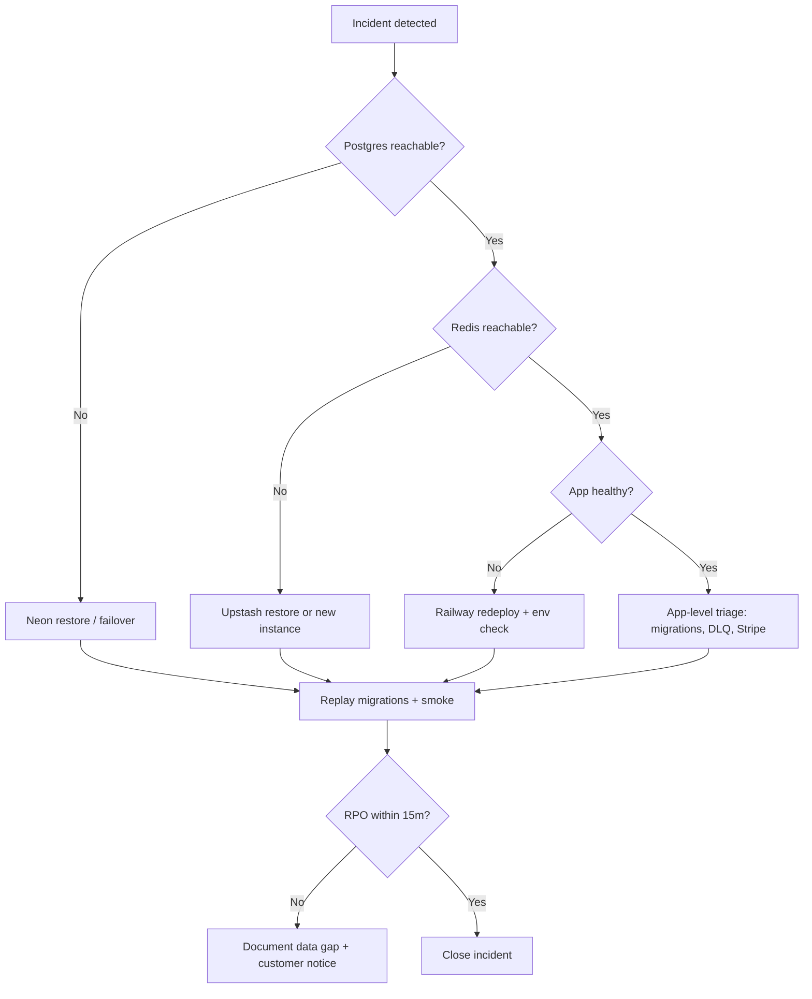

# Disaster recovery runbook

Targets for **core-be** API and worker on Railway with Neon Postgres and Upstash Redis.

| Metric                   | Target         | Notes                                                      |
| ------------------------ | -------------- | ---------------------------------------------------------- |
| **RTO** (recovery time)  | **1 hour**     | Restore service availability for authenticated API traffic |
| **RPO** (recovery point) | **15 minutes** | Maximum acceptable data loss window                        |

Neon point-in-time recovery (PITR) and Railway redeploys are the primary mechanisms. This runbook assumes backups and secrets are already provisioned per [cicd-and-deployment.md](../deployment/ci-cd/cicd-and-deployment.md).

---

## When to invoke

- Regional or provider outage affecting Neon, Upstash, or Railway
- Accidental destructive migration or data corruption confirmed in Postgres
- Complete loss of the production API or worker service with no healthy `/health`

---

## Roles and communication

1. **Incident lead** — coordinates timeline, RTO/RPO tracking, and customer comms.
2. **Platform** — Neon branch restore, Railway redeploy, env/secrets verification.
3. **Application** — migration replay, seed smoke, `pnpm test:api-smoke` against restored stack.

Post status updates in the team channel every **15 minutes** until RTO is met or scope is escalated.

---

## Decision tree

---

## Recovery procedures

### 1. Postgres (Neon) — RPO ≤ 15 minutes

1. Open Neon console → production project → **Restore** or create branch from PITR **≤ 15 minutes** before failure.
2. Update `DATABASE_URL` in Railway (API + worker) to the restored branch/endpoint.
3. Run `pnpm db:migrate` against the restored database (idempotent; fixes schema drift).
4. Verify row counts on critical tables (`tenancy.organizations`, `billing.subscriptions`, `auth.auth_sessions`).

### 2. Redis (Upstash)

1. If Redis is unavailable, provision or restore the shared Redis instance (see [redis-topology.md](../deployment/runbooks/redis-topology.md)).
2. Update `REDIS_URL` on API and worker services. Remove `REDIS_BULLMQ_URL` or set it to the same endpoint if it exists from an older split topology.
3. Expect **cold** permission cache, idempotency keys, and session token cache — traffic may be slower until caches warm.
4. Inspect DLQ depth after workers restart ([dlq-runbook.md](dlq-runbook.md)).

### 3. Application (Railway)

1. Redeploy latest known-good image from `main` (or previous green deployment).
2. Confirm secrets: `JWT_*`, `STRIPE_*`, `SENTRY_DSN`, `ALLOWED_ORIGINS`, `DATABASE_URL`, `REDIS_URL`, `DEPLOYMENT_TOTAL_REPLICA_COUNT`.
3. Scale workers to normal count ([worker-scaling.md](../deployment/runbooks/worker-scaling.md)).
4. Hit `GET /health` until 200 with all dependencies available.

### 4. Validation (before closing)

| Check                 | Command / endpoint                                                                                                             |
| --------------------- | ------------------------------------------------------------------------------------------------------------------------------ |
| Migrations            | `pnpm db:migrate`                                                                                                              |
| Local gate (optional) | `pnpm verify:base` with restored URLs in `.env`                                                                                |
| Deployed smoke        | `SMOKE_BASE_URL=… pnpm test:api-smoke`                                                                                         |
| Stripe webhooks       | Reconcile stuck events — [stripe-subscription-reconciliation.md](../deployment/runbooks/stripe-subscription-reconciliation.md) |

---

## Post-incident

1. Record actual RTO/RPO achieved and root cause.
2. Open follow-up tasks for prevention (monitoring, migration guards, backup drill).
3. Log outcomes in the [quarterly review log](#quarterly-review-log) when the next scheduled review runs.

---

## Quarterly review log

Review this runbook at the start of each calendar quarter (January, April, July, October). Confirm RTO/RPO targets, Neon/Upstash/Railway steps, and cross-links still match production. Run or schedule the [monthly restore drill](backup-drills.md) in the same quarter when possible; the workflow records restore duration and fails when elapsed time is not below **`RTO_MINUTES`** (default 60).

| Quarter | Reviewer                    | Review date | Outcome | Notes                                                                                                    |
| ------- | --------------------------- | ----------- | ------- | -------------------------------------------------------------------------------------------------------- |
| 2026-Q2 | Production readiness verify | 2026-05-20  | Passed  | Linked from [docs/index.md](../index.md); procedures aligned with restore drill and migrations reference |

---

## Related

- [docs/index.md](../index.md) — documentation index (links here)
- [backup-drills.md](backup-drills.md) — monthly automated restore drill (`MONTHLY_DATABASE_RESTORE_DRILL_NEON_API_KEY`; Neon project `core-be` by name; parent branch = workflow ref)
- [restore-drill.md](../deployment/restore-drill.md) — workflow secrets and CI artifact names
- [cicd-and-deployment.md](../deployment/ci-cd/cicd-and-deployment.md) — deploy and secrets
- [runbook-dev-to-production.md](../deployment/runbooks/runbook-dev-to-production.md) — production promotion
- [observability.md](../deployment/runbooks/observability.md) — Sentry and health signals
- [dlq-runbook.md](dlq-runbook.md) — queue recovery after Redis/worker outage
