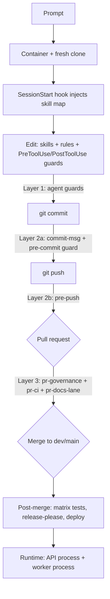

# End-to-end flow: prompt to production

How a change travels through core-be — from an AI prompt (Claude Code on the web /
Cursor) through the clone, the agent processing layer, the git hooks, PR CI, and
post-merge release/deploy — and the two runtime processes it ends up running in.

This is a map of *where enforcement happens*, not a tutorial. Each stage links to
the file that actually implements it so you can verify in detail.

**Related docs:** [git-workflow.md](git-workflow.md) (branch naming, promotion),
[release-versioning.md](release-versioning.md) (commit prefix to version bump),
[../deployment/ci-cd/branch-protection.md](../deployment/ci-cd/branch-protection.md)
(exact required checks), [../getting-started/requirement-intake.md](../getting-started/requirement-intake.md)
(how to phrase a new requirement), [../../agent-os/docs/skill-triggers.md](../../agent-os/docs/skill-triggers.md)
(file pattern to skill map).

---

## The whole flow at a glance

core-be is built around **three enforcement layers**: (1) agent-time guards while
code is edited, (2) git hooks at commit and push, (3) CI on the PR and post-merge.
A change passes through all three before it can deploy.

---

## Stage 1: prompt, container, and clone

- A session starts from the web/desktop/mobile app, a GitHub Action, or an IDE,
  bound to a working branch (web sessions are pinned to a `claude/*` branch by the
  cloud git proxy).
- The runtime is an **ephemeral, isolated container**. The repository is **cloned
  fresh** on start; anything not committed and pushed is lost when the container is
  reclaimed.
- **Outbound network access** is governed by the environment's network policy.
- **Env values** load via `src/shared/config/load-env-files.ts` (`.env.<NODE_ENV>`
  then `.env.local` override); the hosted environment mapping is canonical in
  `tooling/setup/setup.config.json` and pushed to GitHub Environments by
  `pnpm github:sync`.

For a *new requirement*, the intake contract in
[../getting-started/requirement-intake.md](../getting-started/requirement-intake.md)
applies: the agent fills smart defaults, posts **one** Plan (requirement type, fields,
ordered skills, files, verification), and proceeds on **go**.

---

## Stage 2: agent processing (Layer 1)

### SessionStart

`.claude/settings.json` wires a `SessionStart` hook to `agent-os/hooks/session-start.sh`,
which injects `agent-os/docs/skill-triggers.md` into context so the session begins
knowing which skill to run for each file pattern. It fails open (missing map or `jq`
means no context, never an error).

### Skill and rule routing

The rule is **consult `skill-index` first**, then run the mapped skills. There are
39 project skills (`agent-os/skills/skill-index/SKILL.md`) and 9 read-only diagnostic
sub-agents (`agent-os/docs/agents-catalog.md`). Three things fire on a change:

- **Always-on rules** — `engineering-principles.mdc`, `project-identity.mdc`.
- **Glob-scoped rules** — e.g. `import-paths.mdc` (`@/` aliases, no `../`),
  `full-names-only.mdc`, `object-params.mdc`, `core-be-src-architecture.mdc`.
- **Skill triggers** — e.g. `*.routes.ts` runs `route-schema-doc-guard`,
  `route-catalog`, `seed-maintainer`; `*.schema.ts` runs `schema-generator`,
  `sql-design-guard`, `db-migration-maintainer`, `rls-tenant-isolation-guard`.

Multi-skill changes run in a fixed order (scaffold to schema to migration to events
to routes/OpenAPI to seed to tsdoc to overview to narrative to tests to quality to
structure to docs, with `pnpm tsdoc:check` last).

### Edit-time guards

| Hook | Script | Behavior |
| ---- | ------ | -------- |
| PreToolUse (`Edit\|Write\|MultiEdit`) | `agent-os/hooks/guard-edits.sh` | Blocks 3 hard-rule violations instantly: R1 `getRequestDatabase()` / `request-database.context` in `*.worker.ts` / `*.processor.ts`; R2 a `../` import under `src/`; R3 hand-editing a generated file. Fails open. |
| PostToolUse (`Edit\|Write`) | `agent-os/hooks/skill-reminder.sh` | Prints the skills to run for the edited file pattern. |

### Self-tests for the tooling

The `agent-os/` bundle is gated like product code. When `agent-os/**` or `.claude/**`
changes, PR CI runs `pnpm agent-os:check` (`agent-os/evals/check.ts`, Tier 1 — frontmatter,
counts, index-vs-disk, hook portability, referenced paths exist) and
`pnpm agent-os:triggers:strict` (`agent-os/evals/trigger-eval.ts`, Tier 2 — does the
routing map surface the expected skill for a changed file).

---

## Stage 3: commit (Layer 2a)

### commit-msg

`.husky/commit-msg` runs `commitlint --edit` — Conventional Commits are enforced
(the prefix also drives the version bump; see [release-versioning.md](release-versioning.md)).

### pre-commit guard

`.husky/pre-commit` runs `pnpm guard:pre-commit`
(`src/scripts/tooling/run-pre-commit-guard.ts`) — a labeled, fail-fast sequence.
List the steps with `pnpm guard:pre-commit:list`. Some are conditional on staged paths.

| Step | What runs | When |
| ---- | --------- | ---- |
| lint-staged | Biome + markdownlint (`lint-staged.config.mjs`) | always |
| typecheck | `pnpm typecheck` | always |
| domain structure | `pnpm validate:domain:strict` | always |
| architecture policy tests | `pnpm test:global` | when `src/domains/**/*.ts` staged |
| scripts layout | `pnpm validate:scripts-layout` | always |
| route catalog | `pnpm routes:catalog` regenerate + drift check | always |
| source tree | regenerate + drift check | when `src/**` / `tooling/**` staged |
| OpenAPI / Postman | `pnpm docs:check` | when OpenAPI inputs staged |
| TSDoc coverage | `pnpm tsdoc:check` (budget ratchet) | always |
| test naming | `pnpm validate:test-naming` | always |
| migration safety | `pnpm db:migrate:lint` + DBML regenerate | when `migrations/*.sql` staged |
| project identity | `pnpm tool:generate-project-identity:check` | always |
| env example | `pnpm tool:sync-env-example` | always |
| staged secrets | `gitleaks protect --staged` | always |
| conflict markers / large files | reject conflict markers and files over 1MB | always |

---

## Stage 4: push (Layer 2b)

`.husky/pre-push` is a faster gate than CI:

- **Branch-name policy** — must match `dev`, `main`, `claude/*`, or
  `<type>/<description>`. Bypass once with `SKIP_BRANCH_CHECK=1`.
- `pnpm typecheck`, `pnpm build`, `pnpm build:check`.
- Markdown lint on the pushed diff (only when `.md` changed).
- `pnpm test:unit` (only when unit-relevant files changed).
- SonarQube gate `pnpm sonar:scan` (only when deployed-surface `src/*.ts` changed;
  bypass with `SKIP_SONAR=1`).

Then `git push -u origin <branch>`. A PR is **not** created automatically.

---

## Stage 5: pull request checks (Layer 3)

Three workflows fire on a PR into `dev` / `main`.

- **`pr-governance.yml`** — Conventional-Commits PR title, size label, `.env` file
  guard, path labels. Reports as the required check `Checks`.
- **`pr-ci.yml`** — a `changes` path filter then parallel jobs. Fast and mostly
  DB-less.
- **`pr-docs-lane.yml`** — markdownlint + lychee link check, only when a PR touches
  `*.md` (separate workflow so code-only PRs do not show it skipped).

### What actually blocks a merge

`pr-ci.yml` runs ~16 jobs but only **12 are merge-blocking** (the rest run as signal).
The authoritative list is
[../deployment/ci-cd/branch-protection.md](../deployment/ci-cd/branch-protection.md),
mirrored in `.github/rulesets/{main,dev}.json`.

| Required check | Notes |
| -------------- | ----- |
| `Lint`, `Typecheck`, `Static sync`, `Migration lint`, `Build verify` | static + build |
| `Security audit`, `Security secrets`, `Security SAST` | pnpm audit, gitleaks, Semgrep |
| `Contract + property` | offline nock contracts + fast-check |
| `RLS security (non-superuser)` | the one DB-backed PR check (see below) |
| `unit / Unit + global` | reusable unit workflow (note the `unit /` prefix) |
| `Checks` | from `pr-governance.yml` |

Two gotchas: GitHub reports the **bare job `name:`** (requiring `PR CI / Lint` matches
nothing and silently blocks every merge), and the extra pr-ci jobs — `Actionlint`,
`Security IaC (Trivy config)`, `Dependency review`, `OpenAPI breaking-change`,
`agent-os evals` — run but are **not** in the required set. Docs-only PRs skip all
pr-ci jobs, and skipped required checks do not block.

### Why the RLS check runs as a non-superuser

Postgres superusers are exempt from RLS *and* from `FORCE ROW LEVEL SECURITY`, so a
superuser would make every isolation policy pass even when broken (this is how an
org-mandated-MFA bypass once shipped). The `RLS security` job therefore starts a real
Postgres, and the suite under `src/tests/security/rls` runs as the non-privileged
`core_be_app` role (`SET LOCAL ROLE`). Tenant policies key on the
`app.current_organization_id` GUC, with an `app.global_retention_cleanup` bypass for
retention workers (`migrations/00000000000000_init.sql`). This is the runtime contract
behind the PreToolUse R1 guard and the `rls-tenant-isolation-guard` skill.

---

## Stage 6: post-merge (release and deploy)

On push to `dev` / `main`, `post-merge-ci.yml` runs publish/deploy automation — the
same SHA already passed PR CI.

### Matrix tests

`reusable-vitest-postgres-redis.yml` runs the exhaustive DB-backed suite that PR CI
skips for speed:

- **Three parallel shards**, each with its own Postgres 17 + Redis, scoped by
  `VITEST_DOMAIN_FILTER`: `tenancy + billing`, `auth + user`, and
  `notify + audit + upload + rest` (the rest shard also runs the full
  `--project security` and `performance`).
- A separate **unit-coverage** lane (no Postgres) so the merged number is the true
  union of unit + DB-bound tests.
- A **coverage gate** that merges all shard reports, runs the route success-status
  coverage gate, and checks thresholds. On `dev` both gates are `--report-only`; on
  `main` they block.

### release-please and deploy

- **release-please** is config-driven per channel: `dev` uses
  `.github/release-please/config.dev.json` (prerelease, publishes immediately,
  `CHANGELOG-dev.md`); `main` uses `config.json` (stable, created as a **draft**,
  `CHANGELOG.md`).
- **Deploy** (`reusable-railway-deploy.yml`) resolves branch to environment
  (`dev` to development, `main` to production), mirrors the GitHub Environment into
  Railway, then gates: `migrate` to deploy API from the scanned GHCR image to curl
  API `/readyz` to deploy worker (gated only by Railway terminal SUCCESS, since the
  worker is internal-only). On production success the images are retagged `:previous`
  for rollback; on failure, `:deploy-failed-<sha>`.
- For `main`, the stable release is **published** only after a successful deploy, then
  a back-merge of `main` to `dev` is dispatched.

```mermaid
flowchart LR
  merge[Merge to dev/main] --> docker[Docker build + Trivy]
  docker --> matrix[3-shard matrix tests + unit coverage]
  matrix --> coverage[Merged coverage gate]
  coverage --> release[release-please]
  release --> docs[API docs publish]
  docs --> deploy[Railway deploy]
  deploy --> live[migrate, API /readyz, worker SUCCESS]
  live --> publish[Publish release + back-merge main to dev]
```

---

## Runtime: two processes

The deployed image runs as two processes (see `docs/deployment/docker-images.md`):

- **API process** — `HTTP request to middleware to controller to service to
  repository to Postgres`. Controllers coordinate, services express intent,
  repositories own all SQL, Postgres is the only source of truth.
- **Worker process** (`pnpm dev:worker` / `Dockerfile.worker`) — pull-based BullMQ
  jobs booted by `registerDomainWorkers()` in `src/infrastructure/queue/bootstrap.ts`:
  selects queue families (`WORKER_QUEUE_FAMILIES`), budgets the Postgres pool, audits
  the scheduler registry, registers repeatable retention jobs, instantiates each
  worker (skipping `mail` / `stripe-webhook` when their secrets are absent), and
  attaches a per-queue `<queue>-dlq` plus a Sentry `failed` listener. Workers never
  use `getRequestDatabase()`; they set the org GUC through context wrappers. DLQ
  inspection and replay: [dlq-runbook.md](dlq-runbook.md).

---

## Key files

| Area | File |
| ---- | ---- |
| Claude Code hooks | `.claude/settings.json`, `agent-os/hooks/*.sh` |
| Skill routing | `agent-os/skills/skill-index/SKILL.md`, `agent-os/docs/skill-triggers.md` |
| agent-os self-tests | `agent-os/evals/check.ts`, `agent-os/evals/trigger-eval.ts` |
| Commit guard | `.husky/pre-commit`, `src/scripts/tooling/run-pre-commit-guard.ts`, `lint-staged.config.mjs` |
| Push guard | `.husky/pre-push`, `.husky/commit-msg` |
| PR CI | `.github/workflows/pr-ci.yml`, `pr-governance.yml`, `pr-docs-lane.yml` |
| Required checks | `docs/deployment/ci-cd/branch-protection.md`, `.github/rulesets/*.json` |
| Post-merge | `.github/workflows/post-merge-ci.yml`, `reusable-vitest-postgres-redis.yml`, `reusable-railway-deploy.yml` |
| RLS isolation | `src/tests/security/rls/`, `migrations/00000000000000_init.sql` |
| Worker runtime | `src/infrastructure/queue/bootstrap.ts` |
