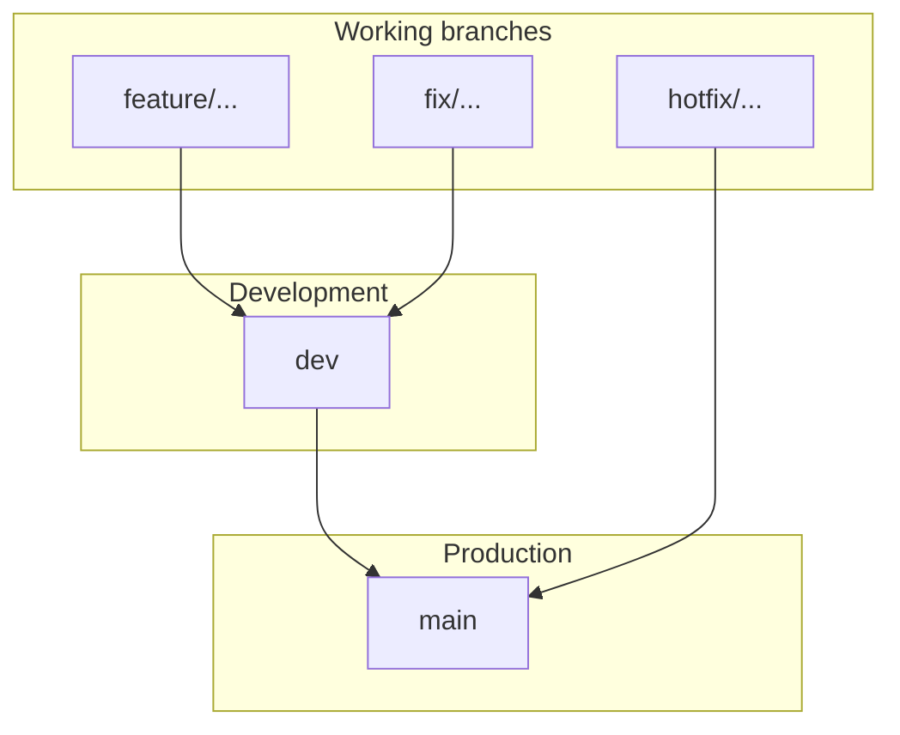

# Git Branch Naming and PR Workflow

Professional branch strategy and pull-request flow for core-be. For the full setup guide see [SETUP.md](../../SETUP.md). For CI/CD and deployment (including which tokens you need), see [cicd-and-deployment.md](../deployment/ci-cd/cicd-and-deployment.md).

---

## Primary long-lived branches

These branches represent environments and use simple, standard names.

| Branch   | Purpose                           | Contains                     |
| -------- | --------------------------------- | ---------------------------- |
| **main** | Production-ready code             | Stable, fully tested code    |
| **dev**  | Integration branch for developers | Latest development changes   |

---

## Short-lived working branches (created from dev)

Use the format: **type/short-description**

### Branch type prefixes

| Type     | Use for               | Example                    |
| -------- | --------------------- | -------------------------- |
| feature  | New feature           | feature/ai-stream-response |
| fix      | Bug fix               | fix/login-error            |
| refactor | Code improvement      | refactor/auth-module       |
| docs     | Documentation         | docs/readme-update         |
| test     | Adding tests          | test/user-service          |
| chore    | Maintenance           | chore/update-dependencies  |
| hotfix   | Urgent production fix | hotfix/payment-crash       |

### Examples

- feature/user-authentication
- feature/ai-stream-response
- fix/token-expiry
- refactor/user-service
- docs/api-documentation

### Enterprise format (with ticket ID)

type/ticket-description

- feature/AI-101-stream-response
- fix/API-205-login-error
- refactor/SYS-88-clean-architecture

### Accepted type prefixes (enforced)

`feature` · `feat` · `fix` · `hotfix` · `refactor` · `docs` · `test` · `chore` · `ci` · `perf` · `build` · `style` · `revert` (`feat` and `feature` are both accepted; the set mirrors the conventional-commit types).

[`.husky/pre-push`](../../.husky/pre-push) rejects any branch whose name is not `dev`, `main`, `claude/*`, or `<type>/<description>` using a type above. Bypass a single push with `SKIP_BRANCH_CHECK=1 git push` (prefer renaming the branch instead). Canonical AI rule: [`agent-os/rules/git-branch-naming.mdc`](../../agent-os/rules/git-branch-naming.mdc).

### AI / automation branches (`claude/*`)

Claude Code **web/cloud** sessions run on a platform-assigned `claude/<slug>` branch (e.g. `claude/vigilant-hopper-cbl23b`) — **not** a `feature/`/`fix/` branch. The name is created by the platform **before** the sandbox starts, and the cloud git proxy restricts each session to pushing only that working branch, so repo skills, rules, and hooks cannot rename it. `claude/*` is therefore allowlisted by the pre-push policy by design (blocking it would break every web session's push). To land that work under a `feature/`/`fix/` name, rename at the PR/merge layer or teleport the session to a local checkout — do not switch branches from inside the session without explicit permission.

---

## Full workflow: merge flow



**Merge order:** feature/... → dev → main

---

## Step-by-step PR workflow

### 1. Create feature branch from dev

```bash
git checkout dev
git pull origin dev
git checkout -b feature/ai-stream-response
```

### 2. Work and commit

Use [Conventional Commits](https://www.conventionalcommits.org/) for commit messages (enforced in PR checks):

```bash
git add .
git commit -m "feat: add AI streaming response"
```

> The commit **type** also drives the release version — `fix:` → patch, `feat:` → minor, `feat!:` (or a `BREAKING CHANGE:` footer) → major. See [release-versioning.md](release-versioning.md) for the full cheat-sheet.

### 3. Push branch

```bash
git push origin feature/ai-stream-response
```

### 4. Open pull request

- **Target branch:** `dev` (for feature/fix/refactor branches).
- PR title must follow conventional commits (e.g. `feat: add AI streaming response`).
- CI runs automatically (quality, tests, security, Docker build). All must pass.
- **Protected branches:** Required checks and merge rules for `main` and `dev` are documented in [branch-protection.md](../deployment/ci-cd/branch-protection.md).
- After review and approval, merge into `dev`.

### 5. Promote to production

- Open a PR **dev → main** when changes are ready for production.
- After merge, production deploys (Railway). Ensure migrations and runbook steps are done.

### Hotfix (production fix)

- Branch from **main**: `git checkout main && git pull && git checkout -b hotfix/payment-crash`.
- Fix, commit, push. Open PR **hotfix/... → main**.
- After merge, deploy to production. Then merge **main → dev** to keep long-lived branches in sync.

---

## Golden rules

**DO:**

- Use lowercase
- Use hyphens in branch names
- Keep names short and clear
- Use prefixes (feature/, fix/, refactor/, docs/, test/, chore/, hotfix/)

**DO NOT:**

- Use spaces in branch names
- Use very long sentences
- Use random or personal branch names

---

## Summary

**Long-lived branches:** main, dev

**Short-lived branches:** feature/short-description, fix/short-description, refactor/short-description, docs/..., test/..., chore/..., hotfix/...

**PR flow:** feature → dev → main. CI runs on every PR; deployments to Railway trigger on push to dev (development) and main (production).
