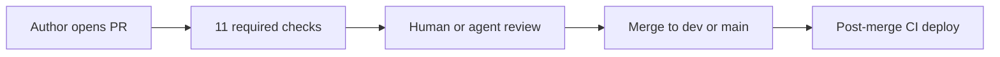
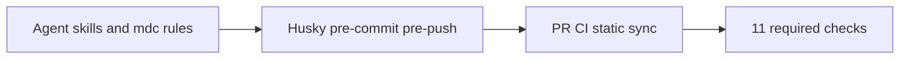

# Pull request review (core-be)

**Authors:** use [`.github/PULL_REQUEST_TEMPLATE.md`](../../.github/PULL_REQUEST_TEMPLATE.md) and run `pnpm ci:local` (or wait for CI).  
**Reviewers (human and agent):** use this doc as the shared rubric. Severity labels match [`.cursor/rules/engineering-principles.mdc`](../../.cursor/rules/engineering-principles.mdc) PR review mode.

---

## At a glance

| Item | Reference |
| ---- | --------- |
| **Required CI checks (11)** | [branch-protection.md](../deployment/ci-cd/branch-protection.md) — `PR CI / *` (10 jobs) + `PR Governance / Checks` |
| **Author gate (local)** | `pnpm ci:local` — see [AGENTS.md](../../AGENTS.md) |
| **Static slice (no full tests)** | `pnpm ci:quality` |
| **PR template** | [`.github/PULL_REQUEST_TEMPLATE.md`](../../.github/PULL_REQUEST_TEMPLATE.md) |
| **New work intake** | [requirement-intake.md](../getting-started/requirement-intake.md) |
| **Severity** | **Blocker** = must fix before merge · **Major** = should fix or justify · **Nit** = optional polish |



---

## Severity legend

| Label | Meaning | Examples |
| ----- | ------- | -------- |
| **Blocker** | Merge must not proceed | Secret in diff, missing authz, worker uses request DB context, broken migration on hot table |
| **Major** | Fix or document why not | Missing tests for new route, N+1 query, raw user-facing string, skill artifact drift CI would catch |
| **Nit** | Nice to have | Naming polish, comment clarity, minor refactor outside PR scope |

---

## Section A — Human reviewer checklist

Check only what the PR touches. Skip categories marked **none** in the PR **Reviewer notes** section.

### Architecture and layers

| Check | What to look for | Typical severity |
| ----- | ---------------- | ---------------- |
| Controller thin | No Drizzle/DB in `*.controller.ts`; uses service + `requireAuth` / `getRequestIdentifier` | Blocker |
| Service intent | Business logic in service; no `withTransaction` ownership in service (repos/infra coordinate transactions) | Major |
| Repository boundary | DB only in `*.repository.ts`; services use same-domain repositories and other domains' services only | Blocker |
| Import paths | No parent-relative `../` in `src/` or `tooling/` TypeScript; use `@/` / `@tooling/` aliases | Blocker |
| Queue processors | Processors under `src/domains/**/workers/`, not `infrastructure/queue/processors/` | Blocker |
| Pass-through facades | No controller → thin wrapper → service with no added value | Nit |

### Naming and API style

| Check | What to look for | Typical severity |
| ----- | ---------------- | ---------------- |
| Full names | No `org`, `repo`, `req` (except Fastify `req`/`reply`) | Major |
| Object params | Functions with 2+ inputs use a single options object (repos exempt) | Major |
| Sub-domain paths | Folder names domain-prefixed (`organization-settings`, not `settings`) | Major |
| Responses | `successResponse` / `paginatedResponse`; errors use typed errors + i18n keys | Major |

### Security

| Check | What to look for | Typical severity |
| ----- | ---------------- | ---------------- |
| Authorization | Routes use auth middleware + `requireOrganizationPermission` / `requireRole` where needed | Blocker |
| Workers / RLS | No `getRequestDatabase()` in `*.worker.ts` / `*.processor.ts`; tenant jobs include `organizationPublicId` | Blocker |
| Secrets | No `.env`, keys, or tokens in diff; Gitleaks clean | Blocker |
| User-facing text | No raw strings in errors/success — translation keys in `src/shared/locales/en/` | Major |
| Input validation | Zod DTO + `*.validator.ts` with `.safeParse()` | Major |

### Performance and data access

| Check | What to look for | Typical severity |
| ----- | ---------------- | ---------------- |
| N+1 | List endpoints batch or join efficiently | Major |
| Indexes | New filters/sorts have supporting indexes in migration | Major |
| Multi-write | Related writes use `withTransaction` | Major |
| Caching | Permission/cache patterns reused where appropriate | Nit |

### Database and migrations

| Check | What to look for | Typical severity |
| ----- | ---------------- | ---------------- |
| Migration safety | `IF NOT EXISTS` / reversible pattern; `pnpm db:migrate:lint` passes | Blocker |
| Column types | `text` not `varchar(n)`; CHECK for length where needed | Major |
| Hot tables | No blocking DDL without plan | Blocker |
| Schema sync | Drizzle `*.schema.ts` matches `migrations/*.sql` | Blocker |
| Soft-delete | Tenant tables use `deleted_at` where lifecycle doc expects it | Major |

### Routes and API surface

| Check | What to look for | Typical severity |
| ----- | ---------------- | ---------------- |
| Route catalog | `docs/routes.txt` updated (pre-commit/CI enforces) | Blocker |
| OpenAPI | Route metadata in openapi-enricher + locale `openapi.json` when operations change | Major |
| Versioning | Public routes under `/api/v1`; deprecation headers if applicable | Major |
| Access documented | New routes match catalog access (public / authenticated / org permission) | Major |

### Tests

| Check | What to look for | Typical severity |
| ----- | ---------------- | ---------------- |
| Coverage | New routes/behavior have unit and/or domain e2e tests | Major |
| Layout | Tests under domain `__tests__/` per [testing-conventions](../../.cursor/rules/testing-conventions.mdc) | Major |
| Determinism | No flaky timers/network without mocks | Major |
| Factories | Reuse domain factories; no duplicate seed helpers | Nit |

### Workers and events

| Check | What to look for | Typical severity |
| ----- | ---------------- | ---------------- |
| Event bus vs BullMQ | In-process handlers don't fail HTTP; durable work on queues | Major |
| Idempotency | Webhooks/billing/notify jobs safe on retry | Major |
| DLQ | New queues wired with DLQ hooks in bootstrap | Major |
| Registration | Handlers registered in correct path (global vs container DI) | Major |

### Environment and config

| Check | What to look for | Typical severity |
| ----- | ---------------- | ---------------- |
| Env schema | New vars in `env-schema.ts` + `.env.example` + sync script | Blocker |
| Hosted envs | Maintainer runs `pnpm github:sync` when adding production secrets | Major |

### Documentation

| Check | What to look for | Typical severity |
| ----- | ---------------- | ---------------- |
| Behavior docs | Canonical reference updated when behavior changes | Major |
| Index | New `docs/**/*.md` listed in [docs/README.md](../README.md) or [deployment/README.md](../deployment/README.md) | Major |
| Generated artifacts | Do not hand-edit `routes.txt`, `openapi/`, Postman JSON | Blocker |

### Dependencies

| Check | What to look for | Typical severity |
| ----- | ---------------- | ---------------- |
| Audit | `pnpm deps:audit` / CI security audit green | Blocker |
| Justification | New packages are necessary; prefer existing utilities | Major |

---

## Section B — Agent reviewer checklist

Use when reviewing as Cursor agent, Bugbot, or **pr-babysit**. Read [skill-index](../../.cursor/skills/skill-index/SKILL.md) first.

### Workflow

1. Read PR **Summary**, **Reviewer notes**, and diff file list.
2. Map each changed path to skill-index triggers; flag if a glob-matched skill was likely skipped (e.g. routes changed but no catalog/OpenAPI touch).
3. Run targeted greps below on changed files only.
4. Post findings in the output format below; do not weaken CI to go green.

### Grep and scan patterns

| Risk | Pattern / rule |
| ---- | -------------- |
| Worker request DB | `getRequestDatabase` or `request-database.context` under `**/*.worker.ts`, `**/*.processor.ts` |
| Controller DB | `database`, `drizzle`, `from(` in `**/*.controller.ts` |
| Raw user strings | `throw new Error("` or `message: "` without `errors.` / `success.` keys in services/controllers |
| Secrets | High-entropy literals, `sk_`, `Bearer` token literals in non-test files |
| console.log | `console.log` in `src/` (use `logger`) |
| Infra processors | new files under `src/infrastructure/queue/processors/` |
| i18n | New `detail` or `message` without matching key in `src/shared/locales/en/` |

### Agent output format

Post a short review comment body:

```markdown
## PR review (agent)

### Blockers
- [ ] <file:line> — <issue>

### Major
- [ ] <file:line> — <issue>

### Nits
- [ ] <optional>

### Skills / CI
- Expected skills: <list from skill-index>
- Author test plan: <confirm or gap>
```

### Related skills

- **pr-babysit** — loop until merge-ready; apply this rubric when addressing comments.
- **ci-investigator** — one failing check diagnosis.
- **code-smells-and-best-practices** — fix Biome issues in touched `src/` files.

---

## Doc sync map

What stays in sync automatically vs what reviewers must verify.



### Hard-enforced (CI / hooks — trust green checks)

| Artifact / rule | Enforced by |
| --------------- | ----------- |
| `docs/routes.txt` | `routes:catalog:check` + pre-commit regen |
| OpenAPI / Postman drift | `pnpm docs:check` |
| `.env.example` vs schema | `tool:sync-env-example` |
| Migration SQL safety | `db:migrate:lint` |
| Domain layout | `validate:domain:strict`, `validate:domain:coverage` |
| Lint / format / types | `pnpm lint`, `pnpm typecheck` |
| Secrets (PR) | Gitleaks |
| Dependencies | `deps:audit` |
| SAST | Semgrep |

### Soft-enforced (reviewer / agent should verify)

| Item | How it stays in sync |
| ---- | -------------------- |
| `docs/README.md` index completeness | **docs-maintainer** when docs change |
| Cross-links in hand-written docs | Author + **docs-maintainer**; advisory link check in **pr-docs-lane** |
| i18n keys across locales | **i18n-message-guard**; partial `validate:locale-keys` in `ci:quality` |
| Seed vs routes | **seed-maintainer** + tests |
| Review snapshots under `docs/reviews/` | Dated files; do not rewrite history |

### One-time doc hygiene (follow-up PRs)

- Grep docs for obsolete workflow name `ci.yml` → use `pr-ci.yml` / `post-merge-ci.yml`.
- Remove ESLint-specific notes where repo uses **Biome**.
- Expand [docs/README.md](../README.md) index for unlisted reference/runbook docs.

### Periodic maintenance

| Cadence | Action |
| ------- | ------ |
| After workflow renames | Grep `docs/` and skills for old job/workflow names |
| Quarterly | `pnpm tool:generate-dbdiagram`; spot-check `docs/reviews/` snapshots vs current code |
| Per route change | Already handled by **route-catalog** + **openapi-route-sync** |

---

## Related links

| Doc | Purpose |
| --- | ------- |
| [git-workflow.md](git-workflow.md) | Branch naming and promotion |
| [branch-protection.md](../deployment/ci-cd/branch-protection.md) | Exact required check names |
| [cicd-and-deployment.md](../deployment/ci-cd/cicd-and-deployment.md) | Full CI/CD pipeline |
| [requirement-intake.md](../getting-started/requirement-intake.md) | New work before coding |
| [AGENTS.md](../../AGENTS.md) | Agent + author PR gate commands |
| [CONTRIBUTING.md](../../CONTRIBUTING.md) | Contributor quick start |
