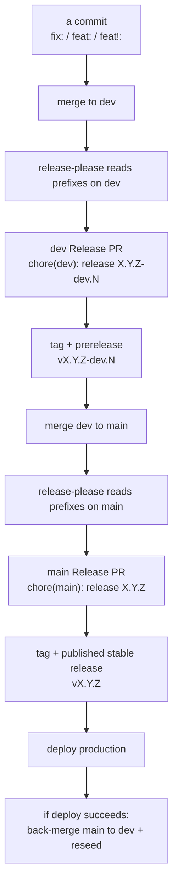

# Release versioning (conventional commits → release-please)

How a version number is chosen and a release is cut in core-be. You never set the
version by hand: the **conventional-commit prefix** on each commit decides the bump,
and **[release-please](https://github.com/googleapis/release-please)** does the math
and keeps a "Release PR" open. Merging that PR cuts the release.

For branch naming and the PR flow see [git-workflow.md](git-workflow.md). For CI/CD
see [cicd-and-deployment.md](../deployment/ci-cd/cicd-and-deployment.md).

---

## Cheat-sheet: commit prefix → version bump

Standard semantic versioning. Among all commits since the last release, the
**highest** bump wins.

| Commit message | Bump | Example (from `4.6.0`) |
| --- | --- | --- |
| `fix: …` | **patch** | `4.6.0 → 4.6.1` |
| `feat: …` | **minor** | `4.6.0 → 4.7.0` |
| `feat!: …` or a `BREAKING CHANGE:` footer | **major** | `4.6.0 → 5.0.0` |
| `docs:` · `chore:` · `refactor:` · `perf:` · `ci:` · `test:` · `build:` · `style:` | none on its own | changelog entry only |

- **You never type a version number.** The prefix is the whole decision; release-please
  computes the number and writes the changelog.
- **Major is opt-in only.** A `!` after the type (`feat!: drop the v1 auth route`) **or**
  a `BREAKING CHANGE: …` line in the commit body. Without one of those it never crosses a major.
- **Force an exact version (rare).** Add a `Release-As: 5.0.0` footer to a commit.

> The repo is past `1.0`, so the `bump-minor-pre-major` / `bump-patch-for-minor-pre-major`
> flags in the release-please config are no-ops (they only affect `0.x`).

---

## Who decides what

| Decision | Who | How |
| --- | --- | --- |
| Bump size (patch / minor / major) | the commit author | the `type:` prefix |
| When to cut the release | whoever merges the Release PR | merge `chore(<channel>): release X.Y.Z` |

---

## The flow

1. You merge `fix:` / `feat:` / `feat!:` commits to `dev`.
2. release-please keeps **one dev Release PR** open with the computed prerelease version
   and changelog; it updates as more commits land.
3. Merging the dev Release PR cuts the prerelease tag + GitHub prerelease and deploys the
   development environment.
4. When `dev` is promoted to `main`, release-please keeps **one stable Release PR** open.
5. Merging the stable Release PR immediately cuts the stable tag + published GitHub Release
   because the release commit is already on `main`; deploy success does not decide whether
   that version exists.
6. Production deploy runs after the stable release commit is on `main`.
7. If production deploy succeeds, the workflow back-merges `main` into `dev` and reseeds
   `dev` to the next prerelease line. If deploy fails, the stable release remains the
   release boundary and the back-merge waits until the deployment issue is fixed.

---

## Two channels: dev (prerelease) and main (stable)

| Channel | Branch | Versions | Config |
| --- | --- | --- | --- |
| Prerelease | `dev` | `X.Y.Z-dev.N` | [`config.dev.json`](../../.github/release-please/config.dev.json) (`prerelease: true`, `versioning: "prerelease"`) |
| Stable | `main` | `X.Y.Z` | [`config.json`](../../.github/release-please/config.json) |

- **dev** publishes a prerelease immediately on each Release-PR merge and advances the
  active `-dev.N` line.
- **main** publishes the stable release immediately on each Release-PR merge so
  release-please can recognize the latest stable tag and will not re-count a draft
  release into another release PR. The automated `main → dev` back-merge dispatch still
  waits for production deploy success in
  [`post-merge-ci.yml`](../../.github/workflows/post-merge-ci.yml).
- After a stable `main` release, an automated back-merge reseeds `dev` to the next minor
  (ship `4.7.0` → `dev` resumes at `4.8.0-dev.0`).

---

## How it's wired

- The **Release Please** job in
  [`post-merge-ci.yml`](../../.github/workflows/post-merge-ci.yml) runs on every push to
  `dev` / `main`.
- It authenticates with a **`RELEASE_PLEASE_TOKEN`** PAT (`repo` + `workflow` scopes),
  read from the matching GitHub Environment — the default `GITHUB_TOKEN` cannot create
  releases. Provision it through `.env.<environment>` + `pnpm github:sync`; see
  [environment-variables.md](../deployment/runbooks/environment-variables.md).
- If a merged Release PR ever fails to release (e.g. the token is missing), the PR sticks
  on the `autorelease: pending` label and retries every push. Fix the token, then either
  re-run the job or relabel the PR `autorelease: tagged` once the release exists.
