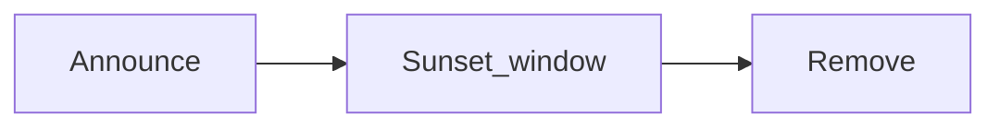

# API versioning and deprecation

Public HTTP APIs are **path-versioned** by major version only: `/api/v1/...`. Response envelopes follow [domains-and-public-api-design.md](../architecture/domains-and-public-api-design.md); versioning is independent of Paddle-style `data` / `meta` shaping.

---

## Versioning model

- **Major version** is the first segment after `/api/` (`v1`, `v2`, …). It signals **breaking** contract changes (URL, request/response shape, status semantics, auth requirements).
- **Non-breaking** fixes and additive fields ship on the **same** major path without a new version.
- When a **breaking** change is unavoidable, introduce **`/api/v{major}/...`** alongside the prior major for an overlap period; see [Adding a new major version](#adding-a-new-major-version).

---

## Deprecation policy (core-be)

This is project policy for integrators; it complements (but does not replace) HTTP standards for headers.

| Phase             | What we do                                                                                                                                                                                     |
| ----------------- | ---------------------------------------------------------------------------------------------------------------------------------------------------------------------------------------------- |
| **Announce**      | Document the change (changelog, release notes, internal runbooks). Optionally mark the operation in generated OpenAPI (`deprecated: true`) and/or set response headers on the affected routes. |
| **Sunset window** | Keep the endpoint available until a **published** sunset date. Default **minimum notice: 90 days** for stable integrations, unless security or compliance requires a shorter window.           |
| **Remove**        | After the sunset date, remove or hard-fail the route as planned; update OpenAPI, route catalog, and clients.                                                                                   |

Headers and docs should stay aligned: if `Sunset` is set, the same removal date should appear in human-readable documentation.

### Deprecation timeline



---

## Standard HTTP headers

Clients and gateways can rely on these headers for automation.

| Header                | Specification                                      | Purpose                                                                                        |
| --------------------- | -------------------------------------------------- | ---------------------------------------------------------------------------------------------- |
| **`Sunset`**          | [RFC 8594](https://www.rfc-editor.org/rfc/rfc8594) | HTTP-date after which the resource is expected to become unavailable (removal or replacement). |
| **`Deprecation`**     | [RFC 9745](https://www.rfc-editor.org/rfc/rfc9745) | `true` or an HTTP-date indicating deprecation is in effect.                                    |
| **`Link`** (optional) | [RFC 8288](https://www.rfc-editor.org/rfc/rfc8288) | e.g. `rel="deprecation"` or `rel="sunset"` pointing to migration or policy docs.               |

Use the shared helper [`applyDeprecatedEndpointHeaders`](../../../src/shared/utils/http/api-versioning.util.ts) in route handlers so values are formatted consistently.

---

## Adding a new major version

There is **no** separate `/api/v2` tree until a breaking release actually needs it. When it does:

1. Keep **one codebase path** per domain (`src/domains/<domain>/…`); versions differ by **mounted URL prefix**, not duplicated domain folders.
2. In [`src/routes.ts`](../../../src/routes.ts), register the same Fastify plugins again with a second prefix. Example:

   ```typescript
   await app.register(authRoutes(auth), {
     prefix: `${buildPublicApiPrefix('v2')}/auth`,
   });
   ```

3. During overlap, deprecated `v1` routes may call `applyDeprecatedEndpointHeaders` with a clear `Sunset` date and documentation links.
4. Regenerate route and OpenAPI artifacts per project skills (`route-catalog`, `openapi-route-sync`) when routes change.

Constants and helpers live in **`src/shared/utils/http/api-versioning.util.ts`** (`PUBLIC_API_VERSION_SEGMENT_V1`, `buildPublicApiPrefix`, deprecation helpers).

---

## Runtime behavior (core-be)

| Surface | Headers | Mechanism |
| ------- | ------- | --------- |
| All `/api/v1/*` responses | `API-Version: 1` | `api-versioning.middleware` (`onSend`) via `applyPublicApiVersionHeader` |
| All `/api/v1/*` during v1→v2 overlap | `Sunset`, `Deprecation` | Set `PUBLIC_API_V1_SUNSET` in `api-versioning.util.ts`; middleware applies `applyDeprecatedEndpointHeaders` on every v1 response |
| `GET /health`, `GET /health/worker` | `Sunset`, `Deprecation` | `health.middleware` (aggregate routes; sunset **2026-08-19** UTC) |
| Per-route deprecation | `Sunset`, `Deprecation`, optional `Link` | Call `applyDeprecatedEndpointHeaders(reply, …)` in the handler before sending the body |

**Past-sunset usage:** `alertDeprecatedUsagePastSunset` logs and sends a throttled Sentry warning when a **2xx** response still carries a `Sunset` header whose date has passed, or when v1 traffic continues after `PUBLIC_API_V1_SUNSET` (when configured).

**Cursor list pagination:** All paginated list endpoints (organizations, memberships, member roles, member invitations, organization API keys, audit logs, webhooks, webhook delivery attempts, notifications, users) use cursor pagination only. Pass `limit` and optional `after` (opaque cursor from `meta.pagination.next`).

The legacy `page` query parameter has been removed. Sending it returns **HTTP 400** with a `validation_error`:

```json
{
  "error": {
    "type": "validation_error",
    "code": "validation_error",
    "detail": "Legacy `page` pagination is no longer supported on this route. Use cursor-based pagination via `limit` and `after` (opaque cursor from `meta.pagination.next`).",
    "errors": [
      {
        "field": "page",
        "message": "Legacy `page` pagination is no longer supported on this route. Use cursor-based pagination via `limit` and `after` (opaque cursor from `meta.pagination.next`)."
      }
    ]
  },
  "meta": { "request_id": "..." }
}
```

The guard is implemented by `ensureCursorOnlyPagination` in `src/shared/utils/http/pagination.util.ts` and invoked by every list query validator before Zod parsing.
