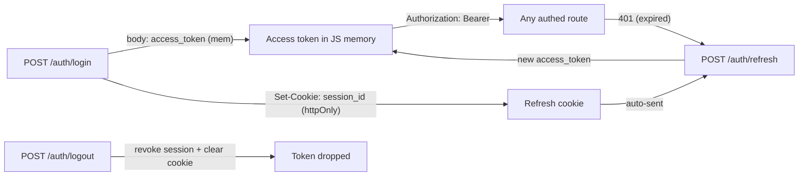
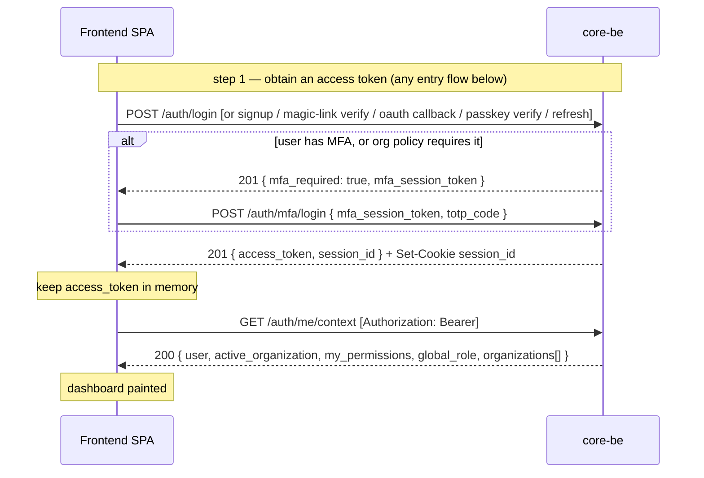

# Frontend auth & headers guide

How a browser frontend (SPA) authenticates against core-be, keeps the user logged in, switches the
active organization, and which headers it must send on which routes. This is the **client-integration**
companion to the backend security docs — it does not restate the server internals, it tells the
frontend exactly what to do.

> Backend internals live elsewhere: credential types and rate limits in
> [authentication.md](../security/authentication.md); cookie/CSRF posture in
> [csrf-and-session-cookies.md](../security/csrf-and-session-cookies.md); the organization model in
> [personal-vs-team-organizations.md](../architecture/personal-vs-team-organizations.md).

---

## TL;DR — the seven rules

1. **Access token lives in JavaScript memory** (a module variable), never `localStorage`.
2. **Send it as `Authorization: Bearer <token>`** on every authenticated request. It is the only
   always-on header.
3. **Refresh reactively**: on a `401`, call `POST /auth/refresh` once, then retry the request once.
4. **De-duplicate refreshes** (single-flight) — many parallel `401`s share one refresh call.
5. **Refresh on app boot** — the in-memory token is gone after a reload, but the `session_id` cookie
   survives, so a silent refresh logs the user back in.
6. **The active organization is inside the token** (`org` claim). To change it, call a switch
   endpoint and **replace the in-memory token** with the one it returns. There is no org header or
   org path segment.
7. **Read the body envelope**: every success response is `{ "data": { … } }`, so the access token is
   `json.data.access_token`.

---

## The model

core-be splits one short-lived, JS-held **access token** from one long-lived, browser-held
**refresh cookie**:

| Credential | Where it lives | Lifetime | Sent how | Purpose |
|------------|----------------|----------|----------|---------|
| **Access token** (JWT, RS256) | JavaScript memory | ~15 min | `Authorization: Bearer` header | Authorizes every API call; carries the signed **`org`** claim (active organization) |
| **Refresh session** | `session_id` httpOnly cookie (path `/api/v1/auth`, `SameSite=Strict`) | days (default 7) | browser sends it automatically to `/auth/*` | Mints fresh access tokens via `POST /auth/refresh`; revocable server-side |
| **CSRF token** | `csrf_token` cookie (readable by JS) | matches session | mirrored into `X-CSRF-Token` **only** for cookie-auth fallback | Double-submit defense on `/auth/refresh` when no `Origin` is sent |

Why this split (and why not put the access token in a cookie too): a `Bearer` header is **never
auto-attached** by the browser, so every authenticated route is CSRF-immune for free — only
`/auth/refresh` (cookie-borne) needs CSRF handling. The long-lived secret (`session_id`) is httpOnly,
so XSS can't exfiltrate it. The 15-minute access token is the only thing in JS, and its blast radius
is small and server-revocable.



---

## Headers the client sends

| Header | Send on | Required? | Notes |
|--------|---------|-----------|-------|
| `Authorization: Bearer <access_token>` | every authenticated request | **Yes** (authed routes) | The in-memory access token. Carries the active `org` claim. |
| `Content-Type: application/json` | any request with a JSON body | **Yes** for JSON bodies | — |
| `X-Idempotency-Key: <uuid>` | `POST`/`PUT`/`PATCH` writes | **Required on 13 routes**, optional elsewhere | `422` if missing on a required route. See [Idempotency keys](#idempotency-keys). |
| `X-Captcha-Token: <widget token>` | public auth forms | **Required only when Turnstile is configured** (production) | From the Cloudflare Turnstile widget. Routes: `login`, `mfa/login`, `magic-link/send`, `password/forgot`, `password/reset`, `email/verify`, OAuth init. |
| `X-CSRF-Token: <csrf_token cookie value>` | `POST /auth/refresh` **only**, **only if you don't send `Origin`** | Browsers: **not needed** | Browsers always send `Origin`, which satisfies the refresh origin check. This is a fallback for non-browser clients. |
| `X-Organization-Id: <org_…>` | **upload domain routes only** | Upload only | The flat org-scoped routes **ignore** it (org comes from the token claim). Do **not** send it elsewhere. |

**Cookies — never touched by JS.** The browser stores and sends `session_id` (httpOnly) and
`csrf_token` automatically, scoped to `/api/v1/auth`. Always call `fetch` with
`credentials: 'include'` so they ride along on auth routes.

**Server-managed headers you never set:** `X-Request-Id` (correlation; echoed in responses),
`X-RateLimit-*` (response only), `Stripe-Signature` (Stripe → server only), and the metrics scrape
token (ops/Prometheus only — not a browser concern).

**What you do *not* send for multi-tenancy:** there is **no** `X-Organization-Id` and **no**
`/organizations/{id}/` path segment on the app routes. The active organization is the token's `org`
claim — see [Active organization & switching](#active-organization--switching).

---

## Token lifecycle (reactive refresh)

You don't watch a clock. When a call returns `401` (token expired), refresh once and retry:

- **Active user** → effectively one refresh per ~15 min (the first call after each expiry).
- **Idle user** → zero refreshes.
- **Reload / app open** → one silent refresh at boot (memory was cleared; the cookie survived).

| Step | Request | Result |
|------|---------|--------|
| **Signup** | `POST /auth/signup` | `201` → `{ data: { access_token } }` + `Set-Cookie: session_id`. Creates the account (email starts **unverified** — a verification code is emailed — and login is allowed before verifying) and logs in. `409` if the email already exists. |
| Login | `POST /auth/login` | `201` → `{ data: { access_token } }` + `Set-Cookie: session_id` |
| Use | any route + `Authorization: Bearer` | `200/201/…` |
| Expiry | any route | `401` → trigger refresh |
| Refresh | `POST /auth/refresh` (cookie auto-sent) | `201` → `{ data: { access_token } }`, session cookie rotated |
| Logout | `POST /auth/logout` + `Authorization: Bearer` | `201`, session revoked server-side, cookie cleared |

If **refresh itself fails** (`401`/`403`), the session is gone (logged out elsewhere, admin-suspended,
or expired) → clear the in-memory token and send the user to login.

---

## Active organization & switching

Every access token is scoped to exactly one active organization via its signed **`org`** claim. The
backend resolves the tenant, permissions, and row-level security from that claim and re-checks
membership on every request — the claim is **scope, not authority**.

To act in a different organization, **re-mint the token**:

| Endpoint | Body | Auth | Result |
|----------|------|------|--------|
| `POST /auth/switch-to-organization` | `{ "organization_id": "org_…" }` | `Bearer` | `201` → new `access_token` scoped to that org. `403` if the caller isn't a member, `400` if the id is missing. |
| `POST /auth/switch-to-personal` | none | `Bearer` | `201` → new `access_token` scoped to the caller's personal org. Cannot fail with `403`. |

Switching re-binds the session to the new token, so **the previous access token immediately stops
working** (hash drift). Always swap your in-memory token for the returned one. No new refresh cookie
is issued — the same `session_id` keeps working, and a later refresh re-mints with the now-current
`org` claim.

**One authoritative call — `GET /auth/me/context`.** Instead of stitching several endpoints, this returns everything a permission-aware UI needs in one request:

```json
{
  "data": {
    "user": { "id": "usr_…", "email": "…", "is_mfa_enabled": false },
    "active_organization": { "id": "org_…", "type": "TEAM", "capabilities": { "can_invite_members": true, "…": "…" } },
    "my_permissions": ["organization:read", "membership:manage"],
    "global_role": null,
    "organizations": [{ "id": "org_…", "type": "TEAM", "capabilities": { "…": "…" }, "is_active": true }]
  }
}
```

- **`capabilities` vs `my_permissions` — render on the intersection.** `capabilities` describes what the org **type** allows (a personal org can never invite members → `can_invite_members: false`); `my_permissions` is what **this caller** may do in the active org (resolved permission codes). Show an action only when the capability is available **and** the caller holds the permission.
- **`organizations`** is the org-switcher list, each flagged `is_active` — render it directly.
- **Switch flow (one call):** `POST /auth/switch-to-organization` (or `…-personal`) re-mints the token **and returns the active-org delta** — `{ access_token, active_organization, my_permissions, global_role }`. Swap your in-memory Bearer for the new `access_token`, repaint from `active_organization` + `my_permissions`, and flip `is_active` in your cached `organizations[]`. The `user` and org-switcher list are stable across a switch, so **no follow-up `GET /auth/me/context` is needed** — re-fetch the full context only on a cold reload.
- **Join flow:** `POST /tenancy/invitations/{invitation_id}/accept` returns the joined `organization_id`; pass it straight to `POST /auth/switch-to-organization` (above) to land on the new team's dashboard — no lookup in between.
  - **Invited user with no account (first time):** the invite already created a passwordless, unverified **placeholder** for that email, and `accept` requires a **verified** email (else `403 errors:invitationRequiresVerifiedEmail` — a forwarded invite must not be claimable by the wrong person). So the new user first authenticates in a way that proves email control: **magic-link** (`/auth/magic-link/send` → `/auth/magic-link/verify`) or **OAuth** both claim the placeholder, verify the email, and provision their personal org in one step; **email/password signup** also claims it but leaves the email unverified, so it needs one extra `POST /auth/email/verify { code }` first. After that, the same `accept` → (`organization_id`) → `switch-to-organization` tail applies. Don't hard-block the UI when `is_email_verified` is false — route the user through verification, then call `accept`.

This works **identically for personal and team organizations** — there is one route surface, and the `capabilities` flags (not different URLs) tell the UI what to show. See [route-consistency-and-org-model.md](route-consistency-and-org-model.md).

`GET /users/me` (profile + deployment `capabilities`) and `GET /tenancy/organizations` (paginated org list) remain available if you need them individually.

> The org-scoped resources are **flat**: `/api/v1/tenancy/organization` (singular — settings, logo,
> audit-logs, api-keys, notification-policies, memberships, roles, invitations live under it),
> `/api/v1/billing/subscriptions`, `/api/v1/notify/webhooks`. Account-level routes that aren't tied
> to one active org stay plural: `GET|POST /api/v1/tenancy/organizations`,
> `GET /api/v1/tenancy/organizations/by-slug/{slug}`, and cross-org invitation actions
> `POST /api/v1/tenancy/invitations/{invitation_id}/accept|decline`.

---

## Entry flows → how many calls to the dashboard

Every way into the app converges on the same tail: **obtain an access token, then make one call — `GET /auth/me/context` ([above](#active-organization--switching)) — to paint the dashboard.** So "land on the dashboard" costs *(calls to obtain a token)* **+ 1**. The only exception is an org **switch**, which returns the active-org delta inline and needs no `/auth/me/context` follow-up.



The first-factor entry points (`login`, `signup`, `magic-link/verify`, `oauth/.../callback`, `webauthn/authenticate/verify`, `password/reset`) all return the **same discriminated body** — branch on the field, **not** the HTTP status (every POST here is `201`):

- `{ access_token, session_id }` → logged in; store the token and call `GET /auth/me/context`.
- `{ mfa_required: true, mfa_session_token }` → collect a TOTP or recovery code and call `POST /auth/mfa/login`, which then returns `{ access_token, session_id }`.

| Entry flow | API call sequence (in order) | Terminal success body | Calls to dashboard |
|------------|------------------------------|-----------------------|--------------------|
| **Email + password — signup** | `POST /auth/signup` → `GET /auth/me/context` | `{ access_token, session_id }` — personal org auto-provisioned and already the active `org` | **2** |
| **Email + password — login** | `POST /auth/login` → `GET /auth/me/context` | `{ access_token, session_id }` *or* `{ mfa_required }` | **2** (+1 if MFA) |
| **MFA second factor** *(continues any first factor)* | `POST /auth/mfa/login` → `GET /auth/me/context` | `{ access_token, session_id }` | the **+1** above |
| **Magic-link / email OTP** | `POST /auth/magic-link/send` → `POST /auth/magic-link/verify` → `GET /auth/me/context` | `{ access_token, session_id }` — unknown emails are auto-signed-up | **3** (+1 if MFA) |
| **OAuth (Google / GitHub / …)** | `GET /auth/oauth/{provider}` *(redirect to provider)* → `GET /auth/oauth/{provider}/callback` → `GET /auth/me/context` | `{ access_token, session_id }` | **3** (+1 if MFA; optional `GET /auth/oauth/providers` to list) |
| **WebAuthn / passkey** | `POST /auth/webauthn/authenticate/options` → `POST /auth/webauthn/authenticate/verify` → `GET /auth/me/context` | `{ access_token, session_id }` | **3** (+1 if MFA) |
| **Silent resume (app boot / reload)** | `POST /auth/refresh` → `GET /auth/me/context` | `{ access_token }` — no `session_id`; restores the previously-active `org` | **2** |
| **Forgot / reset password** | `POST /auth/password/forgot` → `POST /auth/password/reset` → `GET /auth/me/context` | `{ access_token, session_id }` — logs straight in | **3** (+1 if MFA) |
| **Invited teammate → land in the team** | *onboard via signup / magic-link / OAuth (2–3)* → `POST /tenancy/invitations/{invitation_id}/accept` → `POST /auth/switch-to-organization` | `{ access_token, active_organization, my_permissions, global_role }` — switch delta, no `/auth/me/context` needed | onboarding **+ 2** |

Notes:

- **Two-step flows** (magic-link, OAuth, passkey) cost an extra call because the first request only *starts* the challenge — send the code / redirect to the provider / fetch assertion options — and the **second** request is the one that returns the access token.
- **Captcha:** the public auth POSTs may require `X-Captcha-Token` when Turnstile is configured — see [Headers the client sends](#headers-the-client-sends).
- **No `session_id` on refresh:** `POST /auth/refresh` returns only `{ access_token }`; the `session_id` cookie is rotated via `Set-Cookie`, not echoed in the body.
- **Server-internal sequences** (services, DB, event bus, mail) for these journeys live in [`src/FLOWS.md`](../../../src/FLOWS.md) — this table is the **client-facing** view (HTTP calls only), so the two do not overlap.

---

## Reference implementation

A complete, framework-agnostic auth layer. Everything else in your app just calls `apiFetch`.

```js
// auth.js — the entire client auth layer
let accessToken = null;     // in memory ONLY — never localStorage
let refreshing = null;      // single-flight guard

const API = 'https://api.example.com/api/v1';

// --- core fetch wrapper: Bearer attach + reactive refresh-and-retry -----------
export async function apiFetch(path, opts = {}) {
  const isWrite = opts.method && opts.method !== 'GET';
  const send = (token) =>
    fetch(`${API}${path}`, {
      ...opts,
      credentials: 'include', // send/receive the httpOnly session + csrf cookies
      headers: {
        'Content-Type': 'application/json',
        ...opts.headers,
        ...(token ? { Authorization: `Bearer ${token}` } : {}),
        // required on 13 write routes, ignored elsewhere; fresh key per call
        ...(isWrite ? { 'X-Idempotency-Key': crypto.randomUUID() } : {}),
      },
    });

  let res = await send(accessToken);
  if (res.status === 401) {
    try {
      const fresh = await refresh();
      res = await send(fresh); // retry ONCE with the new token
    } catch {
      accessToken = null;
      redirectToLogin();
      throw new Error('unauthenticated');
    }
  }
  return res;
}

// --- single-flight refresh ----------------------------------------------------
function refresh() {
  refreshing ??= fetch(`${API}/auth/refresh`, {
    method: 'POST',
    credentials: 'include', // browser sends session_id automatically
  })
    .then((r) => {
      if (!r.ok) throw new Error('refresh_failed');
      return r.json();
    })
    .then(({ data }) => {
      accessToken = data.access_token;
      return accessToken;
    })
    .finally(() => {
      refreshing = null;
    });
  return refreshing;
}

// --- entry points -------------------------------------------------------------
export async function login(email, password, captchaToken) {
  const r = await fetch(`${API}/auth/login`, {
    method: 'POST',
    credentials: 'include',
    headers: {
      'Content-Type': 'application/json',
      ...(captchaToken ? { 'X-Captcha-Token': captchaToken } : {}),
    },
    body: JSON.stringify({ email, password }),
  });
  const { data } = await r.json();
  if (data.mfa_required) return data; // { mfa_required: true, mfa_session_token } → MFA step
  accessToken = data.access_token;
  return data;
}

export async function completeMfaLogin(mfaSessionToken, totpCode, captchaToken) {
  const r = await fetch(`${API}/auth/mfa/login`, {
    method: 'POST',
    credentials: 'include',
    headers: {
      'Content-Type': 'application/json',
      ...(captchaToken ? { 'X-Captcha-Token': captchaToken } : {}),
    },
    // send `recovery_code` instead of `totp_code` to use a backup code
    body: JSON.stringify({ mfa_session_token: mfaSessionToken, totp_code: totpCode }),
  });
  const { data } = await r.json();
  accessToken = data.access_token;
  return data;
}

export async function bootstrap() {
  try {
    await refresh(); // silent re-login if the session cookie is still alive
    return true;
  } catch {
    return false; // not logged in — show the login screen
  }
}

export async function logout() {
  await apiFetch('/auth/logout', { method: 'POST' }); // server revokes the session + clears cookie
  accessToken = null;
}

// --- organization switching ---------------------------------------------------
export async function switchOrganization(organizationId) {
  const res = await apiFetch('/auth/switch-to-organization', {
    method: 'POST',
    body: JSON.stringify({ organization_id: organizationId }),
  });
  if (!res.ok) throw new Error('switch_failed'); // 403 not a member, 400 bad id
  const { data } = await res.json();
  accessToken = data.access_token; // swap token; the previous one is now dead
  return accessToken;
}

export async function switchToPersonal() {
  const res = await apiFetch('/auth/switch-to-personal', { method: 'POST' });
  const { data } = await res.json();
  accessToken = data.access_token;
  return accessToken;
}
```

The four rules that keep it correct:

| Rule | Why |
|------|-----|
| Access token in **memory only** | `localStorage` is readable by any XSS; memory dies with the tab. |
| **Single-flight** refresh | Parallel `401`s must share one refresh — the session rotates each refresh, so concurrent refreshes would trip reuse-detection and kill the session. |
| Retry the original request **once**, then give up | One expiry = one refresh; if the retry also `401`s, the session is genuinely dead. |
| Refresh failure → clear token + login | The session was revoked or expired. |

---

## Typed contracts & `landOnDashboard()` helpers

The reference client above is the **transport layer** (Bearer attach, single-flight refresh, switching). This section adds the **TypeScript response contracts** and a **`landOnDashboard()` helper per entry flow** that composes those entry points with the single `GET /auth/me/context` paint. Rename `auth.js` → `auth.ts` to adopt the types; the snippets below live in the **same module**, so they share the in-memory `accessToken` and the `apiFetch` / `login` / `completeMfaLogin` / `switchOrganization` / `bootstrap` defined above — nothing from the transport layer is re-implemented here.

### Response contracts

Each interface mirrors a backend serializer; the `// source:` path is the single source of truth — keep the interface in step if that serializer changes.

```ts
// types.ts
// source: src/shared/utils/http/response.util.ts
export interface Envelope<T> { data: T; meta: { request_id: string } }

// source: src/domains/auth/auth.serializer.ts → AuthSerializer.accessToken
export interface AccessTokenResponse {
  access_token: string;
  session_id?: string;          // present on signup/login/magic-link/oauth/passkey/mfa; omitted by /auth/refresh
}
// source: src/domains/auth/auth.serializer.ts → AuthSerializer.mfaRequired
export interface MfaRequiredResponse { mfa_required: true; mfa_session_token: string }

/** First-factor entry points return one of these — discriminate on `mfa_required`. */
export type FirstFactorResponse = AccessTokenResponse | MfaRequiredResponse;

// source: src/domains/auth/auth.serializer.ts → AuthSerializer.magicLinkSent
export interface MagicLinkSentResponse { message: string; expires_in_minutes: number }

// source: src/domains/tenancy/sub-domains/organization/organization-capability.ts → OrganizationCapabilities
export interface OrganizationCapabilities {
  can_invite_members: boolean;
  can_manage_members: boolean;
  can_manage_roles: boolean;
  can_transfer_ownership: boolean;
  can_delete: boolean;
  can_manage_billing: boolean;
}
// source: src/domains/tenancy/sub-domains/organization/organization.types.ts → OrganizationOutput
export interface Organization {
  id: string;                   // org_…
  name: string;
  slug: string | null;          // null for a PERSONAL org
  type: 'PERSONAL' | 'TEAM';
  status: string;
  logo_url: string | null;
  capabilities: OrganizationCapabilities;
  created_at: string;           // ISO-8601
  updated_at: string;
}
// source: src/shared/constants/roles.constants.ts → GlobalRole
export type GlobalRole = 'super_admin' | 'admin' | 'user';

// source: src/domains/user/user.types.ts → UserOutput (self projection)
export interface MeUser {
  id: string;                   // usr_…
  email: string;
  is_email_verified: boolean;
  is_mfa_enabled: boolean;
  first_name: string | null;
  last_name: string | null;
  avatar_url: string | null;
  status: string;
  created_at: string;
  updated_at: string;
  capabilities?: { personal_organizations: boolean; team_organizations: boolean };
  personal_organization_id?: string | null;   // null when personal orgs are disabled (team-only deployment)
}
// source: src/domains/auth/auth-me-context.types.ts → AuthMeContextOutput
export interface MeContext {
  user: MeUser;
  active_organization: Organization | null;             // null → no org in scope; route to onboarding
  my_permissions: string[];                              // e.g. ["organization:read", "membership:manage"]
  global_role: GlobalRole | null;                        // null for a standard user
  organizations: Array<Organization & { is_active: boolean }>;   // org-switcher list
}
// source: src/domains/auth/auth.serializer.ts → AuthSerializer.accessTokenWithActiveOrganization
export interface SwitchResponse {
  access_token: string;
  active_organization: Organization;
  my_permissions: string[];
  global_role: GlobalRole | null;
}
```

### The one paint call + a helper per flow

`getMeContext()` is the single dashboard read; each `landOnDashboard.*` composes an entry flow with it. Gate UI on the **intersection** of `my_permissions` and `active_organization.capabilities` (see [Active organization & switching](#active-organization--switching)).

```ts
// auth.ts (same module as the reference client) ------------------------------
import type {
  Envelope, FirstFactorResponse, MagicLinkSentResponse, MeContext,
} from './types';

// --- thin helpers for public (unauthenticated) auth routes: no Bearer, no refresh-retry
async function postPublic<T>(path: string, body: unknown, captchaToken?: string): Promise<T> {
  const res = await fetch(`${API}${path}`, {
    method: 'POST',
    credentials: 'include',
    headers: { 'Content-Type': 'application/json', ...(captchaToken ? { 'X-Captcha-Token': captchaToken } : {}) },
    body: body == null ? undefined : JSON.stringify(body),
  });
  if (!res.ok) throw new Error(`request_failed_${res.status}`);
  return (await res.json() as Envelope<T>).data;
}
async function getPublic<T>(path: string): Promise<T> {
  const res = await fetch(`${API}${path}`, { method: 'GET', credentials: 'include' });
  if (!res.ok) throw new Error(`request_failed_${res.status}`);
  return (await res.json() as Envelope<T>).data;
}

// --- the single authoritative dashboard read ---------------------------------
export async function getMeContext(): Promise<MeContext> {
  const res = await apiFetch('/auth/me/context');       // Bearer attach + refresh-on-401 handled by apiFetch
  if (!res.ok) throw new Error('me_context_failed');
  return (await res.json() as Envelope<MeContext>).data;
}

// --- shared tail: token-or-MFA → dashboard -----------------------------------
export type LandResult =
  | { status: 'mfa_required'; mfaSessionToken: string }  // collect a code, then landOnDashboard.completeMfa(...)
  | { status: 'ready'; dashboard: MeContext };

async function finishFirstFactor(resp: FirstFactorResponse): Promise<LandResult> {
  if ('mfa_required' in resp) return { status: 'mfa_required', mfaSessionToken: resp.mfa_session_token };
  accessToken = resp.access_token;                       // store in-memory (shared module variable)
  return { status: 'ready', dashboard: await getMeContext() };
}

// --- entry points the reference client doesn't already have ------------------
export const signup = (b: { email: string; password: string; first_name?: string; last_name?: string }, captcha?: string) =>
  postPublic<FirstFactorResponse>('/auth/signup', b, captcha);
export const sendMagicLink = (email: string, captcha?: string) =>
  postPublic<MagicLinkSentResponse>('/auth/magic-link/send', { email }, captcha);
export const verifyMagicLink = (email: string, code: string) =>
  postPublic<FirstFactorResponse>('/auth/magic-link/verify', { email, code });
export const listOAuthProviders = () => getPublic<{ providers: string[] }>('/auth/oauth/providers');
export const startOAuth = (provider: string) => getPublic<{ url: string }>(`/auth/oauth/${provider}`); // then redirect to .url
export const passkeyOptions = (email?: string) =>
  postPublic<unknown>('/auth/webauthn/authenticate/options', { email });   // feed to navigator.credentials.get()
export const verifyPasskey = (assertion: unknown) =>
  postPublic<FirstFactorResponse>('/auth/webauthn/authenticate/verify', assertion);
export const requestPasswordReset = (email: string, captcha?: string) =>
  postPublic<{ message: string }>('/auth/password/forgot', { email }, captcha);
export const resetPassword = (token: string, password: string, captcha?: string) =>
  postPublic<FirstFactorResponse>('/auth/password/reset', { token, password }, captcha);
export const acceptInvitation = (invitationId: string, token: string) =>   // authenticated write → apiFetch
  apiFetch(`/tenancy/invitations/${invitationId}/accept`, { method: 'POST', body: JSON.stringify({ token }) })
    .then(async (r) => {
      if (!r.ok) throw new Error('accept_failed');
      return (await r.json() as Envelope<{ organization_id: string }>).data;
    });

// --- one helper per entry flow: returns the painted dashboard (or an MFA gate)
export const landOnDashboard = {
  // 2 calls — signup + /me/context
  signup: async (input: Parameters<typeof signup>[0], captcha?: string) =>
    finishFirstFactor(await signup(input, captcha)),

  // 2 calls (+1 if MFA) — login + /me/context; the reference login() sets the token on the non-MFA branch
  login: async (email: string, password: string, captcha?: string): Promise<LandResult> => {
    const data = await login(email, password, captcha);
    return 'mfa_required' in data
      ? { status: 'mfa_required', mfaSessionToken: data.mfa_session_token }
      : { status: 'ready', dashboard: await getMeContext() };
  },

  // the +1 for any MFA flow — mfa/login + /me/context. Recovery code: completeMfaLogin posts { recovery_code } instead.
  completeMfa: async (mfaSessionToken: string, totpCode: string, captcha?: string) => {
    await completeMfaLogin(mfaSessionToken, totpCode, captcha);   // reference client fn (sets the token)
    return getMeContext();
  },

  // 3 calls — send + verify + /me/context (user types the emailed code between the two)
  magicLinkSend: (email: string, captcha?: string) => sendMagicLink(email, captcha),
  magicLinkVerify: async (email: string, code: string) => finishFirstFactor(await verifyMagicLink(email, code)),

  // 3 calls — start (redirect to provider) + callback + /me/context
  oauthStart: (provider: string) => startOAuth(provider),        // returns { url } → window.location = url
  oauthComplete: async (provider: string, code: string, state: string) =>
    finishFirstFactor(await getPublic<FirstFactorResponse>(
      `/auth/oauth/${provider}/callback?code=${encodeURIComponent(code)}&state=${encodeURIComponent(state)}`)),

  // 3 calls — options + verify + /me/context
  passkeyOptions: (email?: string) => passkeyOptions(email),
  passkeyVerify: async (assertion: unknown) => finishFirstFactor(await verifyPasskey(assertion)),

  // 3 calls — forgot + reset + /me/context (user clicks the emailed link between the two)
  passwordForgot: (email: string, captcha?: string) => requestPasswordReset(email, captcha),
  passwordReset: async (token: string, password: string, captcha?: string) =>
    finishFirstFactor(await resetPassword(token, password, captcha)),

  // 2 calls — silent refresh + /me/context; null when there is no live session
  resume: async (): Promise<MeContext | null> => (await bootstrap()) ? getMeContext() : null,

  // invited teammate: accept → switch into the team → refresh context (the switcher list just gained an org).
  // Onboarding (signup / magic-link / OAuth) happens via one of the flows above before this runs.
  acceptInvitationAndEnter: async (invitationId: string, token: string): Promise<MeContext> => {
    const { organization_id } = await acceptInvitation(invitationId, token);
    await switchOrganization(organization_id);                   // reference client fn — re-mints the token
    return getMeContext();
  },
};
```

---

## Idempotency keys

The server **requires** `X-Idempotency-Key` on these **13 write routes** (returns `422
idempotencyKeyRequired` / `idempotencyKeyInvalid` without it):

1. Create team organization — `POST /tenancy/organizations`
2. Create membership — `POST /tenancy/organization/memberships`
3. Transfer organization ownership — `POST /tenancy/organization/transfer-ownership`
4. Create invitation — `POST /tenancy/organization/invitations`
5–8. Subscription writes — create / cancel / resume / change-plan under `/billing/subscriptions`
5. Create webhook — `POST /notify/webhooks`
6. Create organization API key — `POST /tenancy/organization/api-keys`
7. Create notification policy — `POST /tenancy/organization/notification-policies`
8. Create member role — `POST /tenancy/organization/roles`
9. Create upload — `POST /uploads`

On any other route, an `X-Idempotency-Key` is **optional**: if you send one, the response is cached and
replayed for that key; if you don't, nothing happens. The wrapper above sends a **fresh** UUID on
every write, which satisfies the requirement and never causes a false replay.

**For true retry-safety** (e.g. the user double-clicks "Pay"), generate the key **once per logical
operation** and reuse the *same* key if you retry that operation — that's what lets the server
collapse duplicates. Reusing a key for a *different* request body is rejected. See
[idempotency.md](../reliability/idempotency.md).

---

## CSRF & the refresh route

Only `POST /auth/refresh` is cookie-authenticated, so it's the only route with CSRF considerations.
The backend accepts it when:

- an **`Origin`** header is present and in `ALLOWED_ORIGINS` (browsers always send `Origin` on
  cross-origin requests — this is the normal path), **or**
- (no `Origin`) the `X-CSRF-Token` header matches the `csrf_token` cookie (double-submit).

So a browser SPA needs **no CSRF token** in practice — keep `credentials: 'include'` and make sure
your frontend origin is in the server's `ALLOWED_ORIGINS`. Note that `X-CSRF-Token` is **not** in the
CORS `allowedHeaders`, so it can't be sent cross-origin anyway; cross-origin refresh relies entirely
on the `Origin` allowlist. The double-submit token only matters for same-origin clients that omit
`Origin`. Full posture: [csrf-and-session-cookies.md](../security/csrf-and-session-cookies.md).

---

## Local development

`SameSite=Strict`, path scoping (`/api/v1/auth`), and `Secure` interact with how you run the SPA and
API on `localhost`:

- Add your dev frontend origin (e.g. `http://localhost:5173`) to **`ALLOWED_ORIGINS`**, or refresh
  returns `403`.
- Always use `credentials: 'include'`, or the browser won't store/send `session_id` and refresh
  returns `401`.
- In production both the API and frontend must be HTTPS (cookies are `Secure`).

---

## Recent changes (active-org claim model)

The auth/tenancy flow was reshaped across mid-2026 — if you integrated against an older build, note:

- **Active org moved from the URL/header into the token.** Org-scoped routes were **flattened**: the
  per-organization path segment (`/organizations/{id}/…`) and the path parser were removed; the
  singular `/tenancy/organization` resource now sources the tenant from the signed **`org`** claim.
- **Switch endpoints** `POST /auth/switch-to-personal` and `POST /auth/switch-to-organization` mint a
  new token with a different `org` claim (and invalidate the previous one).
- **`X-Organization-Id` is no longer used by the app routes** — only the upload domain still reads it.
- **`/auth/mfa/login` now accepts `X-Captcha-Token`** (bot-protection at the MFA step).

See [personal-vs-team-organizations.md](../architecture/personal-vs-team-organizations.md) for the full
organization model and capability flags.

---

## Related

- [authentication.md](../security/authentication.md) — auth methods, rate limits, CAPTCHA boot guard
- [csrf-and-session-cookies.md](../security/csrf-and-session-cookies.md) — cookie + CSRF posture, Origin checks
- [personal-vs-team-organizations.md](../architecture/personal-vs-team-organizations.md) — org model, `org` claim, switching
- [response-codes.md](response-codes.md) — method→status policy, error envelope
- [idempotency.md](../reliability/idempotency.md) — idempotency-key semantics
- [api-versioning.md](api-versioning.md) — `/api/v1`, deprecation headers
