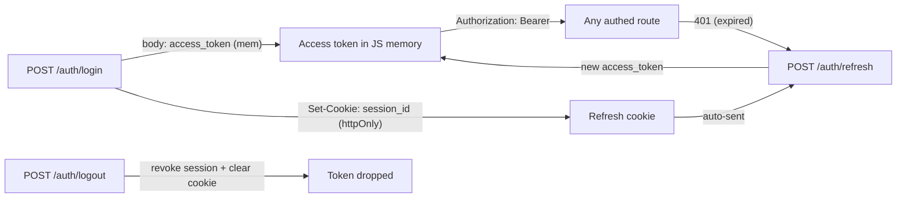

# Frontend auth & headers guide

How a browser frontend (SPA) authenticates against core-be, keeps the user logged in, switches the
active organization, and which headers it must send on which routes. This is the **client-integration**
companion to the backend security docs — it does not restate the server internals, it tells the
frontend exactly what to do.

> Backend internals live elsewhere: credential types and rate limits in
> [authentication.md](../security/authentication.md); cookie/CSRF posture in
> [csrf-and-session-cookies.md](../security/csrf-and-session-cookies.md); the organization model in
> [personal-vs-team-organizations.md](../architecture/personal-vs-team-organizations.md).

---

## TL;DR — the seven rules

1. **Access token lives in JavaScript memory** (a module variable), never `localStorage`.
2. **Send it as `Authorization: Bearer <token>`** on every authenticated request. It is the only
   always-on header.
3. **Refresh reactively**: on a `401`, call `POST /auth/refresh` once, then retry the request once.
4. **De-duplicate refreshes** (single-flight) — many parallel `401`s share one refresh call.
5. **Refresh on app boot** — the in-memory token is gone after a reload, but the `session_id` cookie
   survives, so a silent refresh logs the user back in.
6. **The active organization is inside the token** (`org` claim). To change it, call a switch
   endpoint and **replace the in-memory token** with the one it returns. There is no org header or
   org path segment.
7. **Read the body envelope**: every success response is `{ "data": { … } }`, so the access token is
   `json.data.access_token`.

---

## The model

core-be splits one short-lived, JS-held **access token** from one long-lived, browser-held
**refresh cookie**:

| Credential | Where it lives | Lifetime | Sent how | Purpose |
|------------|----------------|----------|----------|---------|
| **Access token** (JWT, RS256) | JavaScript memory | ~15 min | `Authorization: Bearer` header | Authorizes every API call; carries the signed **`org`** claim (active organization) |
| **Refresh session** | `session_id` httpOnly cookie (path `/api/v1/auth`, `SameSite=Strict`) | days (default 7) | browser sends it automatically to `/auth/*` | Mints fresh access tokens via `POST /auth/refresh`; revocable server-side |
| **CSRF token** | `csrf_token` cookie (readable by JS) | matches session | mirrored into `X-CSRF-Token` **only** for cookie-auth fallback | Double-submit defense on `/auth/refresh` when no `Origin` is sent |

Why this split (and why not put the access token in a cookie too): a `Bearer` header is **never
auto-attached** by the browser, so every authenticated route is CSRF-immune for free — only
`/auth/refresh` (cookie-borne) needs CSRF handling. The long-lived secret (`session_id`) is httpOnly,
so XSS can't exfiltrate it. The 15-minute access token is the only thing in JS, and its blast radius
is small and server-revocable.



---

## Headers the client sends

| Header | Send on | Required? | Notes |
|--------|---------|-----------|-------|
| `Authorization: Bearer <access_token>` | every authenticated request | **Yes** (authed routes) | The in-memory access token. Carries the active `org` claim. |
| `Content-Type: application/json` | any request with a JSON body | **Yes** for JSON bodies | — |
| `X-Idempotency-Key: <uuid>` | `POST`/`PUT`/`PATCH` writes | **Required on 13 routes**, optional elsewhere | `422` if missing on a required route. See [Idempotency keys](#idempotency-keys). |
| `X-Captcha-Token: <widget token>` | public auth forms | **Required only when Turnstile is configured** (production) | From the Cloudflare Turnstile widget. Routes: `login`, `mfa/login`, `magic-link/send`, `password/forgot`, `password/reset`, `email/verify`, OAuth init. |
| `X-CSRF-Token: <csrf_token cookie value>` | `POST /auth/refresh` **only**, **only if you don't send `Origin`** | Browsers: **not needed** | Browsers always send `Origin`, which satisfies the refresh origin check. This is a fallback for non-browser clients. |
| `X-Organization-Id: <org_…>` | **upload domain routes only** | Upload only | The flat org-scoped routes **ignore** it (org comes from the token claim). Do **not** send it elsewhere. |

**Cookies — never touched by JS.** The browser stores and sends `session_id` (httpOnly) and
`csrf_token` automatically, scoped to `/api/v1/auth`. Always call `fetch` with
`credentials: 'include'` so they ride along on auth routes.

**Server-managed headers you never set:** `X-Request-Id` (correlation; echoed in responses),
`X-RateLimit-*` (response only), `Stripe-Signature` (Stripe → server only), and the metrics scrape
token (ops/Prometheus only — not a browser concern).

**What you do *not* send for multi-tenancy:** there is **no** `X-Organization-Id` and **no**
`/organizations/{id}/` path segment on the app routes. The active organization is the token's `org`
claim — see [Active organization & switching](#active-organization--switching).

---

## Token lifecycle (reactive refresh)

You don't watch a clock. When a call returns `401` (token expired), refresh once and retry:

- **Active user** → effectively one refresh per ~15 min (the first call after each expiry).
- **Idle user** → zero refreshes.
- **Reload / app open** → one silent refresh at boot (memory was cleared; the cookie survived).

| Step | Request | Result |
|------|---------|--------|
| Login | `POST /auth/login` | `201` → `{ data: { access_token } }` + `Set-Cookie: session_id` |
| Use | any route + `Authorization: Bearer` | `200/201/…` |
| Expiry | any route | `401` → trigger refresh |
| Refresh | `POST /auth/refresh` (cookie auto-sent) | `201` → `{ data: { access_token } }`, session cookie rotated |
| Logout | `POST /auth/logout` + `Authorization: Bearer` | `201`, session revoked server-side, cookie cleared |

If **refresh itself fails** (`401`/`403`), the session is gone (logged out elsewhere, admin-suspended,
or expired) → clear the in-memory token and send the user to login.

---

## Active organization & switching

Every access token is scoped to exactly one active organization via its signed **`org`** claim. The
backend resolves the tenant, permissions, and row-level security from that claim and re-checks
membership on every request — the claim is **scope, not authority**.

To act in a different organization, **re-mint the token**:

| Endpoint | Body | Auth | Result |
|----------|------|------|--------|
| `POST /auth/switch-to-organization` | `{ "organization_id": "org_…" }` | `Bearer` | `201` → new `access_token` scoped to that org. `403` if the caller isn't a member, `400` if the id is missing. |
| `POST /auth/switch-to-personal` | none | `Bearer` | `201` → new `access_token` scoped to the caller's personal org. Cannot fail with `403`. |

Switching re-binds the session to the new token, so **the previous access token immediately stops
working** (hash drift). Always swap your in-memory token for the returned one. No new refresh cookie
is issued — the same `session_id` keeps working, and a later refresh re-mints with the now-current
`org` claim.

**One authoritative call — `GET /auth/me/context`.** Instead of stitching several endpoints, this returns everything a permission-aware UI needs in one request:

```json
{
  "data": {
    "user": { "id": "usr_…", "email": "…", "is_mfa_enabled": false },
    "active_organization": { "id": "org_…", "type": "TEAM", "capabilities": { "can_invite_members": true, "…": "…" } },
    "my_permissions": ["organization:read", "membership:manage"],
    "global_role": null,
    "organizations": [{ "id": "org_…", "type": "TEAM", "capabilities": { "…": "…" }, "is_active": true }]
  }
}
```

- **`capabilities` vs `my_permissions` — render on the intersection.** `capabilities` describes what the org **type** allows (a personal org can never invite members → `can_invite_members: false`); `my_permissions` is what **this caller** may do in the active org (resolved permission codes). Show an action only when the capability is available **and** the caller holds the permission.
- **`organizations`** is the org-switcher list, each flagged `is_active` — render it directly.
- **Switch flow:** call `POST /auth/switch-to-organization` (or `…-personal`) → swap your in-memory Bearer for the returned `access_token` → re-fetch `GET /auth/me/context` to repaint identity, capabilities, and permissions for the new org.

This works **identically for personal and team organizations** — there is one route surface, and the `capabilities` flags (not different URLs) tell the UI what to show. See [route-consistency-and-org-model.md](route-consistency-and-org-model.md).

`GET /users/me` (profile + deployment `capabilities`) and `GET /tenancy/organizations` (paginated org list) remain available if you need them individually.

> The org-scoped resources are **flat**: `/api/v1/tenancy/organization` (singular — settings, logo,
> audit-logs, api-keys, notification-policies, memberships, roles, invitations live under it),
> `/api/v1/billing/subscriptions`, `/api/v1/notify/webhooks`. Account-level routes that aren't tied
> to one active org stay plural: `GET|POST /api/v1/tenancy/organizations`,
> `GET /api/v1/tenancy/organizations/by-slug/{slug}`, and cross-org invitation actions
> `POST /api/v1/tenancy/invitations/{invitation_id}/accept|decline`.

---

## Reference implementation

A complete, framework-agnostic auth layer. Everything else in your app just calls `apiFetch`.

```js
// auth.js — the entire client auth layer
let accessToken = null;     // in memory ONLY — never localStorage
let refreshing = null;      // single-flight guard

const API = 'https://api.example.com/api/v1';

// --- core fetch wrapper: Bearer attach + reactive refresh-and-retry -----------
export async function apiFetch(path, opts = {}) {
  const isWrite = opts.method && opts.method !== 'GET';
  const send = (token) =>
    fetch(`${API}${path}`, {
      ...opts,
      credentials: 'include', // send/receive the httpOnly session + csrf cookies
      headers: {
        'Content-Type': 'application/json',
        ...opts.headers,
        ...(token ? { Authorization: `Bearer ${token}` } : {}),
        // required on 13 write routes, ignored elsewhere; fresh key per call
        ...(isWrite ? { 'X-Idempotency-Key': crypto.randomUUID() } : {}),
      },
    });

  let res = await send(accessToken);
  if (res.status === 401) {
    try {
      const fresh = await refresh();
      res = await send(fresh); // retry ONCE with the new token
    } catch {
      accessToken = null;
      redirectToLogin();
      throw new Error('unauthenticated');
    }
  }
  return res;
}

// --- single-flight refresh ----------------------------------------------------
function refresh() {
  refreshing ??= fetch(`${API}/auth/refresh`, {
    method: 'POST',
    credentials: 'include', // browser sends session_id automatically
  })
    .then((r) => {
      if (!r.ok) throw new Error('refresh_failed');
      return r.json();
    })
    .then(({ data }) => {
      accessToken = data.access_token;
      return accessToken;
    })
    .finally(() => {
      refreshing = null;
    });
  return refreshing;
}

// --- entry points -------------------------------------------------------------
export async function login(email, password, captchaToken) {
  const r = await fetch(`${API}/auth/login`, {
    method: 'POST',
    credentials: 'include',
    headers: {
      'Content-Type': 'application/json',
      ...(captchaToken ? { 'X-Captcha-Token': captchaToken } : {}),
    },
    body: JSON.stringify({ email, password }),
  });
  const { data } = await r.json();
  if (data.mfa_required) return data; // { mfa_required: true, mfa_session_token } → MFA step
  accessToken = data.access_token;
  return data;
}

export async function completeMfaLogin(mfaSessionToken, totpCode, captchaToken) {
  const r = await fetch(`${API}/auth/mfa/login`, {
    method: 'POST',
    credentials: 'include',
    headers: {
      'Content-Type': 'application/json',
      ...(captchaToken ? { 'X-Captcha-Token': captchaToken } : {}),
    },
    // send `recovery_code` instead of `totp_code` to use a backup code
    body: JSON.stringify({ mfa_session_token: mfaSessionToken, totp_code: totpCode }),
  });
  const { data } = await r.json();
  accessToken = data.access_token;
  return data;
}

export async function bootstrap() {
  try {
    await refresh(); // silent re-login if the session cookie is still alive
    return true;
  } catch {
    return false; // not logged in — show the login screen
  }
}

export async function logout() {
  await apiFetch('/auth/logout', { method: 'POST' }); // server revokes the session + clears cookie
  accessToken = null;
}

// --- organization switching ---------------------------------------------------
export async function switchOrganization(organizationId) {
  const res = await apiFetch('/auth/switch-to-organization', {
    method: 'POST',
    body: JSON.stringify({ organization_id: organizationId }),
  });
  if (!res.ok) throw new Error('switch_failed'); // 403 not a member, 400 bad id
  const { data } = await res.json();
  accessToken = data.access_token; // swap token; the previous one is now dead
  return accessToken;
}

export async function switchToPersonal() {
  const res = await apiFetch('/auth/switch-to-personal', { method: 'POST' });
  const { data } = await res.json();
  accessToken = data.access_token;
  return accessToken;
}
```

The four rules that keep it correct:

| Rule | Why |
|------|-----|
| Access token in **memory only** | `localStorage` is readable by any XSS; memory dies with the tab. |
| **Single-flight** refresh | Parallel `401`s must share one refresh — the session rotates each refresh, so concurrent refreshes would trip reuse-detection and kill the session. |
| Retry the original request **once**, then give up | One expiry = one refresh; if the retry also `401`s, the session is genuinely dead. |
| Refresh failure → clear token + login | The session was revoked or expired. |

---

## Idempotency keys

The server **requires** `X-Idempotency-Key` on these **13 write routes** (returns `422
idempotencyKeyRequired` / `idempotencyKeyInvalid` without it):

1. Create team organization — `POST /tenancy/organizations`
2. Create membership — `POST /tenancy/organization/memberships`
3. Transfer organization ownership — `POST /tenancy/organization/transfer-ownership`
4. Create invitation — `POST /tenancy/organization/invitations`
5–8. Subscription writes — create / cancel / resume / change-plan under `/billing/subscriptions`
5. Create webhook — `POST /notify/webhooks`
6. Create organization API key — `POST /tenancy/organization/api-keys`
7. Create notification policy — `POST /tenancy/organization/notification-policies`
8. Create member role — `POST /tenancy/organization/roles`
9. Create upload — `POST /uploads`

On any other route, an `X-Idempotency-Key` is **optional**: if you send one, the response is cached and
replayed for that key; if you don't, nothing happens. The wrapper above sends a **fresh** UUID on
every write, which satisfies the requirement and never causes a false replay.

**For true retry-safety** (e.g. the user double-clicks "Pay"), generate the key **once per logical
operation** and reuse the *same* key if you retry that operation — that's what lets the server
collapse duplicates. Reusing a key for a *different* request body is rejected. See
[idempotency.md](../reliability/idempotency.md).

---

## CSRF & the refresh route

Only `POST /auth/refresh` is cookie-authenticated, so it's the only route with CSRF considerations.
The backend accepts it when:

- an **`Origin`** header is present and in `ALLOWED_ORIGINS` (browsers always send `Origin` on
  cross-origin requests — this is the normal path), **or**
- (no `Origin`) the `X-CSRF-Token` header matches the `csrf_token` cookie (double-submit).

So a browser SPA needs **no CSRF token** in practice — keep `credentials: 'include'` and make sure
your frontend origin is in the server's `ALLOWED_ORIGINS`. Note that `X-CSRF-Token` is **not** in the
CORS `allowedHeaders`, so it can't be sent cross-origin anyway; cross-origin refresh relies entirely
on the `Origin` allowlist. The double-submit token only matters for same-origin clients that omit
`Origin`. Full posture: [csrf-and-session-cookies.md](../security/csrf-and-session-cookies.md).

---

## Local development

`SameSite=Strict`, path scoping (`/api/v1/auth`), and `Secure` interact with how you run the SPA and
API on `localhost`:

- Add your dev frontend origin (e.g. `http://localhost:5173`) to **`ALLOWED_ORIGINS`**, or refresh
  returns `403`.
- Always use `credentials: 'include'`, or the browser won't store/send `session_id` and refresh
  returns `401`.
- In production both the API and frontend must be HTTPS (cookies are `Secure`).

---

## Recent changes (active-org claim model)

The auth/tenancy flow was reshaped across mid-2026 — if you integrated against an older build, note:

- **Active org moved from the URL/header into the token.** Org-scoped routes were **flattened**: the
  per-organization path segment (`/organizations/{id}/…`) and the path parser were removed; the
  singular `/tenancy/organization` resource now sources the tenant from the signed **`org`** claim.
- **Switch endpoints** `POST /auth/switch-to-personal` and `POST /auth/switch-to-organization` mint a
  new token with a different `org` claim (and invalidate the previous one).
- **`X-Organization-Id` is no longer used by the app routes** — only the upload domain still reads it.
- **`/auth/mfa/login` now accepts `X-Captcha-Token`** (bot-protection at the MFA step).

See [personal-vs-team-organizations.md](../architecture/personal-vs-team-organizations.md) for the full
organization model and capability flags.

---

## Related

- [authentication.md](../security/authentication.md) — auth methods, rate limits, CAPTCHA boot guard
- [csrf-and-session-cookies.md](../security/csrf-and-session-cookies.md) — cookie + CSRF posture, Origin checks
- [personal-vs-team-organizations.md](../architecture/personal-vs-team-organizations.md) — org model, `org` claim, switching
- [response-codes.md](response-codes.md) — method→status policy, error envelope
- [idempotency.md](../reliability/idempotency.md) — idempotency-key semantics
- [api-versioning.md](api-versioning.md) — `/api/v1`, deprecation headers
