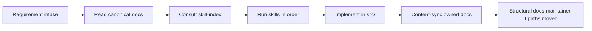

# Documentation system (core-be)

How agents and contributors keep **skills**, **CLAUDE.md**, and **hand-written docs** aligned. Skills orchestrate; docs own the narrative.

---

## Agent workflow



1. **Intake** — [`docs/getting-started/requirement-intake.md`](../../getting-started/requirement-intake.md): pick requirement type and fill details.
2. **Read canonical docs** — use the **Reference docs (read first)** list for that type (below and in intake).
3. **Consult** — [`.cursor/skills/skill-index/SKILL.md`](../../../.cursor/skills/skill-index/SKILL.md): triggers and command order.
4. **Implement** — follow skills (checklists, `pnpm` commands); do not duplicate long prose from docs inside skills.
5. **Content-sync** — if behavior or conventions changed, update the **canonical doc** for that topic (this page’s ownership table). Skip duplicating the same text in CLAUDE or skills unless a **non-negotiable** changed.
6. **Structural** — if a doc file was renamed/moved, run **docs-maintainer** (index + cross-links). If only `src/` paths moved, run **structure-maintainer** + docs content-sync.

**Generated artifacts** (`docs/routes.txt`, `docs/openapi/`, `docs/postman-collection.json`) are never hand-edited; regenerate via route-catalog / `pnpm docs:generate`.

---

## Documentation ownership map

| Topic | Canonical doc | Primary skill(s) | Update content when |
| ----- | ------------- | ---------------- | ------------------- |
| Sub-domains / layout | [sub-domains-layout.md](../architecture/sub-domains-layout.md) | domain-generator, structure-maintainer | New domain resource kind, import rules, test placement |
| Layers / request flow | [project-structure-guide.md](../architecture/project-structure-guide.md) | structure-maintainer | Layer matrix, file suffixes, infra/shared layout |
| Scripts (`src/scripts/`) | [scripts-layout.md](scripts-layout.md) | structure-maintainer | Category folders, new script placement, `validate:scripts-layout` |
| Public API / routes | [domains-and-public-api-design.md](../architecture/domains-and-public-api-design.md) | route-catalog, openapi-route-sync, domain-generator | Route registration pattern, response shape, access control |
| API docs hub (OpenAPI, Scalar, Postman) | [api-documentation.md](../api/api-documentation.md) | openapi-route-sync, route-catalog | Reference UI, validate/upload commands, hosted registry |
| Events / BullMQ | [workers-and-events.md](../runtime/workers-and-events.md) | workers-events | Event names, queues, registration paths, DLQ |
| HTTP / Vitest testing | [testing-conventions.md](../testing/testing-conventions.md) | test-generator | Pyramid, layout, naming suffixes, inject patterns |
| Manual API smoke | [api-testing.md](../../getting-started/api-testing.md) | test-generator | Post-seed manual checklist |
| i18n | [internationalization.md](../runtime/internationalization.md) | i18n-message-guard | Key format, locale files |
| CSRF / sessions | [csrf-and-session-cookies.md](../security/csrf-and-session-cookies.md) | production-hardening-guard | Cookie model, Origin checks |
| Data lifecycle | [data-lifecycle-deletion.md](../data/data-lifecycle-deletion.md) | sql-design-guard, db-migration-maintainer | Soft-delete, retention, immutable ledgers |
| API versioning | [api-versioning.md](../api/api-versioning.md) | openapi-route-sync | Deprecation headers, version prefix |
| Chaos testing | [chaos-testing.md](../reliability/chaos-testing.md) | chaos-test-maintainer | Toxiproxy setup, scenarios |
| Contract tests | [contract-tests.md](../testing/contract-tests.md) | contract-test-maintainer | Stripe/Resend/S3 fixtures |
| Load testing | [load-testing.md](../testing/load-testing.md) | structure-maintainer | k6 scenarios, npm scripts |
| Env / credentials | [integrations/credentials-and-env.md](../../integrations/credentials-and-env.md) | env-schema-add | User-facing env documentation |
| Doc index / links | [docs/README.md](../../README.md) | docs-maintainer | New/renamed/moved hand-written doc |
| New requirements | [requirement-intake.md](../../getting-started/requirement-intake.md) | skill-index | New requirement types or skill order |
| This system | documentation-system.md | docs-maintainer, structure-maintainer | Ownership map or workflow changes |

**CLAUDE.md** holds non-negotiables and command cheat sheets only; link to the rows above for detail.

---

## Code change → documentation (quick reference)

Full skill triggers live in [skill-index](../../../.cursor/skills/skill-index/SKILL.md).

| Code change | Update doc (if behavior/convention changed) |
| ----------- | --------------------------------------------- |
| `*.routes.ts`, access control | domains-and-public-api-design.md |
| `events/`, `queues/`, `workers/` | workers-and-events.md |
| `*.schema.ts`, migrations (retention/soft-delete) | data-lifecycle-deletion.md |
| Test layout, `*.unit.test.ts` tiers | testing-conventions.md |
| `env.config.ts` (user-facing) | integrations/credentials-and-env.md |
| Auth/session middleware | csrf-and-session-cookies.md |
| Domain/sub-domain folders | sub-domains-layout.md, project-structure-guide.md |

---

## Skill file template

Every **domain/architecture** skill under `.cursor/skills/<name>/SKILL.md` should follow:

```markdown
---
name: ...
description: ...
---

# Title

## Read first
- docs/reference/....md — what to take from it

## Doc sections this skill may update
- docs/reference/....md — § Section name (when …)

## When to use
(triggers)

## Checklist
- [ ] Read canonical docs above
- [ ] … implementation steps …
- [ ] pnpm commands
- [ ] Content-sync doc if convention changed
```

**Gate skills** (before-commit-guard, ci-investigator, pr-babysit, lint-warnings-handler) stay command-centric; they do not need a full ownership block.

---

## docs-maintainer modes

| Mode | Trigger | Actions |
| ---- | ------- | ------- |
| **Structural** | Added/renamed/moved file under `docs/` | Update `docs/README.md`, deployment index, cross-links, Mermaid on flow docs |
| **Content-sync** | `src/` change per ownership map; paths unchanged | Update section in canonical doc; avoid copying into skills/CLAUDE |

If only behavior changed, prefer **content-sync** only. Update CLAUDE only when a non-negotiable invariant changed.

---

## Link validation

Enforced by **`pnpm docs:links:check`** in CI (`pnpm ci:quality`), **`pnpm ci:local`**, and pre-commit when `docs/`, `.cursor/skills/**`, `.cursor/rules/**`, or key repo markdown is staged.

```bash
pnpm docs:links:check
```

Scans `docs/`, skills, rules, and key repo markdown for stale path patterns and broken relative links. Does not validate external URLs. Run manually after large doc moves.

---

## Related

- [AGENTS.md](../../../AGENTS.md) — PR gate, parallel agents
- [CLAUDE.md](../../../CLAUDE.md) — architecture invariants
- [CONTRIBUTING.md](../../../CONTRIBUTING.md) — human contributor workflow
