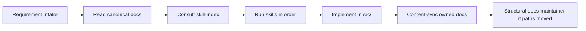

# Documentation system (core-be)

How agents and contributors keep **skills**, **CLAUDE.md**, **hand-written docs in `docs/`**, and **in-source layered docs in `src/`** aligned. Skills orchestrate; docs own the narrative; the in-source layered system anchors documentation to the code it describes.

---

## Two parallel systems

```mermaid
flowchart TB
  subgraph contributor [Contributor / agent makes a change]
    code[Edit src/]
    docs[Edit docs/]
  end
  subgraph layered [Layered docs system - lives in src/]
    sysNarr[src/{OVERVIEW,PATTERNS,FLOWS,POLICIES}.md]
    overview[src/<folder>/OVERVIEW.md]
    docsmd[Auto-generated DOCS.md]
    tsdoc[TSDoc on every export]
    schema[Fastify schema block]
  end
  subgraph handDocs [Hand-written docs - lives in docs/]
    index[docs/README.md]
    refs[docs/reference/, docs/process/, docs/deployment/]
  end
  code --> layered
  docs --> handDocs
  layered --> ratchet[pnpm features:check:strict]
  handDocs --> linkCheck[pnpm docs:lint]
```

| System | What it covers | Lives in | Owner skills | Hard gate |
| --- | --- | --- | --- | --- |
| **Layered in-source docs** | Code-anchored documentation: every directory under `src/`, every public export, every Fastify route | `src/**/*.md` (and TSDoc inside `*.ts`) | feature-doc-maintainer, system-narrative-maintainer, overview-doc-maintainer, route-schema-doc-guard, tsdoc-export-guard | `pnpm features:check:strict` (monotonic ratchet) |
| **Hand-written docs** | Narrative guides — setup, runbooks, deployment, integrations, architecture overviews | `docs/**/*.md` | docs-maintainer | `pnpm docs:lint`, `pnpm docs:links:check` |

The two systems are independent and never overwrite each other.

---

## Layered in-source docs (the new system)

Five layers, each with its own template and its own owner skill:

| Layer | File(s) | Template | Skill |
| --- | --- | --- | --- |
| **System narratives** (cross-cutting) | `src/OVERVIEW.md`, `src/PATTERNS.md`, `src/FLOWS.md`, `src/POLICIES.md` | F / G / H / I | system-narrative-maintainer |
| **Per-folder overviews** | `src/<folder>/OVERVIEW.md` | A.1 (domain), A.2 (sub-domain), A.3 (infra/shared/scripts), A.4 (test suite) | overview-doc-maintainer |
| **Per-folder index** (auto-generated) | `src/<folder>/DOCS.md`, `src/DOCS.md` | (locked template) | feature-doc-maintainer |
| **Symbol-level TSDoc** | every `export <kind> <name>` declaration in `*.ts` | TSDoc summary; `@remarks` block on services / workers / processors / policy files | tsdoc-export-guard |
| **Fastify route schema** | `schema: { summary, description, tags }` on every route registration | (Zod / Fastify schema literal) | route-schema-doc-guard |

### File-header rule (per-folder OVERVIEW.md)

Line 1 must be the bare backticked relative path:

```markdown
`src/domains/billing/sub-domains/subscription/`

# Subscription

## Purpose
...
```

### TSDoc rule (every export)

```ts
/**
 * <one-line summary describing what this export does>
 *
 * @remarks
 * Algorithm:
 * 1. <step>
 *
 * Failure modes:
 * - <error class> → <observable behaviour>.
 *
 * Side effects:
 * - <DB writes, event emissions, cache invalidations>.
 */
export class FooService { ... }
```

`@remarks` is required on **service-like** files (`*.service.ts`, `*.worker.ts`, `*.processor.ts`) and **policy-like** files (`*.constants.ts` under `src/shared/constants/`). It is optional elsewhere.

### Fastify route schema rule

```ts
app.get(
  '/api/v1/audit/logs',
  {
    schema: {
      summary: 'List audit logs',
      description: 'Returns paginated audit log entries for the current organization.',
      tags: ['Audit'],
      querystring: AuditListQueryDto,
      response: { 200: AuditListResponseDto },
    },
    preHandler: [requireOrganizationPermission('audit:read')],
  },
  controller.list,
);
```

The `schema` block is the **single source of truth** for OpenAPI generation; there is no parallel `routeMetadataMap` side-table.

---

## The hard gate (monotonic ratchet)

`pnpm features:check:strict` compares the current count of placeholder tokens against a locked baseline at [`tooling/feature-docs/missing-tokens.baseline.json`](../../../tooling/feature-docs/missing-tokens.baseline.json):

| Token | What it flags | Fix by |
| --- | --- | --- |
| `MISSING_DESCRIPTION` | An exported symbol has no TSDoc summary | tsdoc-export-guard |
| `MISSING_REMARKS` | A service-like / policy-like export has no `@remarks` block | tsdoc-export-guard |
| `MISSING_OVERVIEW_SECTION` | A folder's `OVERVIEW.md` is missing a required section | overview-doc-maintainer |
| `MISSING_SYSTEM_FILE` | One of the four `src/{OVERVIEW,PATTERNS,FLOWS,POLICIES}.md` is missing or malformed | system-narrative-maintainer |

Counts may **decrease** (refresh baseline via `pnpm features:refresh-baseline`); they may **not increase**. The gate runs in pre-commit (step 4d), `ci:local`, and `ci:quality`.

---

## Auto-trigger rule

[`.cursor/rules/feature-doc-maintainer-sync.mdc`](../../../.cursor/rules/feature-doc-maintainer-sync.mdc) routes file changes to the right authoring skill, then to **feature-doc-maintainer** for the index refresh.

| What changed | Authoring skill | Always also run |
| --- | --- | --- |
| Add / rename / remove an exported symbol | tsdoc-export-guard | feature-doc-maintainer |
| Add / change a Fastify route | route-schema-doc-guard | route-catalog, feature-doc-maintainer |
| Add a policy constant under `src/shared/constants/` | tsdoc-export-guard + system-narrative-maintainer | feature-doc-maintainer |
| Author / edit per-folder `OVERVIEW.md` | overview-doc-maintainer | feature-doc-maintainer |
| Edit `src/{OVERVIEW,PATTERNS,FLOWS,POLICIES}.md` | system-narrative-maintainer | feature-doc-maintainer |
| New domain folder under `src/domains/` | overview-doc-maintainer + system-narrative-maintainer | feature-doc-maintainer |

---

## Hand-written docs (the long-standing system)

Hand-written guides live in `docs/` topic subfolders; the index is `docs/README.md`. The owner is **docs-maintainer**.

### Agent workflow for hand-written docs



1. **Intake** — [`docs/getting-started/requirement-intake.md`](../../getting-started/requirement-intake.md): pick requirement type and fill details.
2. **Read canonical docs** — use the **Reference docs (read first)** list for that type (below and in intake).
3. **Consult** — [`.cursor/skills/skill-index/SKILL.md`](../../../.cursor/skills/skill-index/SKILL.md): triggers and command order.
4. **Implement** — follow skills (checklists, `pnpm` commands); do not duplicate long prose from docs inside skills.
5. **Content-sync** — if behavior or conventions changed, update the **canonical doc** for that topic (this page's ownership table). Skip duplicating the same text in CLAUDE or skills unless a **non-negotiable** changed.
6. **Structural** — if a doc file was renamed/moved, run **docs-maintainer**. If only `src/` paths moved, run **structure-maintainer** + docs content-sync.

**Generated artifacts** (`docs/routes.txt`, `docs/openapi/`, `docs/postman-collection.json`) are never hand-edited; regenerate via `pnpm routes:catalog` / `pnpm docs:generate`.

---

## Documentation ownership map

| Topic | Canonical doc | Primary skill(s) | Update content when |
| ----- | ------------- | ---------------- | ------------------- |
| Sub-domains / layout | [sub-domains-layout.md](./sub-domains-layout.md) | domain-generator, structure-maintainer | New domain resource kind, import rules, test placement |
| Layers / request flow | [project-structure-guide.md](./project-structure-guide.md) | structure-maintainer | Layer matrix, file suffixes, infra/shared layout |
| Scripts (`src/scripts/`) | [scripts-layout.md](./scripts-layout.md) | structure-maintainer | Category folders, new script placement, `validate:scripts-layout` |
| Public API / routes | [domains-and-public-api-design.md](./domains-and-public-api-design.md) | route-catalog, route-schema-doc-guard, domain-generator | Route registration pattern, response shape, access control |
| API docs hub (OpenAPI, Scalar, Postman) | [api-documentation.md](../api/api-documentation.md) | route-schema-doc-guard, openapi-multilingual | Reference UI, validate/upload commands, hosted registry |
| Events / BullMQ | [workers-and-events.md](../runtime/workers-and-events.md) | workers-events | Event names, queues, registration paths, DLQ |
| HTTP / Vitest testing | [testing-conventions.md](../testing/testing-conventions.md) | test-generator | Pyramid, layout, naming suffixes, inject patterns |
| Manual API smoke | [api-testing.md](../../getting-started/api-testing.md) | test-generator | Post-seed manual checklist |
| i18n | [internationalization.md](../runtime/internationalization.md) | i18n-message-guard | Key format, locale files |
| CSRF / sessions | [csrf-and-session-cookies.md](../security/csrf-and-session-cookies.md) | production-hardening-guard | Cookie model, Origin checks |
| Data lifecycle | [data-lifecycle-deletion.md](../data/data-lifecycle-deletion.md) | sql-design-guard, db-migration-maintainer | Soft-delete, retention, immutable ledgers |
| API versioning | [api-versioning.md](../api/api-versioning.md) | route-schema-doc-guard | Deprecation headers, version prefix |
| Chaos testing | [chaos-testing.md](../reliability/chaos-testing.md) | chaos-test-maintainer | Toxiproxy setup, scenarios |
| Contract tests | [contract-tests.md](../testing/contract-tests.md) | contract-test-maintainer | Stripe/Resend/S3 fixtures |
| Load testing | [load-testing.md](../testing/load-testing.md) | structure-maintainer | k6 scenarios, npm scripts |
| Env / credentials | [integrations/credentials-and-env.md](../../integrations/credentials-and-env.md) | env-schema-add | User-facing env documentation |
| Doc index / links | [docs/README.md](../../README.md) | docs-maintainer | New/renamed/moved hand-written doc |
| New requirements | [requirement-intake.md](../../getting-started/requirement-intake.md) | skill-index | New requirement types or skill order |
| **Layered docs system (this page)** | [documentation-system.md](./documentation-system.md) | docs-maintainer, system-narrative-maintainer | Ownership map, layered-docs workflow, ratchet behaviour |

**CLAUDE.md** holds non-negotiables and command cheat sheets only; link to the rows above for detail.

---

## Code change → documentation (quick reference)

Full skill triggers live in [skill-index](../../../.cursor/skills/skill-index/SKILL.md).

| Code change | Layered-docs skill | Hand-written doc to update (if convention/behaviour changed) |
| ----------- | ------------------ | --------------------------------------------------------------- |
| New / changed `*.routes.ts` | route-schema-doc-guard | domains-and-public-api-design.md, api-versioning.md |
| New `events/`, `queues/`, `workers/` | tsdoc-export-guard, overview-doc-maintainer | workers-and-events.md |
| New / changed `*.schema.ts`, migrations (retention/soft-delete) | tsdoc-export-guard | data-lifecycle-deletion.md |
| Test layout, `*.unit.test.ts` tiers | overview-doc-maintainer (`src/tests/<suite>/OVERVIEW.md`) | testing-conventions.md |
| `env.config.ts` (user-facing) | tsdoc-export-guard | integrations/credentials-and-env.md |
| Auth/session middleware | tsdoc-export-guard | csrf-and-session-cookies.md |
| New domain or sub-domain folder | overview-doc-maintainer + system-narrative-maintainer (Domains table) | sub-domains-layout.md, project-structure-guide.md |
| New cross-cutting pattern (idempotency, transactional outbox, etc.) | system-narrative-maintainer (`src/PATTERNS.md`) | (link from relevant reference doc) |
| New end-to-end flow (request lifecycle, webhook ingest, etc.) | system-narrative-maintainer (`src/FLOWS.md`) | (link from relevant reference doc) |
| New policy constant under `src/shared/constants/` | tsdoc-export-guard + system-narrative-maintainer (`src/POLICIES.md`) | (link from relevant reference doc) |

---

## Skill file template

Every **domain/architecture** skill under `.cursor/skills/<name>/SKILL.md` follows roughly:

```markdown
---
name: ...
description: ...
---

# Title

## Purpose
(1–2 paragraphs)

## When to use
(triggers)

## Workflow / Checklist
- [ ] Read canonical docs above
- [ ] … implementation steps …
- [ ] pnpm commands
- [ ] Content-sync doc if convention changed

## Related skills
- Cross-links to skills that should run before/after.
```

The five **layered-docs skills** (feature-doc-maintainer, system-narrative-maintainer, overview-doc-maintainer, route-schema-doc-guard, tsdoc-export-guard) follow this same shape and additionally embed their own templates (A.1 / A.2 / A.3 / A.4 / F / G / H / I).

**Gate skills** (before-commit-guard, ci-investigator, pr-babysit, lint-warnings-handler) stay command-centric; they do not need a full ownership block.

---

## docs-maintainer modes

| Mode | Trigger | Actions |
| ---- | ------- | ------- |
| **Structural** | Added / renamed / moved file under `docs/` | Update `docs/README.md`, deployment index, cross-links, Mermaid on flow docs |
| **Content-sync** | `src/` change per ownership map; paths unchanged | Update section in canonical doc; avoid copying into skills/CLAUDE |

If only behavior changed, prefer **content-sync** only. Update CLAUDE only when a non-negotiable invariant changed.

**Scope boundary:** docs-maintainer covers only `docs/**/*.md`. In-source layered docs under `src/` are owned by the layered-docs skills above (routed by [`.cursor/rules/feature-doc-maintainer-sync.mdc`](../../../.cursor/rules/feature-doc-maintainer-sync.mdc)).

---

## Link validation

Two independent gates:

| Gate | Command | Scope |
| --- | --- | --- |
| Hand-written link drift | `pnpm docs:links:check` | `docs/**`, skills, rules, key repo markdown |
| Markdown formatting | `pnpm docs:lint` | All `.md` except auto-generated `DOCS.md` |
| Layered-docs ratchet | `pnpm features:check:strict` | Auto-generated `DOCS.md`, missing-token counts |

Both run in `ci:quality` and `ci:local`; pre-commit runs the same.

```bash
pnpm docs:links:check          # hand-written link drift
pnpm docs:lint                 # markdown formatting
pnpm features:check:strict     # layered-docs ratchet
```

---

## Related

- [AGENTS.md](../../../AGENTS.md) — PR gate, parallel agents, layered docs callout
- [CLAUDE.md](../../../CLAUDE.md) — architecture invariants, layered-docs subsection
- [CONTRIBUTING.md](../../../CONTRIBUTING.md) — human contributor workflow
- [`src/OVERVIEW.md`](../../../src/OVERVIEW.md) — top of the system narrative tree
- [`.cursor/rules/feature-doc-maintainer-sync.mdc`](../../../.cursor/rules/feature-doc-maintainer-sync.mdc) — auto-trigger map
