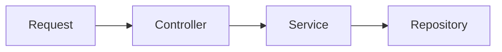

# Domain and Public API Design

Canonical domain layout and Paddle-style API responses. See **CLAUDE.md** for the full canonical layout and dependency rules. For URL major-versioning and deprecation (`/api/v1`, headers, adding `v2`), see **[api-versioning.md](../api/api-versioning.md)**. For persistence lifecycle (**soft-delete**, revocation, immutable ledger rows, retention), see **[data-lifecycle-deletion.md](../data/data-lifecycle-deletion.md)**.

---

## Request flow



Domain → sub-domain layout; request → controller → service → repository.

---

## 1. Code structure: domain → sub-domain

**Rule:** Domain folder name = Postgres schema name (1:1). Inside each domain, **sub-domains** are separate folders (one per resource), each with its own `*.controller.ts`, `*.service.ts`, `*.repository.ts`, `*.validator.ts`, `*.serializer.ts`, `*.dto.ts`, `*.types.ts`, and optionally `*.schema.ts`, `queues/`, `workers/`. One `routes.ts` per domain at the domain root wires all sub-domain routes.

### 1.1 Folder layout

```text
src/domains/<domain>/              # domain = DB schema
  <domain>.routes.ts
  <domain>.container.ts
  events/                          # optional: handler registration aggregator
  __tests__/                       # domain e2e, domain unit, domain factories (see §1.5)
  sub-domains/                     # multi-resource domains only (omit for audit, upload)
    <sub-domain>/                  # top-level resource (sibling)
      <sub-domain>.{controller,service,repository,dto,validator,serializer,types,schema}.ts
      __tests__/                   # sub-domain unit / nested e2e
      events/ | queues/ | workers/ # optional
      <nested-sub-domain>/         # optional aggregate child inside parent sub-domain
        <nested-sub-domain>.{controller,service,...}.ts
        __tests__/unit/
```

**Nested sub-domains:** A sub-domain may contain another sub-domain folder when the child is an aggregate (lifecycle tied to parent). Examples: `sub-domains/webhook/webhook-event/`, `sub-domains/organization/organization-api-key/`, `sub-domains/membership/member-invitation/`. Import: `@/domains/<domain>/sub-domains/<parent>/<nested>/...`.

### 1.2 Domain and sub-domain mapping

| Domain (folder) | Sub-domains (folders)                                                                                                                                                           |
| --------------- | ------------------------------------------------------------------------------------------------------------------------------------------------------------------------------- |
| **audit**       | (single domain, no sub-domains)                                                                                                                                                 |
| **auth**        | auth-method (magic-link, oauth), auth-session, auth-mfa, auth-webauthn                                                                                                          |
| **user**        | user-settings, user-notification-preferences, user-data-export                                                                                                                  |
| **tenancy**     | organization (organization-settings, organization-notification-policy, organization-api-key), membership (member-invitation), member-roles (member-role-permission), permission |
| **billing**     | plan, subscription, stripe-webhook                                                                                                                                              |
| **notify**      | notification, webhook (webhook-event)                                                                                                                                           |
| **upload**      | (single domain, no sub-domains)                                                                                                                                                 |

- **Code:** `src/domains/auth/sub-domains/auth-method/`, `src/domains/tenancy/sub-domains/organization/`, etc. Use `.cursor/skills/domain-generator/SKILL.md` and **CLAUDE.md** when adding or extending sub-domains.
- **DB:** Schemas `auth`, `tenancy`, `billing`, `notify`, `audit` in Postgres (same names as domain folders).

### 1.3 Sub-domain nesting (sub-domains may contain sub-domains)

| Rule                                                                          | Example                                                                                                                                           |
| ----------------------------------------------------------------------------- | ------------------------------------------------------------------------------------------------------------------------------------------------- |
| **Sibling resources** — direct children of `sub-domains/`                     | `sub-domains/plan/`, `sub-domains/subscription/`, `sub-domains/permission/`                                                                       |
| **Nested sub-domains** — folders inside a parent sub-domain                   | `sub-domains/webhook/webhook-event/`                                                                                                              |
| **Organization / membership / member-roles children**                         | `sub-domains/organization/organization-api-key/`, `sub-domains/membership/member-invitation/`, `sub-domains/member-roles/member-role-permission/` |
| **Prefix** multi-word names with domain/resource name                         | `organization-settings`, `member-invitation`, `webhook-event`                                                                                     |
| **Implementation modules** (not separate API resources) stay in parent folder | `auth-method/magic-link.service.ts`, `auth-method/oauth/` — not extra folders unless a public resource                                            |
| Prefer depth ≤ 4 under `domains/<domain>/` for new work                       | Flatten if a nested folder has no distinct routes or tests                                                                                        |

Nested sub-domains use the same layer files and optional `events/`, `queues/`, `workers/`, `__tests__/` as top-level sub-domains.

### 1.4 Layout variants (intentional, not incomplete)

| Variant                   | Example                                                       | When to use                                                         |
| ------------------------- | ------------------------------------------------------------- | ------------------------------------------------------------------- |
| **Bundled routes**        | `user.routes.ts` registers settings, preferences, data-export | Sub-domain has service/repository only; same URL prefix as siblings |
| **Per-sub-domain routes** | `billing/subscription/subscription.routes.ts`                 | Large domain; aggregator `billing.routes.ts` registers plugins      |
| **Implementation module** | `auth/auth-method/magic-link.service.ts`                      | No separate public resource; wired from parent `auth.routes.ts`     |
| **No repository**         | `upload/` uses `infrastructure/storage`                       | Thin presigned-URL flow                                             |
| **Aggregate child**       | `webhook/webhook-event/`                                      | Lifecycle tied to parent                                            |
| **Cross-domain read**     | `user-data-export.service.ts`                                 | Calls auth, tenancy, notify, and audit services (`list*ForUserDataExport`) |

**Route file strategy by domain** (follow the existing style when adding endpoints):

| Domain        | Route entry                      | Sub-domain `*.routes.ts`                                 |
| ------------- | -------------------------------- | -------------------------------------------------------- |
| billing       | `billing.routes.ts` (aggregator) | Yes — one file per billing resource                      |
| tenancy       | `tenancy.routes.ts` (aggregator) | Yes — organization, membership, member-roles, permission |
| notify        | `notify.routes.ts` (aggregator)  | Yes — notification, webhook                              |
| user          | `user.routes.ts` only            | No — extend root routes file                             |
| auth          | `auth.routes.ts` only            | No — MFA/session/method via parent controller            |
| audit, upload | Single root `*.routes.ts`        | No                                                       |

**Route metadata:** `docs/routes.txt` is **auto-generated** from `*.routes.ts` via `pnpm routes:catalog` (do not edit by hand). Program history: **[architecture-consistency-roadmap-2026-05.md](../../reviews/architecture-consistency-roadmap-2026-05.md)** (archival).

**Wiring:** Multi-sub-domain domains use `<domain>.container.ts` to export services. Routes pass the container (or individual services) to controllers. There is no orchestrator layer — controllers call sub-domain services directly.

**Route schema (mandatory for OpenAPI):** Every Fastify route registration must include a `schema: { summary, description, tags }` block. This is the **single source of truth** for OpenAPI generation — there is no parallel `routeMetadataMap` side-table. Owned by **[route-schema-doc-guard](../../../.cursor/skills/route-schema-doc-guard/SKILL.md)**.

```ts
app.get(
  '/api/v1/tenancy/organization',
  {
    schema: {
      summary: 'Get the active organization',
      description: 'Returns the active organization (from the token `org` claim) if the caller is a member.',
      tags: ['Tenancy / Organization'],
      response: { 200: OrganizationResponseDto },
    },
    preHandler: [requireOrganizationPermission('organization:read')],
  },
  controller.get,
);
```

**Layered docs:** Every sub-domain folder must additionally have an `<folder>.overview.md` (Template A.2) and TSDoc on every public export. See [documentation-system.md](./documentation-system.md).

### 1.5 Tests (layout)

| Layer                     | Location                                                                            | Example                                                                          |
| ------------------------- | ----------------------------------------------------------------------------------- | -------------------------------------------------------------------------------- |
| Cross-cutting             | `src/tests/`                                                                        | security, performance, helpers, shared factories                                 |
| Domain bundled e2e        | `<domain>/__tests__/<domain>.test.ts`                                               | `billing.test.ts`, `auth.test.ts`                                                |
| Domain unit / policy      | `<domain>/__tests__/unit/`                                                          | `billing-ledger-immutability.test.ts`                                            |
| Domain test factories     | `<domain>/__tests__/factories/`                                                     | `tenancy/__tests__/factories/permission.factory.ts`                              |
| Sub-domain unit           | `sub-domains/<r>/__tests__/unit/` or `sub-domains/<parent>/<child>/__tests__/unit/` | `plan.validator.test.ts`, `organization-api-key.validator.test.ts`               |
| Sub-domain e2e (optional) | `sub-domains/<parent>/<child>/__tests__/<child>.test.ts`                            | `organization-api-key.test.ts`                                                   |
| Event handlers / emit     | `sub-domains/<r>/__tests__/unit/events/`                                                 | `auth-method.event-handlers.unit.test.ts`, `member-invitation.event-handlers.unit.test.ts` |

Do **not** add per-sub-domain `factories/` unless the helper is truly local; prefer `src/tests/factories/` or domain `__tests__/factories/`. Full pyramid and commands: **`.cursor/skills/test-generator/SKILL.md`** and **`.cursor/rules/testing-conventions.mdc`**.

---

## 2. Response format (Paddle-style)

All successful API responses use this shape. No `success: true` wrapper; `data` and `meta` only.

### 2.1 List (paginated)

```json
{
  "data": [
    {
      "id": "ctm_01hv6y1jedq4p1n0yqn5ba3ky4",
      "status": "active",
      "name": "Jo Brown-Anderson",
      "email": "jo@example.com",
      "created_at": "2024-04-11T15:57:24.813Z",
      "updated_at": "2024-04-11T15:59:56.658719Z"
    }
  ],
  "meta": {
    "request_id": "913dee78-d496-4d13-a93e-09d834c208dd",
    "pagination": {
      "per_page": 50,
      "next": "https://api.example.com/api/v1/customers?after=ctm_01h8441jn5pcwrfhwh78jqt8hk",
      "has_more": false,
      "estimated_total": 4
    }
  }
}
```

- **data**: array of entities (use `public_id` as `id` in JSON).
- **meta.request_id**: UUID for the request (for support/debugging).
- **meta.pagination**: `per_page`, `next` (URL or null), `has_more`, `estimated_total` (optional; use when available without extra query).

### 2.2 Single resource

```json
{
  "data": {
    "id": "ctm_01hrffh7gvp29kc7xahm8wddwa",
    "status": "active",
    "name": "Sam Miller",
    "email": "sam@example.com",
    "created_at": "2024-03-08T16:49:53.691Z",
    "updated_at": "2024-04-11T16:03:57.924146Z"
  },
  "meta": {
    "request_id": "aa0009cb-18f7-4538-b1cd-ad29d91cfaa7"
  }
}
```

- **data**: single object (use `public_id` as `id` in JSON).
- **meta.request_id**: required on every response.

### 2.3 Create (201)

Same as single resource; response body is the created entity with `data` + `meta.request_id`. HTTP status 201.

### 2.4 Delete (204)

No body, or empty body. No `data`/`meta` required for 204.

**Implementation:** Add/update helpers in `src/shared/utils/http/response.util.ts` (e.g. `successResponse(data, requestId)`, `paginatedResponse(data, meta)`) and ensure every response includes `request_id` (e.g. from `request.id` or generated per request). Remove `success: true` from responses.

---

## 3. Error format (Paddle-style)

Follow [Paddle Errors](https://developer.paddle.com/api-reference/about/errors): standard HTTP status (4xx/5xx) and a single `error` object (no `data`).

### 3.1 Generic error

```json
{
  "error": {
    "type": "request_error",
    "code": "not_found",
    "detail": "Entity usr_01gsz97mq9pa4fkyy0wqenepkz not found",
    "documentation_url": "https://docs.example.com/errors/not_found"
  },
  "meta": {
    "request_id": "9346b365-4cad-43a6-b7c1-48ff6a1c7836"
  }
}
```

- **error.type**: e.g. `request_error`, `validation_error`.
- **error.code**: short **snake_case** code (e.g. `not_found`, `unauthorized`, `forbidden`, `conflict`, `internal_error`).
- **error.detail**: human-readable message.
- **error.documentation_url**: (optional) link to error reference.
- **meta.request_id**: required.

### 3.2 Validation error

```json
{
  "error": {
    "type": "validation_error",
    "code": "invalid_field",
    "detail": "Invalid values for fields in request",
    "documentation_url": "https://docs.example.com/errors/invalid_field",
    "errors": [
      {
        "field": "name",
        "message": "max length of 200 exceeded, provided value length 220"
      },
      {
        "field": "email",
        "message": "must be a valid email"
      }
    ]
  },
  "meta": {
    "request_id": "9346b365-4cad-43a6-b7c1-48ff6a1c7836"
  }
}
```

- **error.errors**: array of `{ field, message }` for each invalid field.

**Implementation:** Update `src/shared/middlewares/core/error-handler.middleware.ts` and `src/shared/errors/index.ts` to emit this shape; map existing `AppError` codes to snake_case (`NOT_FOUND` → `not_found`, etc.) and add `type`, `documentation_url`, and `meta.request_id`. Ensure `request_id` is set on the request (e.g. Fastify `request.id` or middleware).

---

## 4. Domain layout and sub-domains (code structure reset)

Domain folder = DB schema; each **sub-domain** is a folder with its own controller, service, repository, validator, serializer, dto, types (see §1). API routes below are implemented by these sub-domains.

### 4.1 auth — sub-domain: users

- **Path:** `src/domains/auth/` (controller, service, repos; sub-domains: auth-method, auth-session, auth-mfa, auth-webauthn).
- **Routes:** Auth flows `POST /api/v1/auth/login`, `logout`, `magic-link`, `oauth/:provider`; current user `GET|PATCH /api/v1/auth/me`; under me: `GET|PATCH /api/v1/auth/me/settings`, `GET|PUT /api/v1/auth/me/notification-preferences`, `GET|POST|DELETE /api/v1/auth/me/auth-methods`, `GET /api/v1/auth/me/sessions`, `DELETE /api/v1/auth/me/sessions/:session_id`.
- **Self-service MFA / WebAuthn (authenticated, under `/auth/me/`):** managing a user's own second factor is a self-service operation and lives under `/auth/me/`: `GET /api/v1/auth/me/mfa`, `DELETE /api/v1/auth/me/mfa/:mfa_method_id`, `POST /api/v1/auth/me/mfa/enroll`, `POST /api/v1/auth/me/mfa/enroll/confirm`, `POST /api/v1/auth/me/mfa/verify`, `POST /api/v1/auth/me/webauthn/register/options`, `POST /api/v1/auth/me/webauthn/register/verify`. MFA-method ids use the `am_` (auth-method) prefix — `mfa_method_id` validates `^am_[a-z0-9]{21}$`.
- **Public login-flow second factor (unauthenticated):** the routes used **during login**, before a session exists, stay at the top level: `POST /api/v1/auth/mfa/login`, `POST /api/v1/auth/webauthn/authenticate/options`, `POST /api/v1/auth/webauthn/authenticate/verify`. The old `/auth/mfa*` (non-login) paths now return 404 — there are no deprecation aliases (pre-first-release).
- **Active-org switch:** `POST /api/v1/auth/switch-to-personal`, `POST /api/v1/auth/switch-to-organization { organization_id }` re-mint the access token with the new `org` claim.

### 4.2 tenancy — sub-domains: organizations, roles, permissions, membership

- **Paths:** `src/domains/tenancy/sub-domains/organization/`, `sub-domains/membership/`, etc. (each with controller, service, repository, etc.).
- **Routes (prefix `/api/v1/tenancy`):** The active organization is the signed `org` token claim, so org-scoped sub-resources hang off the **singular** `/tenancy/organization` resource — there is no per-organization path segment. Account-level list/create stays **plural**.
  - Organizations (account-level): `GET|POST /api/v1/tenancy/organizations` (list / create a team org), `GET /api/v1/tenancy/organizations/by-slug/:slug`.
  - Active organization: `GET|PATCH|DELETE /api/v1/tenancy/organization`.
  - Settings: `GET|PATCH /api/v1/tenancy/organization/settings`.
  - Notification policies: `GET|POST /api/v1/tenancy/organization/notification-policies`, `PATCH|DELETE .../notification-policies/:notification_policy_id`.
  - Roles: `GET|POST /api/v1/tenancy/organization/roles`, `GET|PATCH|DELETE .../roles/:role_id`; role permissions `GET|PUT .../roles/:role_id/permissions`.
  - Memberships: `GET|POST /api/v1/tenancy/organization/memberships`, `GET|PATCH|DELETE .../memberships/:membership_id`; `POST /api/v1/tenancy/organization/leave`, `POST /api/v1/tenancy/organization/transfer-ownership`.
  - Invitations: `GET|POST /api/v1/tenancy/organization/invitations`, `DELETE .../invitations/:invitation_id`; cross-org accept/decline are account-level: `POST /api/v1/tenancy/invitations/:invitation_id/accept|decline`.
  - Permissions (global): `GET /api/v1/tenancy/permissions`.

All `:id` params are **public_id**. Organization **slug** is unique; `getBySlug(slug)` returns same shape as the active-org get.

**Organization context (HTTP):** The active organization rides the signed `org` token claim — not a path parameter or header. The tenant middleware resolves it post-auth and re-checks membership + RLS per request; switch with `POST /api/v1/auth/switch-to-personal` or `POST /api/v1/auth/switch-to-organization { organization_id }` (both re-mint the access token). `X-Organization-Id` is legacy (upload domain only). See **[api-testing.md](../../getting-started/api-testing.md)** (active-organization section). Avatars and logos are attached only via presigned upload keys (`avatar_key` / logo `key`), not arbitrary URLs on PATCH.

#### Personal vs Team capability matrix

An organization has an immutable `type` — `PERSONAL` (single-owner workspace) or `TEAM` (shareable, multi-member). There is **one** route surface for both: no personal-only or team-only URLs. Five capabilities are structurally unavailable to a personal organization, and every serialized organization response advertises them so clients can hide or disable the corresponding actions instead of probing.

- **`capabilities` object** — every organization response (get, list, create, patch) carries a `capabilities` object with booleans `can_invite_members`, `can_manage_members`, `can_manage_roles`, `can_transfer_ownership`, `can_delete`. These describe the **org type's** capability (`TEAM` → all `true`, `PERSONAL` → all `false`), **not** the caller's permission (permissions/roles govern that separately). Derived by `organizationCapabilities(type)` in `src/domains/tenancy/sub-domains/organization/organization-capability.ts`.
- **The 5 team-only routes** (reject a personal org with **HTTP 422** `unprocessable_entity`): `DELETE /api/v1/tenancy/organization`, `POST /api/v1/tenancy/organization/invitations`, `POST /api/v1/tenancy/organization/memberships`, `POST /api/v1/tenancy/organization/transfer-ownership`, `POST /api/v1/tenancy/organization/roles`.
- **Backstop guard** — the same module exports `assertTeamOrganization(organization, capability)` (capabilities `MEMBERS | ROLES | MUTATION`), the single point of enforcement shared by the five routes. It returns 422 (not 409) because the org `type` is immutable, so an identical retry can never succeed. See **[response-codes.md](../api/response-codes.md)** (`409 vs 422`) and **[route-consistency-and-org-model.md](../api/route-consistency-and-org-model.md)**.

### 4.3 billing — sub-domains: plans, subscriptions

- **Paths:** `src/domains/billing/sub-domains/plan/`, `sub-domains/subscription/`, `sub-domains/stripe-webhook/`.
- **Routes:** Plans `GET /api/v1/billing/plans`, `GET /api/v1/billing/plans/:plan_id`. Subscriptions are top-level under the token `org` claim: `/api/v1/billing/subscriptions` (and lifecycle actions: change-plan, cancel, resume).

### 4.4 notify — sub-domains: notifications, webhooks

- **Paths:** `src/domains/notify/sub-domains/notification/`, `sub-domains/webhook/`.
- **Routes:** User notifications `GET /api/v1/notify/notifications`, `GET .../notifications/:notification_id`, `PATCH .../notifications/:notification_id/read`. Webhooks are top-level under the token `org` claim: `GET|POST /api/v1/notify/webhooks`, `GET|PATCH|DELETE .../webhooks/:webhook_id`; delivery attempts `GET .../webhooks/:webhook_id/delivery-attempts`.

### 4.5 audit — sub-domain: logs

- **Path:** `src/domains/audit/`.
- **Routes:** `GET /api/v1/audit/logs` with query params: `organization_id`, `actor_user_id`, `resource_type`, `action`, `from`, `to`, pagination.

---

## 5. Conventions summary

- **Domain folders = DB schemas:** Exactly five: `auth`, `tenancy`, `billing`, `notify`, `audit`. Folder under `src/domains/<name>/` uses the same name as the Postgres schema.
- **URL path segments:** Plural, kebab-case (e.g. `member-invitations`, `audit-logs`).
- **IDs in URLs:** Always **public_id** (21-char NanoID/ULID). Response bodies use `id` for public_id.
- **Body field casing:** Request body and response body property keys are **snake_case** (`file_name`, `created_at`, `avatar_key`) — matching the DB columns and the `meta`/`pagination` envelope; the single external identifier is `id`. Validation `error.errors[].field` values are snake_case too. Internal TypeScript identifiers may stay camelCase. Verbatim third-party / browser-native payloads (Stripe webhooks, OAuth, WebAuthn W3C JSON) and JWT claims are the only exceptions. Enforced by `src/tests/unit/api/snake-case-body-keys.policy.unit.test.ts`.
- **API prefix:** `/api/v1/`.
- **Request ID:** Every response (success and error) includes `meta.request_id` (UUID).
- **Drizzle:** snake_case columns; DB schema names auth, tenancy, billing, notify, audit (match domain folder names).
- **JWT:** `sub` = user `public_id` for consistency.
- **Env files:** Root only — `.env` at project root (local, never committed); `.env.example` at root (committed). No `env/` directory.

---

## 6. Implementation todos (original)

- [x] **core-response-format** — Add Paddle-style response helpers in `src/shared/utils/http/response.util.ts`: single (`data` + `meta.request_id`), paginated (`data` + `meta.request_id` + `meta.pagination` with `per_page`, `next`, `has_more`, `estimated_total`). Ensure request has `request_id` (e.g. `request.id` or middleware).
- [x] **core-error-format** — Update `src/shared/middlewares/core/error-handler.middleware.ts` and `src/shared/errors/index.ts` to Paddle error shape: `error.type`, `error.code` (snake_case), `error.detail`, `error.documentation_url`, `error.errors` (for validation); `meta.request_id`. Map existing codes to snake_case.
- [x] **db-migrations** — Add SQL migrations for OptimizedAuthTenantSchema: create schemas auth, tenancy, billing, notify, audit; create all tables with bigserial PKs, public_id (varchar 21), indexes, constraints, partial indexes as per DBML.
- [x] **db-drizzle-schema** — Add Drizzle schema definitions (snake_case) for `auth.*`, `tenancy.*`, `billing.*`, `notify.*`, `audit.*` in `src/db/schema.ts` or split per schema.
- [x] **domain-auth** — Scaffold `src/domains/auth/`: users (handlers, services, repos, types, routes). Wire auth routes (me). Register under `/api/v1/auth`.
- [x] **domain-tenancy** — Add `src/domains/tenancy/` (folder = schema name). Implement organizations (get by id, get by slug). Register under `/api/v1/tenancy`. Legacy `organizations` domain kept at `/api/v1/organizations`.
- [x] **domain-billing** — Scaffold `src/domains/billing/`: plans (list, get by id). Register under `/api/v1/billing`.
- [x] **domain-notify** — Scaffold `src/domains/notify/`: notifications (list for user). Register under `/api/v1/notify`.
- [x] **domain-audit** — Scaffold `src/domains/audit/`: logs (list). Implement `GET /api/v1/audit/logs`. Register under `/api/v1/audit`.
- [x] **public-id-helpers** — Add `src/shared/utils/identity/public-id.util.ts` (generatePublicId). Responses expose `id` as public_id.
- [x] **docs-sync** — Update CLAUDE.md, README.md for domain names (auth, tenancy, billing, notify, audit), response/error format.
- [x] **reset-code-structure** — Migrate existing flat domain layout to domain → sub-domain layout. Done: `auth/users/`, `tenancy/organizations|roles|permissions|membership/`, `billing/plans/`, `notify/notifications/`, `audit/logs/`; single `routes.ts` per domain. Legacy `organizations` domain and public.organizations removed.
- [x] **env-files-root-only** — Env at project root only: `.env` (not committed), `.env.example` (committed). No `env/` directory. `.gitignore` and `.env.example` updated; PR checks reject committed `.env` (allow only `.env.example`).

---

## 7. Consolidated Master Plan — Phase completion status

All 19 phases from the Consolidated Master Plan (Domain API Upgrade + CI/CD + env convention) have been implemented. This section tracks the status of each phase.

### Phase 0 — Domain co-location audit

- [x] Schema co-location audit (verified Drizzle schemas live under `src/infrastructure/database/schemas/<domain>/`)
- [x] Domain and sub-domain directory naming follows canonical layout from CLAUDE.md

### Phase 1 — Infrastructure hardening

- [x] Postgres.js connection: SSL in production, `statement_timeout`, `max_lifetime`, pool sizing via env
- [x] ioredis connection: `retryStrategy`, `keyPrefix`, error handlers, `lazyConnect`
- [x] Pino logger: redaction of sensitive fields (authorization, password, token, secret, cookie)
- [x] Env validation: Zod schema for all environment variables (`src/shared/config/env.config.ts`)

### Phase 2 — Database safety

- [x] Schema audit: indexes, foreign keys in Drizzle schemas
- [x] Upload and MFA schemas co-located
- [x] `DATABASE_MIGRATION_URL` in env config; `migrate.ts` uses it with fallback
- [x] `db:push` script added to `package.json`
- [x] RLS migration (`migrations/20260215000002_enable_rls.sql`) for all multi-tenant tables
- [x] Tenant middleware sets `app.current_organization_id` Postgres session variable for RLS

### Phase 3 — Security hardening

- [x] JWT: RS256 only, 15-min access token expiry, issuer + audience claims
- [x] Argon2id password hashing (`src/shared/utils/security/password.util.ts`) — Argon2id only
- [x] NIST 12-character minimum password length enforced in DTOs (ResetPasswordDto, ChangePasswordDto)
- [x] Account lockout after 10 failed attempts (30-min window)
- [x] `.strict()` on all 17 DTO files to reject unknown fields
- [x] `maxLength` on all string fields across DTOs
- [x] Helmet middleware with explicit CSP directives
- [x] CORS with explicit `ALLOWED_ORIGINS`
- [x] Rate limiting (global + per-route)
- [x] Idempotency middleware (Redis-backed SETNX, 24h TTL)
- [x] Organization ID format validation in tenant middleware

### Phase 4 — Code quality

- [x] Typed error classes: `AppError`, `ValidationError`, `NotFoundError`, `UnauthorizedError`, `ForbiddenError`, `ConflictError`, `NotImplementedError`
- [x] Public ID utility with modulo-bias fix (NanoID)
- [x] TypeScript strict flags: `noImplicitOverride`, `noFallthroughCasesInSwitch`, `isolatedModules`

### Phase 5 — Test infrastructure foundations

- **Convention:** Vitest under `src/tests/` (cross-cutting) and `src/domains/**/__tests__/**` (domain + sub-domain + nested sub-domain + `__tests__/unit/events/`). k6: `src/tests/load/k6/`. See §1.5 and **test-generator** skill.
- [x] `createTestApp()` helper (`src/tests/helpers/test-app.ts`)
- [x] `createTestOrganization()` helper
- [x] Factory functions: user, organization, plan, permission, role, membership

### Phase 6 — Domain integration tests

- [x] Auth tests (`src/domains/auth/__tests__/auth.test.ts`)
- [x] Tenancy tests (`src/domains/tenancy/__tests__/tenancy.test.ts`)
- [x] Billing tests (`src/domains/billing/__tests__/billing.test.ts`)
- [x] User tests (`src/domains/user/__tests__/user.test.ts`)
- [x] Notify tests (`src/domains/notify/__tests__/notify.test.ts`)
- [x] Audit tests (`src/domains/audit/__tests__/audit.test.ts`)
- [x] Upload tests (`src/domains/upload/__tests__/upload.test.ts`)

### Phase 7 — Security tests

- [x] Auth enforcement (`src/tests/security/auth-enforcement.test.ts`)
- [x] Input validation / injection prevention (`src/tests/security/input-validation.test.ts`)
- [x] CORS headers (`src/tests/security/cors.test.ts`)
- [x] Helmet / security headers (`src/tests/security/helmet-headers.test.ts`)
- [x] Rate limiting (`src/tests/security/rate-limiting.test.ts`)
- [x] Idempotency (`src/tests/security/idempotency.test.ts`)
- [x] JWT security (`src/tests/security/jwt-security.test.ts`)

### Phase 8 — Performance tests

- [x] N+1 query detection (`src/tests/performance/n-plus-one.test.ts`)
- [x] Concurrent request handling (`src/tests/performance/concurrent-requests.test.ts`)

### Phase 9 — Permission system tests

- [x] Permission factories (`src/domains/tenancy/__tests__/factories/permission.factory.ts`)
- [x] Permission integration tests (`src/domains/tenancy/sub-domains/permission/__tests__/permissions.test.ts`)

### Phase 10 — Route registry + completeness

- [x] `docs/routes.txt` — auto-generated route catalog (`pnpm routes:catalog`)
- [x] `src/tests/global/route-completeness.test.ts` — validates registry integrity and Fastify parity

### Phase 11 — k6 load testing

- [x] Helpers: `src/tests/load/k6/helpers/config.js`, `auth.js`, `data.js`, `checks.js`
- [x] Scenarios: `auth-onboarding.js`, `daily-ops.js`, `billing.js`, `webhooks.js`, `admin.js`
- [x] Test scripts in `package.json`: `test:performance`, `test:security`, `test:bench`

### Phase 12 — CI/CD pipeline

- [x] `.github/workflows/ci.yml` — quality, test, security, docker-build, docs jobs
- [x] `.github/workflows/pr-checks.yml` — title validation, labeling
- [x] `.github/CODEOWNERS`
- [x] `.github/dependabot.yml`
- [x] `.github/labeler.yml`
- [x] `.github/pull_request_template.md`
- [x] Domain structure validation in CI (`pnpm validate:domain`)
- [x] Dockerfile HEALTHCHECK

### Phase 13 — Structural tests

- [x] `src/tests/global/domain-consistency.test.ts` — kebab-case, file naming, required files per domain

### Phase 14 — Unit tests

- [x] `src/tests/unit/services/permission-cache.test.ts`

### Phase 15 — Scalability + stability

- [x] S3 error logging in `storage.service.ts`
- [x] Worker RSS monitoring in `infrastructure/queue/bootstrap.ts`
- [x] Transaction utility with timeout + isolation options (`infrastructure/database/transaction.ts`)

### Phase 16 — Final validation

- [x] `src/tests/global/system-validation.test.ts` — validates migrations, route registry, middleware, JWT, logger, schemas, DTOs, TypeScript, CI config

### Phase 17 — AI skills + rules (auto-mode)

- [x] `.cursor/skills/test-generator/SKILL.md`
- [x] `.cursor/skills/schema-generator/SKILL.md`
- [x] `.cursor/skills/seed-maintainer/SKILL.md`
- [x] `.cursor/skills/production-hardening-guard/SKILL.md`
- [x] Skill index updated with trigger map for all new skills
- [x] `.cursor/rules/` updated with production-hardening and no-placeholder-files rules
- [x] CLAUDE.md and README.md updated with full project structure, conventions, and commands

### Phase 18 — Env files (root only)

- [x] Convention: only root `.env.example` is committed; `.env.<environment>` (e.g. `.env.development`, `.env.production`) are gitignored operator templates generated by `pnpm github:sync` from `tooling/setup/setup.config.json`; no `env/` directory
- [x] `.gitignore`: ignores all `.env*` except `.env.example`
- [x] `.env.example`: two top-level halves (`# GitHub Secrets`, `# GitHub Variables`) — section IS Secret/Variable classification for `pnpm github:sync`
- [x] PR check (`.github/workflows/pr-checks.yml`): reject commits that add any `.env.*` file other than `.env.example`
- [x] README / docs: local setup uses `pnpm github:sync` (see [environment-variables.md](../../deployment/runbooks/environment-variables.md))
