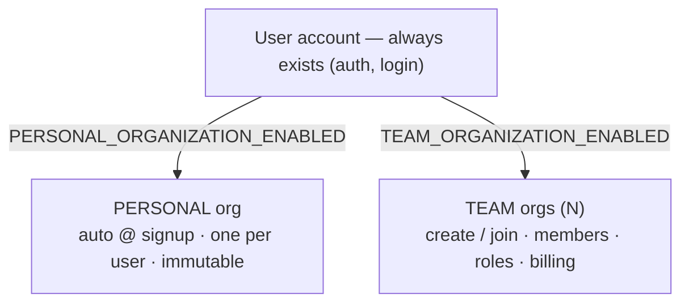

# Personal & Team Organizations

How one user account works across a **personal** organization and any number of **team**
organizations, and how the active organization is carried as a signed token claim.

> Vocabulary: everything is an **organization** (`organizations.type IN ('PERSONAL','TEAM')`).
> "Personal" is a UI label for the personal organization. There is no "workspace" concept.

## Model

- A user owns **exactly one** `PERSONAL` organization (auto-provisioned at signup, enforced by
  the `idx_org_one_personal_per_owner` partial unique index) and belongs to **N** `TEAM`
  organizations via `memberships`.
- **Self-heal guarantee:** signup-time provisioning is best-effort (swallowed on failure and
  gated on first-verification), so a user could historically be left personal-enabled but with
  no `PERSONAL` row — dead-ending onboarding. The personal-org read path now **self-heals**:
  `ensurePersonalOrganization(userId)` provisions the org on demand when
  `PERSONAL_ORGANIZATION_ENABLED` is true and it is missing. Both `GET /users/me`
  (`personal_organization_id`) and `POST /auth/switch-to-personal` go through it, so a
  personal-enabled deployment can never leave a user without a personal org and
  `switch-to-personal` can no longer 404 in hybrid/B2C mode. When personal is **disabled** the
  helper creates nothing (id stays `null`, `switch-to-personal` still 404s). Idempotent — the
  partial unique index absorbs any provision race and the helper re-resolves the winner.
  **Read-safe:** the `getMe` path (`ensurePersonalOrganizationPublicId`) never lets a self-heal
  failure break the read — if the on-demand provision throws (e.g. a transient DB error), it
  degrades to the pre-existing value (usually `null`) and returns 200 rather than 500; the user
  simply heals on a later read. The explicit `switch-to-personal` action still surfaces a genuine
  provisioning failure (it cannot silently succeed). Provisioning depends on the seeded
  `permissions` reference catalog (the owner role is granted every code); it is present in every
  real environment.
- The `PERSONAL` organization has a **null slug** (never user-facing — its app URL is `/`) and is
  **immutable**: it cannot be deleted or have its ownership transferred (`409
personalOrganizationImmutable`); it is removed only when the account is deleted (cascade).
- Internal joins/FKs use the integer PK `organizations.id`; `public_id` (`org_…`) and `slug` are
  external-only identifiers.

## Capability flags (deployment modes)

```text
PERSONAL_ORGANIZATION_ENABLED   (default true)
TEAM_ORGANIZATION_ENABLED       (default true)   — at least one must be true
```

| Mode   | PERSONAL | TEAM | Signup                        | Login default                                                             |
| ------ | -------- | ---- | ----------------------------- | ------------------------------------------------------------------------- |
| Hybrid | on       | on   | personal org auto-provisioned | personal org                                                              |
| B2C    | on       | off  | personal org auto-provisioned | personal org                                                              |
| B2B    | off      | on   | nothing provisioned           | most-recent team, else **none** → frontend redirects to "create your own" |

`GET /users/me` returns `personal_organization_id` so the frontend can render the org switcher.
Which organization kinds are enabled is a deployment setting the frontend reads from its own
build-time flags (`VITE_PERSONAL_ORGANIZATIONS` / `VITE_TEAM_ORGANIZATIONS`); the backend is the
enforcement authority (provisioning is gated on `PERSONAL_ORGANIZATION_ENABLED` /
`TEAM_ORGANIZATION_ENABLED`), so it does not re-advertise them in the response.

## Configuring the mode

The mode is set **per environment** via two flags — no code change, no migration. Both
default to `true`, so **hybrid works out of the box**; set these only to opt into a
single-kind product. At least one must be `true` or the API/worker refuses to boot.

| Where     | How                                                                                                                                                       |
| --------- | --------------------------------------------------------------------------------------------------------------------------------------------------------- |
| Local dev | Set them in `.env.local` (or `.env.<environment>`).                                                                                                       |
| Hosted    | GitHub Environment **Variables** (not Secrets) — they are operational booleans, name-classified as Variables. Push with `pnpm github:sync <environment>`. |

```dotenv
# Hybrid (default) — personal workspace + teams
PERSONAL_ORGANIZATION_ENABLED=true
TEAM_ORGANIZATION_ENABLED=true

# B2C — personal workspaces only
PERSONAL_ORGANIZATION_ENABLED=true
TEAM_ORGANIZATION_ENABLED=false

# B2B — team orgs only
PERSONAL_ORGANIZATION_ENABLED=false
TEAM_ORGANIZATION_ENABLED=true
```

`MAX_TEAM_ORGANIZATIONS_PER_OWNER` (default 20) caps how many TEAM orgs one user may
create; personal orgs are exempt.



### Route effects by mode

Route *registration* is identical in every mode — the flags never add or remove routes.
Two mechanisms change behavior: the **deployment flags** (403 / 404) and the **active-org
type** matrix (`assertTeamOrganization` → 422 when the active org is PERSONAL). Every route
not listed operates on the active org regardless of type.

| Route                                                       | B2C (personal only)                 | Hybrid                      | B2B (team only)           |
| ----------------------------------------------------------- | ----------------------------------- | --------------------------- | ------------------------- |
| `POST /auth/switch-to-personal`                             | 201                                 | 201                         | **404** (no personal org) |
| `POST /auth/switch-to-organization`                         | — (no teams)                        | 201                         | 201                       |
| `POST /tenancy/organizations` (create team)                 | **403** `teamOrganizationsDisabled` | 201                         | 201                       |
| `GET /tenancy/organizations` (list teams)                   | 200 (empty)                         | 200                         | 200                       |
| `DELETE /tenancy/organization`                              | **422**                             | 204 team · **422** personal | 204                       |
| `POST /tenancy/organization/memberships`                    | **422**                             | 201 team · **422** personal | 201                       |
| `POST /tenancy/organization/roles`                          | **422**                             | 201 team · **422** personal | 201                       |
| `POST /tenancy/organization/transfer-ownership`             | **422**                             | 201 team · **422** personal | 201                       |
| `POST /billing/payment-methods/setup`                       | **422**                             | 201 team · **422** personal | 201                       |
| `POST /billing/subscriptions`                               | **422**                             | 201 team · **422** personal | 201                       |
| `POST /billing/subscriptions/{subscription_id}/change-plan` | **422**                             | 201 team · **422** personal | 201                       |
| `POST /billing/subscriptions/{subscription_id}/cancel`      | **422**                             | 201 team · **422** personal | 201                       |
| `POST /billing/subscriptions/{subscription_id}/resume`      | **422**                             | 201 team · **422** personal | 201                       |

The 422s come from the org-type guard: `personalOrganizationNoMembers`
(invitations / memberships), `personalOrganizationNoRoles` (roles),
`personalOrganizationImmutable` (delete / transfer-ownership), and
`personalOrganizationNoBilling` (subscription create / change-plan / cancel / resume —
a personal org cannot manage billing). All other routes — auth,
`/users/*`, the rest of `/tenancy/organization/*` (settings, logo, api-keys, audit-logs,
notification-policies, membership / role reads, leave), the rest of `/billing/*` (plan
catalog, subscription reads + PATCH update, Stripe webhook), `/notify/*`,
`/uploads/*`, `/audit/*` — behave identically in all three modes.

### Switching mode after launch

- **`PERSONAL` off → on** (B2B → hybrid): existing users have no personal org. The read-path
  self-heal provisions one lazily on each user's next `GET /users/me` / `switch-to-personal`,
  so no backfill is strictly required; run `pnpm tool:backfill-personal-orgs` to provision them
  all up front (idempotent) rather than on first access.
- **`TEAM` on → off** (hybrid → B2C): `POST /tenancy/organizations` returns
  `403 teamOrganizationsDisabled`; existing team orgs are not deleted, only no longer
  creatable. The frontend hides team UI based on its own `VITE_TEAM_ORGANIZATIONS` build flag.
- **`PERSONAL` on → off** (hybrid → B2B): no new personal orgs are provisioned and
  `switch-to-personal` returns `404`; users default to their most-recent team (or the
  onboarding redirect when they have none). Existing personal orgs persist until account
  deletion.

## Token model (active organization = signed claim)

The active organization is a signed JWT claim (`org`), not a header or path parameter. It is
**scope, not authority** — membership + RLS are re-checked per request.

| Endpoint                                                            | Effect                                                                                                                            |
| ------------------------------------------------------------------- | --------------------------------------------------------------------------------------------------------------------------------- |
| `POST /auth/login` (and email verification-code / OAuth / WebAuthn) | mints the token with the default-organization `org` claim                                                                         |
| `POST /auth/refresh`                                                | re-mints with the resolved `org` claim                                                                                            |
| `POST /auth/switch-to-personal`                                     | no body; self-heals (provisions the personal org if missing when personal is enabled), then re-mints + re-binds the session to it |
| `POST /auth/switch-to-organization { organization_id }`             | membership-validated (403 if not a member, 400 missing id); re-mints + re-binds                                                   |

Switching re-mints the access token and re-binds the session's `token_hash` to it (no refresh
rotation); the previously held token immediately fails `verifyActiveAccessToken` (hash drift).

## Account deletion

`countActiveOwnedByUser` counts only `type='TEAM'` organizations — owning a team org blocks
account deletion (transfer or delete the team first); the personal org cascades with the account.

## Operational

- **Read-path self-heal** (`ensurePersonalOrganization`) is the durable guarantee: any
  personal-enabled user lacking a personal org gets one provisioned on their next
  `GET /users/me` / `POST /auth/switch-to-personal`. No operator action is required to
  unstick existing users.
- `pnpm tool:backfill-personal-orgs` — optionally provisions the personal org for **all**
  existing users lacking one up front (idempotent), for when `PERSONAL_ORGANIZATION_ENABLED`
  is turned on after launch. The self-heal covers the same gap lazily; the backfill just does
  it eagerly.

## Route shape (active org = token claim)

The org-scoped routes are **flat**: they no longer carry a per-organization
path segment. The active organization rides the signed `org` token claim, so the active-org
resource is **singular** — `/api/v1/tenancy/organization` — with its sub-resources nested under it
(settings, logo, audit-logs, api-keys, notification-policies, memberships, roles, invitations,
leave, transfer-ownership). Other domains hang directly off the claim: `/api/v1/billing/subscriptions`,
`/api/v1/notify/webhooks`.

Account-level routes stay **plural** because they are not scoped to one active org:
`GET|POST /api/v1/tenancy/organizations` (list / create a team org),
`GET /api/v1/tenancy/organizations/by-slug/{slug}`, and the cross-org invitation accept action
`POST /api/v1/tenancy/invitations/{invitation_id}/accept`.

## Implementation status

Delivered: schema (`type`, nullable slug, partial index) · capability flags · personal-org
auto-provisioning (OAuth signup) · **read-path self-heal** (`ensurePersonalOrganization` —
`/users/me` + `switch-to-personal` provision on demand when personal is enabled and missing) ·
deletion guard · `/users/me` `personal_organization_id` · personal-org immutability · backfill · JWT `org`/`sv` claims · login
& refresh org-claim minting · `switch-to-personal` / `switch-to-organization` endpoints (e2e
tested) · **route flatten** — org-scoped routes dropped the per-organization path
segment in favour of the singular `/tenancy/organization` resource sourced from the `org` claim ·
permission layer + RLS sourced from the claim (per-request membership recheck, super-admin audited
bypass).

Planned (subsequent PRs): per-org-type capability matrix (enforce which capabilities each
`organizations.type` may use) · `sv` revocation wiring.
