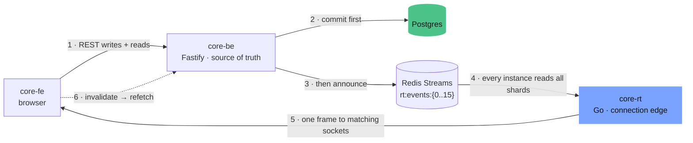
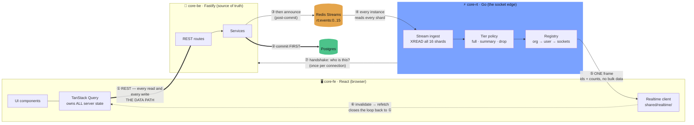
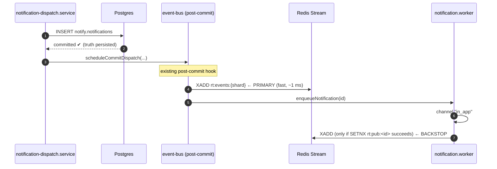
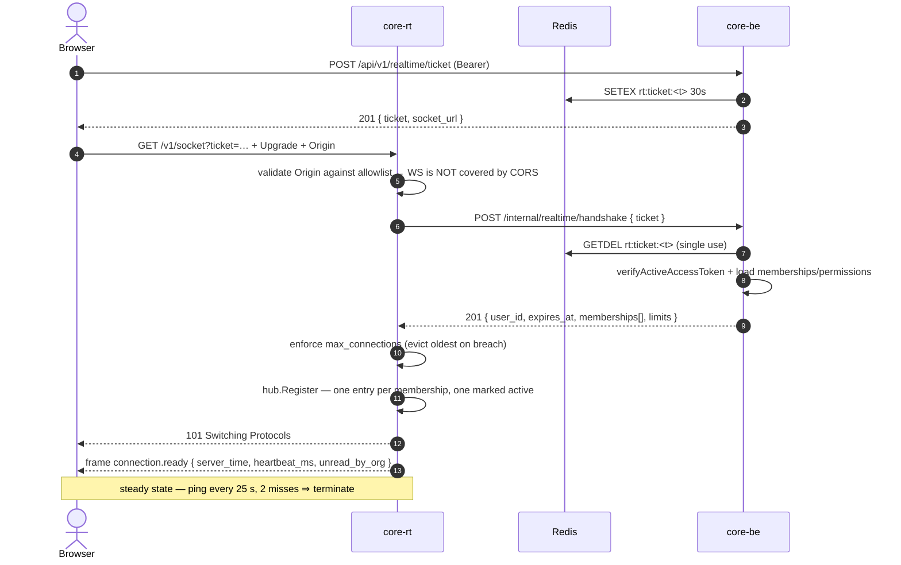
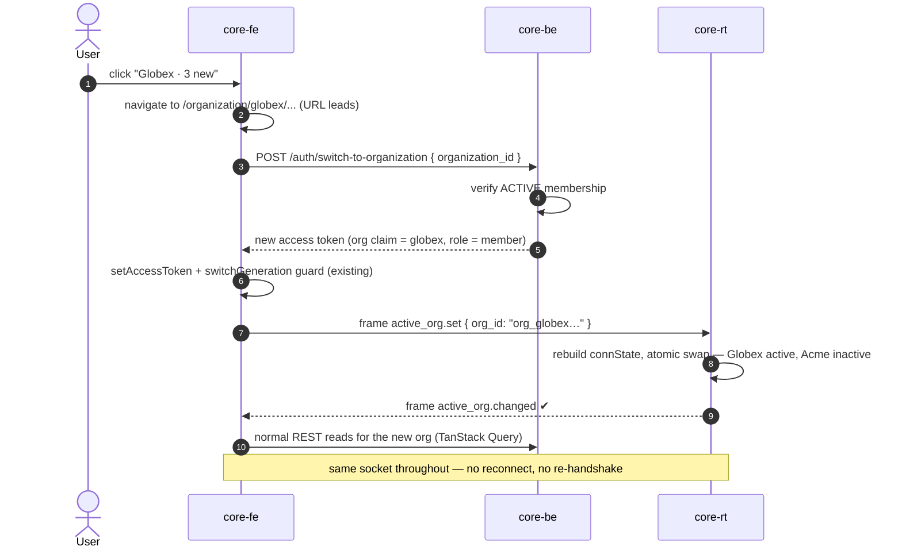
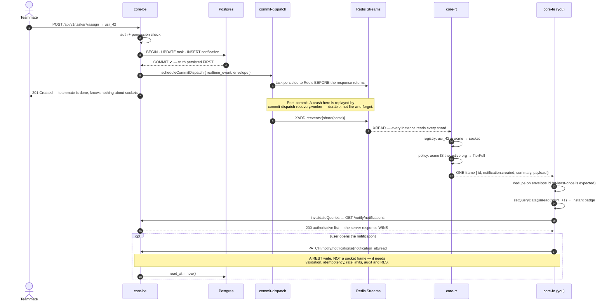

# Realtime service (Go) — architecture and implementation plan

> **Status:** proposal / planning. Nothing in this document is implemented yet.
> **Scope:** a new standalone Go service (`core-rt`) that owns every live client connection, plus
> the publish-side changes in `core-be` and the consumer-side integration in `core-fe`.
> **Audience:** backend + frontend engineers implementing this, and reviewers approving the design.

---

## 1 · Executive summary

We are adding **live data push** to the platform: a teammate's write in `core-be` reaches every other
member's browser in tens of milliseconds, instead of being discovered on the next page load or refetch.

The implementation is a **separate Go service** that does exactly one thing: hold a large number of
long-lived WebSocket connections, and deliver announcements to the right ones. It holds no business
logic, owns no tables, and is never the source of truth.



**The five rules everything else follows from:**

| # | Rule | Why it matters |
|---|------|----------------|
| 1 | **Postgres commits before Redis is told.** | If every socket on earth is dead, the truth survives and the next refetch repairs the UI. |
| 2 | **The socket announces changes; REST moves data.** | One code path for reads, one for writes — both already have auth, RLS, validation, idempotency and audit. |
| 3 | **The socket is never a write path.** | A `mark-as-read` frame would bypass validation, rate limits, idempotency, audit and RLS. It stays a `PATCH`. |
| 4 | **Delivery follows membership; presentation follows the active org.** | One user, many orgs, one connection — with a structural guarantee that org data cannot cross into another org's UI. |
| 5 | **A slow client degrades itself, never the fan-out.** | Bounded per-connection queues; overflow ⇒ tell that one client to resync, drop nothing else. |

**What we are explicitly *not* building:** a message bus, a collaborative-editing CRDT, a chat product,
a general RPC channel, or a second read API. Those are separate decisions with separate designs.

### 1.1 The three-sided picture — where the socket actually sits

`core-rt` sits in the middle, with `core-fe` on one side and `core-be` on the other. But it sits
*beside* the request path, not inside it — which is the single most important thing to understand
about this design.



**The diagram in one sentence:** data always travels the thick line ① between the browser and
`core-be`; `core-rt` only ever whispers "something changed, ask again" down arrow ⑤.

> **The three end-to-end flows — login, a data update, and multi-org notification with
> switching — are drawn step by step in [Appendix B](#appendix-b--the-three-end-to-end-flows).**
> Read them when you want the wire-level ordering; read this section for the shape.

#### The three sides, and what each is forbidden from doing

| | `core-fe` (left) | `core-rt` (middle) | `core-be` (right) |
|---|---|---|---|
| **Owns** | Rendering, the query cache, the URL (which drives org context) | Open connections, the registry, delivery tiering | Truth: Postgres, auth, RLS, validation, business rules |
| **Never does** | Store server data in Zustand | Touch Postgres · hold business logic · accept a write | Hold a WebSocket |
| **If it dies** | — | **Product still fully works**, just not live | Everything is down (as today) |
| **Language** | TypeScript | Go | TypeScript |
| **Scales with** | — | Logged-in users | Request rate |

`core-rt` having **no database access at all** is not an oversight — it is what makes the service
safe to scale, deploy and restart carelessly. It holds no truth, so it can lose everything it holds.

#### The seven arrows

| # | Arrow | Carries | Why it exists |
|---|-------|---------|---------------|
| ① | `core-fe` ⟷ `core-be` | **All** reads and writes, over normal HTTPS | The socket is not a data channel. Every byte of business data crosses here, through the auth, RLS, validation, idempotency and audit machinery you already have. |
| ② | `core-be` → Postgres | The committed row | **Truth is persisted before anyone is told.** If every socket on earth died at this instant, nothing is lost. |
| ③ | `core-be` → Redis | A small envelope: ids, type, counts | Fires *after commit*, never inside the transaction. Fire-and-forget with a timeout — a Redis outage must never fail the user's request. |
| ④ | Redis → `core-rt` | The same envelope | Every instance reads every shard and filters locally, so no instance needs to know which user is connected where. This is what makes instances interchangeable and removes sticky sessions. |
| ⑤ | `core-rt` → `core-fe` | **One frame.** Ids and counts, plus payload *only* for the active org | The whole reason the system exists — and deliberately the thinnest arrow on the diagram. |
| ⑥ | `core-fe` → itself | A cache invalidation | The frame does not update the UI. It marks a query stale, and TanStack Query refetches over ① — so the **server response always wins**. |
| ⑦ | `core-rt` → `core-be` | One internal call per connection | "Here is a ticket — who is this, which orgs, which permissions?" Authorization logic stays in TypeScript; `core-rt` never re-implements it. |

#### The loop is the point

Follow ① → ② → ③ → ④ → ⑤ → ⑥ → back to ①. The path **returns to REST**. That circularity is
deliberate and buys three properties that are otherwise expensive:

- **Ordering stops mattering.** "Something changed, refetch" is idempotent and commutative. Deltas
  applied in sequence are not — and that is where realtime UIs rot.
- **A lost frame costs nothing** beyond staleness until the next refetch. So we can accept
  at-least-once delivery instead of building exactly-once, which does not exist anyway.
- **Turning the feature off is safe.** Cut arrows ③–⑥ entirely and the product degrades to exactly
  today's behaviour: refetch on navigate. That is the kill switch, and it is a property of the
  shape, not a feature bolted on.

#### What each boundary refuses to carry

| Boundary | Crosses | Deliberately does **not** cross |
|---|---|---|
| `core-fe` ⟷ `core-be` (①) | Everything | — |
| `core-be` → Redis (③) | Ids, type, counts, org | Row contents · PII · anything large |
| `core-rt` → `core-fe` (⑤) | Ids, counts; payload **only** for the active org | Another org's data · titles from an inactive org · bulk lists |
| `core-rt` → Postgres | **Nothing.** No connection exists | — |
| `core-fe` → `core-rt` | 4 control frames (auth refresh, active-org, resync ack, ping) | **Any write.** `mark-as-read` is a REST `PATCH` |

The row that matters most is the last-but-one: an inactive organisation's event is serialised
**server-side** into a different, smaller envelope with `payload` absent. The privileged fields never
leave `core-rt`. Cross-tenant isolation is therefore a property of the encoder, not a rendering
choice the frontend could get wrong.

### 1.2 Failure matrix

What actually happens when each piece breaks. The design's value is mostly visible here.

| What fails | Live updates | REST reads/writes | User-visible effect | Recovery |
|---|---|---|---|---|
| **`core-rt` instance dies** | Pause for that instance's users | ✅ fine | Badge stops moving | Client reconnects with jittered backoff, refetches |
| **All of `core-rt` down** | ❌ stopped | ✅ fine | Product works, just not live | Restart; clients reconnect and refetch |
| **Redis Streams unavailable** | ❌ stopped | ✅ fine | As above | Events published during the outage are lost; the next refetch repairs the UI |
| **`core-be` down** | ❌ stopped | ❌ down | Total outage | Same as today — realtime changes nothing here |
| **Postgres down** | ❌ stopped | ❌ down | Total outage | Same as today |
| **One slow client** | Only that client | ✅ fine | That client gets `resync.required` and refetches | Bounded queue; nobody else is affected |
| **Deploy of `core-rt`** | ~1–15 s gap | ✅ fine | Brief "reconnecting" state | Jittered `reconnect_after_ms` prevents a stampede |

The pattern across every row: **realtime failures degrade to today's behaviour; they never create a
new class of outage.** Any future change that breaks this property should be treated as a
regression, not a trade-off.

---

## 2 · Why Go, and why a separate service

### 2.1 Why not just add WebSockets to `core-be`

Fastify can hold WebSockets. It should not hold *these* WebSockets:

- **Event-loop contention.** Node is one thread per process. 20 000 idle sockets each waking for a
  30-second ping is ~660 wakeups/sec of timer and I/O work competing with API request handlers on the
  *same* thread. Live push latency and p99 API latency become coupled — a bad trade for both.
- **Memory per connection.** Each Node socket carries JS object graphs, per-socket closures and V8
  heap pressure — realistically 60–150 KB. Go's cost is a fraction of that (§10.1).
- **Independent scaling.** Connection count scales with *logged-in users*; API capacity scales with
  *request rate*. They move independently. Coupling them means over-provisioning one to serve the other.
- **Deploy blast radius.** Today an API deploy is a rolling restart nobody notices. Once the API also
  terminates sockets, every deploy disconnects every user — a reconnect stampede on every release.

### 2.2 Why Go specifically

- **Goroutine-per-connection is the natural model.** Two goroutines per socket (reader + writer), each
  starting at a 2 KB stack, multiplexed onto OS threads by the runtime's epoll-backed netpoller. The
  code reads like blocking I/O and runs like an event loop.
- **Predictable tail latency.** Sub-millisecond GC pauses at these heap sizes; no single-thread head-of-line
  blocking.
- **Static binary, tiny image.** A `FROM scratch`/distroless image (~15 MB) that starts in milliseconds —
  which matters when a rolling deploy needs to re-absorb 50 000 reconnects quickly.
- **The right language for the job's shape.** This service is 90% concurrency plumbing and 10% logic.
  That is precisely what Go is good at, and precisely where its lack of expressiveness costs nothing.

### 2.3 Where the code lives

**A new repository, `core-rt`.** Not a directory inside `core-be`.

`core-be` is a strict pnpm/TypeScript repo whose gates — `validate:domain`, `knip`, Biome, `tsdoc:check`,
the domain-structure validator, `routes:catalog` — all assume TypeScript under `src/domains/**`. A Go tree
inside it would need an exclusion in every one of those gates, permanently, and would still confuse the
skills and rules that read the layout. A separate repo gets its own idiomatic Go CI (`go vet`,
`staticcheck`, `golangci-lint`, `go test -race`) and its own deploy cadence.

**Shared across the repo boundary:** the wire contract only — a directory of golden JSON fixtures
(§5.4) committed identically in all three repos, with a test on each side that asserts it can
encode/decode them. No codegen infrastructure, but drift fails CI.

---

## 3 · What already exists (the ground we are building on)

Grounding the plan in the current code, so no step is speculative:

| Concern | Where it lives today | How realtime uses it |
|---------|---------------------|----------------------|
| Access token | RS256 via `jose`, `src/shared/utils/security/jwt.util.ts`. Claims: `sub` = `usr_…`, `org` = active org `org_…`, `role`, `kid` header. 15 min expiry. | `core-rt` verifies the signature locally with the public key; the `org` claim is the active org. |
| Token revocation | `AuthSessionService.verifyActiveAccessToken` → session token-hash row + Redis `session:tok:<hash>` with a `__revoked__` tombstone. | `core-rt` does **not** reimplement this — it delegates the handshake to `core-be` and listens for revocation events (§7). |
| Notifications | `notify.notifications` (`public_id`, `user_id`, `organization_id`, `type`, `title`, `data`, `is_read`, `created_at`) with RLS on `app.current_organization_id` / `app.current_user_id`. | The first event source. The row is written first; the announcement references its `public_id`. |
| Notification creation | `notification-dispatch.service.ts` → `repository.create()` → `scheduleCommitDispatch()` → BullMQ `notification` queue → `notification.worker.ts` fans out to `email` \| `in_app`. The `in_app` case today only records `'in_app:persisted'`. | The publish hook goes here — post-commit primary, worker backstop (§6.2). |
| Memberships | `tenancy.memberships` — `user_id`, `organization_id`, `role_id`, `status ∈ {INVITED, ACTIVE, SUSPENDED}`, soft-delete. | Defines which orgs a socket is registered under. |
| Org switching | `POST /api/v1/auth/switch-to-organization` re-mints the token with a new `org` claim; FE guards it with a monotonic `switchGeneration`. | Switching is REST. Only *informing the socket* is a frame (§8.3). |
| Redis | `ioredis`, key prefix `core:<NODE_ENV>:` from `resolveRedisKeyPrefix()`; BullMQ on a separate logical DB. | `core-rt` must reproduce the same prefix, from the same env var. |
| Deploy | Railway services (`api`, `worker`) from GHCR images, via `reusable-railway-deploy.yml`. | `core-rt` becomes a third service on the same pattern. |
| FE HTTP | `apiClient` (`src/core/http/fetch-client.ts`), token in a module closure, single-flight refresh under the `core-auth:refresh` Web Lock, TanStack Query owns all server state. | The socket becomes a **cache-invalidation signal** feeding TanStack Query (§9.3). |
| FE org context | The **URL** is the source of truth (`/organization/$organizationSlug`); guards call `switch-to-organization`. | The socket follows the URL, never leads it. |

---

## 4 · Decision log

The choices worth arguing about, with what we rejected and why. Several of these **deliberately depart
from the sequence diagrams** that motivated this work; those are marked ⚠ and justified.

| # | Decision | Rejected alternative | Rationale |
|---|----------|---------------------|-----------|
| D1 | **WebSocket**, not SSE | SSE; long-polling | We need client→server control frames (auth refresh, active-org change, heartbeat). SSE would force a second channel for those. SSE stays the documented fallback for hostile corporate proxies (§10.5). |
| D2 | **Redis Streams**, not pub/sub ⚠ | Redis pub/sub (as drawn in the diagrams) | Pub/sub is fire-and-forget: a subscriber that is reconnecting for 200 ms loses those messages **permanently and silently**. Streams give a bounded durable window (`MAXLEN ~ 10000`), so an instance that blips catches up on reconnect. Same fan-out shape, one extra config knob. |
| D3 | **16 fixed shards, every instance reads all of them** | A stream/channel per org | Per-org channels means an O(instances × orgs) subscription matrix that churns on every connect/disconnect. Fixed shards mean one `XREAD` per instance, zero routing state, and instances that are fully interchangeable. Migration path in §10.3. |
| D4 | **No writes over the socket** ⚠ | `READ id 42` frames writing to Postgres (as drawn) | A DB write over the socket bypasses request validation, the idempotency middleware, rate limits, the audit trail and the RLS context wrappers — and would force `core-rt` to hold a DB connection, making it stateful. `mark-as-read` stays `PATCH /notify/notifications/{notification_id}/read`. |
| D5 | **`RESYNC_REQUIRED` → client refetches; no server-side event replay** ⚠ | `SELECT … WHERE id > lastEventId` replay (as drawn) | Two reasons. (a) The client already has TanStack Query — `invalidateQueries` is a correct, tested, cached refetch path we get for free. (b) **The drawn replay is subtly broken:** `notifications.id` is a `bigserial`, and sequence values are handed out at INSERT time but rows become visible at COMMIT time. Transaction A can take id 42, transaction B take 43 and commit first; a reader that records `lastEventId = 43` will **never** see 42. Gap-free replay needs a commit-ordered outbox, not a sequence — a real project we should not take on to save a refetch. |
| D6 | **Handshake authorization delegated to `core-be`** | `core-rt` queries Postgres for memberships | Keeps authorization logic in exactly one place, keeps `core-rt` free of DB credentials and RLS concerns, and means a permission-model change never needs a Go deploy. One internal HTTP call per connection (~5 ms, cached 60 s). |
| D7 | **Short-lived single-use ticket for the upgrade** ⚠ | Access token in the query string (as drawn) | Query strings land in access logs, proxy logs, browser history and `Referer`. Browsers cannot set headers on `new WebSocket()`, so the token cannot travel as a header. A 30-second, single-use, `GETDEL`-redeemed ticket bounds the exposure to something worthless. |
| D8 | **Cross-org pings carry ids and counts, no free text** ⚠ | Sending the notification title cross-org (as drawn) | A title is user-authored content from another tenant ("Q3 layoffs — draft"). Rendering it in org A's UI is a cross-tenant disclosure. Default to `{org_id, notification_id, type, unread_count}`; the FE renders "New activity in Globex". Titles behind `REALTIME_CROSS_ORG_TITLES` (default `false`). |
| D9 | **At-least-once + client-side dedupe** | Exactly-once | Exactly-once across a network is a fiction. Every event carries a stable `id`; the FE applies idempotently. This lets us publish both inline (fast) and from the worker (reliable) without coordination. |
| D10 | **No sticky sessions at the load balancer** | Sticky routing by user | Any instance can serve any user because every instance reads every shard and filters locally. This is what makes rolling deploys and autoscaling boring. |
| D11 | **Socket lifetime ≤ credential lifetime** | Authenticate once at connect, trust forever | The most common WebSocket security bug. A socket authenticated at 09:00 with a 15-minute token must not still be delivering data at 17:00. The connection carries a hard deadline and must be re-armed (§7.4). |
| D12 | **`github.com/coder/websocket`** | `gorilla/websocket`; `gobwas/ws` + hand-rolled epoll | `coder/websocket` (formerly `nhooyr.io/websocket`) is context-aware, has no `unsafe`, is actively maintained, and has a small stdlib-shaped API. `gobwas` + epoll is genuinely faster past ~100 k conns/instance but is materially more code to get right — adopt only if §10.1 measurements demand it. |

---

## 5 · The wire contract

### 5.1 Envelope (server → `core-rt` → client)

One shape for every event. `snake_case` keys, matching the repo's API body-casing rule.

```jsonc
{
  "v": 1,                                    // envelope version; bump = breaking
  "id": "01J8ZQ9V3K2M7B4X6R0T8N5C1D",        // ULID — stable dedupe key, k-sortable
  "type": "notification.created",            // <domain>.<resource>.<past-tense-verb>
  "occurred_at": "2026-08-11T09:14:22.481Z",
  "org_id": "org_7hk3n2p9qw4r8t6y1u5i0",     // null for account-level events
  "scope": "user",                           // "user" | "org"
  "target_user_id": "usr_2b8f4d6a1c3e5g7h9",  // required when scope = "user"
  "required_permission": "notification.read", // optional gate when scope = "org"
  "summary": {                               // ALWAYS sent — safe for any tier
    "resource_id": "ntf_4k2m8p6q1w3e5r7t9",
    "unread_count_delta": 1
  },
  "payload": {                               // active-org tier ONLY; may be omitted
    "title": "Task 7 assigned to you",
    "action_url": "/organization/acme/tasks/7"
  }
}
```

- `id` is a **ULID**, not a database id: monotonic, generated at publish time, and meaningful across
  event types. It is the client's dedupe key.
- `summary` is the *always-safe* projection. `payload` is the *privileged* projection.
- `required_permission` lets an org-scoped event be gated (e.g. only `billing.read` holders hear about
  an invoice). `core-rt` evaluates it against the permission set captured at handshake.

### 5.2 Client → server frames

Control only. Four of them, forever if we can help it.

| Frame | Body | Effect |
|-------|------|--------|
| `auth.refresh` | `{ access_token }` | Re-arms the connection deadline with the new token's `exp`. Sent by the FE's existing refresh timer. |
| `active_org.set` | `{ org_id }` | Flips which membership is `active`. Rejected if the user is not a member. No reconnect. |
| `resync.ack` | `{ }` | Client confirms it has refetched after a `resync.required`. Clears the server-side flag. |
| `ping` | `{ }` | Optional app-level ping. Protocol-level ping/pong is the primary liveness mechanism. |

Anything else is a protocol violation → close `4400`.

### 5.3 Close codes

| Code | Meaning | Client behaviour |
|------|---------|------------------|
| `1000` | Normal (logout, tab close) | Do not reconnect. |
| `1001` | Going away (deploy) — carries `reconnect_after_ms` | Reconnect after the given jittered delay. |
| `4400` | Protocol violation | Do not reconnect; report to Sentry. This is a bug. |
| `4401` | Auth expired / revoked | Refresh the token, then reconnect. |
| `4403` | Forbidden (no memberships, org suspended) | Do not reconnect; let the guards handle it. |
| `4408` | Handshake timeout (no valid ticket in 5 s) | Reconnect with a fresh ticket. |
| `4429` | Too many connections for this user | Back off hard (60 s+); likely too many tabs. |

### 5.4 Contract fixtures

`contract/fixtures/*.json` — one file per event type and per close scenario, committed **identically**
in `core-rt`, `core-be` and `core-fe`. Each repo has one test that round-trips every fixture through its
own encoder/decoder. A field added on one side without the others fails three CI pipelines. This is the
cheapest possible cross-language contract enforcement and needs no build tooling.

---

## 6 · `core-be` changes (the publish side)

`core-be` gains a publisher and two small endpoints. It does not gain a socket.

### 6.1 New module — `src/infrastructure/realtime/`

```text
src/infrastructure/realtime/
  realtime.overview.md
  realtime-envelope.ts        # buildRealtimeEnvelope() — ULID, versioning, tier split
  realtime-publisher.ts       # publishRealtimeEvent() — XADD to the sharded stream
  realtime-shard.util.ts      # shardFor(org_id) — stable hash % REALTIME_STREAM_SHARDS
  realtime-ticket.service.ts  # mint / redeem the connect ticket (Redis GETDEL)
  realtime.constants.ts       # shard count, stream MAXLEN, ticket TTL
```

It belongs in `infrastructure/` alongside `queue/` and `mail/`: it is a transport, not a domain.
Publishing is **fire-and-forget with a timeout** — a Redis failure logs and increments a counter but
never fails the originating request. The DB row is already committed; the UI repairs on next refetch.

### 6.2 Where the publish call goes

Two call sites, deliberately:



- **Primary — post-commit inline.** Extends the existing `scheduleCommitDispatch` hook in
  `notification-dispatch.service.ts`. Lowest latency, and it already runs only after commit.
- **Backstop — the worker's `in_app` channel.** `notification.worker.ts` currently records
  `'in_app:persisted'` and does nothing. It becomes: publish, guarded by
  `SET rt:pub:<notification_id> 1 NX EX 300`. If the inline publish already ran, the `NX` fails and
  the worker skips. If the inline publish was lost to a Redis blip, the worker — which has BullMQ
  retries and a DLQ — covers it.

Because the FE dedupes on `envelope.id`, a rare double-publish is harmless (D9). If we later need
strict once-per-commit delivery, the **existing** `mail-outbox` pattern
(`infrastructure/mail/mail-outbox.schema.ts`) is the template for a realtime outbox; that is a Phase-3
upgrade, not a launch requirement.

### 6.3 New routes

Both under the existing `/api/v1` prefix, following the repo's contract rules (snake_case params,
`POST` → 201, semantic param names, route `schema.summary`/`description`/`tags` present).

```text
POST /api/v1/realtime/ticket        → 201  { ticket, expires_in, socket_url }
```

Authenticated with the normal bearer. Mints a 128-bit random ticket, stores
`rt:ticket:<ticket> → {user_id, org_id, session_id}` with a 30 s TTL, returns it. **Idempotency
header not required** — it mints a throwaway credential, not business state.

```text
POST /api/v1/internal/realtime/handshake   → 201  { user_id, memberships[], permissions{}, limits }
```

Called by `core-rt` only. Not in the public OpenAPI surface; protected by the existing
`api-key-auth.middleware.ts` plus a network policy (Railway private networking). Redeems the ticket
(`GETDEL` — single use), re-verifies the session is active through the *existing*
`verifyActiveAccessToken` path, and returns:

```jsonc
{
  "user_id": "usr_2b8f4d6a1c3e5g7h9",
  "expires_at": "2026-08-11T09:29:22Z",       // from the token exp — the socket deadline
  "active_org_id": "org_7hk3n2p9qw4r8t6y1u5i0",
  "memberships": [
    { "org_id": "org_7hk…", "role": "admin",  "permissions": ["notification.read", "billing.read"] },
    { "org_id": "org_9wq…", "role": "member", "permissions": ["notification.read"] }
  ],
  "limits": { "max_connections": 10 }
}
```

This single call is what makes D6 work: all membership and permission logic stays in TypeScript,
reusing `AuthorizationService` and its Redis permission cache.

### 6.4 Revocation channel

`core-be` publishes to `rt:control` (a separate stream) whenever authorization changes:

| Trigger | Existing call site | Control event |
|---------|-------------------|---------------|
| Logout / sign-out-everywhere | `invalidateCachedSessionToken` | `session.revoked { session_id }` |
| Membership removed or suspended | membership service | `membership.revoked { user_id, org_id }` |
| Org suspended | organization service | `org.suspended { org_id }` |
| Role/permission change | `invalidatePermissions` | `permissions.changed { user_id, org_id }` |

`core-rt` acts on these immediately: close the matching sockets (`4401`/`4403`), or re-handshake for a
permission change. This is what keeps staleness far below the 15-minute token ceiling in practice.

---

## 7 · `core-rt` — the Go service

### 7.1 Package layout

```text
core-rt/
├── cmd/realtime/main.go          # wiring, signal handling, graceful shutdown
├── internal/
│   ├── config/                   # env → typed struct, validated at boot, fail fast
│   ├── protocol/                 # envelope + frame types, close codes, fixture tests
│   ├── auth/                     # ticket redemption, JWT verify, deadline, revocation watch
│   ├── hub/                      # the registry — sharded maps, org/user indexes
│   ├── conn/                     # per-connection reader/writer/backpressure/heartbeat
│   ├── ingest/                   # Redis Streams consumer → decode → hub.Dispatch
│   ├── policy/                   # tier selection (full vs summary), permission gate
│   ├── obs/                      # prometheus, slog, sentry, otel
│   └── health/                   # /healthz, /readyz, /metrics
├── contract/fixtures/            # golden JSON, mirrored in core-be and core-fe
├── test/load/                    # connection + fan-out load harness
├── Dockerfile                    # distroless, static binary
└── Makefile
```

### 7.2 Connection lifecycle



Note there is **no `SUBSCRIBE org:x` step**. Every instance already reads every shard (D3), so
connecting is purely local bookkeeping — no Redis round-trip, no subscription churn.

### 7.3 The registry (`hub`)

The one data structure that has to be right.

```go
// 256 shards keyed by FNV(userID) — a broadcast to one user touches one shard's lock,
// so 50k connections never contend on a single mutex.
type Hub struct {
    shards [256]*shard
}

type shard struct {
    mu      sync.RWMutex
    byUser  map[UserID]map[ConnID]*Conn        // scope=user delivery
    byOrg   map[OrgID]map[ConnID]*Conn         // scope=org delivery
}

type Conn struct {
    id       ConnID
    userID   UserID
    out      chan *outbound   // BOUNDED — cap 64
    deadline atomic.Int64     // unix ms; token exp + grace
    state    atomic.Pointer[connState]   // memberships + activeOrg, swapped wholesale
    resync   atomic.Bool      // set on overflow, cleared on resync.ack
}

type connState struct {
    memberships map[OrgID]membership  // org → role + permission set
    activeOrg   OrgID
}
```

Two details that matter:

- **`connState` is swapped, never mutated.** An org switch or a permission refresh builds a whole new
  `connState` and does one `atomic.Pointer.Store`. The fan-out path does one atomic load and never
  takes a lock — so switching orgs cannot stall delivery, and delivery cannot observe a half-updated
  membership set.
- **A connection appears in `byOrg` for *every* membership**, not just the active one. That is the
  structural half of rule 4: delivery is decided by membership, tier by active-org.

### 7.4 The auth deadline (D11)

Every `Conn` carries `deadline = token.exp + 60 s grace`. A single sweeper goroutine scans shards every
10 seconds and closes anything past its deadline with `4401`. The FE's existing refresh timer already
mints a new token every ~14 minutes; it sends `auth.refresh`, `core-rt` verifies the RS256 signature
locally (issuer, audience, expiry, `sub` must match the connection's user) and re-arms the deadline.

Local verification is safe here precisely *because* it can only ever **extend** an already-authorized
connection for one more token lifetime, and revocation arrives out-of-band on `rt:control` (§6.4).

### 7.5 Ingest and fan-out

```go
// One goroutine. Blocking XREAD across all 16 shard streams plus rt:control.
// COUNT batches; BLOCK 5s so shutdown is responsive.
for {
    msgs := redis.XRead(ctx, streams, lastIDs, COUNT=256, BLOCK=5*time.Second)
    for _, m := range msgs {
        env, err := protocol.Decode(m.Values)      // reject unknown v, count it
        if err != nil { obs.DecodeErrors.Inc(); continue }
        hub.Dispatch(env)                          // pure local map lookups
        lastIDs[m.Stream] = m.ID
    }
}
```

`Dispatch` resolves the target set (one map lookup), and for each connection asks `policy.Tier`:

```go
switch {
case env.Scope == ScopeUser && env.TargetUserID != conn.userID:
    return Drop                       // not for this user
case !conn.state.Load().memberships.Has(env.OrgID):
    return Drop                       // not a member — structural silence
case env.RequiredPermission != "" && !membership.Can(env.RequiredPermission):
    return Drop                       // org-scoped event, insufficient permission
case env.OrgID == conn.state.Load().activeOrg:
    return TierFull                   // summary + payload
default:
    return TierSummary                // summary only — no payload, no free text
}
```

`TierSummary` marshals a **different envelope** with `payload` absent. It is not a client-side
rendering choice — the privileged fields never leave the server. That is what makes rule 4 a guarantee
rather than a convention, and it gets a dedicated test (§13).

### 7.6 Backpressure — the part most implementations get wrong

Each connection has a bounded `out` channel (cap 64). The writer goroutine drains it.

```go
select {
case conn.out <- msg:
    // normal path
default:
    // Queue full: a phone on 2G, a suspended laptop, a paused debugger.
    // We do NOT block (that would stall fan-out for everyone) and we do NOT
    // grow the queue (that is how you OOM at 03:00).
    if conn.resync.CompareAndSwap(false, true) {
        conn.forcePush(protocol.ResyncRequired{})   // reserved slot, best-effort
    }
    obs.Dropped.WithLabelValues("slow_client").Inc()
}
```

Once `resync` is set, further events for that connection are dropped entirely until the client sends
`resync.ack` — there is no point queueing more for a client that is already behind and about to
refetch everything. **One slow client degrades exactly itself.** The recovery is the same
`RESYNC_REQUIRED` → `invalidateQueries` path used after a reconnect (D5), so there is one repair
mechanism, not two.

### 7.7 Graceful shutdown

On `SIGTERM`:

1. `/readyz` starts failing → the LB stops routing new upgrades (drain window ≥ 15 s).
2. Stop the ingest loop; finish dispatching what is already decoded.
3. Close every connection with `1001` and a **jittered** `reconnect_after_ms` in
   `[1000, 15000]` — computed per-connection, not per-instance.
4. Wait for writers to flush, up to a 20 s hard cap, then exit.

Step 3 is the whole point: 50 000 clients reconnecting at the same instant is a self-inflicted DDoS on
the ticket endpoint and the handshake endpoint. Jitter turns a spike into a 15-second ramp.

---

## 8 · The multi-org model

This is the "one login, many organisations" behaviour from the sequence diagrams, made precise.

### 8.1 The invariant

> **Delivery follows membership. Presentation follows the active org.**

One socket. Registered under every ACTIVE membership. Exactly one marked active. An org the user does
not belong to has no registry entry — so there is no filter to get wrong, no path to leak through.
Non-membership is silence by structure, not by policy.

### 8.2 The three tiers

| Situation | What crosses the wire | What the user sees |
|-----------|----------------------|--------------------|
| Event in the **active** org | `summary` + `payload` | Toast, badge, live list update |
| Event in an **inactive** org (member) | `summary` only — ids and counts, no titles (D8) | A quiet dot on the org switcher: "Globex (3)" |
| Event in a **non-member** org | *nothing* — no registry entry exists | Nothing |

### 8.3 Switching orgs



The socket **follows** the URL and the token; it never drives them. `core-rt` accepts
`active_org.set` only for an org already in the connection's membership set — it is a presentation
hint, not an authorization decision. Authorization was settled at handshake, and the *new token*
(with the new `org` claim) is what actually authorizes the REST reads that follow.

---

## 9 · `core-fe` integration

### 9.1 Module layout

Flat modules under `src/shared/realtime/`, matching the shape of the existing `shared/auth/` and
`shared/tenancy/` runtime areas.

```text
src/shared/realtime/
├── REALTIME.OVERVIEW.md
├── realtime.constants.ts        # backoff table, heartbeat, close codes
├── realtime-contracts.ts        # Zod schemas for every inbound frame + fixture test
├── realtime-ticket.ts           # POST /realtime/ticket via apiClient
├── realtime-client.ts           # the singleton connection state machine
├── realtime-router.ts           # event.type → query invalidation + toast
├── realtime-provider.tsx        # mounts in the app shell; wires lifecycle
└── use-realtime-status.ts       # hook for the connection badge
```

Layer rules hold: `shared/realtime` may import `core/http`, `core/config`, `shared/auth`,
`shared/tenancy`, `shared/notify`. Pages import only `use-realtime-status`.

### 9.2 The state machine

```text
        ┌──────── auth ready + REALTIME_ENABLED ────────┐
        ▼                                               │
     IDLE ──▶ TICKETING ──▶ CONNECTING ──▶ CONNECTED ───┤
        ▲          │            │             │         │
        │          └── 4xx ─────┴──▶ BACKOFF ─┘         │
        │                            │ 1s→2s→4s→…→30s   │
        │                            │ full jitter      │
        └───── forceLogout / 1000 / 4403 ───────────────┘
```

- **Backoff is exponential with full jitter**, capped at 30 s, reset on `connection.ready`.
- **Never reconnect on `1000`, `4400`, `4403`.** Those are terminal by design.
- **On `4401`:** call the *existing* `refreshAccessToken()` — which is already single-flight and
  Web-Lock-serialized — then reconnect. Never add a second refresh path (the backend rotates refresh
  sessions with reuse detection; parallel refreshes kill the session).
- **Tab hidden > 5 min:** close with `1000` to save battery and a server slot; reconnect on
  `visibilitychange`. Ticket + handshake is ~50 ms, so this is nearly free.

### 9.3 The rule that makes this safe: the socket is a cache-invalidation signal

> **The socket never writes application data into a store. It tells TanStack Query what is stale.**

This is the single most important frontend decision here, and it follows directly from the existing
convention *"Never store API data in Zustand — TanStack Query owns server state."*

```ts
// realtime-router.ts — sketch
function route(env: RealtimeEnvelope): void {
  if (seen.has(env.id)) return;            // dedupe (D9) — bounded LRU, ~500 ids
  seen.add(env.id);

  if (env.org_id !== activeOrgId()) {
    // Inactive-org ping: badge only. Never touches the active org's caches.
    bumpOrgUnreadBadge(env.org_id, env.summary.unread_count_delta);
    return;
  }

  switch (env.type) {
    case 'notification.created':
      // Instant badge (optimistic) + authoritative refetch (correct).
      // Keys are already org-scoped — pass the event's org, not a global "current".
      queryClient.setQueryData(
        notificationQueryKeys.unreadCount(env.org_id),
        (n = 0) => n + env.summary.unread_count_delta,
      );
      queryClient.invalidateQueries({ queryKey: notificationQueryKeys.list(env.org_id) });
      if (env.payload) notify.info(env.payload.title);
      break;
    // …one case per event type; unknown types are counted and ignored, never thrown.
  }
}
```

A detail worth calling out: `notificationQueryKeys` is **already parameterised by organization id**
(`list(organizationId)`, `unreadCount(organizationId)`), precisely so switching orgs cannot surface the
previous tenant's rows. That existing decision does half of rule 4's frontend work for us — a
cross-org event keyed by its own `org_id` physically cannot write into the active org's cache entry,
even if the router had a bug. We should keep that property and never introduce an org-free
notification key.

Why this is right:

- **No divergent state.** The server response is always what wins. A dropped, duplicated or reordered
  event costs at most one extra refetch.
- **Ordering stops mattering.** "Something changed, refetch" is commutative and idempotent. Applying
  deltas in order is not, and that is where realtime UIs rot.
- **We reuse everything.** Loading, error, retry, offline, staleness and devtools all work already.
- **`RESYNC_REQUIRED` needs no special code.** It is `invalidateQueries()` with a broader key.

The one exception is the unread badge, where we `setQueryData` for instant feedback *and* invalidate
for correctness. Optimism for the pixel, truth from the server.

### 9.4 Lifecycle wiring

| Trigger | Existing hook | Action |
|---------|--------------|--------|
| Auth ready (token present) | app shell / `session-context` | `realtime.connect()` |
| Token refreshed | `shared/auth/refresh-timer.ts` | send `auth.refresh` |
| Org switched | `shared/tenancy/switch.ts` (after `switchGeneration` wins) | send `active_org.set` |
| `forceLogout()` | `shared/auth/service.ts` | `realtime.close(1000)` |
| Cross-tab logout | `shared/auth/auth-channel.ts` (BroadcastChannel) | `realtime.close(1000)` |
| Tab hidden / visible | `document.visibilitychange` | close after 5 min / reconnect |

### 9.5 Multiple tabs

Each tab opens its own socket at launch; `max_connections: 10` per user caps the blast radius. That is
simple and correct.

The optimization, **if** connection count becomes the binding constraint: elect a leader tab with
`navigator.locks.request('core-realtime:leader')` — the same primitive already used for
`core-auth:refresh` — and have the leader re-broadcast frames to followers over the existing
`auth-channel.ts` BroadcastChannel. It cuts sockets-per-user from ~4 to 1. Deliberately deferred; the
infrastructure is already there when we want it.

### 9.6 Config and CSP

Two env vars, honouring *one behaviour = one variable*:

| Key | Purpose | local | development | production |
|-----|---------|-------|-------------|------------|
| `VITE_REALTIME_ENABLED` | Feature on/off | `true` | `true` | `true` |
| `VITE_REALTIME_URL` | `wss://` origin (empty ⇒ derive from `VITE_API_BASE_URL`) | `ws://localhost:8080` | `wss://rt.dev…` | `wss://rt…` |

Both go in `envProfiles.<env>.allowed` / `.defaults` in `env-schema.ts`, read once through
`platformConfig`. No `import.meta.env` reads outside the allowlist.

**CSP:** `lib/csp-api-origin.ts` must add the realtime origin to `connect-src` in both the generated
`dist/_headers` and the `index.html` meta fallback. **List both `https://` and `wss://` forms
explicitly** — CSP3 says an `https:` source should match `wss:` for the same host, but WebKit has been
inconsistent about it, and the failure mode is a silently blocked connection in Safari only.

---

## 10 · Scaling

### 10.1 Capacity model — one instance

Per connection, honestly budgeted:

| Item | Bytes |
|------|-------|
| 2 goroutine stacks (2 KB initial, grows) | ~4–8 K |
| Read + write buffers (`coder/websocket`) | ~8 K |
| `Conn` struct + registry map entries (×2 indexes) | ~1 K |
| Outbound channel (64 × pointer) + amortized message payloads | ~2 K |
| Kernel socket buffers (tunable via `tcp_rmem`/`tcp_wmem` min) | ~8 K |
| **Total** | **~25 KB** |

**Target: 50 000 connections per instance on 2 vCPU / 2 GB** — ~1.25 GB for connections, leaving
headroom for GC and burst. Set `GOMEMLIMIT=1600MiB` and `ulimit -n 65536`.

Treat that number as a **hypothesis to falsify in week 1**, not a fact. `test/load/` must prove it
before we size production.

CPU is not the constraint at launch: decoding a ~500-byte JSON envelope costs a few microseconds, so
one core absorbs well over 100 k events/s — orders of magnitude above the expected rate.

### 10.2 Horizontal scaling

Instances are interchangeable (D10): no sticky sessions, no shared state, no coordination. Scale on
`rt_connections_active` (target 70% of the measured per-instance ceiling). Each new instance reads the
same 16 shards and filters locally.

### 10.3 When the broadcast model stops working — and the exit

The design's one real limit: **every instance decodes every event.** Total decode work is
`events/s × instances`.

| Signal | Threshold | Action |
|--------|-----------|--------|
| Sustained publish rate | > 10 000 events/s | Move to Phase 2 |
| Ingest CPU share per instance | > 20% | Move to Phase 2 |
| `rt_stream_lag_seconds` p99 | > 1 s | Investigate before it becomes Phase 2 |

**Phase 2 — interest-based sharding.** Each instance registers which shards it actually has members
for (`rt:interest:<shard> → set[instance_id]`, refreshed on a TTL) and only `XREAD`s those. Publishers
are unchanged. Cost: an interest map that can go stale, so it needs a conservative TTL and a
"read-everything" fallback on doubt.

**Phase 3 — a real broker.** NATS JetStream (subject-based routing does interest management for us) or
Kafka. Only if Phase 2's decode cost is still binding, i.e. north of ~100 k events/s. We will very
likely never get here, and should not design for it now.

### 10.4 Load-balancer requirements

- WebSocket upgrade support (Railway/Cloudflare: yes).
- **Idle timeout > heartbeat interval.** Cloudflare's default is 100 s; our 25 s ping is comfortably
  inside it. Verify per-edge — a proxy idle timeout shorter than the heartbeat produces a mystifying
  "disconnects exactly every N seconds" bug.
- Drain window ≥ 15 s on deploy so `/readyz` can shed traffic before the process exits.
- No request-body buffering on the upgrade path.

### 10.5 The SSE fallback

Some corporate proxies still break WebSocket upgrades. If telemetry shows a non-trivial cohort failing
to connect, add `GET /v1/stream` (SSE) to `core-rt` reusing the same hub, tiers and envelope — only the
frame transport differs. Control frames become tiny `POST`s. Build only on evidence; the client state
machine should keep the transport behind an interface so this stays a swap, not a rewrite.

---

## 11 · Security model

| Threat | Control |
|--------|---------|
| **Cross-site WebSocket hijacking** | Validate the `Origin` header against an allowlist at upgrade. **WebSocket upgrades are not covered by CORS** — the browser sends them cross-origin with cookies and no preflight. This check is the entire defence, and it is one `if`. |
| Token leakage via URL | Never send the access token. A 30-second, single-use, `GETDEL`-redeemed ticket (D7). |
| Token replay after logout | Handshake re-checks the live session; `rt:control` closes sockets on revoke; hard deadline caps worst case at token lifetime + 60 s (D11). |
| Cross-tenant data leak | Tiering happens server-side: `payload` is never serialized for a non-active org (§7.5, D8). Dedicated test in §13. |
| Privilege escalation over the socket | `active_org.set` can only select an org already in the handshake-issued membership set. No frame can add a membership or a permission. |
| Connection flooding | Per-user cap (10, from `limits`); per-IP connection rate limit; global instance cap that sheds with `4429`. |
| Oversized frames | 32 KB read limit — clients only ever send control frames of a few hundred bytes. |
| Slow-loris style resource exhaustion | 5 s handshake deadline (`4408`); bounded outbound queue; ping-based liveness (2 misses ⇒ terminate). |
| Internal endpoint exposure | `/internal/realtime/handshake` requires the API key **and** private networking; excluded from the public OpenAPI surface. |
| PII in logs | Log `user_id`/`org_id` public ids only. Never log ticket values, tokens or `payload` contents. |

---

## 12 · Observability

**Prometheus** (`/metrics`, scraped alongside the existing `core-be` registry):

| Metric | Type | Purpose |
|--------|------|---------|
| `rt_connections_active{instance}` | gauge | Capacity + autoscaling signal |
| `rt_connections_total{result}` | counter | Handshake success/failure rate |
| `rt_handshake_duration_seconds` | histogram | `core-be` handshake latency |
| `rt_messages_delivered_total{tier}` | counter | Full vs summary split |
| `rt_messages_dropped_total{reason}` | counter | `slow_client`, `not_member`, `no_permission`, `decode_error` |
| `rt_publish_to_deliver_seconds` | histogram | **The headline SLI** — `occurred_at` → wire |
| `rt_stream_lag_seconds` | gauge | Ingest falling behind (Phase-2 trigger) |
| `rt_connection_age_seconds` | histogram | Reveals proxy-timeout disconnect patterns |

**SLOs** (proposed, to be ratified after the load test):

- Publish→deliver p99 **< 250 ms** measured at the wire.
- Connection success rate **> 99.5%** over 5 minutes.
- Drop rate from `slow_client` **< 0.1%** of delivered messages.

**Logs:** `slog` JSON, matching `core-be`'s structured-log conventions. Event names namespaced
`realtime.*` and registered in `docs/reference/reliability/observability-log-events.md`.

**Tracing:** propagate `traceparent` from the publishing request into the envelope, so a Sentry trace
spans HTTP → Postgres → Redis → Go → browser. This is the difference between "the UI feels slow" and
"the p99 is in the handshake".

---

## 13 · Testing strategy

| Layer | Where | What it proves |
|-------|-------|----------------|
| Unit (Go) | `internal/*/\*_test.go` | Registry concurrency (`go test -race`), tier selection, backoff, envelope encoding |
| **Contract** | all three repos, on `contract/fixtures/` | The wire shape cannot drift between Go, TypeScript and Zod |
| Integration (Go) | `test/` with miniredis + a stub `core-be` | Handshake, revocation, reconnect, shutdown |
| **Security** | `test/security/` (Go) + `src/tests/security/` (BE) | **Cross-org leak test:** an inactive-org event must serialize with `payload == nil`. **Origin test:** a foreign `Origin` is rejected at upgrade. Both are non-negotiable gates. |
| Load | `test/load/` | 50 k connections on the target instance; measure real bytes/conn; 10 k events/s fan-out; **reconnect stampede after a kill** |
| `core-be` unit | `src/infrastructure/realtime/__tests__/` | Envelope build, shard hash stability, ticket single-use |
| `core-be` integration | `src/domains/notify/__tests__/integration/` | Commit-then-publish ordering; publish failure never fails the request |
| `core-fe` unit | colocated `*.test.ts` | State machine, backoff, dedupe LRU, router → correct query keys |
| `core-fe` E2E | `tests/e2e/realtime.e2e.test.ts` | Two browser contexts: A writes, B sees it live without a reload |
| Chaos | `src/tests/chaos/` via the existing Toxiproxy harness | Redis partition mid-stream; verify recovery and that no event is silently lost beyond the stream window |

The two rows in bold are the ones that must never be skipped for schedule. Everything else is
negotiable; a cross-tenant leak is not.

---

## 14 · Delivery plan

Six milestones. Each ends in something demonstrable, and each is independently revertible.

| # | Milestone | Deliverable | Exit criterion |
|---|-----------|-------------|----------------|
| **M0** | Contract + skeleton | `contract/fixtures/`, `protocol` package, Zod schemas, `core-rt` repo with CI, health endpoints, Dockerfile | Fixture round-trip tests green in all three repos |
| **M1** | Connect | Ticket endpoint, handshake endpoint, upgrade + Origin check, hub registration, heartbeat, graceful shutdown | A browser holds a connection through a deploy and reconnects with jitter |
| **M2** | Deliver | Redis Streams publisher in `core-be` (post-commit + worker backstop), ingest loop, tiering, backpressure | A notification created on instance 1 reaches a socket on instance 2 in < 250 ms p99 |
| **M3** | Frontend | `shared/realtime/` client, router, provider, status badge, CSP + env, lifecycle wiring | Notification bell updates live; no manual refresh; E2E green |
| **M4** | Multi-org | Membership fan-out, summary tier, `active_org.set`, `rt:control` revocation | Instagram-style switching demo works; cross-org leak test green |
| **M5** | Production | Load test, SLOs + dashboards, alerts, Railway service, runbook, rollout flag | 50 k connections sustained; SLOs met; kill-switch verified |

**Rollout:** ship behind `VITE_REALTIME_ENABLED` and a server-side `REALTIME_PUBLISH_ENABLED`.
Internal staff → 5% → 25% → 100%, watching `rt_publish_to_deliver_seconds` and the API's own p99 at
each step (to confirm publishing is not taxing the request path). **Kill switch:** setting
`REALTIME_PUBLISH_ENABLED=false` stops all publishing; the product degrades exactly to today's
behaviour — refetch-on-navigate — with no user-visible breakage. That property is worth protecting in
every design decision that follows.

---

## 15 · Open questions

These need answers before M2, and are decisions for the team rather than the design:

1. **Event catalogue beyond notifications.** Which domains publish in v1? Recommended: notifications
   only at launch, then membership changes and billing status. Each new type is a fixture + a router
   case + a test — cheap, but not free.
2. **Redis topology.** Same instance as cache/BullMQ, or dedicated? Streams with `MAXLEN ~ 10000` × 16
   shards is a bounded few MB, so sharing is fine at launch — but a `rediss://` connection budget check
   belongs in the boot guards, matching `assert-redis-tls-safety.ts`.
3. **`max_connections` per user.** 10 assumes heavy tab users. Confirm against real session data.
4. **Presence ("who is online").** Frequently requested, materially different problem (it needs
   cross-instance state aggregation). Out of scope here — treat as a separate design.
5. **Mobile / native clients.** If a native app is on the roadmap, the ticket + handshake flow works
   unchanged, but background-socket policy on iOS/Android would push us toward push notifications for
   the inactive case. Worth knowing now; nothing to build now.

---

## Appendix A — Corrections to the source sequence diagrams

The three diagrams this plan is based on are directionally right and their five phases map cleanly onto
the design. Five points were changed deliberately; each is listed here so the diagrams can be updated
rather than silently contradicted by the code.

| Diagram showed | This plan does | Why |
|----------------|----------------|-----|
| `READ id 42` frame → `UPDATE notification … read_at` | `PATCH /notify/notifications/{notification_id}/read` over REST | A socket write bypasses validation, idempotency, rate limits, audit and RLS, and forces the socket service to hold DB credentials (D4). |
| Redis `PUBLISH` / `SUBSCRIBE org:<slug>` | Redis Streams, 16 fixed shards, every instance reads all | Pub/sub drops silently during a subscriber blip, with no way for the client to notice (D2, D3). |
| `RESYNC lastEventId 41` → `SELECT … WHERE id > 41` → replay 42, 43, 44 | `resync.required` → client `invalidateQueries` → REST refetch | `bigserial` ids are allocated before commit, so a lower id can become visible *after* a higher one — an `id >` replay can permanently skip rows. And the client already has a correct refetch path (D5). |
| Cross-org ping carries the title `"CG mentioned you"` | Cross-org ping carries ids + counts only | A title is another tenant's user-authored content; rendering it in this org's UI is a cross-tenant disclosure (D8). |
| `Cookie: session=…` / `Authorization: Bearer …` on the upgrade | 30-second single-use ticket, redeemed `GETDEL` | Browsers cannot set headers on `new WebSocket()`; cookies on an upgrade are exactly the cross-site hijacking vector that the `Origin` check exists to stop (D7, §11). |

Everything else — commit before announce, REST for state and sockets for change announcements,
publishers targeting people rather than servers, per-instance registries, ping-based liveness, and
membership-based delivery with active-org presentation — is carried through unchanged, because it is
correct.

---

## Appendix B — The three end-to-end flows

The same three journeys as the source sequence diagrams, redrawn against **this** design — so every
step below is one you can actually implement, with the five corrections from Appendix A already
applied. Read these when you want to know what happens, in order, on the wire.

### B.1 · Login → live connection

From typing a password to holding an authenticated socket. Note that the socket is opened **last**,
after the first paint — the UI is usable before the live pipe exists, and stays usable if it never
does.

```mermaid
sequenceDiagram
  autonumber
  actor U as User
  participant FE as core-fe
  participant BE as core-be
  participant PG as Postgres
  participant RD as Redis
  participant RT as core-rt

  rect rgba(122,162,255,0.08)
    Note over U,PG: PHASE 1 — AUTH (plain HTTP, no sockets involved)
    U->>FE: email + password
    FE->>BE: POST /api/v1/auth/login
    BE->>PG: verify credentials, load memberships
    PG-->>BE: usr_42 · acme (admin) · globex (member)
    BE->>PG: create session row
    BE-->>FE: 201 { access_token · org claim = acme } + session cookie
    FE->>FE: setAccessToken (memory only) + scheduleTokenRefresh
  end

  rect rgba(199,146,234,0.09)
    Note over FE,BE: PHASE 2 — FIRST PAINT (REST, never the socket)
    FE->>BE: GET /api/v1/notify/notifications (Bearer)
    BE-->>FE: 200 list → TanStack Query cache
    Note over FE: UI is fully usable here. Everything below is enhancement.
  end

  rect rgba(76,195,138,0.09)
    Note over FE,RT: PHASE 3 — OPEN THE PIPE
    FE->>BE: POST /api/v1/realtime/ticket (Bearer)
    BE->>RD: SETEX rt:ticket:abc 30s
    BE-->>FE: 201 { ticket, socket_url }
    FE->>RT: GET /v1/socket?ticket=abc + Upgrade + Origin
    RT->>RT: validate Origin against allowlist (WS is NOT covered by CORS)
    RT->>BE: POST /internal/realtime/handshake { ticket }
    BE->>RD: GETDEL rt:ticket:abc — single use, cannot be replayed
    BE->>PG: verifyActiveAccessToken + memberships + permissions
    BE-->>RT: 201 { user, expires_at, memberships[], limits }
    RT->>RT: register socket under EVERY membership; acme = ACTIVE
    RT-->>FE: 101 Switching Protocols
    RT-->>FE: frame connection.ready { unread_by_org }
  end

  Note over FE,RT: Steady state — ping every 25 s.<br/>Connection deadline = token exp + 60 s grace.
```

**Why the ticket exists.** Browsers cannot set headers on `new WebSocket()`, so the access token
cannot travel as one. A 30-second single-use ticket keeps the real credential out of URLs, logs and
`Referer` headers, and `GETDEL` makes redemption atomic — a stolen ticket is already spent.

**Why the socket is opened last.** Phases 1 and 2 give a complete, working application. Phase 3 adds
liveness. If it fails, the user never notices anything beyond a status dot.

### B.2 · A data update, end to end

The payoff path: a teammate's click reaching your screen. The critical ordering is steps 4–7 —
Postgres commits **before** anything is announced.



**Read steps 12–15 carefully — they are the whole frontend design.** The frame does not carry the
task. It bumps a counter for instant feedback and marks a query stale; the refetch over REST is what
actually updates the UI. That is why a dropped, duplicated or out-of-order frame costs at most one
extra refetch, and why we never had to build exactly-once delivery.

**Total latency:** commit → frame on the wire is typically 5–30 ms. The refetch that follows is a
normal API call, so the badge moves instantly and the list follows within one round trip.

### B.3 · Multi-organization notification and switching

Dakshil is a member of **Acme** (admin, currently active) and **Globex** (member, inactive). He is
not a member of **Initech**. One socket serves all of it.

```mermaid
sequenceDiagram
  autonumber
  actor CG as Colleague in Globex
  participant BE as core-be
  participant RD as Redis
  participant RT as core-rt
  participant FE as core-fe
  actor U as Dakshil (working in Acme)

  Note over RT: Socket #s9 is registered under BOTH memberships.<br/>acme = ACTIVE · globex = inactive · initech = NO ENTRY AT ALL

  rect rgba(199,146,234,0.10)
    Note over CG,U: EVENT IN AN INACTIVE ORG — the quiet path
    CG->>BE: POST /api/v1/docs/9/mention → usr_42 (in Globex)
    BE->>RD: commit, then XADD rt:events:{shard(globex)}
    RD-->>RT: XREAD
    RT->>RT: usr_42 IS a member of globex → deliver
    RT->>RT: globex ≠ active org → TierSummary
    RT-->>FE: frame { org_id: globex, summary { resource_id, unread_delta } }
    Note over RT,FE: payload ABSENT. No title, no document data.<br/>Another tenant's text never crosses the wire.
    FE->>FE: org_id ≠ activeOrg → badge only; Acme's caches untouched
    FE-->>U: quiet dot on the switcher — Globex (3)
  end

  rect rgba(229,165,75,0.10)
    Note over U,BE: THE SWITCH — new token, same socket
    U->>FE: click "Globex (3)"
    FE->>FE: navigate /organization/globex/… (the URL leads)
    FE->>BE: POST /api/v1/auth/switch-to-organization
    BE->>BE: verify ACTIVE membership in globex
    BE-->>FE: 201 new access_token · org = globex · role = member
    FE->>FE: setAccessToken (guarded by switchGeneration)
    FE->>RT: frame active_org.set { org_id: globex }
    RT->>RT: rebuild connState → ONE atomic pointer swap
    RT-->>FE: frame active_org.changed ✔
    FE->>BE: GET /api/v1/notify/notifications (globex token)
    BE-->>FE: 200 globex list → deep-link opens the mention
    Note over FE,RT: SAME socket throughout. No reconnect, no re-handshake.<br/>Roles now reversed: globex loud, acme quiet.
  end

  rect rgba(229,101,75,0.09)
    Note over RT: ISOLATION — an Initech event arrives on its shard.
    Note over RT: usr_42 has no membership → no registry entry →<br/>no lookup can match. Not filtered out. UNREACHABLE.
  end
```

**Three things this flow guarantees:**

1. **Delivery follows membership; presentation follows the active org.** He is reachable in every
   org he belongs to, but only the active one gets the full experience.
2. **The summary tier is enforced by the encoder, not the renderer.** `TierSummary` marshals a
   different, smaller envelope — the privileged fields are never serialized. A frontend bug cannot
   leak them, because they never arrive.
3. **Non-membership is structural silence.** Initech is not filtered out by a check that could have
   a bug; there is simply no registry entry, so no code path exists that could deliver to him.

**The switch never reconnects.** `active_org.set` is a presentation hint that can only select an org
already in the handshake-issued membership set. Authorization was settled at handshake, and the new
token — not the frame — is what authorizes the REST reads that follow.
