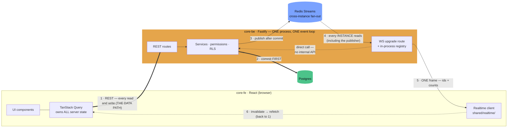
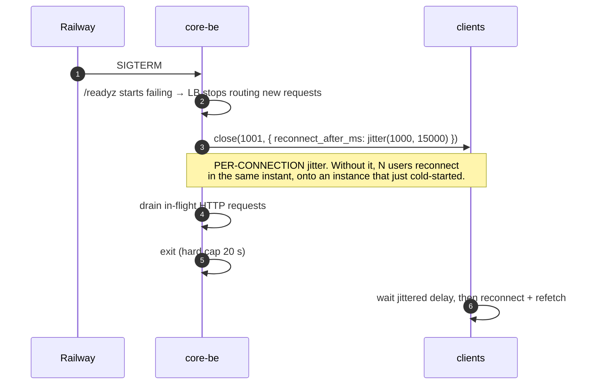

# Realtime inside `core-be` — the Option A plan

> **This is the chosen architecture.** WebSockets live in the `core-be` Fastify process. No Go
> service, no second repository, no new language.
>
> **Status:** proposal. Nothing here is implemented yet.
> **Sibling documents:** [`realtime-go-service-plan.md`](realtime-go-service-plan.md) is the
> separate-service design and remains the reference for *when you outgrow this* — its Appendix C is
> the trade-off analysis that led here. This document supersedes it for implementation.

---

## 1 · What changes, and what stays

Option A is not a smaller version of the Go plan — it is a genuinely different shape, and copying
the Go design wholesale would import complexity that only exists to cross a process boundary that
Option A does not have.

**Deleted entirely.** Every one of these exists in the Go plan solely because the socket lives in a
different process:

| Gone | Why it existed | Why it is unnecessary here |
|---|---|---|
| `POST /realtime/ticket` | Browsers cannot set headers on `new WebSocket()`, so the token had to travel some other way | The upgrade is **same-origin**, so the `session_id` cookie is sent automatically |
| `POST /internal/realtime/handshake` | `core-rt` had to ask `core-be` who the caller was | It *is* `core-be`. Authorization is a function call |
| `REALTIME_INTERNAL_SECRET` | Securing that internal endpoint | No endpoint |
| Contract fixtures in three repos | Keeping a Go struct and a Zod schema in sync | One TypeScript type, shared by construction |
| `rt:control` revocation stream | Telling another process about a logout | The logout code path can close the sockets directly |
| The `core-rt` repository, Go toolchain, second CI | — | — |

**Kept, because they are about correctness, not about process boundaries:**

- Postgres commits **before** anything is announced.
- The socket announces changes; **REST moves data**.
- **No writes over the socket** — `mark-as-read` stays a `PATCH`.
- Delivery follows membership; **presentation follows the active org**, with the summary/full tier
  split enforced server-side.
- Client dedupes on a stable envelope id; at-least-once is expected.
- Redis for cross-instance fan-out (§5).

**Net:** roughly **350–450 lines** against ~2,000, and **3–5 days** against 2–3 weeks.

---

## 2 · The architecture



**The loop is unchanged.** Data still travels the thick line ①; the socket still only says
"something changed, ask again" on ⑤; ⑥ still returns to REST. Every property that made the Go design
robust — ordering irrelevance, cheap frame loss, the kill switch — comes from that loop, not from
where the socket is hosted.

**What changed is the box.** `WS` and `API` now share a process, an event loop, and a deploy. That
is the whole trade: the dotted arrow becomes free, and §7 becomes your problem.

> ### The one short-circuit you must not take
>
> When an event is published by the same instance that holds the target socket, it is tempting to
> deliver in-process and skip Redis. **Don't.** Publish everything to Redis and let every instance —
> including the publisher — receive it from there. One path, no "am I the origin?" branch, no
> double-delivery when you get that branch wrong. The extra hop is a sub-millisecond local Redis
> round trip.

---

## 3 · Connecting — the part that gets dramatically simpler

No ticket. No handshake. The browser's session cookie is already valid for this origin, and the
repo already owns a tested Origin guard for exactly this situation.

```mermaid
sequenceDiagram
  autonumber
  actor U as User
  participant FE as core-fe
  participant BE as core-be
  participant PG as Postgres
  participant RD as Redis

  rect rgba(122,162,255,0.08)
    Note over U,PG: AUTH — unchanged, no sockets involved
    U->>FE: email + password
    FE->>BE: POST /api/v1/auth/login
    BE->>PG: verify credentials
    BE-->>FE: 201 access_token + session_id cookie (httpOnly)
  end

  rect rgba(199,146,234,0.09)
    Note over FE,BE: FIRST PAINT — REST, never the socket
    FE->>BE: GET /api/v1/notify/notifications
    BE-->>FE: 200 → TanStack Query cache
    Note over FE: UI fully usable here. Everything below is enhancement.
  end

  rect rgba(76,195,138,0.09)
    Note over FE,RD: OPEN THE PIPE — one request, no ticket
    FE->>BE: GET /api/v1/realtime/socket?organization_id=org_acme<br/>Upgrade + Origin + session_id cookie (automatic)
    BE->>BE: requireAllowedSourceOriginForCookieSessionRoute(request)
    Note over BE: EXISTING, tested guard. WS upgrades are NOT<br/>covered by CORS — this is the whole CSWSH defence.
    BE->>BE: authSessionService.verifyActiveSession(cookie)
    BE->>PG: memberships + permissions (Redis-cached)
    BE->>BE: verify organization_id IS an active membership
    BE->>BE: registry.add(socket) under EVERY membership; requested org = ACTIVE
    BE-->>FE: 101 Switching Protocols
    BE-->>FE: frame connection.ready { unread_by_org }
    opt first socket for this org on this instance
      BE->>RD: ensure stream reader running
    end
  end

  Note over FE,BE: Heartbeat every 25 s. Socket closes when the session is<br/>revoked — the logout path calls registry.closeForSession() directly.
```

### Why the cookie, not the access token

| | Cookie (chosen) | Bearer token |
|---|---|---|
| How it reaches the server | Sent automatically on a same-origin upgrade | Cannot — browsers set no headers on `new WebSocket()` |
| Extra endpoint needed | none | a ticket endpoint |
| Revocation | Session row is the source of truth; logout closes sockets directly | Bounded by token lifetime |
| Risk | **CSWSH if the Origin check is missing or wrong** | Token in a URL |

The cookie path is strictly simpler *provided* the Origin check is present. That check is not
optional and not new code — `requireAllowedSourceOriginForCookieSessionRoute` already exists in
`src/shared/middlewares/session/cookie-session-origin.pre-handler.ts`, is already used for the
refresh route, and takes a plain `FastifyRequest`. Attach it as an `onRequest` hook on the upgrade
route and the defence is done.

> **Browsers always send `Origin` on a WebSocket upgrade**, so the pre-handler's first branch always
> applies. Its CSRF/Referer fallbacks only engage for non-browser clients, which fail closed. That is
> the correct posture for this route.

### The active organization

The FE already knows it — the URL is the source of truth. Pass it as `?organization_id=org_…` and
**verify it against membership server-side**. It is a selector, never an authorization claim. On
switch, the client sends an `active_org.set` frame; the server re-verifies membership and flips the
flag. Same socket, no reconnect.

---

## 4 · A data update, end to end

```mermaid
sequenceDiagram
  autonumber
  actor TM as Teammate
  participant BE1 as core-be (instance 1)
  participant PG as Postgres
  participant CD as commit-dispatch
  participant RD as Redis Streams
  participant BE2 as core-be (instance 2 — holds your socket)
  participant FE as core-fe (you)

  TM->>BE1: POST /api/v1/tasks/7/assign → usr_42
  BE1->>PG: BEGIN · UPDATE task · INSERT notification
  PG-->>BE1: COMMIT ✔ — truth persisted FIRST
  BE1->>CD: scheduleCommitDispatch { realtime_event, envelope }
  CD->>RD: task persisted to Redis BEFORE the response returns
  BE1-->>TM: 201 Created

  Note over CD,RD: Durable. A crash here is replayed by<br/>commit-dispatch-recovery.worker.
  CD->>RD: XADD rt:events

  RD-->>BE1: XREAD — the publisher reads its own event too (no short-circuit)
  RD-->>BE2: XREAD
  BE1->>BE1: registry: usr_42 not here → drop
  BE2->>BE2: registry: usr_42 → socket; acme IS active → TierFull
  BE2-->>FE: ONE frame { id, notification.created, summary, payload }

  FE->>FE: dedupe on envelope id
  FE->>FE: setQueryData(unreadCount, +1) ← instant badge
  FE->>BE1: invalidateQueries → GET /notify/notifications
  BE1-->>FE: 200 authoritative list — the server response WINS

  opt user opens the notification
    FE->>BE1: PATCH /notify/notifications/{notification_id}/read
    Note over FE,BE1: REST, not a socket frame — it needs validation,<br/>idempotency, rate limits, audit and RLS.
    BE1->>PG: read_at = now()
  end
```

The `core-be` publish side is **identical to the Go plan** — the `realtime_event` variant on the
existing `commit-dispatch` discriminated union (see the implementation map, amendment §1.1). Only the
consumer changed: an in-process registry rather than a separate service.

---

## 5 · Cross-instance fan-out

You need Redis as soon as you run **more than one `core-be` instance**, which on Railway you will.

> **Single instance?** Then the in-process registry is complete and you need no Redis at all. That is
> the true minimum — roughly 200 lines. It is a legitimate place to start for an internal beta, but
> do not let it calcify: the second instance turns silent non-delivery into a production bug, not an
> error.

### Streams, not pub/sub — and here the reason is specific to this codebase

The Go plan chose Streams because pub/sub drops messages silently when a subscriber blips. That
argument holds here, and **`core-fe` makes it stronger**:

```ts
// core-fe · src/core/http/queryClient.ts
refetchOnWindowFocus: false,
```

That default is set deliberately. It means a silently dropped message has **no natural repair path** —
the UI stays stale until the user navigates or manually refreshes. In an app that *did* refetch on
focus, pub/sub loss would self-heal within a tab switch; here it does not.

So:

- **Redis Streams** with a bounded `MAXLEN`. Each instance keeps a cursor and catches up after a blip.
- **One stream** (`rt:events`) is enough at Option A's scale. Sharding is a later optimisation, and
  the publisher indirection (§9) makes it a one-file change.
- Pub/sub is acceptable **only** if you also flip `refetchOnWindowFocus` to `true` — but note that
  changing a global query default affects every query in the app and increases request volume. It is
  a bigger change than it looks. Prefer Streams.

### Key prefix

Use the existing `redisConnection` from `infrastructure/cache/redis.client.ts`, which already applies
`resolveRedisKeyPrefix()`. Since both publisher and consumer are `core-be`, the prefix mismatch that
would have been Option C's most likely silent failure **cannot happen here** — one more thing this
architecture gets for free.

---

## 6 · Multi-organization tiering

Unchanged from the Go plan, and it remains the single most security-sensitive piece.

```mermaid
sequenceDiagram
  autonumber
  actor CG as Colleague in Globex
  participant BE as core-be
  participant RD as Redis
  participant FE as core-fe
  actor U as Dakshil (working in Acme)

  Note over BE: One socket, registered under BOTH memberships.<br/>acme = ACTIVE · globex = inactive · initech = NO ENTRY

  rect rgba(199,146,234,0.10)
    CG->>BE: POST /api/v1/docs/9/mention → usr_42 (in Globex)
    BE->>RD: commit, then XADD
    RD-->>BE: XREAD
    BE->>BE: usr_42 IS a member of globex → deliver
    BE->>BE: globex ≠ active org → TierSummary
    BE-->>FE: frame { org_id: globex, summary { resource_id, unread_delta } }
    Note over BE,FE: payload ABSENT — serialised server-side.<br/>Another tenant's title never crosses the wire.
    FE->>FE: org_id ≠ activeOrg → badge only; Acme caches untouched
    FE-->>U: quiet dot on the switcher — Globex (3)
  end

  rect rgba(229,165,75,0.10)
    U->>FE: click "Globex (3)"
    FE->>FE: navigate /organization/globex/… (URL leads)
    FE->>BE: POST /api/v1/auth/switch-to-organization
    BE-->>FE: 201 new access_token · org = globex
    FE->>BE: frame active_org.set { org_id: globex }
    BE->>BE: re-verify membership, flip the active flag
    BE-->>FE: frame active_org.changed ✔
    Note over FE,BE: SAME socket. No reconnect. Roles reversed.
  end

  rect rgba(229,101,75,0.09)
    Note over BE: An Initech event: usr_42 has no membership →<br/>no registry entry → unreachable, not filtered.
  end
```

`tierFor(envelope, connection)` must be a **pure function with no I/O**, unit-tested, returning
`Full | Summary | Drop`. `Summary` serialises a *different object* with `payload` omitted — the
privileged fields are never written to the socket. A dedicated test asserting `payload === undefined`
for an inactive-org event is non-negotiable.

---

## 7 · The two costs you are accepting, and how to hold them

Appendix C of the Go plan explains why these decide the architecture at scale. Having chosen Option
A, here is how to keep them manageable.

### 7.1 Fan-out blocks the event loop — chunk it from day one

A broadcast is a synchronous loop on the only thread you have. Ten lines prevents the p99 cliff:

```ts
const BROADCAST_CHUNK = 200;

async function broadcast(sockets: Iterable<WebSocket>, frame: string): Promise<void> {
  let n = 0;
  for (const socket of sockets) {
    if (socket.readyState === socket.OPEN) socket.send(frame);
    // Yield to the event loop every N sends so API requests are not starved
    // behind a large org-wide broadcast. See realtime-go-service-plan.md App. C.4.1.
    if (++n % BROADCAST_CHUNK === 0) await new Promise(setImmediate);
  }
}
```

Serialise the frame **once** before the loop — `JSON.stringify` per socket is the other easy way to
turn a 10 ms broadcast into a 100 ms one.

**Add a metric now, not later:** `realtime_broadcast_duration_seconds`. It is the number that tells
you when Option A has stopped fitting, and without it you will be guessing.

### 7.2 Every deploy disconnects every user — jitter the reconnect

Sockets now share `core-be`'s lifecycle. On `SIGTERM`:



Two drain semantics now live in one shutdown: HTTP finishes in flight, sockets are closed
deliberately. Make the socket close **first** so clients start their backoff while requests drain.

**Watch your deploy frequency.** If releases start feeling disruptive, that is the architecture
talking — and it is the signal to revisit Appendix C, not to deploy less often.

---

## 8 · Files

Following the implementation map's conventions. The `realtime` domain is **flat** (like `audit` and
`upload`), so `'realtime'` must be added to `FLAT_DOMAINS` in
`src/scripts/validators/domain/validate-domain.ts`.

```text
src/
├── infrastructure/realtime/                       + ADD
│   ├── realtime.overview.md                       + ADD  (convention: every infra module has one)
│   ├── realtime.constants.ts                      + ADD  MAXLEN · heartbeat · chunk size · caps
│   ├── realtime-envelope.ts                       + ADD  Zod schema + buildRealtimeEnvelope()
│   ├── realtime-publisher.ts                      + ADD  publishRealtimeEvent() — THE indirection
│   ├── realtime-registry.ts                       + ADD  org → user → sockets, in-process
│   ├── realtime-tier.ts                           + ADD  tierFor() — PURE, no I/O
│   ├── realtime-broadcast.ts                      + ADD  chunked, pre-serialised (§7.1)
│   ├── realtime-ingest.ts                         + ADD  XREAD loop → registry
│   └── __tests__/unit/*.unit.test.ts              + ADD  incl. the payload-absent leak test
│
├── domains/realtime/                              + ADD  flat domain
│   ├── realtime.routes.ts                         + ADD  GET /socket ({ websocket: true })
│   ├── realtime.controller.ts                     + ADD  upgrade handler
│   ├── realtime.service.ts                        + ADD  session → memberships → permissions
│   ├── realtime.dto.ts · .validator.ts            + ADD  the 4 inbound control frames
│   ├── realtime.container.ts                      + ADD
│   ├── realtime.overview.md                       + ADD
│   └── __tests__/integration/realtime.integration.test.ts   + ADD  ! validate:domain REQUIRES this
│
├── routes.ts                                      ~ EDIT  register the plugin
├── domains/domain-containers.plugin.ts            ~ EDIT  wire the container
├── infrastructure/queue/commit-dispatch/
│   ├── commit-dispatch.types.ts                   ~ EDIT  + 'realtime_event' variant
│   └── commit-dispatch.executor.ts                ~ EDIT  + the matching case
├── domains/notify/…/notification-dispatch.service.ts   ~ EDIT  schedule the realtime task
├── domains/auth/…/auth-session.service.ts         ~ EDIT  on revoke → registry.closeForSession()
├── shared/config/env-schema.ts                    ~ EDIT  ! new env vars
├── scripts/validators/domain/validate-domain.ts   ~ EDIT  ! FLAT_DOMAINS += 'realtime'
├── OVERVIEW.md · PATTERNS.md · FLOWS.md · POLICIES.md  ~ EDIT  ! narratives
└── server.ts                                      ~ EDIT  SIGTERM: close sockets before HTTP drain
```

Plus `pnpm add @fastify/websocket`, `.env.example` sync, `docs/routes.txt` regeneration, and the
three route-catalog JSON files.

**Env vars** (static production-safe defaults; conditions in the `.refine()` layer):

| Variable | Default | Purpose |
|---|---|---|
| `REALTIME_ENABLED` | `false` | The kill switch — gates both the route and publishing |
| `REALTIME_MAX_SOCKETS_PER_USER` | `10` | Tab cap |
| `REALTIME_CROSS_ORG_TITLES` | `false` | Never leak another tenant's free text |

**Gates that will fire** — unchanged from the implementation map: `knip` (`files: error`, so land
each file with its caller), `tsdoc:check` (budget at 0/0; `@remarks` required on service/publisher
files), `validate:domain`, the snake_case body-key policy, and the route-catalog checks.

---

## 9 · Keeping the exit cheap

You may outgrow this. Four decisions — about a day's care — make migrating to a separate service a
mechanical change rather than a rewrite:

1. **Version the envelope** (`v: 1`) and never let a handler read a Drizzle row directly. This is the
   most important one: it is what makes the socket layer replaceable instead of entangled.
2. **Publish through one function.** Everything goes through `publishRealtimeEvent(envelope)`, even
   in-process. Swapping its body is then a one-file change.
3. **Never write to Postgres from a socket handler.** The moment a frame can mutate state, the layer
   stops being extractable and becomes a second API.
4. **Keep `tierFor()` pure.** No I/O. It ports to any language unchanged, and it is the one place
   where a bug is a cross-tenant leak.

Migration, if it comes: stand up the service, move the registry + `tierFor` + ingest, repoint
`publishRealtimeEvent`, change the client URL. **Domain code never changes**, because it only ever
knew about `publishRealtimeEvent`.

**The number that says it is time:** `realtime_broadcast_duration_seconds` p99 above ~50 ms, or
concurrent connections per instance above ~5,000. Instrument both from day one.

---

## 10 · Build order

| Step | Do | Ships behind the flag? |
|---|---|---|
| 1 | `realtime.constants.ts`, `realtime-envelope.ts`, `realtime-tier.ts` + unit tests (incl. the leak test) | n/a — pure |
| 2 | `commit-dispatch` variant + executor + `realtime-publisher.ts` | Deploy **alone first** — the task is persisted to Redis, so every running instance must be able to parse it before any is written |
| 3 | `env-schema.ts`, `.env.example` | ✅ |
| 4 | Registry, broadcast, ingest + `server.ts` shutdown | ✅ |
| 5 | The `realtime` domain, route, Origin guard, `validate-domain.ts` | ✅ `REALTIME_ENABLED=false` |
| 6 | `core-fe` client, router, provider, CSP | ✅ |
| 7 | Notification publisher + session-revoke hook | ✅ |
| 8 | Narratives, `CLAUDE.md`, metrics, dashboards | — |

Everything merges to `main` inert. Turning it on is a config change, not a deploy.

**Realistic: 3–5 days** for a working end-to-end path, plus a day for metrics and the shutdown path.

---

## 11 · `core-fe` — unchanged from the Go plan

The frontend does not care where the socket is hosted. The module layout
(`src/shared/realtime/`), the state machine, the backoff, the lifecycle wiring, and the rule that
matters most all carry over verbatim:

> **The socket is a cache-invalidation signal, not a data channel.** It never writes application data
> into a store — it tells TanStack Query what is stale.

Two Option-A specifics:

- **No ticket fetch.** `realtime-ticket.ts` is deleted from the plan; the client connects directly
  with `credentials: 'include'` semantics (the cookie rides the same-origin upgrade automatically).
- **CSP is simpler** — the socket is on the API origin you already allow. Still list the `wss://`
  form explicitly alongside `https://`: CSP3 says an `https:` source should match `wss:` for the same
  host, but WebKit has been inconsistent, and the failure mode is a silently blocked connection in
  Safari only.

See the Go plan's §9 for the full frontend design; every word of it applies.
