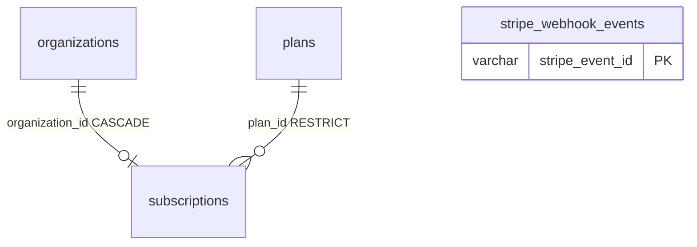

# Billing database schema (Postgres)

Canonical reference for the **`billing`** schema. The billing surface is **subscription only**: Stripe is the source of truth for customers, charges, and billing documents; this service mirrors subscription state via `customer.subscription.*` webhooks. Drizzle definitions live under `src/domains/billing/sub-domains/*/`.

For tables **without** tenant RLS, see [system-tables-without-tenant-rls.md](../security/system-tables-without-tenant-rls.md). For pool sizing vs org-scoped HTTP transactions, see [resource-limits runbook](../../deployment/runbooks/resource-limits.md).

---

## Tenant context (RLS)

| Mechanism | Detail |
| --------- | ------ |
| Session GUC | `app.current_organization_id` — set from `X-Organization-Id` (organization `public_id`) via tenant middleware |
| HTTP | Org-scoped routes run inside `organizationRlsTransactionMiddleware` (single connection + `SET LOCAL` for the request) |
| Workers / scripts | **Do not** rely on RLS alone — pass `organization_id` / `organizationPublicId` explicitly in queries |
| FORCE RLS | Enabled on tenant tables ([`20260516000006_force_row_level_security.sql`](../../../migrations/00000000000000_init.sql)) |
| Retention | Policies allow `app.global_retention_cleanup = 'true'` for purge workers ([`00000000000000_init.sql`](../../../migrations/00000000000000_init.sql)) |

---

## `billing.plans` (global catalog)

| Item | Definition |
| ---- | ---------- |
| **Primary key** | `id` (`bigserial`) |
| **Public API id** | `public_id` (`varchar(21)`, unique) |
| **Foreign keys** | `created_by_user_id` → `auth.users(id)`; `updated_by_user_id` → `auth.users(id)` (nullable) |
| **RLS** | **None** — shared catalog; access controlled by API permissions (`plan:read`, etc.) |
| **Soft delete** | No `deleted_at` — use `is_active` |
| **Notable indexes** | `idx_plans_public_id`, `idx_plans_name`, `idx_plans_active` |
| **Drizzle** | [`plan.schema.ts`](../../../src/domains/billing/sub-domains/plan/plan.schema.ts) |

---

## `billing.subscriptions`

| Item | Definition |
| ---- | ---------- |
| **Primary key** | `id` (`bigserial`) |
| **Public API id** | `public_id` (`varchar(21)`, unique) |
| **Foreign keys** | `organization_id` → `tenancy.organizations(id)` **ON DELETE CASCADE**; `plan_id` → `billing.plans(id)` **ON DELETE RESTRICT**; optional audit FKs → `auth.users` |
| **Uniqueness** | At most one **non-terminal** subscription per organization — partial unique index `idx_subscriptions_org` on `organization_id` `WHERE status <> 'CANCELED'`. `CANCELED` rows are excluded so re-subscription after cancel does not collide; a concurrent create that loses the race surfaces as `409 ConflictError` (`errors:subscriptionAlreadyExists`), not a 500 |
| **RLS policy** | `subscriptions_tenant_isolation` — `organization_id` matches org resolved from `app.current_organization_id` (+ retention bypass) |
| **Stripe** | `provider_subscription_id`, `provider_customer_id`, `last_stripe_event_created_at` (monotonic webhook guard) |
| **Drizzle** | [`subscription.schema.ts`](../../../src/domains/billing/sub-domains/subscription/subscription.schema.ts) |

---

## `billing.stripe_webhook_events` (system — no tenant RLS)

| Item | Definition |
| ---- | ---------- |
| **Primary key** | `stripe_event_id` (`varchar(255)`) — Stripe’s event id, not `bigserial` |
| **Foreign keys** | **None** — ledger is global ingress |
| **RLS** | **None** — workers scope by Stripe ids + repository queries; see [system-tables-without-tenant-rls.md](../security/system-tables-without-tenant-rls.md) |
| **Purpose** | At-least-once webhook deduplication and processing status |
| **HTTP ingress** | Signature verified in [`stripe-webhook-ingress.plugin.ts`](../../../src/domains/billing/sub-domains/stripe-webhook/stripe-webhook-ingress.plugin.ts) before enqueue |
| **Drizzle** | [`stripe-webhook.schema.ts`](../../../src/domains/billing/sub-domains/stripe-webhook/stripe-webhook.schema.ts) |

---

## Design rule — subscription only

This service mirrors **only** subscription state from Stripe. Customers, payment instruments, billing documents, and charge history live entirely in Stripe and are surfaced to end users via the Stripe Customer Portal. Earlier billing entity prototypes that overlapped with Stripe's surface were dropped during schema consolidation and must not be reintroduced — keep the model aligned with Stripe being the source of truth.

---

## Entity relationship (active tables)

---

## Related

- [database/core-be.dbml](../../database/core-be.dbml) — full billing + all schemas on [dbdiagram.io](https://dbdiagram.io/) (`pnpm tool:generate-dbdiagram`)
- [external-service-resilience.md](../reliability/external-service-resilience.md) — Stripe/Resend circuits and webhook flow
- [migrations.md](migrations.md) — how to change schema safely
- [domains-and-public-api-design.md](../architecture/domains-and-public-api-design.md) — billing routes and permissions
- [`src/domains/billing/billing.overview.md`](../../../src/domains/billing/billing.overview.md) — domain overview (Stripe authoritative, idempotency, stale-event protection)
- [`src/domains/billing/sub-domains/plan/plan.overview.md`](../../../src/domains/billing/sub-domains/plan/plan.overview.md) — plan catalog invariants
- [`src/domains/billing/sub-domains/subscription/subscription.overview.md`](../../../src/domains/billing/sub-domains/subscription/subscription.overview.md) — subscription state machine, retained mutable-state semantics (watermark-guarded, not append-only)
- [`src/domains/billing/sub-domains/stripe-webhook/stripe-webhook.overview.md`](../../../src/domains/billing/sub-domains/stripe-webhook/stripe-webhook.overview.md) — webhook receiver, reclaim window, per-source DLQ
- [`src/FLOWS.md`](../../../src/FLOWS.md) § Stripe webhook ingest, § Subscription create — end-to-end flows
