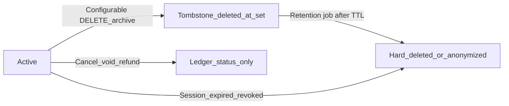

# Data lifecycle, deletion, and archival

How core-be treats **removal** of persisted rows: tombstones (`deleted_at`), **revocation** flags, **immutable ledgers**, **ephemeral** credentials, and **retention** workers. Complements [domains-and-public-api-design.md](../architecture/domains-and-public-api-design.md) (API shape) and [api-versioning.md](../api/api-versioning.md) (HTTP versioning).

---

## Principles

1. **HTTP `DELETE` on tenant-owned configuration** should usually mean **tombstone** (soft delete) or an explicit **archive** action — not a silent SQL `DELETE`, unless the resource is **ephemeral** by design.
2. **Financial and subscription state** remains an **immutable operational ledger**: lifecycle is **`status`** and provider fields (subscriptions, Stripe webhook ledger) — not `deleted_at` as a hide switch.
3. **Secrets and sessions** favor **hard delete** after expiry/revocation to shrink attack surface; optional **retention** is time-boxed and documented.
4. Every **read** path for tombstoned entities must filter **`deleted_at IS NULL`** (Drizzle: `isNull(table.deleted_at)`) unless the handler is **admin**, **restore**, or **compliance export**.
5. **`INSERT`** on tenant-managed entities with a stable natural key uses **`onConflictDoUpdate`**: set **`deleted_at` to `NULL`** and refresh columns so **recreate becomes reactivation** (webhook URL per org, notification-policy triple — see **Upserts** below).
6. Tombstones older than **`TOMBSTONE_RETENTION_DAYS`** (default **90**) are **hard-deleted** by dedicated BullMQ retention workers (distinct from audit/session jobs).
7. Introducing `deleted_at` on tables with **multiple natural keys** may require **composite unique indexes** for upsert + deduplication — see [sql-design-guard](../../../.cursor/skills/sql-design-guard/SKILL.md).

---

## Taxonomy (pick one primary class per table)

| Class                        | Meaning                                                     | Typical signal                                     |
| ---------------------------- | ----------------------------------------------------------- | -------------------------------------------------- |
| **Tombstone**                | Row hidden from normal API; may be restored or purged later | `deleted_at timestamptz` nullable                  |
| **Revocation / inactive**    | Row kept for audit; not shown in “active” lists             | `revoked_at`, `canceled_at`, `is_active`, `status` |
| **Immutable ledger**         | Business facts and money movement; no user “delete”         | `status`, provider ids, line items                 |
| **Ephemeral / high-risk**    | Tokens, sessions; remove when spent or revoked              | Hard `DELETE` after policy TTL                     |
| **Append-only / compliance** | Retained then purged by schedule                            | Retention worker, no user delete                   |
| **Junction / derived**       | Lifetime tied to parent                                     | Delete or orphan policy with parent                |

---

## Use-case checklist (all in scope for the lifecycle initiative)

Each area must be **documented and implemented** (correct queries, migrations, workers, or explicit guardrails). Work may ship in **multiple PRs**; ordering is for blast radius, not deferring scope.

- **Tenant-config delete** — webhooks, API keys, roles, org notification policies, etc.
- **Membership / RBAC teardown** — memberships, role-permission links.
- **Offboarding identity** — users, settings, notification preferences, uploads, linked rows.
- **Immutable operational ledger** — subscriptions and `billing.stripe_webhook_events`: **no** naive `deleted_at`; enforce **no stray SQL delete** and provider-aligned `status`.
- **Ephemeral secrets / credentials** — sessions, verification tokens; retention and hard delete.
- **Notification hygiene** — user notifications vs org-level webhooks.
- **Compliance retention** — audit logs and other TTL tables.

For each **table × use-case** cell, classify **`implement_now`** vs **`not_applicable_to_table`** (e.g. `sessions` is not applicable to “immutable ledger”). **`not_applicable_to_table`** must be explicit — never blank.

---

## Lifecycle flow

---

## Execution order (recommended)

1. Freeze the **matrix** (spreadsheet or markdown appendix below) with stakeholder sign-off on **ledger** and **ephemeral** rules.
2. **Tenant-config**: align resources that still use Drizzle `.delete()` (e.g. **webhooks**) with **`deleted_at`** + filtered selects.
3. **Billing**: document + guardrails (tests / conventions) — **no** `deleted_at` on subscriptions / webhook ledger tables.
4. **Cross-cutting**: align naming (`revoked_at` vs tombstone) only where it reduces ambiguity in **this same initiative**.
5. **Retention**: tombstone TTL purge vs **audit/session** cleanup — separate jobs, explicit schedules.

---

## Upsert / reactivation

| Resource                | Unique conflict target                                    | On conflict behaviour                                                            |
| ----------------------- | --------------------------------------------------------- | -------------------------------------------------------------------------------- |
| Org notification policy | `(organization_id, notification_type, channel)`           | Tombstone cleared; preferences refreshed                                         |
| Webhook                 | `(organization_id, url)`                                  | Tombstone cleared; secret/events/`is_enabled` updated; **`public_id` unchanged** |

See migrations **`20260516000002_*` … `*_04_*`** for `deleted_at` columns and uniqueness.

---

## Immediate vs delayed cleanup

| Entity / table         | On HTTP soft-delete (immediate)                                                                             | After `TOMBSTONE_RETENTION_DAYS` (delayed)                                                   |
| ---------------------- | ----------------------------------------------------------------------------------------------------------- | -------------------------------------------------------------------------------------------- |
| `uploads`              | `DELETE` removes S3 object + sets `deleted_at`; user offboarding tombstones all user uploads (+ S3 per row) | Hard-delete row + S3 (`upload-tombstone-retention`)                                          |
| `users`                | Revoke all sessions + auth methods; clear avatar S3 key; tombstone uploads; **delete all GDPR export S3 keys + `auth.user_data_exports` rows** | Hard-delete row (`user-tombstone-retention`; blocked if still `organizations.owner_user_id`) |
| `user_data_exports`    | Removed on user offboarding (`deleteAllExportsForUser`)                                                     | Daily `user-data-export-retention` when `expires_at` passed; S3 lifecycle on prefix `user-data-export/` (7 days) |
| `organizations`        | Clear logo S3 key; tombstone org-scoped uploads (DB only); **no** child membership/role/API tombstone       | Hard-delete org (`organization-tombstone-retention`; CASCADE children)                       |
| Other tombstone tables | API `DELETE` sets `deleted_at` only                                                                         | Matching `*-tombstone-retention` worker                                                      |

**Org tombstone window:** Child rows (memberships, webhooks, roles, etc.) may remain `deleted_at IS NULL` while the org is tombstoned. Normal API access is blocked via `requireOrganizationByPublicId` / org repository filters — not via cascading soft-delete.

### Tombstone purge cron order (FK-safe)

Registered in `src/infrastructure/queue/scheduler.ts` (default stagger 05:44–05:53 UTC):

1. `user-data-export-retention` — expired GDPR export artifacts (S3 + `auth.user_data_exports`)
2. `upload-tombstone-retention` — `uploads.user_id` blocks user hard-delete
3. `organization-tombstone-retention` — releases `owner_user_id` when org purged
4. Child tombstones (webhooks, policies, memberships, roles, API keys)
5. `user-tombstone-retention` — last

Batch deletes use `deleteInBatchesByCondition` with per-row FK fallback (`blockedCount` logged as `batch-delete.fkBlocked`).

---

## Table inventory (Drizzle `*.schema.ts`)

**`deleted_at`** (where applicable): `auth.users`, `tenancy.organizations`, `tenancy.memberships`, `tenancy.roles`, `tenancy.api_keys`, `tenancy.organization_notification_policies`, `notify.webhooks`, `upload.uploads`.

| Postgres table                       | Schema  | Primary class           | Deletion / inactive signal today          | Notes                                                                           |
| ------------------------------------ | ------- | ----------------------- | ----------------------------------------- | ------------------------------------------------------------------------------- |
| `users`                              | auth    | Tombstone + offboarding | `deleted_at`, `status`                    | Offboarding: sessions, auth methods, avatar S3, upload S3+tombstone, GDPR export S3+rows; purge last |
| `user_data_exports`                  | auth    | Compliance export       | `expires_at`, `status`                    | Presigned URL ≤24h; S3 lifecycle + retention worker; offboarding deletes immediately |
| `user_settings`                      | auth    | Tombstone chain         | FK to user                                | Inherits visibility from user                                                   |
| `user_notification_preferences`      | auth    | Tombstone chain         | FK to user                                | Same                                                                            |
| `sessions`                           | auth    | Ephemeral               | `expires_at`, `is_revoked`                | Cleanup worker hard-deletes                                                     |
| `auth_methods`                       | auth    | Revocation              | `revoked_at`                              | Not `deleted_at` by design                                                      |
| `mfa_methods`                        | auth    | Revocation              | `revoked_at`                              | Same                                                                            |
| `verification_tokens`                | auth    | Ephemeral               | TTL implicit                              | Hard delete acceptable                                                          |
| `organizations`                      | tenancy | Tombstone               | `deleted_at`, `status`                    | Logo S3 + org upload tombstone; no child cascade on soft-delete                 |
| `memberships`                        | tenancy | Tombstone               | `deleted_at`                              |                                                                                 |
| `member_invitations`                 | tenancy | Revocation + TTL        | `revoked_at`, `expires_at`, `accepted_at` |                                                                                 |
| `roles`                              | tenancy | Tombstone               | `deleted_at`                              |                                                                                 |
| `role_permissions`                   | tenancy | Junction                | none                                      | Drops when role hard-removed — align with tombstone role                        |
| `permissions`                        | tenancy | Reference               | none                                      | Seeds only                                                                      |
| `organization_settings`              | tenancy | Tombstone chain         | FK org                                    | Visibility from org                                                             |
| `organization_notification_policies` | tenancy | Tenant-config           | `deleted_at`                              | Upsert + API soft-delete                                                        |
| `api_keys`                           | tenancy | Tombstone               | `deleted_at`                              |                                                                                 |
| `webhooks`                           | notify  | Tenant-config           | `deleted_at`                              | Unique `(organization_id, url)`; purge worker after `TOMBSTONE_RETENTION_DAYS`  |
| `webhook_delivery_attempts`          | notify  | Append / child          | FK `webhook_id`                           | Retain for audit; parent soft-deleted                                           |
| `notifications`                      | notify  | Notification hygiene    | Hard delete / read flags                  | User dismiss — not org integration                                              |
| `logs`                               | audit   | Append-only             | Retention worker                          |                                                                                 |
| `plans`                              | billing | Reference / catalog     | `is_active`                               | Not user-deleted per row                                                        |
| `subscriptions`                      | billing | Immutable ledger        | `status`, `canceled_at`, provider ids     |                                                                                 |
| `stripe_webhook_events`              | billing | System ledger           | `processing_status`                       | No tenant RLS; deny-all + `core_be_app` policy                                  |
| `uploads`                            | upload  | Tombstone               | `deleted_at`                              | Per-upload DELETE + user offboarding S3 sweep; retention purge deletes S3+row   |

---

## Related code

- **Repeatable cron index (all `upsertJobScheduler` retention jobs):** `src/infrastructure/queue/scheduler.ts`
- **Audit retention worker (processor):** `src/domains/audit/workers/audit-retention.worker.ts`
- **Session cleanup worker (processor):** `src/domains/auth/sub-domains/auth-session/workers/session-cleanup.worker.ts`
- **GDPR export retention:** `src/domains/user/sub-domains/user-data-export/workers/user-data-export-retention.worker.ts` — see [user-data-export.md](../data/user-data-export.md)
- **Tombstone hard-delete** (uses **`TOMBSTONE_RETENTION_DAYS`**, default **90**): tombstoned `deleted_at` tables — `user/workers/user-tombstone-retention.worker.ts`, `tenancy/organization/workers/organization-tombstone-retention.worker.ts`, `tenancy/membership/workers/membership-tombstone-retention.worker.ts`, `tenancy/member-roles/workers/member-role-tombstone-retention.worker.ts`, `tenancy/organization/organization-api-key/workers/organization-api-key-tombstone-retention.worker.ts`, `tenancy/organization/organization-notification-policy/workers/organization-notification-policy-tombstone-retention.worker.ts`, `notify/webhook/workers/webhook-tombstone-retention.worker.ts`, `upload/workers/upload-tombstone-retention.worker.ts` (upload purge deletes S3 objects per row)
- **Billing ledger guard**: domain unit test `src/domains/billing/__tests__/unit/billing-ledger-immutability.test.ts`
- **Tombstone read guard**: `src/domains/user/__tests__/unit/tombstone-repository-reads.test.ts`
- **Batch delete FK fallback**: `src/infrastructure/database/batch-delete.util.ts`, `src/tests/unit/infrastructure/database/batch-delete.util.test.ts`
- **Scheduler tombstone order**: `src/tests/unit/infrastructure/queue/scheduler.test.ts`
- **SQL design guard**: `.cursor/skills/sql-design-guard/SKILL.md`

After pulling schema changes (for example **`notify.webhooks.deleted_at`**), apply **`pnpm db:migrate`** so the database matches Drizzle definitions.

When you change any `*.schema.ts` or `migrations/*.sql`, follow **db-migration-maintainer** and **sql-design-guard**.

## Related

- [`src/PATTERNS.md`](../../../src/PATTERNS.md) § Soft Delete, § Tenant Isolation, § Audit Emission — cross-cutting patterns referenced by every lifecycle decision
- [`src/POLICIES.md`](../../../src/POLICIES.md) — `*_RETENTION_DAYS`, `TOMBSTONE_RETENTION_DAYS`, audit retention, GDPR export caps
- [`src/infrastructure/database/OVERVIEW.md`](../../../src/infrastructure/database/OVERVIEW.md) — RLS context family used by retention workers (`withGlobalRetentionCleanupDatabaseContext`)
