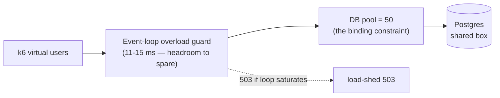

# Scalability & capacity

Measured capacity envelope of a single core-be instance, where the throughput
ceiling comes from, and how to scale past it. Numbers are from the escalating
load + stress ladder (`comprehensive-journey` k6 scenario, 180 s/level, against a
single instance with `POSTGRES_MAX_CONNECTIONS`-backed pool = 50). Re-run the
ladder with [load-testing](../testing/load-testing.md) whenever the pool size,
instance count, or DB tier changes.

## Measured capacity (single instance)

| Virtual users | Throughput  | p95 latency | Event-loop lag | Server 5xx |
| ------------- | ----------- | ----------- | -------------- | ---------- |
| 100           | 718 req/s   | 57 ms       | 11 ms          | **0**      |
| 200           | 986 req/s   | 212 ms      | 13 ms          | **0**      |
| 300           | 959 req/s   | 492 ms      | 13 ms          | **0**      |
| 400           | 1,026 req/s | 611 ms      | 15 ms          | **0**      |

A warmer single-endpoint run has peaked at **1,104 req/s @ p95 176 ms**. Treat
**~1,000 req/s** as the steady-state ceiling for one instance on the reference box.

Read the curve, not the peak:

- **Throughput plateaus at ~200 VU.** Beyond it, adding load does not add
  req/s — it only adds latency (p95 57 → 611 ms from 100 → 400 VU). The instance
  is saturated, requests queue, and they drain in order.
- **The event loop never saturates** (11–15 ms at every level). The ceiling is
  **not** CPU- or event-loop-bound — so the [load-shed valve](#the-load-shed-valve)
  never fires and there are **zero server 5xx** at any level.
- **`http_req_failed` sits flat at ~13.8%** across all levels. That is **not**
  capacity failure: it is the per-organization write cap (100 writes/min/org)
  returning `429`, which is workload-proportional and therefore constant as a
  fraction of a journey. Write-cap `429`s are rejected before route-level metrics,
  so they do not appear in `http_request_duration_seconds`.

## Where the ceiling is

The binding constraint is the **database**: the connection pool (50) and
Postgres throughput on the shared box, not the Node process. The app layer has
headroom (idle event loop) it cannot use because every journey is DB-bound.

This is confirmed by the **single-instance-vs-cluster** experiment: 8 replicas at
400 VU delivered **486 req/s — worse than one instance's 1,104** — and shed
**4,908 × 503** from the overload guard, because N replicas oversubscribed the
shared box's CPU while all contending for the same Postgres. **Horizontal API
scaling only pays off with a dedicated, independently-scaled DB tier.** On a
single box, more API processes make it slower.

## The load-shed valve

`overload-guard.middleware.ts` returns `503` when event-loop lag crosses its
threshold — deliberate back-pressure that protects liveness under genuine CPU
saturation. In the single-instance ladder it **never fired** (the loop stayed
healthy); in the oversubscribed cluster it fired ~4,900 times. A burst of `503`s
in production is the signal that the API tier is CPU-starved (too many
processes per core, or a runaway handler) — not that the DB is the limit. See
[degraded-mode-runbook](degraded-mode-runbook.md).

## Concurrency correctness under stress

The ladder doubles as a concurrency soak. At 400 VU > pool size, delete-then-insert
and concurrent-create paths race their unique indexes (Postgres `23505`):

- **`PUT /users/me/notification-preferences`** — the replace-all cascade is now
  serialized per user with a transaction-scoped `pg_advisory_xact_lock`, so it
  held at **0 new `23505` 5xx** through the whole ladder.
- The other **24 `23505`s** observed during the run are concurrent-create races
  on idempotent paths (org / session / MFA bootstrap) — every one is caught and
  resolved to `200`/`201`. Recorded route statuses across the ladder were
  **200/201 only**.

## Scaling past one instance

1. **Give Postgres its own tier.** The single-box ceiling is DB contention.
   A managed/dedicated Postgres (more cores, more IOPS) raises the ceiling before
   any API replica helps.
2. **Then add API replicas** behind the LB, each with a pool sized so
   `replicas × pool ≤ Postgres max_connections` (minus headroom). The pool is the
   throttle — oversizing it just moves contention into Postgres.
3. **Keep the per-org write cap** — it is the fairness valve that kept
   `http_req_failed` proportional rather than letting one tenant starve the pool.
4. **Watch the event loop, not just throughput.** A rising `503` rate from the
   overload guard means the API tier is CPU-starved; a rising p95 with a calm loop
   means the DB tier is the limit. They have different fixes.

## Hardening follow-ups

| Item | Status |
| ---- | ------ |
| Index attribution FK columns (online user-delete cost) | **Done** — `migrations/20260623000000_attribution_fk_indexes.sql` |
| Centralize the per-worker `stalled` listener into `attachDeadLetterAndAlerting` | Proposed — 32 workers each attach identical boilerplate; centralizing makes it structural but changes log-event tags (`*.stalled` → `queue.job.stalled`), so it wants owner review |
| Partition `audit.logs` + `webhook_delivery_attempts` by time | Proposed — high-volume append tables; range partitioning keeps retention deletes and recent-window reads cheap at scale (owner decision: ops project) |

See also: [load-testing](../testing/load-testing.md) ·
[health-checks](health-checks.md) ·
[external-service-resilience](external-service-resilience.md) ·
[chaos-testing](chaos-testing.md)
