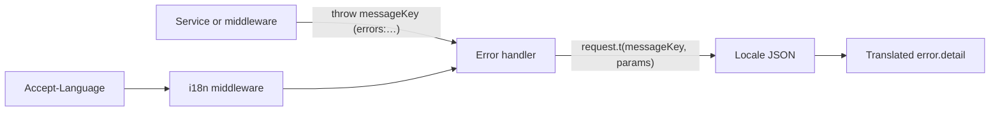

# i18n (Internationalization)

All user-facing response messages in the API are produced via **i18next**. English (`en`) is the default and fallback locale.

---

## Request flow



Services and validators throw typed errors with a **messageKey** (for example `errors:userNotFound`). The global error handler calls `request.t(error.messageKey, error.messageParams)` so the client receives text from `src/shared/locales/{lng}/errors.json`. The i18n middleware sets `request.language` from `Accept-Language` (fallback `en`).

---

## Scope

- **Error responses**: `error.detail` and each `error.errors[].message` are translated using `request.t(key, params)` in the error handler.
- **Success responses**: When a controller returns a `message` in the response body, it uses `request.t(messageKey, messageParams)` (or a fallback using `request.language`).

## Conventions

1. **Translation keys in code**
   - Errors: use keys like `errors:notFound`, `errors:validation.invalidToken`, `errors:disposableEmail`.
   - Success: use keys like `success:emailVerified`, `success:passwordResetEmailSent`.
   - Namespace format: `namespace:key` (e.g. `errors:routeNotFound`, `success:verificationEmailSent`).

2. **Locale files**
   - Add new keys to **`src/shared/locales/en/`** first (e.g. `src/shared/locales/en/errors.json`, `src/shared/locales/en/success.json`).
   - Then add the same keys to other locales (e.g. `src/shared/locales/es/`).
   - i18next `fallbackLng: 'en'` ensures missing keys or unsupported languages return the English string.

3. **Errors**
   - Services/validators throw with a **messageKey** (and optional **messageParams**). Do not throw raw user-facing strings.
   - The error handler calls `request.t(error.messageKey, error.messageParams)` for `detail` and for each validation item's `message` when `messageKey` is set.

4. **Success messages**
   - Services that return a user-facing message return `{ messageKey, messageParams? }`. Controllers call `request.t(messageKey, messageParams)` and send the result as `message` in the response.

## Middleware and request

- **i18n middleware** (`src/shared/middlewares/i18n.middleware.ts`): Runs on every request (`onRequest`), sets `request.t`, `request.language`, and prefers `Accept-Language` when present.
- **Ignored routes**: `/health/live`, `/health/ready`, `/api/v1/mcp` (no translation; fallback messages used when needed).

## Locale key parity

`en` is the source of truth. Every leaf key in `src/shared/locales/en/` must exist in each other locale with the same nested structure (dot notation for nested keys, e.g. `validation.invalidToken`):

| File | Purpose |
| ---- | ------- |
| `errors.json` | API error `detail` and validation messages |
| `success.json` | Success response `message` keys |
| `common.json` | Shared labels |
| `mail.json` | Transactional email copy |

**Check locally:**

```bash
pnpm validate:locale-keys
```

This runs JSON parity (`en` ↔ `es`) for all four files and fails if application code passes a redundant English **fallback** string when an `errors:` messageKey is already set. Legacy alias: `pnpm validate:locale-errors-parity` (errors.json only).

CI runs `validate:locale-keys` in `ci:quality`. When adding a key, update **every** locale file in the same change.

## Skill

When adding or changing user-facing messages, run the **i18n-message-guard** skill so keys stay in sync with `src/shared/locales/en/` (and other locales). See `.cursor/skills/skill-index/SKILL.md`.
