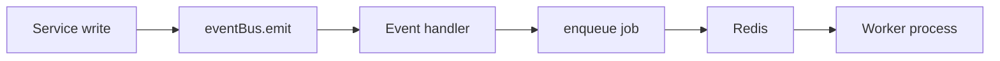

# Domain events and BullMQ workers

Event bus (in-process) and BullMQ workers (durable) are **not the same thing**. Mixing them up is the most common architectural mistake on this codebase.

---

## Comparison

|                  | Event bus (in-process)                                            | BullMQ workers (durable)                                   |
| ---------------- | ----------------------------------------------------------------- | ---------------------------------------------------------- |
| **Where**        | `src/core/events/event-bus.ts`                                    | `src/infrastructure/queue/bootstrap.ts`, `pnpm dev:worker` |
| **When**         | Immediately after a successful service write                      | Async, retried, in a separate worker process               |
| **Runs in**      | API process                                                       | Worker process                                             |
| **Failure mode** | Handler enqueues side effects; **must not fail the HTTP request** | Retries → DLQ                                              |

**Typical flow:** `service` → `eventBus.emit` → handler → `enqueueEmail()` → mail worker.

A service may also call `enqueueEmail()` directly without the bus for simple side effects. Both are valid.



---

## Registration (two paths — bootstrap order matters)

1. **`buildApp()` → `registerEventHandlers()`** ([`register-event-handlers.ts`](../../../src/core/events/register-event-handlers.ts)) **before** routes. Handlers that only need `enqueueEmail()` or have no container deps (auth + tenancy email handlers).
2. **`registerRoutes()` → [`domain-containers.plugin.ts`](../../../src/domains/domain-containers.plugin.ts) → `createNotifyContainer()`**. Handlers that need repositories from DI (notify handlers today).

**Rule:** No container deps → path 1. Needs a repository from the composition root → path 2.

### Registrar reference

| Registrar                               | Example event types                                                   | Side effect             |
| --------------------------------------- | --------------------------------------------------------------------- | ----------------------- |
| `registerAuthMethodEventHandlers`       | `AUTH_EVENT.MAGIC_LINK_REQUESTED`, password reset, email verification | Mail queue              |
| `registerMemberInvitationEventHandlers` | `MEMBER_INVITATION_EVENT.CREATED`, `RESENT`                           | Mail queue              |
| `registerNotifyEventHandlers`           | `NOTIFY_EVENT.WEBHOOK_DELIVERY_REQUESTED`                             | BullMQ webhook delivery |

Billing side effects use BullMQ directly (for example [`stripe-webhook`](../../../src/domains/billing/sub-domains/stripe-webhook/)) — there is no top-level `billing/events/` aggregator.

---

## Core pattern

- **Services emit domain events** (in-process) after successful DB writes.
- **Event handlers enqueue BullMQ jobs** for side effects.
- **Workers process jobs** (pull-based) and interact with integrations/DB as needed.

Event handler failure must **not** fail the HTTP request (log and continue).

### Request id propagation

HTTP handlers pass `getRequestIdentifier(request)` into services as `context.requestId`. Services attach it when emitting:

```typescript
await eventBus.emit(buildDomainEvent(EVENT_TYPE, payload, { requestId: context?.requestId }));
```

Event handlers read `event.requestId` and pass it to `enqueueEmail()`, `enqueueNotification()`, `enqueueWebhookDeliveryByAttemptId()`, etc. Job payloads store `requestId` (Zod-validated); workers log it on `mail.worker.processing` and **`email.sent`** so worker logs correlate with API `request.complete` (`requestId` field).

### Post-commit enqueue (transactional outbox)

When a handler runs inside an HTTP request, BullMQ enqueue helpers are scheduled with **`eventBus.onCommit(...)`** and run only after **`eventBus.flushOnCommit()`** in [`request-context.middleware.ts`](../../../src/shared/middlewares/request-context.middleware.ts) (after the request DB transaction commits). Mail uses a durable outbox row plus deferred `dispatchOutboxEmail`; webhook delivery, notification dispatch, and user-data export defer `queue.add` the same way. Outside HTTP scope (workers, scripts), use **`runEnqueueAfterCommit()`** from [`event-bus.ts`](../../../src/core/events/event-bus.ts) — it enqueues immediately when no onCommit scope is active.

### Prometheus metrics (BullMQ)

When **`METRICS_ENABLED=true`**, workers export BullMQ telemetry to the shared Prometheus registry:

| Metric                                                | Source                                                                                                         |
| ----------------------------------------------------- | -------------------------------------------------------------------------------------------------------------- |
| `bullmq_queue_{waiting,active,delayed,failed}{queue}` | `refreshBullMQQueueGauges()` — called from `refreshMetricsBeforeScrape()` before `GET /metrics`                |
| `bullmq_job_duration_seconds{queue,job_name}`         | `attachBullMQJobMetrics()` on worker `completed` — wired via `attachDeadLetterAndAlerting()` in `bootstrap.ts` |

Queue depth gauges scrape the monitored queue list in `src/infrastructure/observability/bullmq-metrics.ts` (`MONITORED_BULLMQ_QUEUE_NAMES`). See [observability runbook](../../deployment/runbooks/observability.md) for scrape setup and metric names.

---

## Naming conventions

- **Event types**: `"<domain>.<verb>"` (e.g. `organization.created`)
- **Queue names**: `"<domain>"` (e.g. `organization`)
- **Job names**: `"<domain>.<action>"` (e.g. `organization.created`)
- **Payload fields**: prefer **snake_case** in event payloads (e.g. `organization_id`, `created_by`)
- **Full names only**: `repository` not `repo`, `organization` not `org`, `database` not `db`

---

## Default resilience settings

- `attempts: 3`
- exponential backoff starting at 1000ms
- `removeOnComplete` capped
- `removeOnFail` capped

---

## Worker concurrency and exactly-once side effects

When the same BullMQ job can be processed concurrently (retries, stalls, or multiple worker processes), processors must not double-apply side effects (duplicate email, duplicate outbound webhook HTTP, duplicate subscription sync).

| Worker               | Claim mechanism                                                                              | Terminal skip                                                                                  |
| -------------------- | -------------------------------------------------------------------------------------------- | ---------------------------------------------------------------------------------------------- |
| **Stripe webhook**   | `StripeWebhookEventRepository.tryClaimEvent()` — insert ledger with `ON CONFLICT DO NOTHING` | `processed_duplicate` → no handler                                                             |
| **Webhook delivery** | `WebhookDeliveryAttemptRepository.tryMarkSending()` — `PENDING` → `SENDING` update           | `already_sent` → no HTTP; stale `SENDING` (by `sent_at` lease) reclaimed to `PENDING` on retry |
| **Mail**             | `tryClaimPendingMailOutbox()` — `pending` → `sending` update                                 | `already_sent` → no Resend call                                                                |

Stuck `sending` rows (worker crash after claim) are reclaimed to `pending` by the repeatable **mail-outbox-sweeper** job (`reclaimStaleSendingMailOutboxIds`) before re-enqueue.

Regression tests: `src/tests/integration/worker-race/*.integration.test.ts` (`pnpm test:integration`).

---

## Worker Postgres context (RLS)

HTTP requests set `app.current_organization_id` via tenant middleware and an org-scoped transaction. **Workers do not** — each job must use an explicit context wrapper before querying FORCE RLS tables.

| Context wrapper                                                             | GUC / purpose                                                            |
| --------------------------------------------------------------------------- | ------------------------------------------------------------------------ |
| `withOrganizationContext` / `runTenantScopedWorkerJob`                      | `app.current_organization_id` — tenant mutations and reads               |
| `withGlobalRetentionCleanupDatabaseContext` / `runGlobalRetentionWorkerJob` | `app.global_retention_cleanup` — cross-tenant tombstone retention        |
| `withUserDatabaseContext` / `runUserScopedWorkerJob`                        | `app.current_user_id` — GDPR export                                      |
| `withSessionRetentionCleanupDatabaseContext`                                | `app.session_retention_cleanup` — session cleanup worker                 |
| `withSystemTableWorkerContext`                                              | No tenant RLS — `auth.mail_outbox`, `billing.stripe_webhook_events` only |

`src/worker.ts` sets `CORE_BE_RUNTIME=worker`. Calling `getRequestDatabase()` without a pinned ALS session throws `WorkerDatabaseContextError`. Pass `databaseHandle` into `createWorker*Repository(databaseHandle)` for tenant-scoped work.

FORCE RLS table list: `src/infrastructure/database/force-rls-tables.constants.ts`. Security regression: `src/tests/security/rls/worker-rls-context.security.test.ts`.

---

## Worker registry and queue families

Every BullMQ worker is registered exactly once in [`worker-registration.registry.ts`](../../../src/infrastructure/queue/worker-runtime/worker-registration.registry.ts) — the **single source of truth** for **worker startup** (`bootstrap.ts`), **Postgres connection budgeting** (`worker-connection-budget.ts`), **scheduler filtering** (`scheduler.ts`), and **scheduler ↔ registry consistency** (`scheduler-registry-audit.ts`). A registration declares:

| Field                             | Purpose                                                                                                                                                                                                                                                                                 |
| --------------------------------- | --------------------------------------------------------------------------------------------------------------------------------------------------------------------------------------------------------------------------------------------------------------------------------------- |
| `queueName`                       | BullMQ queue (unique per worker)                                                                                                                                                                                                                                                        |
| `family`                          | One of `mail`, `notify`, `webhook`, `stripe`, `retention`, `observability` — used by `WORKER_QUEUE_FAMILIES` to split processes                                                                                                                                                         |
| `usesPostgres`                    | If `true`, the worker holds a Postgres pool checkout per concurrent job                                                                                                                                                                                                                 |
| `scheduled`                       | `true` for cron-driven workers (entry exists in `scheduler.ts`); `false` for event-driven or orphan workers. Cross-checked at startup — mismatches log `worker.registry.scheduler_mismatch`                                                                                             |
| `criticality`                     | `throughput` (drives user-visible latency), `maintenance` (cron / retention), or `observability` (metrics only)                                                                                                                                                                         |
| `holdsConnectionDuringExternalIo` | `true` when the Postgres checkout is held during an outbound HTTP/S3/Resend/Stripe call (e.g. webhook delivery, S3-bound retention). Slow externals on these workers translate to pool starvation; surfaced in pool-pressure alerts as `workerPeakPostgresConcurrencyHoldingExternalIo` |
| `resolvePostgresConcurrency()`    | Concurrency contribution to the per-process pool budget                                                                                                                                                                                                                                 |
| `isEnabled()`                     | Optional skip (e.g. mail/Stripe disabled by env)                                                                                                                                                                                                                                        |
| `create()`                        | Factory invoked by bootstrap                                                                                                                                                                                                                                                            |

Currently **25 workers** are registered (**23** use Postgres, **2** are Redis-only observability; **18** are cron-scheduled, **5** are event-driven, **2** are orphans tagged `scheduled: false` until a cron is wired). Add a new worker by appending one entry — bootstrap, scheduler filtering, connection budgeting, and the scheduler-registry audit pick it up automatically.

Operational sizing per family is documented in [resource-limits.md → Worker Postgres pool demand](../../deployment/runbooks/resource-limits.md#worker-postgres-pool-demand-per-process). Split-service deployment guidance is in [worker-scaling.md](../../deployment/runbooks/worker-scaling.md#splitting-worker-services-by-family).

---

## Files and locations

| Concern                                                                             | Path                                                                                                                                                  |
| ----------------------------------------------------------------------------------- | ----------------------------------------------------------------------------------------------------------------------------------------------------- |
| Event bus                                                                           | `src/core/events/event-bus.ts`                                                                                                                        |
| Queue connection, scheduler, DLQ, bootstrap                                         | `src/infrastructure/queue/connection.ts`, `scheduler.ts`, `dead-letter.ts`, `bootstrap.ts`                                                            |
| Worker registry (families, Postgres demand, scheduled flag, criticality, factories) | `src/infrastructure/queue/worker-runtime/worker-registration.registry.ts`                                                                             |
| Worker connection budget                                                            | `src/infrastructure/queue/worker-runtime/worker-connection-budget.ts`                                                                                 |
| Scheduler ↔ registry audit                                                          | `src/infrastructure/queue/worker-runtime/scheduler-registry-audit.ts`                                                                                 |
| Worker family parsing                                                               | `src/infrastructure/queue/worker-runtime/worker-queue-family.util.ts`                                                                                 |
| Worker options                                                                      | `src/infrastructure/queue/worker-runtime/worker-options.ts` — `getDefaultWorkerOptions()`, `getWebhookWorkerOptions()`, `getRetentionWorkerOptions()` |
| Redis                                                                               | `src/infrastructure/cache/redis.client.ts`                                                                                                            |
| Domain aggregator                                                                   | `src/domains/<domain>/events/index.ts` → `register*EventHandlers()`                                                                                   |
| Event types + handlers                                                              | `src/domains/<domain>/sub-domains/<sub-domain>/events/*`                                                                                              |
| Queues + enqueue                                                                    | `src/domains/<domain>/sub-domains/<sub-domain>/queues/*`                                                                                              |
| Workers                                                                             | `src/domains/<domain>/sub-domains/<sub-domain>/workers/*` (or domain root for flat domains)                                                           |
| Worker entrypoint                                                                   | `src/worker.ts`                                                                                                                                       |
| BullMQ Prometheus gauges/histogram                                                  | `src/infrastructure/observability/bullmq-metrics.ts`, `prometheus-metrics.ts`                                                                         |

**Queue ownership:** `src/infrastructure/queue/` wires Redis, repeatable retention registration (`scheduler.ts`), dead-letter (`dead-letter.ts`), and worker startup only. **Processors** and event-driven **queue definitions + enqueue helpers** live in domain sub-domains — never in `infrastructure/queue/processors/` (that path does not exist).

**Repeatable / cron jobs:** register every `upsertJobScheduler` entry in `scheduler.ts` only. Domain worker files define the `Worker` processor (same queue name as in `scheduler.ts`).

| Scheduler id          | Queue             | Default cron (UTC)                 | Doc                                                              |
| --------------------- | ----------------- | ---------------------------------- | ---------------------------------------------------------------- |
| `daily-audit-export`  | `audit-export`    | `15 2 * * *` (`AUDIT_EXPORT_CRON`) | [audit-export.md](../security/audit-export.md)                   |
| `daily-audit-cleanup` | `audit-retention` | `0 3 * * *`                        | [data-lifecycle-deletion.md](../data/data-lifecycle-deletion.md) |

---

## Dead-letter queue and alerting

- After retries exhaust (`job.attemptsMade >= (job.opts.attempts ?? 1)`), `attachDeadLetterAndAlerting` enqueues to **`<source-queue-name>-dlq`** with snake_case payload (`original_queue`, `original_job_id`, `original_data`, `failed_reason`, …).
- Transient failures: `queue.job.retry` at **warn**. Final failures: `queue.job.final_failure`, DLQ enqueue, one Sentry event per failure (fingerprint `worker_final_failure` + queue + job name). Do not call `captureException` from per-job `failed` handlers (duplicates across retries).
- Workers return `{ worker, queueName, close }` (`WorkerHandle` in `bootstrap.ts`).
- Bull Board lists each `-dlq` next to its source queue when enabled.
- On shutdown: close workers, then `closeDeadLetterQueues()`, then Redis (`src/worker.ts`).
- **Poison messages** (payload that fails `*.job.schema.ts` validation) never burn the retry budget: each worker entry point validates `job.data` via `parseJobDataOrDeadLetter` (`src/infrastructure/queue/dlq/poison-job.util.ts`), which records the dead-letter (Postgres + Redis mirror) and throws BullMQ `UnrecoverableError` so remaining attempts are skipped. `attachDeadLetterAndAlerting` treats `UnrecoverableError` as already-handled (logs `queue.job.unrecoverable`, no second record). The producer-side `parseBullMQJobData` still throws a plain error — enqueue is not a retry path.

## Distributed tracing across the queue

Every `enqueue*` helper injects the active W3C trace context (`captureTraceContextForPropagation`) into the job payload (`traceparent` / `tracestate`, shared `traceContextJobFieldsSchema`); each worker re-enters that context with `runWithPropagatedTraceContext` (`src/infrastructure/observability/tracing/trace-context.util.ts`), so the worker span is a child of the originating API request. Jobs enqueued outside an active span (or with OTEL disabled) simply omit the fields and run without a new span.

---

## Canonical examples

**Tenancy — member invitation**

```text
member-invitation.service.ts  →  eventBus.emit(tenancy.member_invitation.created|resent)
tenancy/sub-domains/member-invitation/events/*.ts  →  enqueueEmail()
tenancy/events/index.ts  →  registerTenancyEventHandlers()
```

**Auth — transactional email**

```text
magic-link.service.ts / auth-method.service.ts  →  eventBus.emit(auth.*.requested)
auth/sub-domains/auth-method/events/*.ts  →  enqueueEmail()
auth/events/index.ts  →  registerAuthEventHandlers()
```

**Billing — Stripe webhooks (BullMQ, not event bus)**

```text
stripe-webhook.routes  →  stripe-webhook.service  →  enqueueStripeWebhookJob()
billing/sub-domains/stripe-webhook/workers/stripe-webhook.worker.ts  →  processor
```

**Notify — webhook delivery (event bus)**

```text
emitWebhookDeliveryRequested()  →  notify/sub-domains/webhook/events/
webhook-delivery.event-handlers.ts  →  enqueueWebhookDeliveryByAttemptId()
```

**Outbound webhook SSRF:** `webhook-delivery.worker` uses `createPinnedWebhookFetch()` (`src/shared/utils/security/webhook-outbound-fetch.util.ts`). DNS is resolved once per delivery via `resolveAndPinWebhookUrl()`; the HTTP client connects to the pinned public IP while sending the original `Host` / TLS SNI. `validateWebhookUrl()` at create/update time rejects private/link-local targets. Optional `WEBHOOK_URL_ALLOWLIST` (comma-separated host suffixes) further restricts hostnames in production.

`src/core/events/register-event-handlers.ts` calls each domain’s `register*EventHandlers()` from `buildApp()` before routes.

---

## Implementation checklist

1. **Emit** — After DB write in service: `eventBus.emit({ type, payload, timestamp })` with snake_case payload.
2. **Handle** — Register once via `registerEventHandlers()`; validate payload, enqueue job, catch/log (do not throw to HTTP).
3. **Work** — Worker: switch on `job.name`, structured logs, idempotent when possible.
4. **Bootstrap** — Retention schedules in `scheduler.ts`; domain workers in `bootstrap.ts` (from `src/worker.ts`).
5. **Shutdown** — SIGTERM/SIGINT: close workers, `closeDeadLetterQueues()`, close Redis, exit 0.

---

## Don'ts

- Don't call integrations directly from services (emit events instead).
- Don't push jobs from HTTP controllers; keep enqueue in services/events.
- Don't place **processors** in `src/infrastructure/queue/` — use `src/domains/.../workers/*`. Event-driven queue + enqueue helpers belong in `src/domains/.../queues/*`.
- Don't register repeatable processors outside `scheduler.ts` (schedulers only, no processors there).

---

## Related

- [documentation-system.md](../architecture/documentation-system.md) — ownership map
- [CLAUDE.md](../../../CLAUDE.md) §6 — short pointer
- `.cursor/skills/workers-events/SKILL.md` — orchestration checklist
